## Introduction

Personalized text-to-image (T2I) models are one of the emerging applications of generative AI. Imagine asking a T2I model to generate an image of your friend John with the prompt “John sitting on a chair while reading a book.” While the model will likely produce an image of a person sitting and reading, it probably won't depict “John.” To do that, we need to personalize a T2I model by having it learn the subject of interest (i.e., John).

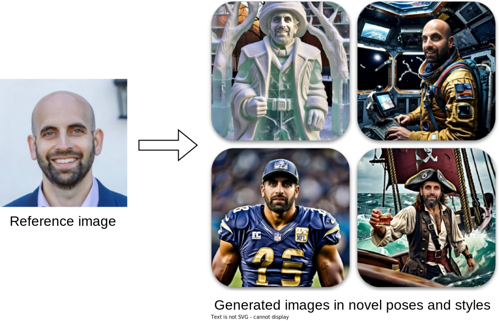

Figure 1: Personalized T2I model generating identity variations (images taken from \[1\])

In this chapter, we explore how to develop a personalized T2I model capable of generating professional-quality headshots of specific individuals.

## Clarifying Requirements

Here is a typical interaction between a candidate and an interviewer:

**Candidate:** Are the generated headshots primarily intended for business profiles, such as LinkedIn?  
**Interviewer:** Correct.

**Candidate:** I assume users will provide several images of themselves in different variations – pose, angle – with their faces visible. Is that correct? How many images will we ask them to upload?  
**Interviewer:** Yes, that’s correct. Let’s assume between 10 to 20 images.

**Candidate:** What if some images are not suitable, like if they're too dark or the face isn't visible?  
**Interviewer:** We need to detect those and notify the user to provide better images.

**Candidate:** Should users be able to specify features such as hairstyle in the generated images?  
**Interviewer:** For simplicity, let's assume attribute control isn't required.

**Candidate:** What resolution is required for the headshots?  
**Interviewer:** The system should support 1024x1024 outputs.

**Candidate:** Can I assume we can start from a pretrained generic T2I model?  
**Interviewer:** Yes.

**Candidate:** Should users be able to provide text prompts to control the generated headshots?  
**Interviewer:** We prefer to keep it simple, so assume users won't provide text prompts.

**Candidate:** How many headshot images should the system generate?  
**Interviewer:** 50 images.

**Candidate:** What is the expected latency?  
**Interviewer:** The user provides the images, and we notify them by email when the images are ready. The overall process should take less than an hour.

## Frame the Problem as an ML Task

In this section, we use headshot generation as a case study to explore an important aspect of image generation: personalization. This process involves adapting a pretrained T2I model to learn a new subject, in this case, the user’s face.

### Specifying the system’s input and output

The input includes several images of the user's face, taken from different angles and in different poses. The output consists of professional headshots of the individual. These headshots are high-quality and diverse, and they preserve the person's identity.

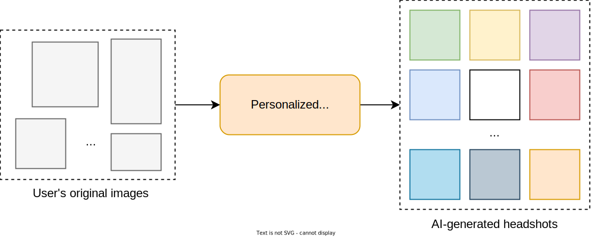

Figure 2: Input and output of a headshot generation system

### Choosing a suitable ML approach

Diffusion models work exceptionally well at generating very detailed and realistic images. A common practice for personalization is to start with a T2I model pretrained on a broad range of images as a base model.

There are two primary approaches to personalizing a pretrained T2I model: tuning-based and tuning-free.

Tuning-based methods finetune the T2I model on a set of reference images for each identity. This approach integrates the new identity into the model, allowing it to generate a variety of images while preserving the identity.

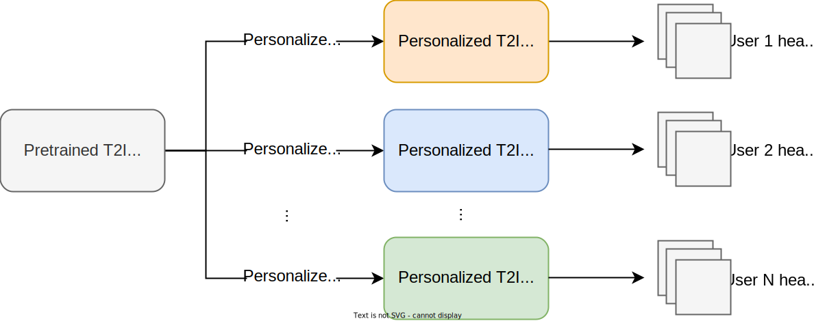

Figure 3: Tuning-based approach for T2I personalization

On the other hand, tuning-free methods bypass the need for finetuning the T2I model for each new identity. Instead, they finetune the pretrained T2I model along with a visual encoder once. After this training, the visual encoder extracts features from a new reference image and injects them into the T2I model. This allows the model to generate personalized images without adjusting its internal weights for each identity.

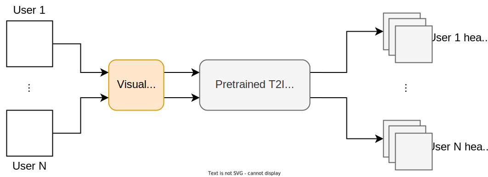

Figure 4: Tuning-free approach for T2I personalization

Tuning-free methods, such as Meta’s Imagine Yourself \[1\], are simpler because they only require training once with fewer parameters than training the entire T2I model. A single model should be deployed, and only one reference image is needed, allowing the same pretrained model to generate personalized images for multiple identities. However, these methods often rely on a single reference image to capture facial features, which may not capture all the details from different angles or expressions. Additionally, they require special adjustments tailored to the subject. For instance, \[1\] uses specific encoders and proposes a technique for generating synthetic paired data.

On the other hand, tuning-based methods tend to capture more detailed features of the subject. They are also more versatile, handling a wider range of subjects beyond human faces. Given these advantages, we focus on tuning-based methods in the rest of this chapter. If you are interested in learning more about tuning-free methods, refer to \[2\]\[3\]\[1\].

Several tuning-based methods can be used to achieve personalization, each offering unique advantages and disadvantages. Three of the most common ones are:

- Textual inversion
- DreamBooth
- Low-rank adaptation (LoRA)

#### Textual inversion

Textual inversion \[4\] personalizes a T2I model by introducing a new special token that represents the subject and learning its embedding. During finetuning, the model updates the special token's embedding, while the diffusion model, text encoder, and other token embeddings remain unchanged.

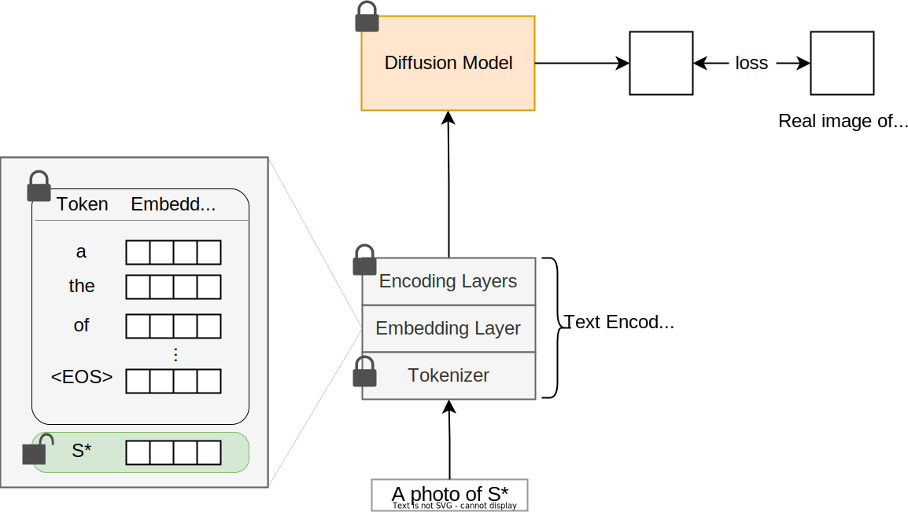

Figure 5: Textual inversion updating only the special token embedding

After finetuning, the model generates images of the new subject when prompted with the special token.

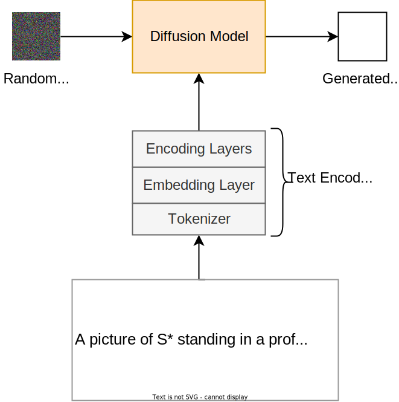

Figure 6: Generating an image of the subject of interest

Let’s review the pros and cons of textual inversion.

##### Pros:

- **Efficiency:** Textual inversion training involves learning only a new token embedding, making it a lightweight and efficient process.
- **Preservation of original model capabilities:** The T2I model's capabilities are maintained since the diffusion model’s parameters remain unchanged.
- **Minimal storage requirements:** Minimal storage is required because only the special token embedding needs to be stored for each personalized model.

##### Cons:

- **Difficulty in learning subject details:** Textual inversion often struggles to learn new subject details accurately due to its limited capacity to encode these details. This limitation arises because the new subject is represented by a single token embedding.

In summary, while textual inversion is an efficient method for personalizing a T2I model, it often struggles to capture and preserve all the details of the new subject.

#### DreamBooth

DreamBooth \[5\] is a popular personalization method that was introduced by Google in 2023. It finetunes a pretrained diffusion model using images of the subject of interest. Unlike textual inversion, DreamBooth updates all the diffusion model's parameters during finetuning. This allows the model to capture the new subject's details more effectively.

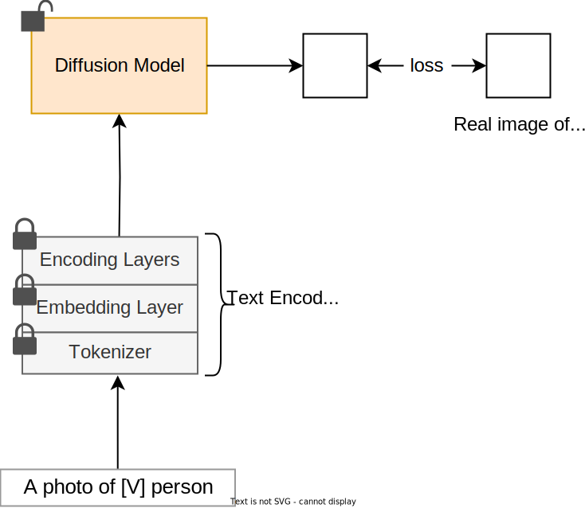

Figure 7: DreamBooth method updating the entire diffusion model

DreamBooth relies primarily on two techniques for successful finetuning:

- Rare-token identifier
- Class-specific prior preservation loss

##### Rare-token identifier

Most personalization methods select an identifier to represent the subject of interest. While textual inversion creates a new token for this purpose, DreamBooth selects an identifier using the existing vocabulary of tokens. The authors have found that simply choosing any existing token won’t work well in practice. Let’s explore why simple approaches such as selecting a common or random identifier won’t work, and why the rare-token identifier is preferred.

###### Challenges with common or random token identifier

A simple way to represent the subject of interest is to choose a common English word such as “unique” or “special”. This approach is problematic because the token usually has an established meaning. For example, if we choose “special” to refer to the subject of interest using a prompt like “a special person sitting”, the model might struggle because "special" already has a broad, established meaning in the context of language. The model has to separate this token from its original meaning and then learn a new meaning for it that references the new subject.

Another way to represent the subject is to randomly combine characters. This approach also poses issues because the tokenizer might treat each character separately, leading to strong prior associations for these characters. For example, if we choose "xxy5syt00" to represent the subject, the tokenizer might break it down into individual characters, each of which could have pre-existing associations within the model. This fragmentation can cause the model to generate outputs that are influenced by the meanings or patterns associated with those individual characters or sub-units, rather than treating the identifier as a unique and cohesive entity.

###### How the rare-token identifier works

DreamBooth resolves these problems by selecting rare tokens—those that appear infrequently in the training data. Representing the subject of interest with these tokens strikes a balance: they’re distinct enough to avoid strong prior associations but still cohesive so that tokenizers treat them as a single unit.

Here is the step-by-step process to form an identifier:

1. **Identifying a few rare tokens in the vocabulary:** The model's vocabulary contains a large set of tokens, each with a unique ID. A "rare token" is one that appears infrequently in the training data. Such rare tokens are identified by assessing token frequency distribution.
2. **Generating a sequence of rare tokens:** Once we have identified the rare tokens, we generate a sequence using some of these tokens.
3. **Forming the identifier:** The tokenizer converts the sequence of token IDs back into their corresponding text form. This forms an identifier to represent the subject. "XyZ", "SKS", and "\[V\]" are possible examples of an identifier.

##### Class-specific prior preservation loss

DreamBooth finetunes all layers of the diffusion model. While this enhances the quality of generated images, it can lead to overfitting, where the model loses diversity in its outputs. For example, training the model on images of a specific dog might make it struggle to generate images of other dogs.

To address this problem, DreamBooth uses class-specific prior preservation loss to maintain general class characteristics. This prevents the model from overfitting to the specific examples and losing its ability to generate diverse images that belong to the broader class. We will examine DreamBooth’s loss function in the training section.

DreamBooth has several pros and cons.

##### Pros:

- **Effective at learning subject details:** Updating more parameters allows the model to learn the details of the subject more accurately.
- **Fewer images required:** Because the entire diffusion model is updated, a smaller image set is needed to learn the subject.

##### Cons:

- **High storage requirement:** After finetuning for each subject, the entire diffusion model has to be stored for future use. This can require several gigabytes per subject, which is costly and not scalable.
- **Resource-intensive:** Updating the entire diffusion model demands more GPU memory during training.

In summary, DreamBooth learns subject details effectively but is costly to train and store. In contrast, textual inversion is efficient and compact, but less effective. Next, we'll explore LoRA, which offers a balanced approach.

#### LoRA

LoRA, introduced by Microsoft \[6\], is a powerful method for efficiently finetuning very large models. This method was originally developed for adapting large language models (LLMs) to specific tasks but was later adopted for other tasks including T2I personalization.

The key motivation behind LoRA is that finetuning all parameters of large pretrained models, such as GPT-3 \[7\], is time-consuming and costly. Instead, LoRA adapts a large model to a new task by introducing a small set of parameters and updating only those, thus significantly reducing computational costs.

Due to its importance, let's examine in detail the mathematical foundations of LoRA.

##### The mathematics of LoRA

In a typical neural network layer, a weight matrix, $W \in \mathbb{R}^{d_{\text {out }} \times d_{\text {in }}}$, transforms the input vector, $x \in \mathbb{R}^{d_{i n}}$, into the output vector $y \in \mathbb{R}^{d_{\text {out }}}$.

$Image represents a simplified diagram of a machine learning model, likely for a supervised learning task.  The diagram shows three rectangular boxes arranged vertically. The bottom box, colored pale yellow, is labeled  `$x \in \m...` representing the input data (x) belonging to a space (m), likely a feature space. An upward arrow connects this box to the middle box. The middle box is larger and light gray, labeled 'Pretrained...' and `$W \in \mathbb{...}`, indicating a pretrained model with weight matrix W belonging to a space (likely a weight space represented by the mathematical notation).  Finally, an upward arrow connects the middle box to the top box, also pale yellow, labeled `$y \in \m...`, representing the output data (y) belonging to a space (m), likely the same space as the input. The arrows indicate the flow of information: the input data (x) is processed by the pretrained model (W) to produce the output data (y).  The ellipses (...) suggest that the full mathematical notation is not shown, implying more detailed information about the spaces and parameters is omitted for brevity.$ 

Figure 8: A fully connected neural network layer

The goal of finetuning is to adjust weight parameters, $W$, to improve the performance of the specific task. Instead of modifying $W$ directly, LoRA modifies the weights by introducing an additional low-rank component, $\Delta W$, which can be expressed as a product of two learnable lowrank matrices:

$$
\Delta W=A B
$$

where:

- $A \in \mathbb{R}^{d_{\text {out }} \times d_r}$,
- $B \in \mathbb{R}^{d_r \times d_{\mathrm{in}}}$,
- $d_{\text {in }}$ and $d_{\text {out }}$ represent input and output dimensions,
- $r$ is a small integer representing the rank, typically much smaller than $d_{\text {in }}$ and $d_{\text {out }}$.
$Image represents a diagram illustrating a generative AI system's architecture.  At the top, a yellow rectangle labeled  `$y \in \m...` represents the system's output.  An addition symbol (+) connects this output to two inputs: `$Wx$` and `$A(Bx)$`.  `$Wx$` originates from a gray rectangle labeled 'Pretrained...' and containing `$W \in \mathbb{...}`, representing a pre-trained model's weights.  A padlock icon next to this rectangle indicates that the pre-trained model's weights are protected.  `$A(Bx)$` is an input that feeds into a larger, enclosed section representing a fine-tuned model. This section contains two trapezoidal shapes: a light-blue one labeled with `$A$`, `$ \mathb...`, and some seemingly encoded text, and a light-green one below it labeled with `%3CmxGraphModel%3E%3...`, `$ \mathbb{R}..`, and a padlock icon, suggesting a graph-based model with protected parameters.  The light-blue trapezoid represents a LoRA (Low-Rank Adaptation) layer, indicated by a curved arrow pointing to a label 'LoRA I...'.  A padlock icon is present within the fine-tuned model section, suggesting protection of its parameters.  Finally, a yellow rectangle labeled `$x \in \m...` at the bottom represents the system's input, connected to the output of the fine-tuned model.  The overall flow shows the input `$x$` being processed through the pre-trained model and the fine-tuned LoRA model to produce the output `$y$`.$ 

Figure 9: Injection of low-rank matrices

Learning the new parameters introduced by LoRA is more efficient than finetuning the full matrix. Specifically, the original matrix, $W$, has $d_{\text {out }} \times d_{\text {in }}$ parameters, while the low-rank approximation introduces only $r \times\left(d_{\text {in }}+d_{\text {out }}\right)$ parameters. For small values of $r$, this can lead to significant savings in both storage and computation.

##### LoRA for T2I personalization

To apply LoRA to our pretrained T2I model, we inject trainable parameters into the diffusion model and update only those parameters during finetuning to learn the new identity. This method requires training of only a fraction of the model's parameters, which is much faster and more memory-efficient.

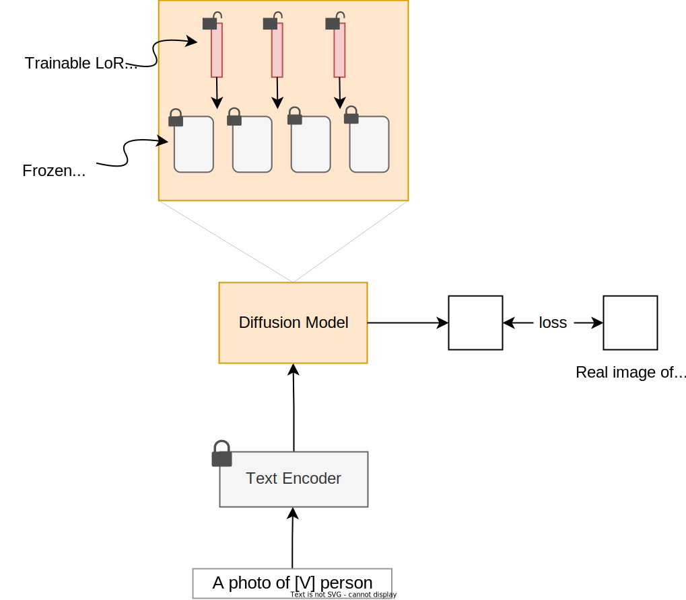

Figure 10: LoRA method injecting and learning new parameters in the diffusion model

##### Pros:

- **Preserves original model capabilities:** LoRA preserves the T2I’s capabilities by freezing the original model parameters.
- **Reduces memory and computational needs:** LoRA updates only a small fraction of the model's parameters, making it more efficient than DreamBooth.
- **Minimizes storage requirements:** Since the original model remains unchanged, only the LoRA layers are stored. This typically means just a few megabytes per personalized model, which is cost-efficient and scalable.

##### Cons:

- **Less effective learning:** LoRA is less effective than DreamBooth because it finetunes only a small number of parameters, thus limiting its capacity to learn the new subject.
- **Slight increase in inference time:** LoRA slightly increases inference time due to additional parameters and computations. However, this is often negligible compared to the overall benefits of reduced storage requirements and faster adaptation times.

Table 1 provides a comparison of the three tuning-based personalization methods.

|  | Textual Inversion | LoRA | DreamBooth |
| --- | --- | --- | --- |
| **Learning effectiveness** | Low | Moderate | High |
| **Required storage** | Low | Moderate | High |
| **Required training resources** | Low | Moderate | High |
| **Maintaining the original model’s capabilities** | Yes | Yes | No |

Table 1: Comparison of popular tuning-based personalization methods

#### Which method is more suitable for headshot generation?

The suitability of these methods depends on the use case and the system requirements. For headshot generation, we choose DreamBooth for three main reasons:

1. **Better identity preservation**: DreamBooth is most effective at preserving details of the subject, leading to better identity preservation.
2. **Acceptable training time:** According to \[5\], it takes around 15 minutes to finetune a diffusion model using DreamBooth. This training time is acceptable given that we are required to share the generated images with the user within an hour.
3. **No need for storage:** We don’t need to save personalized models after generating the headshots, so storage concerns with the DreamBooth approach are not relevant.

## Data Preparation

The number of images needed varies depending on the method. Tuning-free methods generally require just one image, whereas tuning-based methods such as DreamBooth need around 10–20 images.

Since we are using DreamBooth, users are asked to upload 10–20 images. These images may come in different resolutions and aspect ratios. To prepare them for training, we follow these steps:

- Image resizing
- Image augmentation
- Generic face data addition
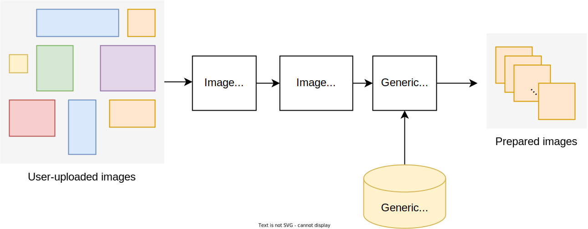

Figure 11: Preparing data for training

#### Image resizing

Diffusion models typically require fixed input dimensions, but user-uploaded images often vary in dimensions. We resize the images to uniform dimensions suitable for the diffusion model.

#### Image augmentation

T2I models require lots of images to learn concepts such as objects, identities, and scenes. However, for personalization, we often lack a large dataset. We use image augmentation techniques such as mirroring, slight rotations, and scaling to artificially expand the dataset. This step is essential when only a small number of images is available for training.

#### Generic face data addition

Training only on the provided images may cause the model to overfit to a specific identity and forget previously learned knowledge. To prevent this, we combine user-uploaded images with a larger, generic dataset of faces. We generate these images using a pretrained diffusion model with prompts such as "an image of a person."

## Model Development

### Architecture

The DreamBooth method finetunes a pretrained diffusion model. We use a model with a U-Net architecture, pretrained to output 1024x1024 images, similar to what we covered in Chapter 9. The architecture remains unchanged: a series of downsampling blocks followed by a series of upsampling blocks.

### Training

To finetune a pretrained diffusion model, we follow the same process as training a diffusion model from scratch:

- **Noise addition:** Noise is added to an image based on a randomly selected timestep.
- **Conditioning signals preparation:** Separate encoders prepare the image caption and timestep as conditioning signals for the model to predict noise.
- **Noise prediction:** The model predicts the noise to be removed from the noisy image using the conditioning signals.

#### Training data

The training data consists of user-uploaded images and generic face images added during data preparation. User-uploaded images are labeled as "An image of a \[V\] person," while generic face images are labeled as "An image of a person."

#### ML objective and loss function

The key challenge in personalization is to ensure the model can generate both general categories (e.g., human faces) and specific instances within those categories (e.g., a unique individual). To address this, we use two loss functions:

- Reconstruction loss
- Class-specific prior preservation loss

##### Reconstruction loss

This loss function measures the differences between the reconstructed image and the actual images of the specific subject. It helps the model preserve the subject's identity.

##### Class-specific prior preservation loss

This loss function measures the difference between the generated images and actual images of generic faces. It ensures the model maintains the characteristics of the human class and avoids overfitting to specific identities.

##### Overall loss

The overall loss function is a weighted combination of the reconstruction loss and the class-specific prior preservation loss. The formula for the overall loss can be expressed as:

$$
\text {Overall loss}=\alpha \times \text {reconstruction loss}+\beta \times \text {class-specific prior preservation loss}
$$

$\alpha$ and $\beta$ are hyperparameters that control the trade-off between maintaining a specific identity and preserving human characteristics. The ML objective is to minimize the overall loss, which allows the model to generate images of unique identities while retaining its ability to produce generic human face images.

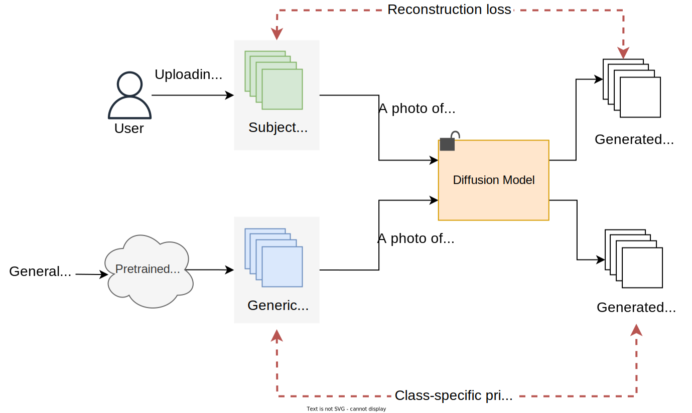

Figure 12: Overall loss calculation

### Sampling

The sampling process for headshot generation is similar to the T2I generation discussed in Chapter 9, as both use diffusion models. However, a key difference lies in how we provide text prompts. In Chapter 9, the user provided the text prompt. For example, a user might input "a cat sitting on a chair," and the diffusion model would generate an image reflecting that text.

In headshot generation, the users don't provide prompts. Instead, we create a set of hand-engineered prompts. These prompts represent various professional settings and include the identifier used during training to ensure the generated images reflect the user's identity. Some examples include:

- "A professional headshot of \[V\] smiling in front of a plain white background."
- "A close-up of \[V\] with a neutral expression, wearing formal attire."
- "A headshot of \[V\] with soft lighting, looking slightly to the left."
- "A profile shot of \[V\] against a blurred outdoor background."
- "A professional headshot of \[V\] wearing a business suit, with a confident expression."

After creating the prompts, we sample one image per prompt from the diffusion model. We follow the standard diffusion process sampling steps:

1. Generate initial random noise.
2. Iteratively denoise the input through multiple steps, using Classifier-free guidance (CFG) \[8\] during each step to reduce noise and refine image details. To review CFG, refer to \[8\] or Chapter 9.
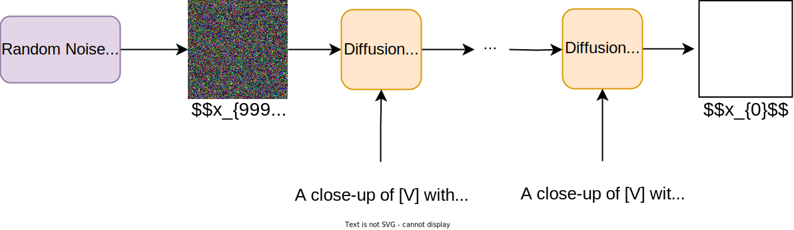

Figure 13: Sampling a headshot image

## Evaluation

### Offline evaluation metrics

It is important to evaluate personalized diffusion models to ensure our model is capable of preserving the user’s identity in the generated images. We assess the performance of a personalized diffusion model by focusing on three main aspects:

- Text alignment
- Image quality
- Image alignment

#### Text alignment

Text alignment refers to how closely generated images match text prompts. A common metric for measuring this is the CLIPScore \[9\], which ensures the images are not only high quality but also relevant to the input text.

#### Image quality

As we explored in previous chapters, we employ common metrics such as FID \[10\] and Inception score \[11\] to measure the quality of the generated images.

#### Image alignment

Image alignment, particularly relevant to personalized text-to-image models, refers to assessing the visual similarity between generated images and the subject of interest. For instance, if the model is tasked with generating an image of a specific backpack, image alignment measures how closely the generated image resembles that backpack.

Commonly used metrics for measuring the visual similarity between the generated and original subject are:

- CLIP score
- DINO score
- Facial similarity score

##### CLIP score

CLIP model \[12\] uses two encoders—one for images and one for text. These encoders are trained to ensure that the image and text embeddings of a relevant image–text pair are close in the embedding space.

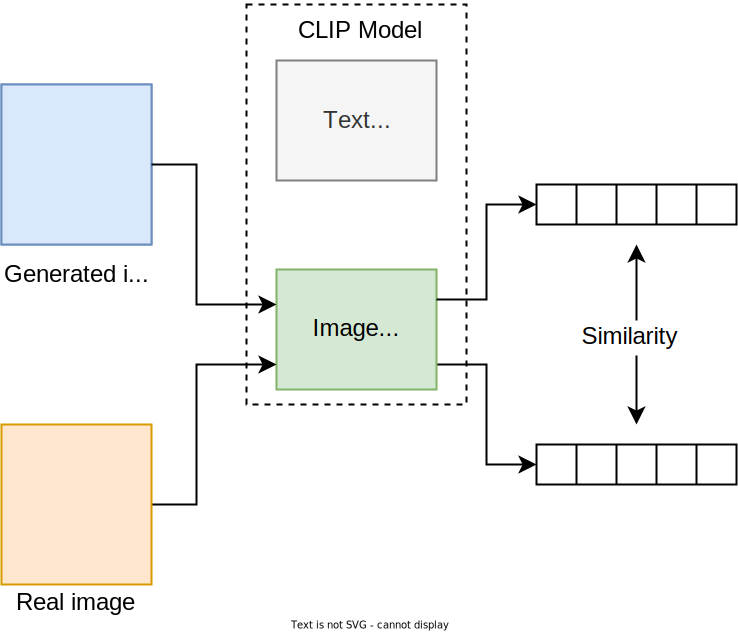

Figure 14: Image alignment calculation with CLIP

To measure image alignment using CLIP, we discard the text encoder and use the image encoder to generate embeddings for both the generated and real images. We then calculate the cosine similarity between these embeddings to assess their similarity. Higher scores indicate that the personalized diffusion model creates images that are more visually similar to real images.

##### DINO score

DINO \[13\] is a self-supervised learning method developed by Meta. DINO learns visual representations of images without the need for labeled data. In particular, it uses a method called contrastive learning \[14\], whereby the model learns to distinguish between similar and dissimilar images by organizing them in an embedding space—similar images are placed closer together, and dissimilar ones are positioned farther apart.

DINO, along with its more recent variations like DINOv2 \[15\], is particularly good at capturing similarities between images because it is trained to recognize subtle differences. This makes DINO particularly effective for measuring image alignment. By comparing the embeddings of a generated image with a real one, DINO can evaluate how well the generated image matches the real one.

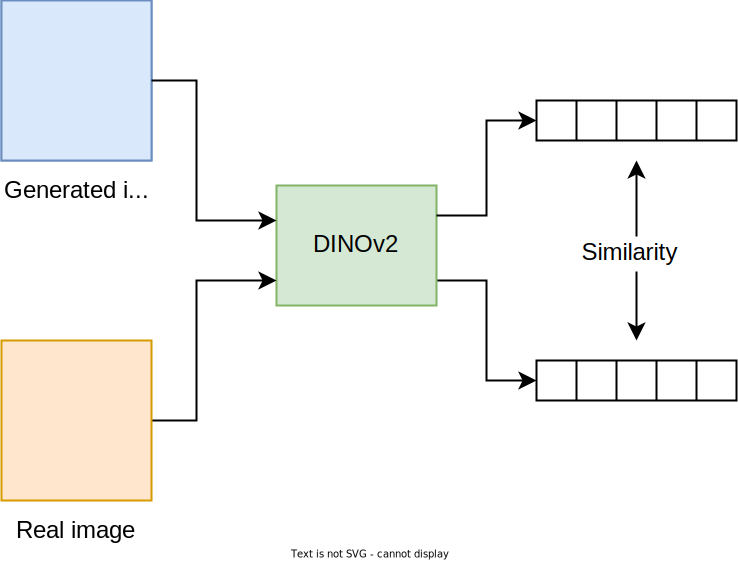

Figure 15: Image alignment calculation with DINOv2 \[15\]

##### DINO versus CLIP

DINO is preferred for comparing images because it is trained to capture detailed visual features. For example, two images, one with a yellow jacket and another with a red jacket, might have a low DINO score due to the color difference. On the other hand, CLIP is better for comparing images with text, as it is trained to match descriptions with visuals. The same images with different jacket colors might have a high CLIP score if both reflect a person wearing a jacket.

##### Facial similarity score

While CLIP and DINO measure visual similarity between generated and real images, they aren't designed to assess identity preservation. For example, two face images might show different individuals, but CLIP and DINO could still give a high similarity score. To address this, we use a face recognition model to compare generated and real images. These models specialize in identifying and measuring facial similarity, which is a crucial requirement in a personalized headshot generation system.

Combining DINO, CLIP, and facial similarity scores provides a comprehensive evaluation of image alignment in the personalized diffusion model.

### Online evaluation metrics

Online evaluation is crucial in headshot generation. It measures user satisfaction directly, which is vital when users pay for the service, as higher satisfaction often leads to increased revenue. We focus on two primary metrics:

- **User feedback:** This metric directly reflects user satisfaction. After receiving their generated headshots, users rate their satisfaction on a scale from 1 to 5. High ratings indicate that the headshots meet or exceed expectations, while lower scores highlight improvements are needed.
- **Conversion rate to paid service:** This metric measures the percentage of users who move from showing interest to becoming new paying customers. It is calculated by dividing the number of new paying customers by the total number of users who engaged with the service—such as visiting the website, signing up for a trial, or making inquiries—within a specific time period.

## Overall ML System Design

Generating professional headshots requires more than just a diffusion model. In this section, we examine three key pipelines:

- Data pipeline
- Training pipeline
- Inference pipeline

### Data pipeline

This pipeline has two responsibilities:

- Preparing images with the subject of interest
- Preparing images of generic human faces
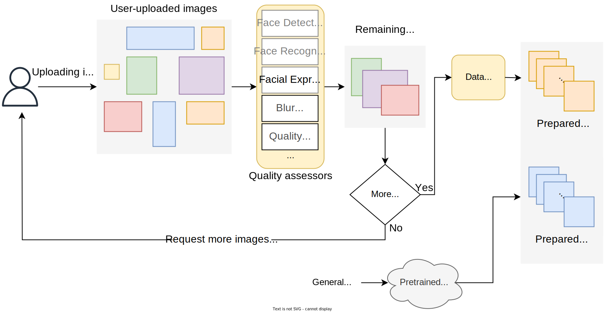

Figure 16: Data pipeline components

#### Preparing images with the subject of interest

This process evaluates user-uploaded images to ensure they meet predefined standards and prepares them for training.

Specifically, it verifies that the images are diverse and contain only a single object of interest: the user's face. To achieve this, we use various heuristics and ML models to analyze the images, checking factors such as clarity, diverse angles, expressions, and the presence of the user's face. If any images fail to meet these criteria, they are rejected, and the user is asked to upload more. This ensures that only high-quality images are used to finetune the diffusion model.

#### Preparing images of generic human faces

This step involves preparing images with generic faces to prevent the model from overfitting to the subject of interest. We use the pretrained T2I model to generate these images with prompts like “a person sitting on a chair.”

### Training pipeline

This pipeline is responsible for personalizing the pretrained diffusion model.

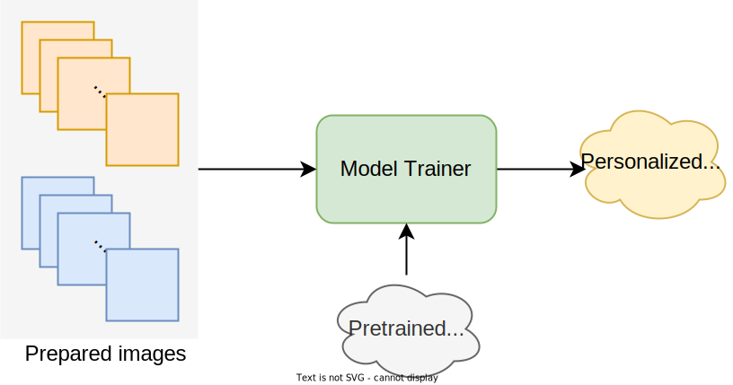

Figure 17: Finetuning a pretrained diffusion model

### Inference pipeline

The inference pipeline is responsible for generating the headshots of the user using a personalized T2I model. Three main components in the inference pipeline are:

- Image generator
- Quality assessment service
- Uploader service
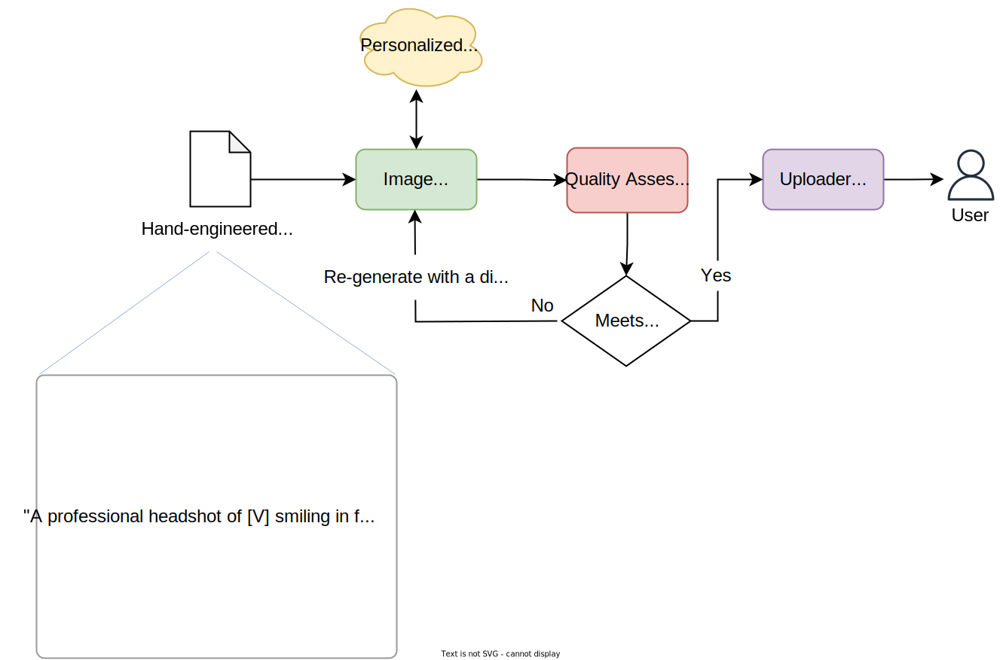

Figure 18: Inference pipeline components

#### Image generator

The image generator utilizes the personalized T2I model and hand-engineered text prompts to generate one image per prompt.

#### Quality assessment service

This service ensures the generated images meet identity preservation standards. This service uses a pretrained face recognition model to compare the generated headshot with the user's real images. If the generated image fails to preserve the user's identity, the service rejects it and requests that the image generator produce a new image using the same text prompt but with a different initial noise.

#### Uploader service

The uploader service manages the delivery of generated images to the user. It uploads the images to cloud storage so users can download their headshots.

## Other Talking Points

If there is extra time at the end of the interview, here are some additional talking points:

- Preventing catastrophic forgetting during the finetuning \[16\].
- The details of choosing a rare token for the new subject, and its importance \[5\].
- Details of class-specific prior preservation loss \[5\].
- Addressing the issue of reduced output diversity after finetuning \[5\].
- Supporting multiple sizes and aspect ratios in generated images \[17\].
- Details of tuning-free methods such as Meta’s Imagine Yourself \[1\].
- Mitigating the risks and ethical concerns around deepfake generation and detection \[18\].
- ML techniques to handle personally identifiable information (PII) securely while ensuring data privacy \[19\]\[20\].

## Summary

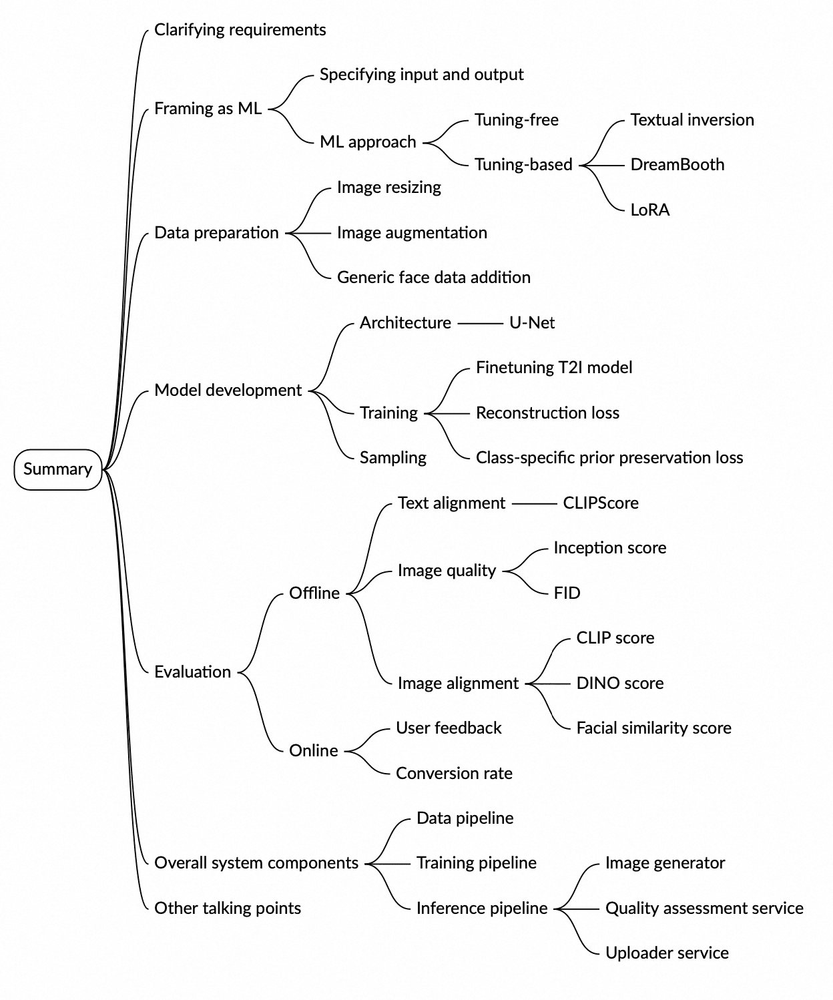

Image represents a mind map summarizing key aspects of a Generative AI system design interview. A central 'Summary' box branches into seven main colored categories: Clarifying requirements (light orange) and Specifying Input and output (light blue) focus on initial project definition, including framing the problem as a Machine Learning (ML) task and choosing between tuning-free (e.g., Textual Inversion) or tuning-based (e.g., DreamBooth, LoRA) approaches. Data preparation (purple) details image resizing and augmentation, including generic face data addition. Model development (gold) covers architecture (U-Net), training (with reconstruction, class-specific prior preservation losses), and sampling. Evaluation (salmon) distinguishes between offline metrics (text alignment, image quality, CLIPScore, Inception score, FID) and online metrics (image alignment, user feedback, conversion rate). Overall system components (teal) outlines the data, training, and inference pipelines, along with the image generator, quality assessment service, and uploader service. Finally, Other talking points (light peach) suggests additional discussion areas. Each branch further subdivides into more specific details, creating a hierarchical structure illustrating the interconnectedness of various design considerations.

## Reference Material

\[1\] Imagine yourself: Tuning-Free Personalized Image Generation. [https://ai.meta.com/research/publications/imagine-yourself-tuning-free-personalized-image-generation/](https://ai.meta.com/research/publications/imagine-yourself-tuning-free-personalized-image-generation/).  
\[2\] MoA: Mixture-of-Attention for Subject-Context Disentanglement in Personalized Image Generation. [https://arxiv.org/abs/2404.11565](https://arxiv.org/abs/2404.11565).  
\[3\] InstantID: Zero-shot Identity-Preserving Generation in Seconds. [https://arxiv.org/abs/2401.07519](https://arxiv.org/abs/2401.07519).  
\[4\] An Image is Worth One Word: Personalizing Text-to-Image Generation using Textual Inversion. [https://textual-inversion.github.io/](https://textual-inversion.github.io/).  
\[5\] DreamBooth: Fine Tuning Text-to-Image Diffusion Models for Subject-Driven Generation. [https://arxiv.org/abs/2208.12242](https://arxiv.org/abs/2208.12242).  
\[6\] LoRA: Low-Rank Adaptation of Large Language Models. [https://arxiv.org/abs/2106.09685](https://arxiv.org/abs/2106.09685).  
\[7\] Language Models are Few-Shot Learners. [https://arxiv.org/abs/2005.14165](https://arxiv.org/abs/2005.14165).  
\[8\] Classifier-Free Diffusion Guidance. [https://arxiv.org/abs/2207.12598](https://arxiv.org/abs/2207.12598).  
\[9\] CLIPScore: A Reference-free Evaluation Metric for Image Captioning. [https://arxiv.org/abs/2104.08718](https://arxiv.org/abs/2104.08718).  
\[10\] FID calculation. [https://en.wikipedia.org/wiki/Fr%C3%A9chet\_inception\_distance](https://en.wikipedia.org/wiki/Fr%C3%A9chet_inception_distance).  
\[11\] Inception score. [https://en.wikipedia.org/wiki/Inception\_score](https://en.wikipedia.org/wiki/Inception_score).  
\[12\] Learning Transferable Visual Models From Natural Language Supervision. [https://arxiv.org/abs/2103.00020](https://arxiv.org/abs/2103.00020).  
\[13\] Emerging Properties in Self-Supervised Vision Transformers. [https://arxiv.org/abs/2104.14294](https://arxiv.org/abs/2104.14294).  
\[14\] Contrastive Representation Learning. [https://lilianweng.github.io/posts/2021-05-31-contrastive/](https://lilianweng.github.io/posts/2021-05-31-contrastive/).  
\[15\] DINOv2: Learning Robust Visual Features without Supervision. [https://arxiv.org/abs/2304.07193](https://arxiv.org/abs/2304.07193).  
\[16\] An Empirical Study of Catastrophic Forgetting in Large Language Models During Continual Fine-tuning. [https://arxiv.org/abs/2308.08747](https://arxiv.org/abs/2308.08747).  
\[17\] SDXL: Improving Latent Diffusion Models for High-Resolution Image Synthesis. [https://arxiv.org/abs/2307.01952](https://arxiv.org/abs/2307.01952).  
\[18\] Deepfakes, Misinformation, and Disinformation in the Era of Frontier AI, Generative AI, and Large AI Models. [https://arxiv.org/abs/2311.17394](https://arxiv.org/abs/2311.17394).  
\[19\] Privacy-Preserving Personal Identifiable Information (PII) Label Detection Using Machine Learning. [https://ieeexplore.ieee.org/document/10307924](https://ieeexplore.ieee.org/document/10307924).  
\[20\] Does fine-tuning GPT-3 with the OpenAI API leak personally-identifiable information? [https://arxiv.org/abs/2307.16382](https://arxiv.org/abs/2307.16382).