## Introduction

Text-to-video generation is a key application of generative AI, enabling the generation of videos from textual descriptions. This chapter delves into the crucial components required to build a text-to-video model.

Figure 1: An example of a generated video by OpenAI’s Sora model \[1\]

## Clarifying Requirements

Here is a typical interaction between a candidate and an interviewer.

**Candidate:** What is the expected length of the generated videos?  
**Interviewer:** Let’s aim for five-second-long videos.

**Candidate:** What video resolution are we targeting?  
**Interviewer:** We should aim for high-definition quality to ensure the videos suit a wide range of modern platforms and devices. Let’s aim for 720p resolution.

**Candidate:** Is 24 frames per second (FPS) the desired rate for the generated video?  
**Interviewer:** Yes.

**Candidate:** What is the expected latency for generating a video?  
**Interviewer:** Video generation is computationally expensive. For the start, a few minutes of processing time will be acceptable. In future iterations, we will optimize for efficiency and speed.

**Candidate:** Should we focus on a specific video category?  
**Interviewer:** No, the system should generate videos across various genres and subjects.

**Candidate:** Should the system support multiple languages for text input, or are we starting with English only?  
**Interviewer:** Let's start with English.

**Candidate:** Should the generated videos include audio output?  
**Interviewer:** Let's focus on silent videos for now. Audio could be considered for an enhancement for future iterations, but it’s not a priority at this stage.

**Candidate:** What is the approximate size of our training data?  
**Interviewer:** We have a large video dataset, around 100 million diverse videos with captions. Some captions might be noisy or non-English.

**Candidate:** A common approach to building a text-to-video model is to extend a pretrained text-to-image model to handle videos. Do we have a pretrained text-to-image model?  
**Interviewer:** Yes, that is a fair assumption.

**Candidate:** Considering the high computational demands of video generation, what is our compute budget?  
**Interviewer:** Training a video generation system requires significant computational resources. We have over 6000 *H100 GPUs* \[2\] available for text-to-video training.

**Candidate:** Shall we ensure the system has safeguards to prevent generating offensive or harmful videos is crucial?  
**Interviewer:** Great point. Yes, we need to ensure our proposed system is safe for users.

## Frame the Problem as an ML Task

This section frames the text-to-video generation problem as an ML task and highlights the necessary considerations beyond those used in Chapter 9 for text-to-image generation.

### Specifying the system’s input and output

The input is a descriptive text outlining a scene, action, or narrative. The output is a five-second 720p (1280 x720) video that visually and temporally aligns with the given text prompt.

For example, given a text input like "A dog playing fetch in a park on a sunny day," the system should generate a video depicting this scene, capturing the dog's movement, the park's environment, and the ambiance of a sunny day.

Figure 2: Input and output of a text-to-video system

### Choosing a suitable ML approach

Text-to-video generation is similar in nature to text-to-image generation. Both generate visuals from textual descriptions. Techniques such as autoregressive modeling and diffusion models that are popular in text-to-image generation are also effective for text-to-video generation. As we saw previously, diffusion models have demonstrated strong performance in producing detailed and realistic visuals. Therefore, we choose a diffusion model to develop our text-to-video generation system.

There is, however, a crucial difference between them. For video generation, the model must process and generate a sequence of frames rather than a single image. This significantly increases the computational load. For instance, generating a five-second video at 24 FPS means the model must produce 120 frames. A 512x512 image might take around 1 second to generate on a high-end GPU such as the NVIDIA’s H100, but scaling this to a five-second 720p video would require much more time, as each 720p frame has about 3.6 times more pixels. As a result, generating a five-second 720p video could take around seven minutes.

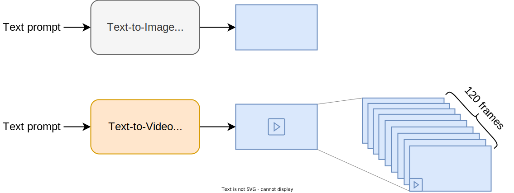

Figure 3: Text-to-video generating a sequence of frames

To address the complexity and computational cost of video generation, we employ the popular latent diffusion model approach. This approach was first popularized by the Stable Diffusion paper \[3\] and later applied and used by most video generation models, such as OpenAI's *Sora* \[1\] and Meta’s *Movie Gen* \[4\]. Let’s explore this approach further.

#### Latent diffusion model (LDM)

The core idea behind LDM is to have a diffusion model operate in a lower-dimensional latent space rather than directly in the pixel space. The diffusion model learns to denoise these lower-dimensional latent representations rather than the original video pixels in the training dataset.

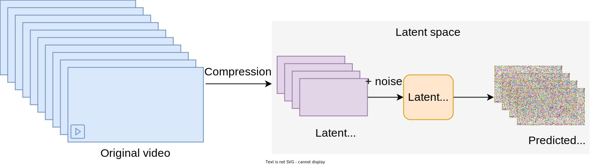

Figure 4: Diffusion model operating in a lower-dimensional latent space

LDM relies primarily on a compression network to compress video pixels into a latent representation. Let’s examine the compression network in more detail.

##### Compression network

The compression network is a neural network that maps video pixels to a latent space. It takes raw video as input and outputs a compressed latent representation, reducing both its frame count (temporal dimension) and its resolution (spatial dimensions).

The compression network is usually based on a Variational Autoencoder (VAE) \[5\] model that is trained separately from the diffusion model. The VAE's visual encoder transforms the input video into a latent representation, while its visual decoder reconstructs the original video frames from this latent space.

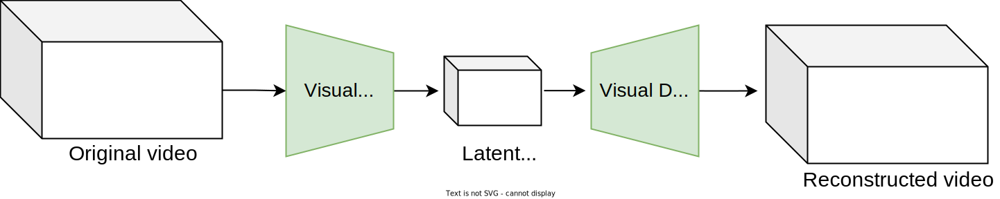

Figure 5: Compression network consisting of visual encoder and decoder

##### How does LDM address computational complexity?

LDMs require less computing power than standard diffusions because processing compressed representations is cheaper than handling high-dimensional pixels. To understand the impact of this compression, let's walk through an example.

Imagine we need a video with 24 FPS, a duration of five seconds, and a resolution of 720p. This means 120 frames, each with 1280x720 pixels—a substantial amount of data to process. If we use a compression network similar to \[4\] that reduces both the temporal and spatial resolution by a factor of 8, the video’s spatial dimension becomes 160x90 pixels, and its temporal dimension shrinks to 15 frames.

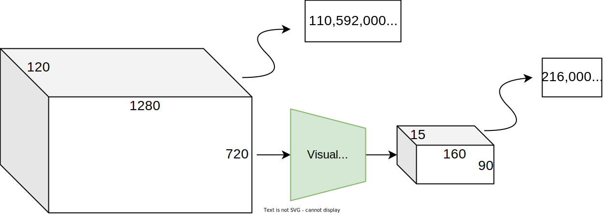

Figure 6: Impact of compression on data volume

This compressed representation is 512 times smaller than its pixel-space equivalent, making LDM training 512 times more efficient. This efficiency results in faster generation times and reduced resource consumption, which is especially valuable when handling high-resolution video data.

##### How to generate a video using a trained LDM

To generate a video using a trained LDM, we start with pure noise in the latent space. The LDM gradually refines it into a denoised latent representation. The visual decoder then converts this latent representation back into pixel space to produce the final video.

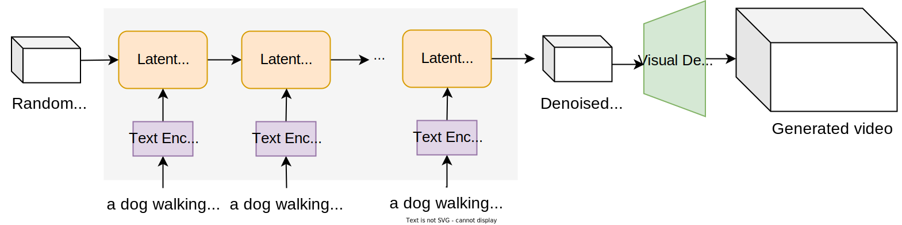

Figure 7: Video generation using a trained LDM

For this chapter, we choose an LDM approach to develop our text-to-video generation system because it's efficient and it reduces computational load. To learn more about LDM, refer to \[6\].

## Data Preparation

The dataset for text-to-video generation includes 100 million pairs of textual descriptions and their corresponding videos. These pairs cover various subjects and actions, allowing the model to learn from diverse videos. In this section, we prepare the videos and captions for training our LDM.

### Video preparation

We focus on three key steps in preparing videos for training:

1. Filter inappropriate videos
2. Standardize videos
3. Precompute video representations in the latent space

##### Filter inappropriate videos

Large datasets often contain unwanted content. This step removes inappropriate videos to ensure the model learns only from high-quality ones. Common steps include:

- **Remove low-quality or short videos:** We follow *Movie Gen* \[4\] and remove low-resolution, short, slow motion, or distorted videos with compression artifacts.
- **Remove duplicated videos (deduplication):** We use a deduplication method such as \[7\] to eliminate identical videos. This ensures training data is diverse and the model will not be exposed to certain videos more than others.
- **Remove harmful videos:** We use harm-detection models to identify and remove videos with explicit content. This step is vital to ensure our text-to-video model will not generate harmful videos.

##### Standardize videos

- **Adjust video length:** We split longer videos into five-second clips to ensure training data consists only of videos of the same length.
- **Standardize frame rate:** We re-encode the videos with higher frame rates to 24FPS to ensure all the videos have the same frame rates.
- **Adjust video dimensions:** We resize and crop videos to a standard size, for example, 1280x720 pixels.

##### Precompute video representations in the latent space

As the LDM operates in the latent space, it needs only latent representations as input. Thus, each training iteration normally requires the following steps:

1. Extract frames from a video in the training data.
2. Pass these frames through a pretrained compression network to obtain latent representations.
3. Use the latent representations to continue training the diffusion model.

However, those steps are inefficient. Extracting frames and compressing them for millions of videos each time we train a new model slows diffusion training. Computing latent representations on the fly is resource-intensive and time-consuming.

To optimize the process, we precompute the latent representations for all videos and cache them in storage. During training, the diffusion model directly accesses the precomputed latent representations without waiting for frame extraction or compression processes. This approach significantly speeds up the diffusion training process, while keeping the storage cost manageable. Let’s run a quick calculation to understand the storage need.

**Back-of-the-envelope calculation:** Assume that each video frame, when compressed into a latent representation, reduces in size by a factor of 512. So, if a video with 1,000 frames takes up about 1,000 MB, its latent representation would only take around 2 MB. If we cache latent representations for 100 million videos, the total storage required would be around 200 TB. Given modern storage capabilities, this is relatively manageable, especially compared to the significant time saved during training.

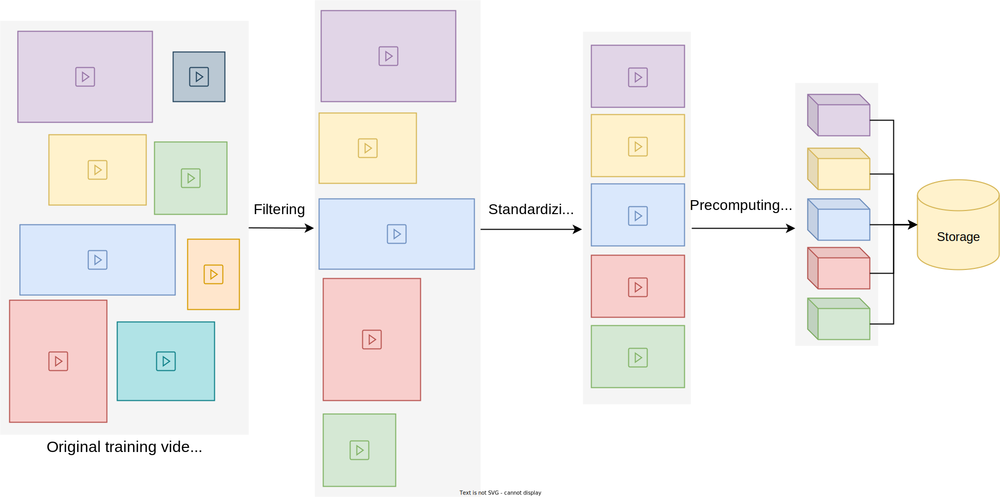

Figure 8: Video data preparation

### Caption preparation

It's important to have high-quality, consistent captions. Some captions are likely to be missing or irrelevant. Common steps for preparing captions are:

- **Handle missing or non-English captions:** For videos without captions or with captions in another language, we use models such as LLaMa3-Video \[8\] or LLaVA \[9\] to automatically generate descriptive captions.
- **Re-captioning**: We improve existing captions using pretrained video captioning models such as LLaMa3-Video or LLaVA to generate longer, more detailed versions. The Sora team \[1\] has shown that this process is essential for enhancing quality and text alignment.
- **Precomputing caption embeddings:** Diffusion model training requires caption embeddings for conditioning. We use the text encoder to precompute caption embeddings, speeding up LDM training.
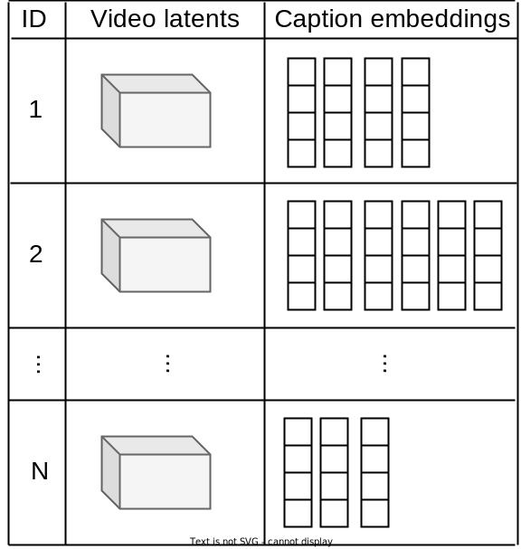

Figure 9: Prepared video–caption training data for training

## Model Development

### Architecture

When selecting the architecture for a text-to-video diffusion model, we have two main options: U-Net and DiT. We’ll examine each and determine the additional layers required to extend them to handle videos.

#### U-Net for videos

Let's briefly review the U-Net architecture before extending it to process videos. As we explored in Chapter 9, the U-Net architecture consists of a series of downsampling blocks followed by a series of upsampling blocks. Each downsampling block includes 2D convolutions to process and update image features and a cross-attention layer to update features by attending to the text prompt.

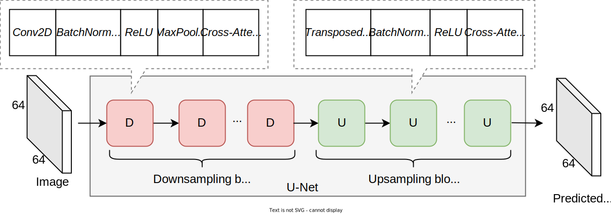

Figure 10: U-Net architecture for image generation

However, these layers mainly focus on capturing the relationships between pixels within a single image. This design presents a challenge for videos, where maintaining temporal consistency is crucial for smooth motion and continuity across frames. Current layers, however, operate spatially within individual frames rather than across frames.

To address this shortcoming, we modify the U-Net architecture to understand relationships across frames. In particular, we inject two commonly used temporal layers:

- Temporal attention
- Temporal convolution
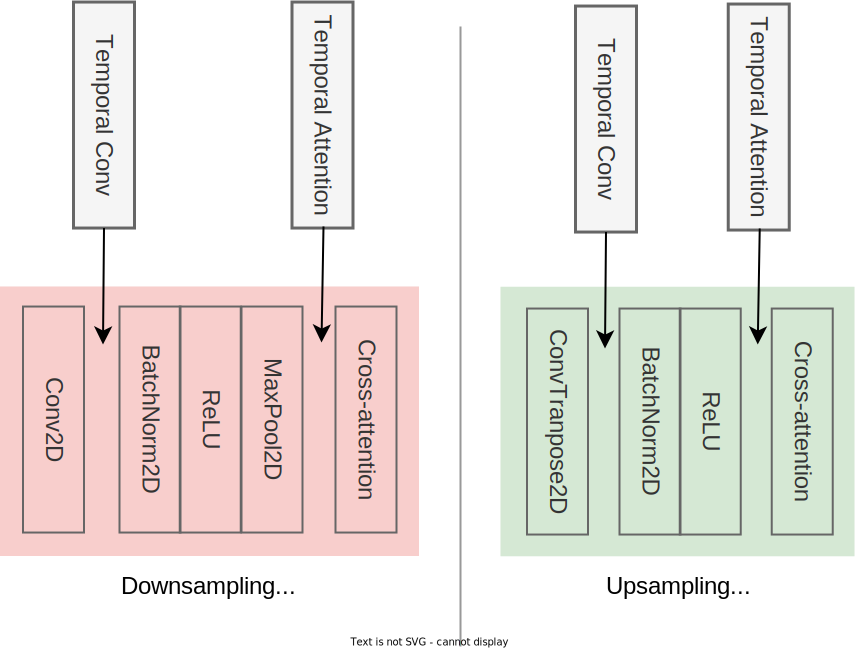

Figure 11: Injecting temporal layers into the U-Net’s downsampling and upsampling blocks

Let’s briefly review each layer.

**Temporal attention:** Temporal attention utilizes the attention mechanism across frames. Each feature is updated by attending to relevant features across other frames. Figure 12 shows how a certain feature in frame 2 is updated by attending to the features in the other frames.

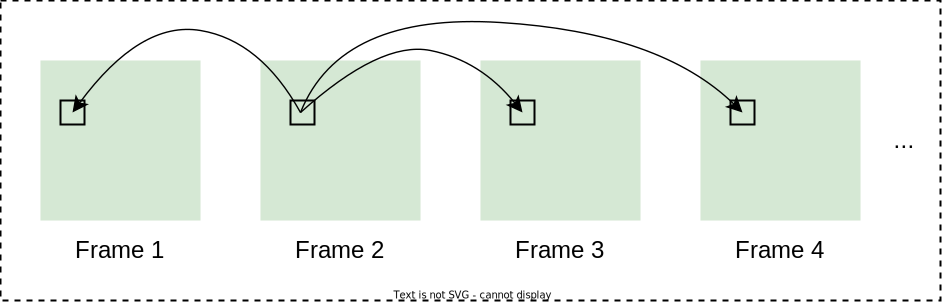

Figure 12: Temporal attention updating features by looking across frames

- **Temporal convolution:** Temporal convolution refers to applying a convolution operator to a 3D segment of data, to capture the temporal dimension. Figure 13 illustrates 2D and 3D temporal convolutions.
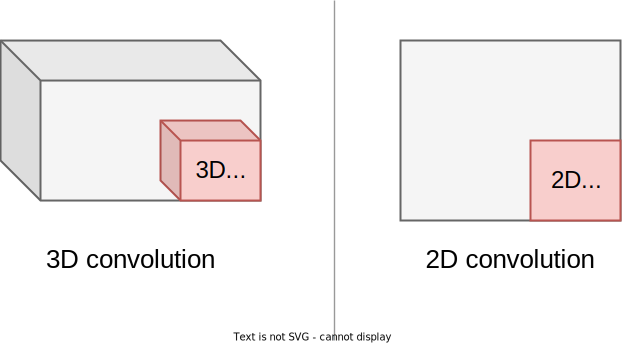

Figure 13: 2D convolution vs. 3D convolutions

In summary, to extend a U-Net architecture to process videos, we can interleave temporal convolution and temporal attention layers in each downsampling and upsampling block. These layers allow the U-Net architecture to model the motion in input videos and generate a sequence of frames that are temporally consistent. To learn more about how these layers can be interleaved, refer to \[10\].

#### DiT for videos

Unlike U-Net, which is based mainly on convolutions, DiT relies primarily on the Transformer architecture. As shown in Figure 14, DiT consists of four main components:

- Patchify
- Positional encoding
- Transformer
- Unpatchify
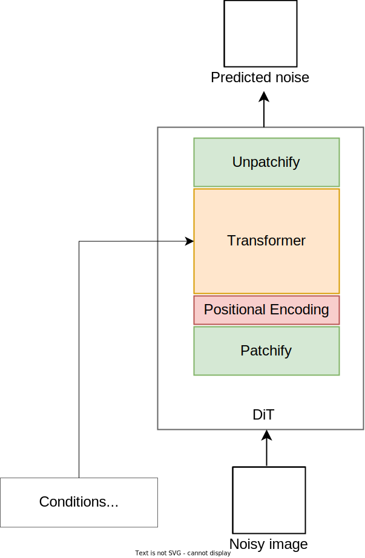

Figure 14: DiT components

Let’s examine each component and understand its purpose.

##### Patchify

This component converts the input to a sequence of embedding vectors. It first divides the input into smaller, fixed-size patches. Each patch is then flattened to form a sequence of vectors. The flattened patches are finally transformed into patch embeddings using a projection layer. This step is crucial to align the embedding size of each flattened patch with the Transformer's hidden size.

The patchify process is similar for both image and video inputs. For images, it divides the input into fixed-size 2D patches. For videos, the video is divided into 3D patches.

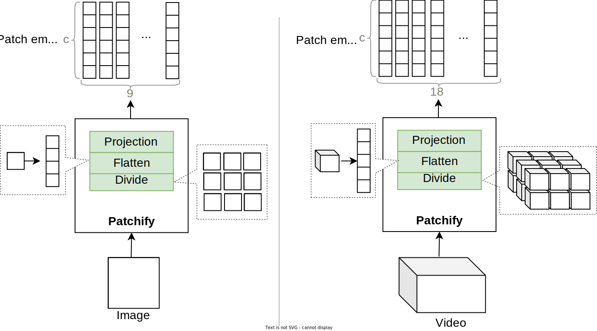

Figure 15: Patchify for image vs. video

##### Positional encoding

The positional encoding component produces an embedding for each position in the original sequence. These embeddings provide the Transformer with information about the location of each patch in the original input.

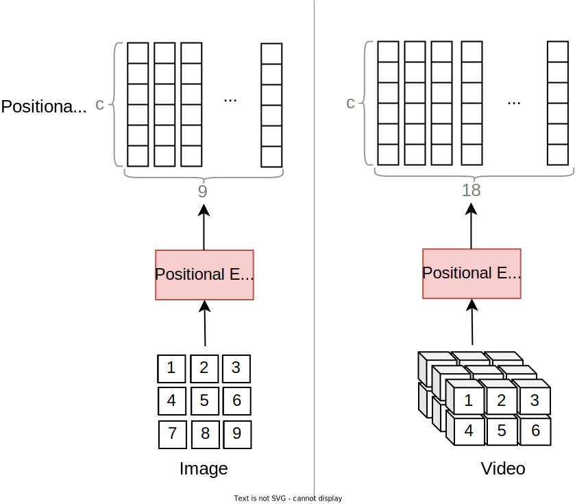

Figure 16: 1D positional encoding for image vs. video

As we saw in Chapter 2, there are different ways to encode positions: Some methods use fixed positional encoding during training, while other methods make the positional encoding learnable. There are also different ways to assign positions to each patch. For example, we can give each patch a single number to show its place in a sequence or use 3D coordinates (2D for images) to show where each patch is in space and time.

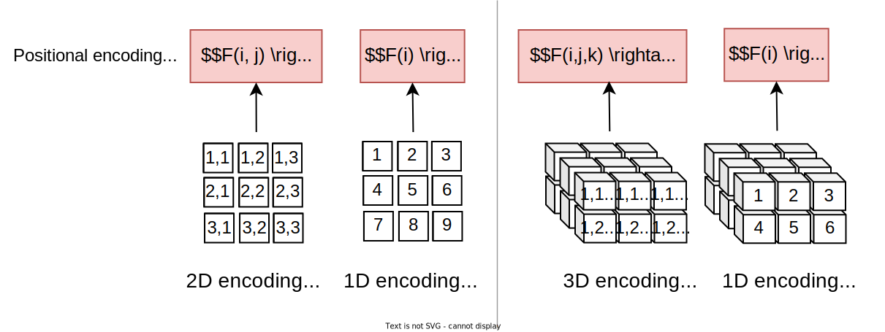

Figure 17: 1D, 2D, and 3D positional encoding

There is not one best way to do positional encoding. We often need to run experiments to find the approach that will be most effective for the data and task. In this chapter, we follow OpenSora \[11\] and use RoPE \[12\] positional encoding. To learn more about positional encoding in text-to-video models, refer to \[4\].

##### Transformer

The Transformer processes the sequence of embeddings and other conditioning signals, such as the text prompt, to predict noise for each patch.

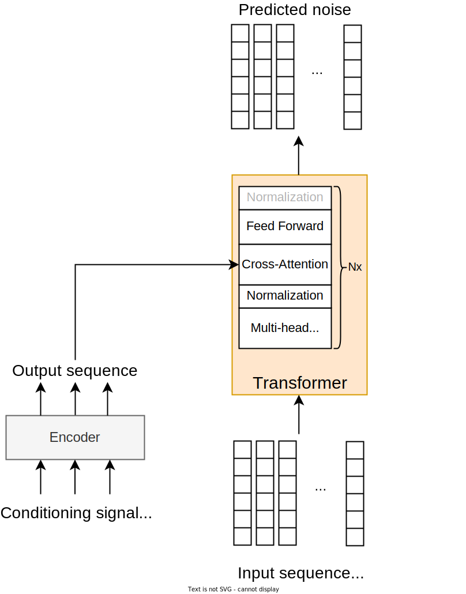

Figure 18: Transformer component

##### Unpatchify

Unpatchify converts the predicted noise vectors back to the original input dimensions. It includes a *LayerNorm* for normalization, a linear layer to adjust vector length, and a reshape operation to form the final output.

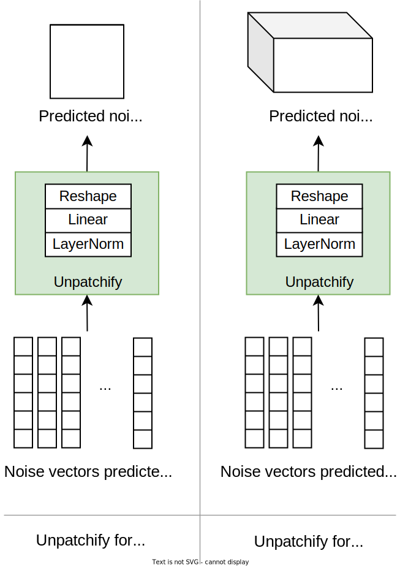

Figure 19: Unpatchify component

#### U-Net vs. DiT

Both U-Net and DiT architectures are proven to be effective for text-to-video generation. The U-Net architecture has been around for longer and has been extensively tested. Popular U-Net-based text-to-video models include Stable Video Diffusion \[13\] by Stability AI and EMU video \[14\] by Meta.

The DiT architecture is more recent and has shown great promise, with superior results. DiT performs better with increased data and computational power due to the scalable nature of Transformers. In addition, it has a flexible architecture, making it easier to adapt to videos and other input modalities. Meta’s *Movie Gen* and OpenAI’s *Sora* is a popular model based on the DiT architecture.

In this chapter, we follow Sora and choose the DiT architecture.

### Training

Training a video diffusion model is very similar to training an image diffusion model. During training, we add noise to the original video by simulating the forward process and train the model to predict the added noise. The three concrete steps involved in one iteration of training are:

1. **Noise addition:** A timestep is randomly sampled to determine the level of noise addition. The sampled timestep is used to add noise to the input video.
2. **Noise prediction:** The DiT model receives the noisy video as input and predicts the added noise based on conditioning signals such as text prompt and the sampled timestep.
3. **Loss calculation:** The loss is measured by comparing the predicted noise to the actual noise.

To review diffusion training in more detail, refer to Chapter 9.

#### ML objective and loss function

The primary loss function is the reconstruction loss, calculated using the mean squared error (MSE) formula. This loss measures the difference between the predicted noise and the actual noise, encouraging the model to accurately predict the added noise. The ML objective is to minimize the reconstruction loss, leading to accurate video reconstruction.

Researchers have experimented with adding other loss functions to enhance text-to-video performance. To learn more, refer to \[4\].

#### Challenges in training video diffusion models

Training a DiT model for text-to-video generation involves several challenges and design decisions. This section explores two important challenges:

- Lack of large-scale video–text data
- Computational cost of high-resolution video generation

##### Lack of large-scale video–text training data

Training large models requires lots of data. As opposed to training text-to-image models, where a huge amount of image–text paired data is available, paired video–text data is scarce. This scarcity presents a challenge in training effective video generation models.

There are two common strategies for addressing the lack of large-scale data:

1. **Train the DiT model on both image and video data:** This strategy treats each image as a single-frame video, thus allowing the model to train on both image–text and video–text data.
2. **Pretrain the DiT model on image data:** This strategy first pretrains the DiT model on image–text pairs to leverage extensive image data and build a strong visual foundation. The pretrained model is then finetuned on video–text pairs for video generation.
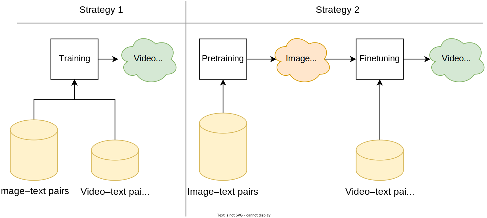

Figure 20: Two strategies to utilize image–text training data

Both strategies leverage hundreds of millions of image–text data in training, allowing the DiT model to learn from both images and videos. For simplicity, we choose the first strategy, as it requires only one stage of training. However, both strategies can be effective in practice.

##### Computational cost of high-resolution video generation

As discussed earlier, processing and generating videos is more expensive than images. This is primarily because videos generally contain hundreds of frames, making the process slower and more costly. Generating high-resolution videos, such as 720p or 1080p, adds to the challenge.

Here are a few common strategies to reduce the computational cost of training high-resolution video generation models:

- **Employ an LDM-based approach:** Instead of training the DiT model directly in pixel space, we use a compression network to convert videos from pixel space into a lower-dimensional latent space. Training the diffusion model in this latent space reduces the computational load.
- **Precompute video representations:** By precomputing video representations in the latent space before training, we avoid repetitive computations during training. Utilizing this cached data speeds up the training process.
- **Utilize a spatial super-resolution model:** As proposed by Google’s “ *Imagen video”* \[15\], we use a separately trained model to upscale the resolution of generated videos. The DiT model generates videos at a lower resolution that are then enhanced to the desired resolution by a spatial super-resolution model. For example, the DiT model can generate videos at 720p, and a spatial super-resolution model can then upscale them to 1080p or 4K.
- **Utilize a temporal super-resolution model:** As proposed by \[15\], we employ a model to increase the temporal resolution by interpolating between frames. For instance, if a video should be five seconds at 24 FPS (i.e., 120 frames total), the DiT model can generate it at 12 FPS (60 frames), and a temporal super-resolution model can then interpolate to achieve 24 FPS.
- **Use more efficient architectures:** We can adopt an efficient implementation of the attention mechanism \[16\] to reduce the computational load during training. Additionally, techniques like Mixture of Experts (MoE) \[17\] can be used to accelerate the training process.
- **Use distributed training:** We use distributed training techniques, such as tensor parallelism, to parallelize training across multiple devices. By splitting the model, data, or both across different devices, we can significantly speed up training and handle larger video datasets more efficiently. This approach is particularly useful for high-resolution video generation, where memory and computational demands are substantial. For an overview of distributed training, refer to Chapter 1.
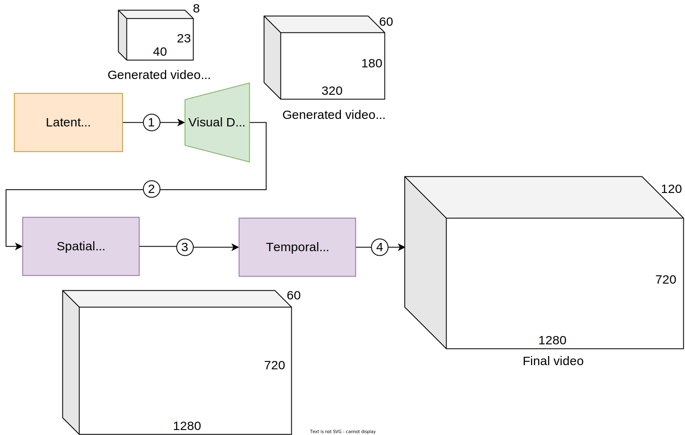

Figure 21: Efficient text-to-video pipeline

### Sampling

The sampling process in diffusion models starts with random noise, and the model iteratively denoises the sample until a fully denoised video representation in the latent space is obtained. For more details on sampling in diffusion models, refer to Chapter 9.

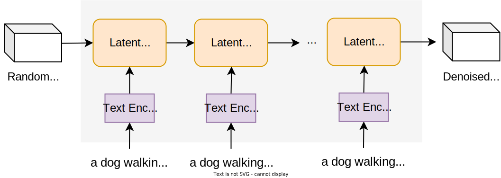

Figure 22: Sampling process from a trained LDM

## Evaluation

### Offline evaluation metrics

A consistent benchmark is crucial for evaluating video generation models. *VBench* \[18\] and *Movie Gen Bench* \[19\] offer this by providing a curated set of prompts designed to test various aspects of video generation such as motion coherence, temporal consistency, and scene complexity. We can use these benchmarks to measure how well the model creates realistic and smooth videos, focusing on video quality, motion accuracy, and scene transitions. Let’s explore both automated metrics and human evaluation, focusing on three key areas:

- Frame quality
- Temporal consistency
- Video–text alignment

#### Frame quality

Frame quality refers to measuring the quality of each frame independently. To measure this quality we employ FID \[20\] and Inception score (IS) \[21\], both of which are commonly used for images. The overall quality is calculated by averaging the FID and IS scores of all frames. Other metrics such as LPIPS \[22\] and KID \[23\] can also be used.

While FID and IS measure the quality of individual frames, they don't account for the temporal consistency in generated videos. For instance, a video might have high-quality frames but lack smooth transitions, resulting in a high FID score without visual coherence. Let's explore temporal consistency and the common metrics used to measure it.

#### Temporal consistency

Temporal consistency refers to how smoothly visual content transitions from one frame to the next. Evaluating temporal consistency is important to ensure the generated video flows naturally. A common metric for measuring temporal consistency is the Fréchet Video Distance (FVD).

##### FVD

FVD \[24\], which is an extension of FID, evaluates both the visual quality and temporal consistency of videos. It compares the statistical distribution of generated videos to real videos in an embedded space.

Here's a step-by-step guide to calculating the FVD score:

1. **Generating videos:** We start by generating a large set of videos using the model we want to evaluate. These videos will be compared against a set of real videos to evaluate their quality and consistency.
2. **Extracting features:** We pass each video (both generated and real) through a pretrained I3D model \[25\] and extract features from a specific layer. The I3D model extends the Inception v3 \[26\] architecture to sequential data by training it for action recognition.
3. **Calculating mean and covariance:** We calculate the mean and covariance of the extracted features separately for generated and real videos. These statistical measures summarize the distribution of features for both sets of videos.
4. **Computing Fréchet distance:** We calculate the FVD score as the Fréchet distance between the mean and covariance of generated and real videos. The Fréchet distance measures how close the two distributions are.

A lower FVD score indicates greater similarity between the distributions, meaning the generated videos are more realistic and temporally consistent.

#### Video–text alignment

Video–text alignment refers to how accurately the generated video reflects the textual description on which it was conditioned.

A commonly used metric to measure video–text alignment is the CLIP similarity score, calculated as follows:

1. **Extracting frame-level features:** We pass each video frame through a pretrained CLIP image encoder to get visual features. The text is encoded using the text encoder to obtain textual features.
2. **Calculating similarities:** For each frame, we compute the cosine similarity between its visual features and the textual features. This score indicates how well the frame content aligns with the text.
3. **Aggregating per-frame similarities:** We aggregate these similarity scores to get a single score representing the overall video–text alignment. Aggregation can be done by averaging, taking the maximum score, or using other statistical methods.

A high CLIP similarity score indicates that generated videos are aligned with their corresponding text.

#### Human evaluation

Alongside the described automated metrics, human evaluation is still vital for assessing generative models, as it provides a subjective assessment that complements automated measures.

For human evaluation, we generate videos from test prompts using two different models. We then present pairs of videos, one from each model, to human annotators. They choose the better video based on assessing video–text alignment, video quality, and temporal consistency. This process allows us to compare two models to see which one performs better.

### Online evaluation metrics

Online evaluation metrics for text-to-video models are similar to those for text-to-image models. Important metrics include:

- Click-through rate
- Time spent on the page
- User feedback
- Conversion rate

These metrics help gauge user engagement, satisfaction, and overall model performance in production.

## Overall ML System Design

In this section, we dive into the holistic design of a text-to-video generation system. In particular, we examine the following pipelines:

- Data pipeline
- Training pipeline
- Inference pipeline

### Data pipeline

The data pipeline prepares training data by filtering unsuitable images and videos, standardizing them, and precomputing and storing latent representations. It ensures captions are relevant and detailed by re-captioning and using a pretrained text encoder to precompute and store caption embeddings.

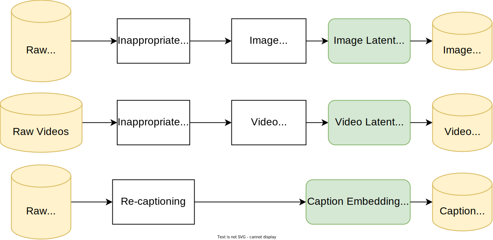

Figure 23: Data pipeline

### Training pipeline

The training pipeline trains the model using the training data prepared by the data pipeline.

### Inference pipeline

The inference pipeline processes real-time user requests to generate videos from text prompts. As shown in Figure 24, it has several crucial components that ensure system quality and safety.

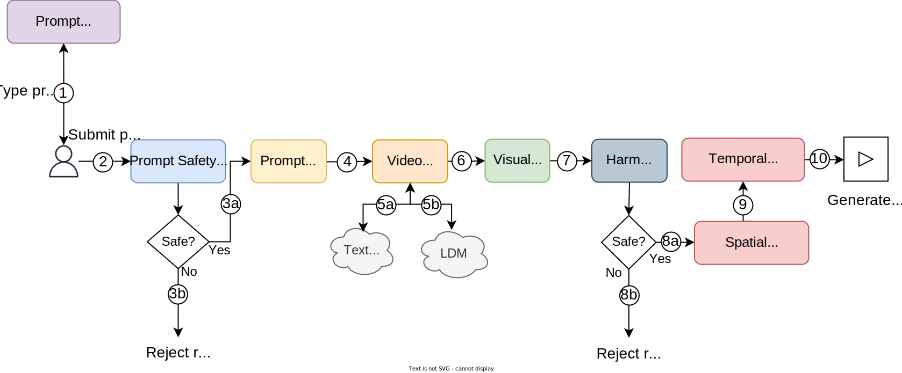

Figure 24: Inference pipeline components

Most of the components are similar to those explored in Chapter 9 for text-to-image generation. The unique components for text-to-video generation are:

- Visual decoder
- Temporal super-resolution

#### Visual decoder

The LDM generates output in the latent space, not the pixel space. The visual decoder then uses the compression network to convert this latent representation back into the pixel space.

#### Temporal super-resolution

This component interpolates between the generated frames, leading to smoother motion in videos.

## Other Talking Points

In case there's extra time at the end of the interview, you might discuss these further topics:

- Ensuring sampling flexibility for variable durations, resolutions, and aspect ratios \[1\].
- Extending the text-to-video model to downstream applications such as inpainting, outputpainting, video-to-video stylization, frame interpolation, super-resolution, and animating images (image-to-video) \[10\].
- Support for controlling the generated videos such as the level of desired motion and the type of motion (camera vs. object motion) \[27\].
- Using progressive distillation techniques to reduce the computational demands of training \[28\].
- Details of spatial and temporal super-resolution models \[15\].
- Details of re-captioning model \[9\]\[8\].
- Different noise schedulers. \[29\].
- Noise conditioning augmentation techniques \[30\].
- Personalizing a text-to-video model to a particular subject \[31\].
- ControlNet for text-to-video models \[32\].
- Details of Stable Cascade method \[33\].
- Details of visual compression network \[13\].

## Summary

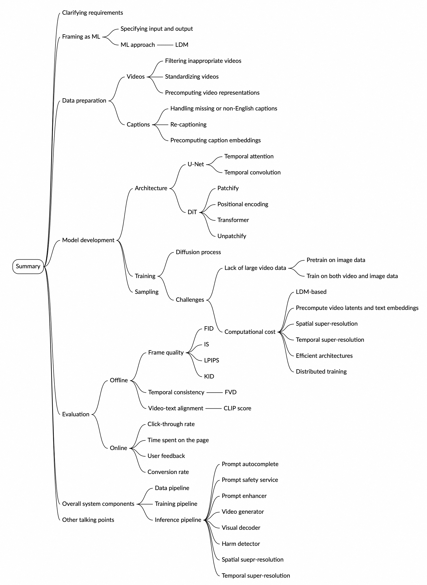

Image represents a mind map summarizing the design of a video generation AI system. The central node is labeled 'Summary,' branching out into several major categories. The 'Clarifying Requirements' branch details specifying input and output, and framing the problem as a machine learning (ML) approach, specifically using Latent Diffusion Models (LDM). The 'Data Preprocessing' branch covers video standardization, pre-computation, and caption handling (including missing or non-English captions) and pre-computing caption embeddings. The 'Model Development' branch focuses on architecture (using U-Net, temporal attention, and positional encoding within a Diffusion model), training, and challenges (computational cost and limitations of long video runs). The 'Evaluation' branch distinguishes between offline (frame quality metrics like PSNR, LPIPS, and KID; temporal consistency; video-text alignment; and click-through rate) and online (time spent on the page, user feedback, and conversion rate) metrics. Finally, the 'Overall System Components' branch details the data pipeline, training pipeline, and inference pipeline, which includes components like a prompt safety service, video generator, visual detector, and spatial and temporal super-resolution. The 'Other Talking Points' branch suggests additional discussion areas. All branches are color-coded for clarity, and the connections visually represent the hierarchical relationships between different aspects of the system design.

## Reference Material

\[1\] Video generation models as world simulators. [https://openai.com/index/video-generation-models-as-world-simulators/](https://openai.com/index/video-generation-models-as-world-simulators/).  
\[2\] H100 Tensor Core GPU. [https://www.nvidia.com/en-us/data-center/h100/](https://www.nvidia.com/en-us/data-center/h100/).  
\[3\] High-Resolution Image Synthesis with Latent Diffusion Models. [https://arxiv.org/abs/2112.10752](https://arxiv.org/abs/2112.10752).  
\[4\] Meta Movie Gen. [https://ai.meta.com/research/movie-gen/](https://ai.meta.com/research/movie-gen/).  
\[5\] Auto-Encoding Variational Bayes. [https://arxiv.org/abs/1312.6114](https://arxiv.org/abs/1312.6114).  
\[6\] The Illustrated Stable Diffusion. [https://jalammar.github.io/illustrated-stable-diffusion/](https://jalammar.github.io/illustrated-stable-diffusion/).  
\[7\] On the De-duplication of LAION-2B. [https://arxiv.org/abs/2303.12733](https://arxiv.org/abs/2303.12733).  
\[8\] The Llama 3 Herd of Models. [https://arxiv.org/abs/2407.21783](https://arxiv.org/abs/2407.21783).  
\[9\] LLaVA-NeXT: A Strong Zero-shot Video Understanding Model. [https://llava-vl.github.io/blog/2024-04-30-llava-next-video/](https://llava-vl.github.io/blog/2024-04-30-llava-next-video/).  
\[10\] Lumiere: A Space-Time Diffusion Model for Video Generation. [https://arxiv.org/abs/2401.12945](https://arxiv.org/abs/2401.12945).  
\[11\] OpenSora Technical Report. [https://github.com/hpcaitech/Open-Sora/blob/main/docs/report\_02.md](https://github.com/hpcaitech/Open-Sora/blob/main/docs/report_02.md).  
\[12\] RoFormer: Enhanced Transformer with Rotary Position Embedding. [https://arxiv.org/abs/2104.09864](https://arxiv.org/abs/2104.09864).  
\[13\] Stable Video Diffusion: Scaling Latent Video Diffusion Models to Large Datasets. [https://arxiv.org/abs/2311.15127](https://arxiv.org/abs/2311.15127).  
\[14\] Emu Video: Factorizing Text-to-Video Generation by Explicit Image Conditioning. [https://arxiv.org/abs/2311.10709](https://arxiv.org/abs/2311.10709).  
\[15\] Imagen Video: High Definition Video Generation with Diffusion Models. [https://arxiv.org/abs/2210.02303](https://arxiv.org/abs/2210.02303).  
\[16\] HyperAttention: Long-context Attention in Near-Linear Time. [https://arxiv.org/abs/2310.05869](https://arxiv.org/abs/2310.05869).  
\[17\] Mixture of Experts Explained. [https://huggingface.co/blog/moe](https://huggingface.co/blog/moe).  
\[18\] VBench: Comprehensive Benchmark Suite for Video Generative Models. [https://vchitect.github.io/VBench-project/](https://vchitect.github.io/VBench-project/).  
\[19\] Movie Gen Bench. [https://github.com/facebookresearch/MovieGenBench](https://github.com/facebookresearch/MovieGenBench).  
\[20\] FID calculation. [https://en.wikipedia.org/wiki/Fr%C3%A9chet\_inception\_distance](https://en.wikipedia.org/wiki/Fr%C3%A9chet_inception_distance).  
\[21\] Inception score. [https://en.wikipedia.org/wiki/Inception\_score](https://en.wikipedia.org/wiki/Inception_score).  
\[22\] The Unreasonable Effectiveness of Deep Features as a Perceptual Metric. [https://arxiv.org/abs/1801.03924](https://arxiv.org/abs/1801.03924).  
\[23\] Demystifying MMD GANs. [https://arxiv.org/abs/1801.01401](https://arxiv.org/abs/1801.01401).  
\[24\] Towards Accurate Generative Models of Video: A New Metric & Challenges. [https://arxiv.org/abs/1812.01717](https://arxiv.org/abs/1812.01717).  
\[25\] Quo Vadis, Action Recognition? A New Model and the Kinetics Dataset. [https://arxiv.org/abs/1705.07750](https://arxiv.org/abs/1705.07750).  
\[26\] Rethinking the Inception Architecture for Computer Vision. [https://arxiv.org/abs/1512.00567](https://arxiv.org/abs/1512.00567).  
\[27\] Moonshot: Towards Controllable Video Generation and Editing with Multimodal Conditions. [https://arxiv.org/abs/2401.01827](https://arxiv.org/abs/2401.01827).  
\[28\] Progressive Distillation for Fast Sampling of Diffusion Models. [https://arxiv.org/abs/2202.00512](https://arxiv.org/abs/2202.00512).  
\[29\] Schedulers. [https://huggingface.co/docs/diffusers/v0.9.0/en/api/schedulers](https://huggingface.co/docs/diffusers/v0.9.0/en/api/schedulers).  
\[30\] Photorealistic Text-to-Image Diffusion Models with Deep Language Understanding. [https://arxiv.org/abs/2205.11487](https://arxiv.org/abs/2205.11487).  
\[31\] CustomVideo: Customizing Text-to-Video Generation with Multiple Subjects. [https://arxiv.org/abs/2401.09962](https://arxiv.org/abs/2401.09962).  
\[32\] Control-A-Video: Controllable Text-to-Video Generation with Diffusion Models. [https://controlavideo.github.io/](https://controlavideo.github.io/).  
\[33\] Introducing Stable Cascade. [https://stability.ai/news/introducing-stable-cascade](https://stability.ai/news/introducing-stable-cascade).