## Introduction

In Chapter 4, we developed a chatbot capable of answering open-domain questions. However, many applications need access to additional information, such as company databases (e.g., internal documentation), real-time data (e.g., sports scores), or user-provided files (e.g., uploaded PDFs).

Allowing chatbots to access this information improves the accuracy and relevance of their responses, especially for fact-based or specialized tasks. A real-world example of such a system is *Perplexity.ai* \[1\], an AI-powered conversational search engine that uses web-based information to respond to user queries.

Figure 1: \*Perplexity’s\* output based on real-time information (Credit: \[1\])

In this chapter, we build a system similar to ChatPDF \[2\] that answers employee questions using internal company documents. Instead of reading FAQs, employees can ask the chatbot directly and receive answers based on those documents.

## Clarifying Requirements

Here is a typical interaction between a candidate and an interviewer:

**Candidate:** What does the external knowledge base consist of? Does it change over time?  
**Interviewer:** The knowledge base includes company Wiki pages and a company-wide “Stack Overflow”–style forum. The documentation does change, but at a slower pace compared to real-time updates.

**Candidate**: Do the Wiki pages and forums contain text, images, and other modalities?  
**Interviewer**: Assume each page is in PDF format and contains text, tables, and diagrams. For simplicity, other modalities do not need to be considered.

**Candidate**: Do the pages follow a fixed format or template?  
**Interviewer**: No, the formats vary. Some are double-column, some are single-column, and others are mixed.

**Candidate**: How many pages are there in total?  
**Interviewer**: We have around 5 million pages.

**Candidate**: Is it necessary for the system to include document references?  
**Interviewer**: Yes.

**Candidate:** Should the system respond in real time?  
**Interviewer:** Users can tolerate a slight delay of a few seconds.

**Candidate**: Does the system need to support multiple languages?  
**Interviewer**: To keep things simple, let’s stick to English.

**Candidate**: Should the system support user feedback or follow-up questions?  
**Interviewer**: Not initially. However, your design should be flexible enough to add support for feedback loops or follow-up questions.

**Candidate**: What is the expected growth in documents?  
**Interviewer**: The document base is expected to grow by twenty percent annually.

**Candidate**: Do we need to address safety concerns, such as preventing harmful, biased, or misleading outputs?  
**Interviewer**: Safety matters, but let's prioritize data handling, architecture, and performance efficiency.

## Frame the Problem as an ML Task

### Specifying the system’s input and output

The input to the ChatPDF system is a text prompt provided by the user. The model processes this prompt alongside a continuously updated document database containing both text and images. The output is a text-based response that accurately addresses the user's query.

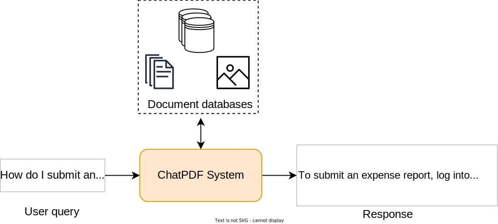

Figure 2: Input and output of a ChatPDF system

### Choosing a suitable ML approach

Given the nature of the task, large language models (LLMs) are well-suited for text generation and are often the default choice. However, general-purpose LLMs may struggle with specific domains and, therefore, may need customization to handle external data sources. To enable an LLM to answer queries based on company-specific data, there are three main approaches:

- Finetuning
- Prompt engineering
- Retrieval-augmented generation (RAG)

Let's explore each one in detail and discuss their trade-offs.

#### Finetuning

In this approach, a pretrained general-purpose LLM is finetuned on company-specific data, such as internal documents. By updating its weights, the LLM adapts to better understand the company's unique terminology, processes, and FAQs. Chapter 10 will explore advanced finetuning techniques such as LoRA \[3\] to adapt large models to specific data.

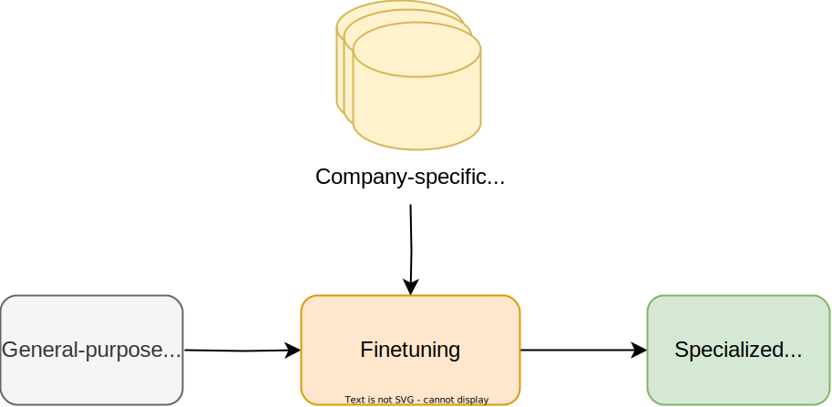

Figure 3: Finetuning approach

##### Pros:

- **Customizable:** Finetuning allows the model to generate responses tailored to specific domains.
- **Enhanced accuracy:** By finetuning the model on specialized data, it becomes more accurate and better able to handle niche topics.

##### Cons:

- **Computationally expensive:** Updating the entire model’s parameters requires a lot of computational resources, which can be expensive.
- **Frequent retraining:** This approach requires frequent finetuning to continuously incorporate up-to-date data into the model.
- **Requires technical expertise:** This approach requires an understanding of ML principles and language model architectures, which can be a barrier for those without specialized knowledge.
- **Extensive data requirement:** Finetuning requires a substantial, high-quality dataset, which can be difficult and time-consuming to collect.
- **Lack of references:** Finetuned models usually can’t provide references for their answers, making it hard to verify or trace information back to its source.

#### Prompt Engineering

Prompt engineering guides a general-purpose LLM to produce specific outputs through carefully designed prompts. Unlike finetuning, this method keeps the underlying LLM unchanged and includes relevant information, such as company data or instructions, directly in the prompts to control the model’s behavior. For example, a prompt might include information such as the summary of company policies, as shown in Figure 4. Later in this chapter, we will explore more advanced prompt engineering techniques, such as few-shot and chain-of-thought prompting.

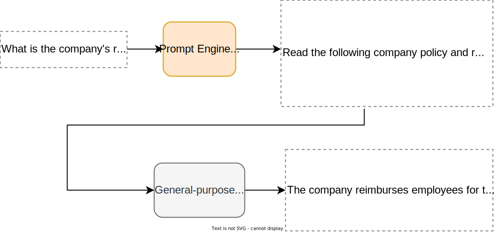

Figure 4: Prompt engineering approach

##### Pros:

- **Ease of use:** The prompt engineering is simple to use and requires no technical skills, which makes it suitable for a wide range of users.
- **Cost-effectiveness:** By leveraging a pretrained LLM, prompting incurs minimal computational costs compared to finetuning.
- **Flexibility:** Prompts can be easily modified to experiment with different outputs without having to retrain the model.

##### Cons:

- **Inconsistency:** The quality and relevance of responses can vary greatly depending on how the prompt is phrased.
- **Limited customization:** The ability to tailor responses is limited to the effectiveness and creativity of the prompt design. Prompt engineering lacks the depth of customization that finetuning provides.
- **Limited to LLM’s existing knowledge:** Outputs are confined to the information the LLM was initially trained on, making it less effective for highly specialized domains or providing responses based on the most current information.

#### RAG

RAG is an advanced method that combines the capabilities of a general-purpose LLM with a real-time retrieval system. Instead of relying solely on the LLM’s pretrained knowledge, RAG retrieves relevant information from external sources, such as a company’s internal documents, and feeds it into the LLM during inference. This approach ensures the LLM generates responses that are both relevant and accurate based on the available information.

A RAG system, as shown in Figure 5, has two components:

- **Retrieval:** The retrieval component takes the user’s original prompt, finds the most relevant information from external sources, and returns it as context.
- **Generation:** Typically, a general-purpose LLM uses the user's prompt and the retrieved information to generate a response.
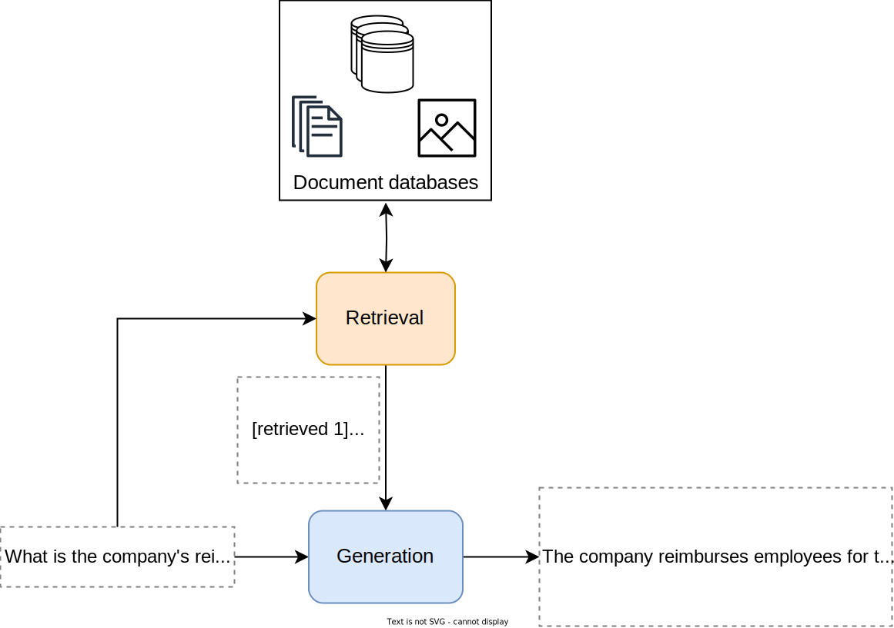

Figure 5: Components of a RAG system

##### Pros:

- **Access to most current information:** RAG can provide up-to-date responses by pulling data from external sources, thus improving the relevance and accuracy of the answers.
- **Contextual relevance:** By retrieving information from external sources, RAG can add context to the model’s answers, making responses more detailed and relevant.

##### Cons:

- **Implementation complexity:** Implementing RAG can be technically challenging, as it requires two components (retrieval and generation) to work together smoothly.
- **Dependence on retrieval quality:** The quality of the responses is highly dependent on the relevance and accuracy of the retrieved information, which can impact the overall performance of the system.

#### Which approach is more suitable for ChatPDF?

Finetuning allows the LLM to generate more specialized responses but is computationally expensive and does not reference original documents, making it unsuitable for our needs. While prompt engineering provides a simple and flexible way to guide a general-purpose LLM without finetuning, it’s not scalable. This is because including the information from all external sources in the prompt typically exceeds LLM’s context window.

RAG offers a balanced solution in terms of ease of setup, cost, and scalability, making it ideal for handling large, evolving datasets and providing up-to-date information. This approach is particularly effective for internal query chatbots in corporate environments. Therefore, we choose RAG to build our ChatPDF system. In the model development section, we delve into prompt engineering and discuss how we combine it with RAG to further enhance the system.

## Data Preparation

The performance of the RAG system relies on the quality of the knowledge database and the way it is indexed. When the knowledge base is sourced from websites, data-cleaning strategies such as removing inappropriate content or anonymizing sensitive information should be applied, as discussed in Chapter 4.

In this section, we focus on preparing data from a collection of PDF pages. This involves a three-step process:

- Document parsing
- Document chunking
- Indexing

### Document parsing

PDFs are one of the most widely used document formats. It is important to properly extract their content to prepare the data for LLM training and to ensure that the LLM can correctly answer questions based on the PDF’s content.

Parsing a PDF means converting its text, images, and other elements into a structured format that a language model can understand. There are two primary approaches for parsing PDFs:

- Rule-based document parser
- AI-based document parser

#### Rule-based document parser

The rule-based approach relies on predefined rules and patterns that are based on the layout and structure of the document. It attempts to “calculate” the layout and extract content accordingly, making it easy to implement when the document format is consistent and predictable.

However, rule-based methods struggle to handle a wide range of PDF types and formats because PDFs can vary considerably in design. The rigid nature of this method means that if the document does not match the expected format, it can result in mistakes when extracting the content. This makes rule-based parsing less useful when dealing with differing or complex document layouts.

#### AI-based document parser

AI-based methods take a different approach. They use advanced techniques such as object detection and OCR (Optical Character Recognition) \[4\] to identify and extract various elements from a document, for example, text, tables, and diagrams. These methods can handle a wide range of document layouts, making them better suited for dealing with complex documents.

There are various tools available for AI-based document parsing. For example, *Dedoc* \[5\] supports parsing a wide range of document formats and standardizing content into a consistent structure. Similarly, Layout-Parser \[6\] uses high-precision models to accurately detect different parts of a document, though the size of these models can slow down the process. To better understand AI-based document parsers, let’s take a closer look at how Layout-Parser works.

Layout-Parser takes a document image as input and generates a structured output using the following steps:

1. **Layout detection:** The parser uses advanced object detection models to detect and generate rectangular boxes around different content regions. These regions can include elements such as paragraphs, tables, images, or headers.
2. **Text extraction:** The content inside each rectangular box is processed using OCR to extract the text. The bounding box coordinates ensure the text is recognized in the correct order and format, maintaining the document's original structure.
3. **Structured output generation:** The parser produces a structured output containing two types of data:
	1. **Text blocks:** Includes the block’s coordinates, extracted text, reading order, and meta information.
		2. **Non-text blocks:** Includes the coordinates of figures or images.
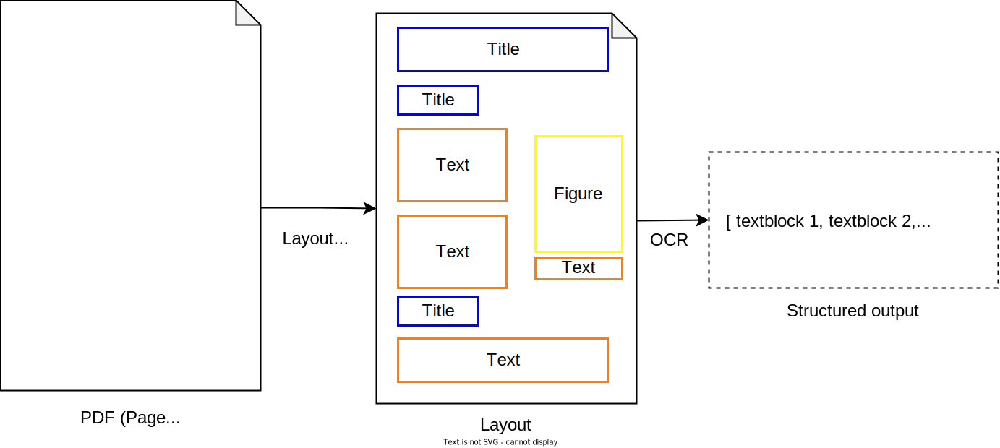

Figure 6: Converting a PDF page to a structured output for LLM

Several online services provide document parsing services, for example, Google Cloud Document AI \[7\] and PDF.co \[8\]. These services allow users to upload their documents and have them parsed without needing to set up and maintain the parsing system themselves.

### Document chunking

Once we have identified the blocks of text, images, or tables in a document, the next step is to index them into a searchable database. For long text blocks such as those found in reports or books, indexing the entire content as a single item is ineffective. This is because the embedding vector representing an entire book or report might capture the general context but miss important details, which can result in less-accurate or incomplete retrieval results. Additionally, if we retrieve the entire book or report, it would exceed the token limit of most models, such as the 128K token limit for the GPT-4o model.[^1]

Document chunking addresses these challenges by breaking the text into smaller, manageable pieces or ‘chunks.’ Chunking helps improve the quality and precision of the retrieval and ensures that each chunk fits within the model's input limit.

Some common strategies for chunking are:

- **Length-based chunking:** This simple approach splits the text into chunks based on a specified length. While it's easy to implement, it can sometimes split sentences or logical sections in the middle, leading to fragmented or less-meaningful chunks. Tools like LangChain \[9\] provide text splitters, such as the *CharacterTextSplitter* and *RecursiveCharacterTextSplitter*, which allow for adjustable chunk sizes and overlap settings. These splitters can handle different separators and help maintain coherence across chunks.
- **Regular expression-based chunking:** This approach uses regular expressions to split the text based on specific punctuation marks, such as periods, question marks, or exclamation points. It allows for better sentence-level chunking by keeping logical breaks intact, although it may still lack a deeper semantic understanding of the text.
- **HTML, markdown, or code splitters:** For documents in structured formats like HTML or Markdown, specialized splitters are used. These tools split the text at element boundaries such as headers, list items, or code blocks, while preserving the document’s overall structure. For example, LangChain has *MarkdownHeaderTextSplitter*, *HTMLHeaderTextSplitter,* and *PythonCodeTextSplitter*, respectively. These splitters are useful for web pages or technical documentation, where maintaining the hierarchical structure is important.$Image represents a data flow diagram illustrating text chunking within a LangChain system.  A dashed-line box on the left, labeled 'Character splitting is the most basic for...', acts as an input source.  A solid arrow connects this box to a central, light orange rectangle labeled 'LangChain,' representing the core processing unit.  A curved dashed arrow points from 'LangChain' to the top, indicating the input of a parameter, 'chunk_size=35,...'.  From 'LangChain,' four solid arrows extend to a dashed-line box on the right, containing four horizontally stacked text boxes. These boxes describe the output:  the first states '\nCharacter splitting is the most...', the second explains 'form of splitting up your text. \n...', the third details 'process of simply dividing your te...', and the fourth describes 'sized chunks regardless of their c...'.  The overall diagram shows how character splitting, as a basic method, is used by LangChain with a specified chunk size to divide input text into smaller, processed chunks.$ 
	Figure 7: Length-based text chunking with LangChain

### Indexing

After preparing the data through document parsing and chunking, the final critical step in the RAG system is indexing. Indexing is the process of organizing the chunked data into a structure that enables efficient and accurate retrieval. This step plays a key role in ensuring that the system can quickly locate relevant chunks of information when a query is made.

To determine the indexing process, it is crucial to understand various retrieval techniques and choose the one that best suits the task. Popular retrieval techniques include:

- Keyword-based
- Full-text search
- Knowledge graph–based
- Vector-based

Let’s first explore each technique, and then index our data to enable efficient retrieval.

#### Keyword-based

Traditional keyword-based retrieval relies on matching exact query terms with the content of documents. It is fast and simple but cannot understand the meaning of the query. For example, it may struggle with synonyms, leading to incomplete or irrelevant results. This approach is ineffective when dealing with large-scale datasets or when the goal is to retrieve information based on semantic similarity rather than exact word matches.

#### Full-text search

Full-text search engines such as Elasticsearch \[10\] offer a more advanced approach by scanning entire documents for relevant matches. This method allows for a comprehensive analysis of the document’s content, including partial matches and phrase searches. However, full-text search comes with higher computational overhead, especially when dealing with large datasets containing, for example, millions of PDF documents. Although effective for finding specific text, this approach is less efficient when it comes to semantic retrieval.

#### Knowledge graph–based

Knowledge graph–based retrieval is a sophisticated technique that leverages structured relationships between entities (e.g., people, places, or concepts) to retrieve information based on the connections between these entities. This method is excellent for answering complex queries and understanding relationships within the data. However, building and maintaining a knowledge graph requires significant effort, and it is not always practical for large, unstructured datasets such as PDF collections or Wiki pages. To learn more about knowledge graph–based retrieval, refer to \[11\].

#### Vector-based

Instead of relying on text-based matches, this method uses high-dimensional embeddings—numerical representations of the text and images—to measure the similarity between a query and the stored chunks of data. This technique enables the retrieval of relevant information even when the exact words in the query do not match the document content, making it more flexible and powerful for large-scale datasets.

#### Which retrieval technique is suitable for the ChatPDF?

To select an appropriate retrieval method, let’s first understand the scale of our system and estimate the number of data chunks involved. In this case, the company manages a large dataset of around 5 million pages. Suppose each page contains roughly 1,500 characters and includes three images. Using length-based chunking with a chunk size of 500 characters and a 200-character overlap, each page will generate 5 text chunks and 3 image chunks. Therefore, the total number of chunks the RAG system is dealing with is 5M(1500 / (500-200) + 3)=40M. This figure is expected to grow by roughly 20 percent each year, as indicated in the requirements section.

With around 40 million data chunks and a projected 20 percent annual increase, it's essential to select a retrieval technique that is scalable and can handle this growing volume efficiently.

Traditional retrieval methods \[12\] \[13\] such as keyword-based and full-text search have been widely used, but they face limitations in speed, scalability, and the ability to understand the semantic meaning of queries. Knowledge graph–based retrieval requires significant effort to build and maintain such graphs, making them a costly choice.

Vector-based retrieval, on the other hand, is the primary technique used in modern RAG systems due to the following advantages:

- **Semantic understanding:** It can capture the semantic meaning of a query, allowing for more accurate retrieval even when the exact query terms are not present in the document.
- **Scalability:** Using embedding vectors makes this method highly scalable and able to handle large datasets efficiently.
- **Efficiency:** Once the data is indexed as embedding vectors, the system can efficiently retrieve the relevant chunks.

Due to these advantages, we choose vector-based retrieval and index our data accordingly.

#### Indexing data for vector-based retrieval

In a vector-based retrieval system, each chunk of data is converted into an embedding vector representing the content in a numerical format. When indexing, ML models are employed to compute the embeddings and store them in a vector database. This makes it easy for the RAG system to quickly compare them to the query’s embedding and retrieve the most relevant information without unnecessary processing at inference time. We'll dive into the architecture of these ML models and examine the retrieval process in more detail in the model development section.

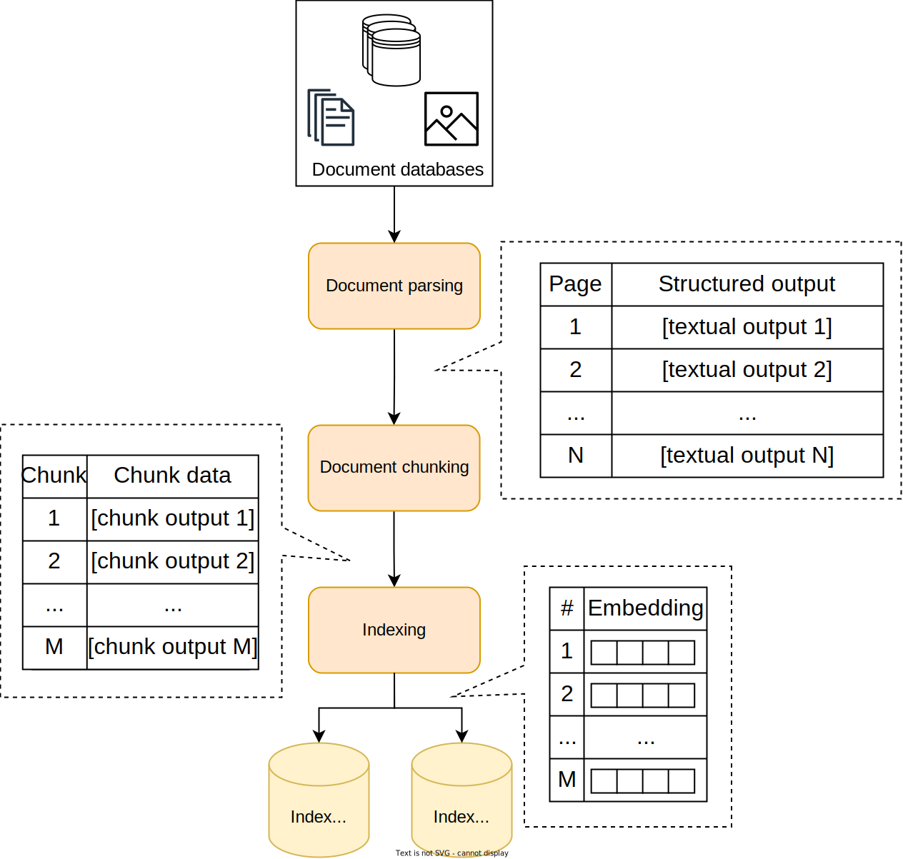

Figure 8: Data preparation steps from PDFs to indexed embeddings

In summary, we use a three-step approach to prepare PDFs for the RAG system. First, we apply document parsing techniques to convert the PDF into a structured format, breaking it down into text, tables, and images. Then, we use document chunking to split long text into smaller, manageable chunks. Finally, each chunk is converted to an embedding vector and indexed individually to improve retrieval accuracy.

## Model Development

### Architecture

This section explores the architecture of a RAG system, focusing on the ML models used in the indexing, retrieval, and generation components.

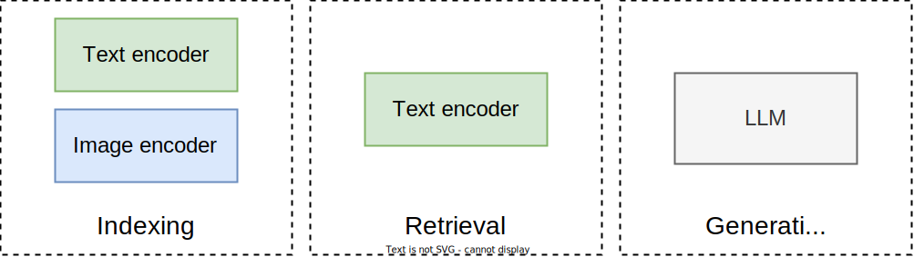

Figure 9: Various ML models in a RAG system

#### Indexing

As discussed in the data preparation section, we use ML models to convert data chunks (e.g., text or images) into embeddings. This process involves two ML models: a text encoder and an image encoder.

##### Text encoder

The text encoder is a neural network that converts input text into dense vector representations, or "embeddings." These embeddings capture the semantic meaning of the text, allowing for the assessment of the similarity of texts. During the indexing process, the text encoder converts each text chunk into an embedding, which is then stored in a database for efficient retrieval.

The architecture of the text encoder is typically based on an encoder-only Transformer, similar to what we covered in Chapter 3.

##### Image encoder

The image encoder transforms image data into embeddings. Its architecture can be either CNN-based or Transformer-based, as we covered in Chapter 5.

For effective retrieval, it is important to align the image embeddings with text embeddings. For example, if the query is “How many cats are in the company?” the system needs to ensure that the encoded query is close to the embeddings of relevant images, such as those featuring cats. There are two primary approaches to achieving this alignment:

1. **Shared embedding space:** Use image and text encoders that generate embeddings in a shared embedding space. CLIP \[14\] provides pretrained encoders with a shared embedding space, enabling cross-modal retrieval.
2. **Image captioning:** First, generate a textual description of the image using an image captioning model. The generated caption can then be encoded using a text encoder, ensuring that both image and text data exist in the same embedding space. This approach is helpful when using separate models for text and image encoders or when training a joint model is resource-intensive. To learn more about building an image captioning system from scratch, refer to Chapter 5.
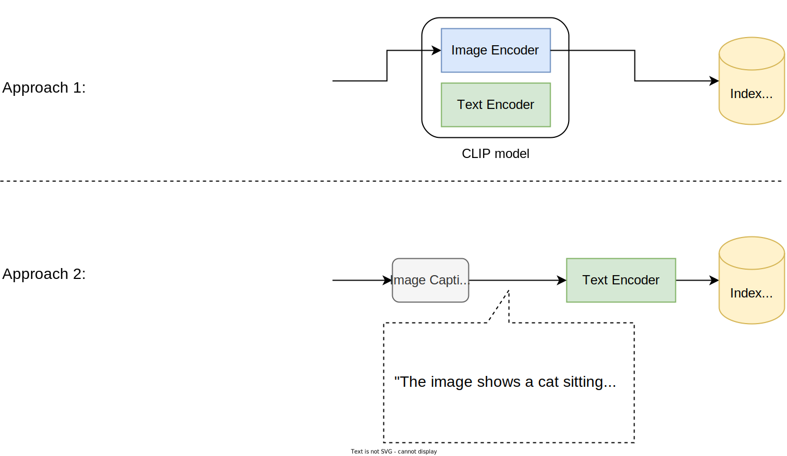

Figure 10: Two approaches for achieving text–image alignment

In summary, the indexing process uses a text encoder and an image encoder to convert data chunks into embeddings. These models are often pretrained, meaning they can be directly applied without additional training. For the purposes of this chapter, we use a pretrained CLIP model as both the text and image encoder.

#### Retrieval

The retrieval process involves converting the user’s query into the same embedding space as the indexed data. This is done using the same text encoder employed during the indexing process. Once the query embedding is computed, it is compared with the stored embeddings to retrieve the most relevant data chunks.

#### Generation

The generation component is responsible for producing the final response based on the user query and the retrieved context. This task is typically handled by an LLM, which generates contextually relevant text.

RAG systems can work with various types of LLMs irrespective of their architecture, including decoder-only Transformers (see Chapter 4 for details) or cloud-hosted models that support finetuning via APIs \[15\] \[16\].

### Training

Most of the components in a RAG system start with pretrained models, so finetuning the LLM is not typically the first step in optimizing performance. In many cases, a well-designed retrieval process combined with effective prompt engineering can yield satisfactory results. Finetuning should be considered when the system consistently fails to provide accurate or relevant answers, even after adjusting retrieval parameters and crafting prompts. For instance, if the retrieved documents are relevant but the LLM is not generating high-quality responses, finetuning could help the LLM better understand the context and nuances of the retrieved data.

One promising approach to finetuning LLMs in RAG systems is Retrieval-Augmented Fine-Tuning (RAFT). Let’s briefly examine RAFT.

#### RAFT

RAFT \[17\] introduces a novel training method to enhance the LLM’s ability to handle both relevant and irrelevant information within retrieved documents.

In traditional RAG systems, the LLM’s output depends heavily on the quality of the retrieved documents. However, irrelevant documents might be included in the retrieval results. These irrelevant documents can mislead the LLM, causing it to generate suboptimal responses. RAFT addresses this issue by incorporating a distinction between relevant and irrelevant documents during the finetuning process. This process involves two key steps:

1. **Document labeling:** Retrieved documents are labeled as either relevant (golden) or irrelevant (distractors). This provides the LLM with clear signals about the documents on which they should focus.
2. **Joint training:** During finetuning, the LLM is trained to generate responses based on the relevant documents while minimizing the influence of irrelevant documents. This requires adjusting the model’s loss function to penalize the use of irrelevant documents during response generation.

By training the model to prioritize relevant content and ignore distractors, RAFT improves the LLM’s ability to handle noisy retrieval results and generate accurate and relevant responses. This ability is crucial in real-world applications, where retrieval systems may not always be perfect. To learn more about RAFT, refer to \[17\].

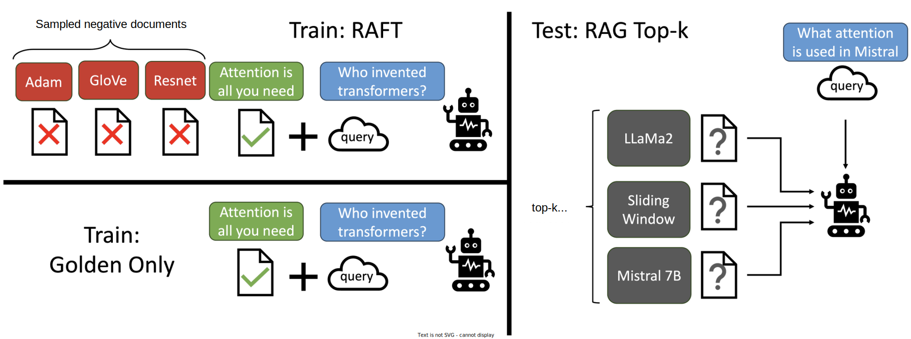

Figure 11: RAFT training method (Image taken from \[17\])

### Sampling

Sampling typically involves generating new data with a generative model. In a RAG system, however, multiple components work together to produce a response to a user’s query. In this section, we explore these components and highlight techniques for improving performance in the retrieval and generation stages of a RAG system.

#### Retrieval

The retrieval process occurs in two main steps:

1. Computing the query embedding
2. Performing a nearest neighbor search

##### 1\. Computing the query embedding

The first step involves converting the user’s query into an embedding using the text encoder. This embedding captures the semantic meaning of the query, allowing the system to compare it to the indexed embeddings of data chunks.

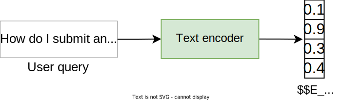

Figure 12: User query converted to embedding

##### 2\. Performing a nearest neighbor search

Once the query embedding is computed, the system performs a nearest neighbor search to find data chunks that are most similar to the query. Nearest neighbor search addresses the task of identifying data points in a dataset that are closest to a given query point, based on a chosen similarity measure. Common measures include Euclidean distance \[18\], cosine similarity \[19\], or other distance metrics that capture relationships between data points in an embedding space.

Nearest neighbor search is a fundamental component of information retrieval, search engines, and recommendation systems. Even small improvements in its performance can lead to significant overall system gains. Given its importance, interviewers may want you to dive deeper into this topic.

Nearest neighbor algorithms generally fall into two categories:

- Exact nearest neighbor
- Approximate nearest neighbor

###### Exact nearest neighbor

Exact nearest neighbor search, also called linear search, is the simplest and most accurate form of nearest neighbor search. It calculates the distance between the query embedding, $E_q$, and every item in the dataset, retrieving the $k$ nearest neighbors.

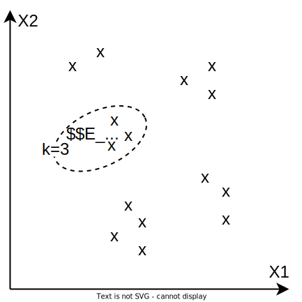

Figure 13: Top-3 nearest neighbors to query embedding

While this method guarantees finding the true nearest neighbors, it has a time complexity of $O(N\times D)$, where $N$ is the number of items in the dataset and $D$ is the embedding dimension. This linear complexity can make the process very slow when working with large-scale systems, such as a RAG system indexing tens of millions of items. For instance, performing an exact search across 40 million items for a single query would involve 40 million comparisons, leading to high computational costs and latency. Therefore, the exact nearest neighbor search is often too slow and computationally expensive to be employed in practice.

###### Approximate nearest neighbor (ANN)

In many applications, it's sufficient to retrieve items that are similar enough without needing to find the exact nearest neighbor. ANN algorithms use specialized data structures that allow the system to retrieve “close enough” neighbors without searching the entire dataset, thus reducing search time to sublinear complexity, for example, $O(\log(N)\times D)$. While these algorithms typically require some preprocessing or extra storage, they offer considerable performance benefits.

Various ANN algorithms can generally be divided into the following categories:

- Tree-based
- Locality-sensitive hashing
- Clustering-based
- Graph-based

While the interviewer typically will not expect you to know every detail of these categories, it is generally helpful to have a high-level understanding of them. Let’s dive in.

###### Tree-based

Tree-based algorithms partition the data space into multiple partitions. Then they leverage the characteristics of the tree to perform a faster search. For example, k-d tree \[20\] splits the space based on feature values, enabling faster searches by narrowing down relevant regions of the data. Other algorithms include R-trees \[21\] and Annoy (Approximate Nearest Neighbor Oh Yeah) \[22\].

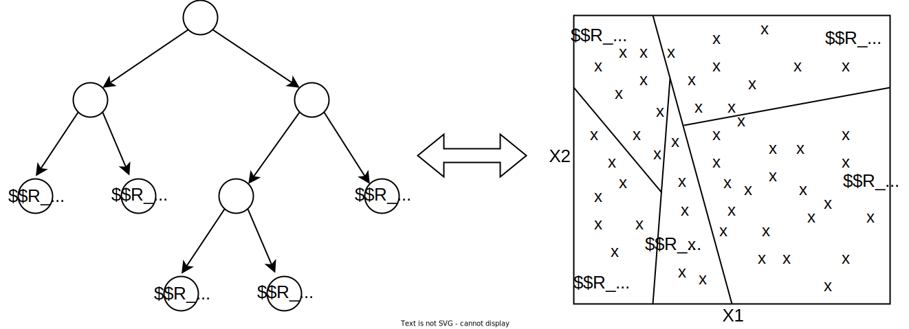

Figure 14: Partitioned space created by a tree

###### Locality-sensitive hashing (LSH)

LSH groups similar points into buckets using specialized hash functions. These functions ensure that points close in space are hashed into the same bucket. This drastically reduces the search space because only points in the same bucket as the query need to be examined, making LSH highly efficient for large datasets. You can learn more about LSH by reading \[23\].

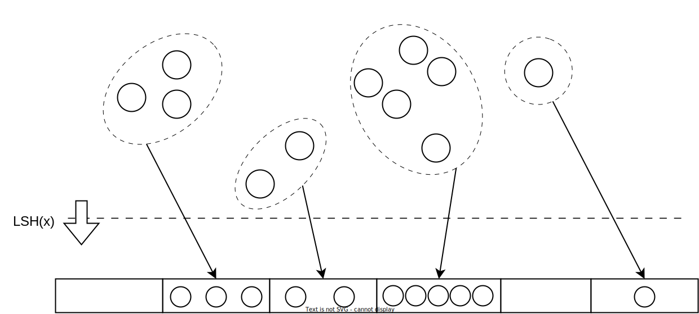

Figure 15: LSH groups the data points into buckets

###### Clustering-based

Clustering-based algorithms organize data into clusters using distance metrics such as cosine similarity or Euclidean distance. This allows the search for the nearest neighbor to be limited to the cluster(s) most relevant to the query, reducing the number of comparisons required, as only data points within the selected cluster are considered. Specifically, once the indexed items are organized into clusters, nearest neighbors are retrieved in two steps:

1. **Inter-cluster search:** The query embedding is compared to the centroids of all clusters, and the clusters that are closer than a specified threshold are selected.
2. **Intra-cluster search:** The query embedding is compared to the items in selected clusters.

This two-step process—first narrowing down the search to a cluster, then conducting a finer search within that cluster—significantly improves efficiency. This process is shown in Figure 16.

###### Graph-based

Graph-based algorithms, such as HNSW (hierarchical navigable small world) \[24\], structure the data as a graph, where nodes represent data points and edges connect them based on proximity in the embedding space. HNSW operates by navigating through this graph in a hierarchical manner, beginning with a higher-level coarse graph and gradually moving down to finer levels. The search is refined at each level, exploring only nearby nodes, thus drastically reducing the search space.

###### Which nearest neighbor search category is best suited for a RAG retrieval system?

In RAG systems, the number of indexed items is typically massive and growing, often exceeding hundreds of millions of embeddings. The time complexity of the exact nearest neighbor search is too high, therefore, we rely on ANN algorithms to efficiently retrieve relevant data chunks.

Various ANN algorithms have their own strengths. Choosing the right ANN algorithm usually depends on factors such as the dataset size, required speed, and accuracy trade-offs. For simplicity, we employ a clustering-based ANN approach in the retrieval component of the RAG system.

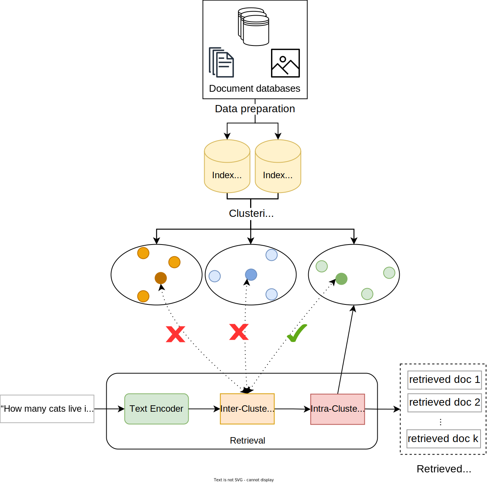

Figure 16: Overall retrieval process

Several modern frameworks provide out-of-the-box support for ANN, including:

- **Elasticsearch \[10\]:** A widely used search engine that supports vector similarity search.
- **FAISS \[25\]:** A popular library developed by Meta that enables efficient nearest neighbor search for large datasets.
- **ScaNN \[26\]:** A library developed by Google, designed for fast and efficient nearest neighbor search on large datasets.

These frameworks are commonly used in practice to make the retrieval components of large-scale systems both efficient and scalable.

#### Generation

The generation component takes the user query and retrieved context as input and generates a response using top-p sampling. However, we can further improve the quality of the generated response by incorporating prompt engineering techniques, as shown in Figure 17.

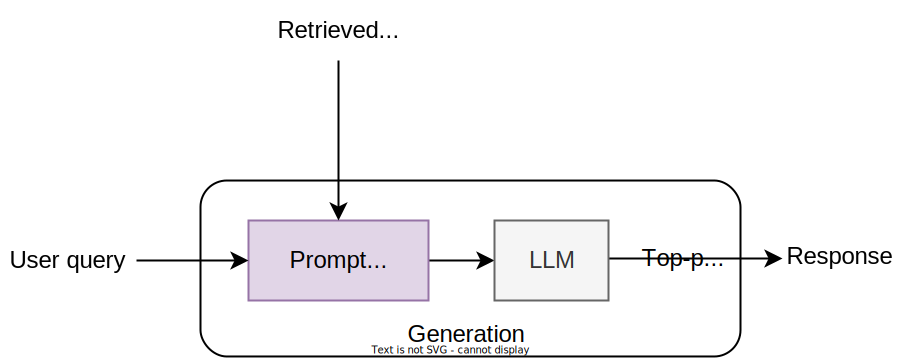

Figure 17: Generation component overview

In this section, we dive into prompt engineering and explore how it enhances response generation in a RAG system.

##### Prompt engineering

Prompt engineering is a powerful technique that optimizes input prompts to help LLMs generate more accurate and contextually relevant responses. By carefully designing prompts, we can guide the model’s output to better align with specific tasks, improving overall performance. While prompt engineering can be applied in both the retrieval (e.g., crafting better queries to optimize search) and generation, we focus on applying it to the generation for educational purposes. The same approach can also be used to improve retrieval performance.

Let’s start this section with prompt design principles, followed by prompt engineering techniques.

##### Prompt design principles

Effective prompt design is crucial for maximizing the performance of language models. By following key principles, we can enhance the quality of the generated output and reduce irrelevant or confusing responses. Below are some essential prompt engineering principles:

1. **Start simple:** Begin with straightforward prompts and gradually introduce more complexity. Iterative experimentation is key to refining prompts. Tools such as Cohere’s Playground \[27\] allow you to easily test and adjust prompts as needed.
2. **Break down complex tasks:** Break down tasks involving multiple subtasks into smaller, manageable steps. This avoids overwhelming the LLM and ensures better focus on individual subtasks.
3. **Use clear instructions:** Be explicit with instructions, using clear, action-oriented commands such as "Write," "Summarize," or "Translate." Experiment with different instructions to find what works best for your task. Placing instructions at the beginning of the prompt, separated by delimiters such as "###," can also help organize the prompt.
4. **Be specific:** Specificity leads to more accurate responses. Clearly describe what you expect in terms of format, style, or outcomes. However, avoid overloading the prompt with unnecessary details—include only what is relevant to the task.
5. **Experiment with prompt length:** Consider the length of the prompt. Too much unnecessary information can confuse the LLM, while too little may result in vague responses. Strike a balance by being concise yet detailed enough to guide the LLM effectively.

##### Prompt engineering techniques

Several prompt engineering techniques have been developed to improve the quality of LLM outputs. Some of the most effective ones include:

- Chain-of-thought prompting
- Few-shot prompting
- Role-specific prompting
- User-context prompting

###### Chain-of-thought prompting

Chain-of-thought (CoT) prompting \[28\] involves guiding the model through intermediate reasoning steps before arriving at a final answer. This is especially useful for complex queries requiring multi-hop reasoning, where the model must combine information from multiple documents to generate a complete response. CoT prompts guide the model to break down its reasoning into steps, leading to more accurate and insightful answers.

Figure 18: Example of CoT

CoT has been further extended by techniques such as \[29\] that allow models to evaluate multiple reasoning paths before selecting the best response. OpenAI’s o1 [^2] \[30\] and \[31\] have shown that an LLM’s ability to handle more complex tasks can be improved by allocating more computational budget at inference time, also known as test-time compute scaling.

###### Few-shot prompting

Few-shot prompting \[32\] involves providing the model with a few examples of input-output pairs before the actual query. This method helps the model understand the desired format and tone of the output, improving its ability to generate responses that align with the provided examples.

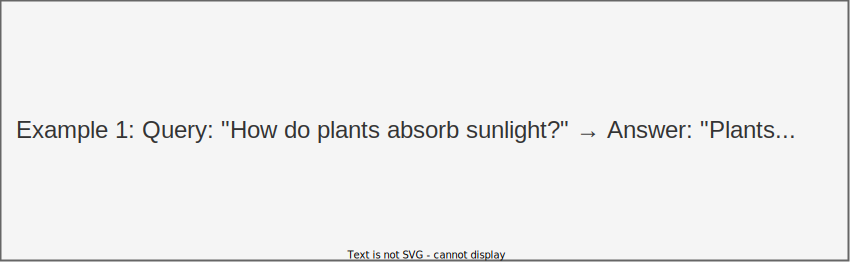

Figure 19: Example of few-shot prompting

###### Role-specific prompting

In some cases, the language model may need to adopt a specific "role" to generate an appropriate response. For example, in legal or medical domains, prompting the model to act as a subject-matter expert ensures that the response carries the necessary tone, accuracy, and authority.

Figure 20: Example of role-specific prompting

###### User-context prompting

User-context prompting tailors the model’s output based on specific user information included in the prompt. By incorporating user profiles, preferences, or locations into the queries, the model can generate personalized responses that are more relevant to the users.

Figure 21: Example of user-context prompting

This method is particularly effective when user-specific information is crucial to shaping the response, such as in personalized recommendations or location-based queries.

##### Putting it all together: prompt engineering for response generation

Combining these techniques allows us to craft highly effective prompts for generating responses in a RAG system. Principles such as clarity and specificity can guide the model to produce more accurate outputs. Prompt engineering techniques can significantly enhance a RAG’s generation capabilities, resulting in more reliable and contextually appropriate outcomes.



Figure 22: Example of final prompt for response generation

## Evaluation

Unlike traditional ML models, which are evaluated using well-defined quantitative metrics, evaluating RAG systems is more complex. This complexity arises because the quality of the final text response depends on the effectiveness of multiple components within the pipeline. To capture this multifaceted evaluation, we use a triad diagram to explain the relationship between different evaluation aspects.

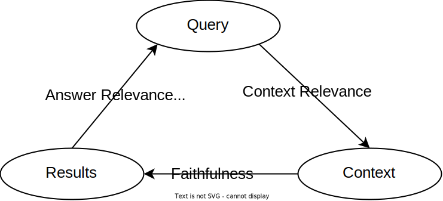

Figure 23: Triad of RAG evaluation

The evaluation of a RAG system focuses on four key aspects:

- Context relevance
- Faithfulness
- Answer relevance
- Answer correctness

These aspects help assess how well the system retrieves, generates, and matches information relevant to the user’s query. Let’s examine each in more detail.

#### Context relevance

Context relevance measures how accurately and completely the retrieval component selects relevant documents based on the query. The goal is to ensure that all relevant content appears at the top of the retrieval results. This aspect directly evaluates the effectiveness of the retrieval mechanism. Common metrics used for context relevance include:

- Hit rate
- Mean reciprocal rank (MRR)
- Normalized discounted cumulative gain (NDCG)
- Precision@k

To learn more about evaluation metrics in retrieval and ranking systems, refer to \[33\]\[34\].

#### Faithfulness

Faithfulness assesses whether the generated response is factually aligned with the retrieved context. It checks if the generation component is hallucinating (i.e., introducing information not grounded in the context). This is crucial because the system should produce answers that strictly reflect the source material. By evaluating faithfulness, we reduce the risk of generating plausible-sounding yet factually unaligned responses, thereby enhancing the reliability and trustworthiness of the output.

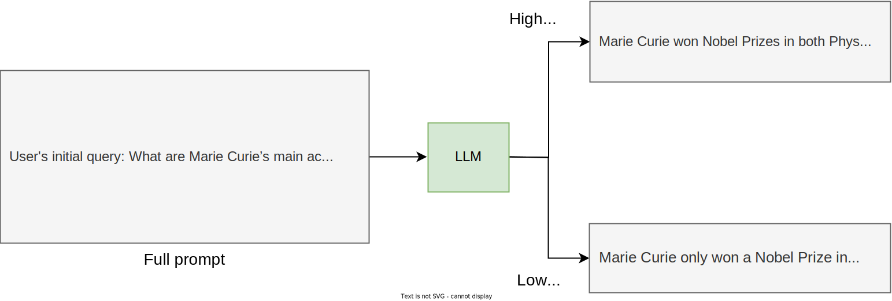

Figure 24: Example of faithfulness

Faithfulness can be assessed using the following methods:

- **Human evaluation:** Experts manually review the generated responses to determine whether they are factually aligned and correctly referenced to the retrieved documents. This process involves cross-checking each claim against the source materials to ensure all information generated is substantiated.
- **Automated fact-checking tools:** Tools such as \[35\] and \[36\] can automate the validation process by comparing the generated response against a database of verified facts. They offer a scalable solution for identifying inaccuracies, thus reducing the reliance on human evaluators.
- **Consistency checks:** This method involves evaluating whether the LLM provides consistent factual information across multiple queries. Regular consistency checks ensure that the LLM does not produce contradictory information, which is essential for maintaining the reliability and coherence of the responses over time.

#### Answer relevance

Answer relevance measures how closely the generated answer matches the original query in terms of completeness and lack of redundancy. If the response includes irrelevant or redundant information or lacks important details, it scores low in relevance. This aspect can be evaluated by comparing the question and the answer using another language model (e.g., ChatGPT).

Figure 25: Example of answer relevance

#### Answer correctness

Answer correctness focuses on how closely the generated answer matches the correct reference answer. It measures the similarity between the two using popular metrics including BLUE, ROGUE, and METEOR. To review these metrics, refer to Chapter 3.

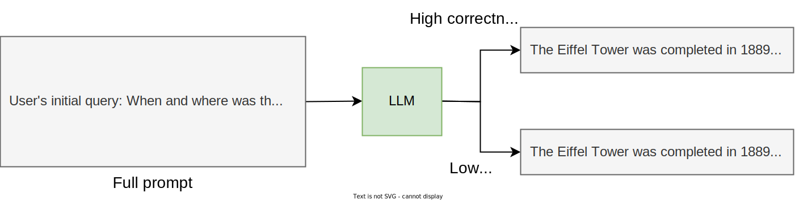

Figure 26: Example of answer correctness

## Overall ML System Design

A RAG system consists of several components that work together to retrieve and generate responses efficiently. In this section, we will explore the following key components:

- Indexing process
- Safety filtering
- Query expansion
- Retrieval
- Generation
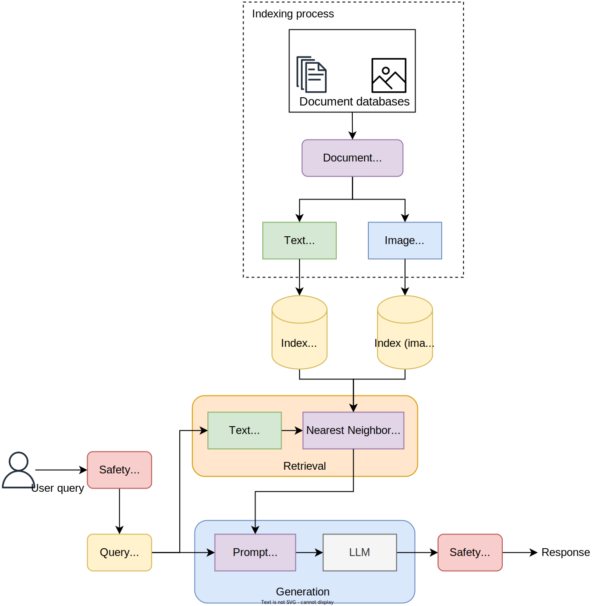

Figure 27: RAG system overall design

### Indexing process

The indexing process is responsible for converting the knowledge base into embeddings, which are then stored in an index table for efficient retrieval. This begins with document parsing and chunking, where the text and images in PDFs are broken down into meaningful data chunks. These data chunks are then converted into embeddings using a CLIP text and image encoder, ensuring that both text and image embeddings are mapped into a shared embedding space. Once the data chunks are embedded, they are stored in the index table, thus allowing for fast retrieval.

### Safety filtering

The safety filtering component ensures that user requests are safe and comply with the system's guidelines. This involves checking queries for inappropriate or harmful content before processing them further. To learn more about safety filtering and evaluation, refer to Chapter 4.

### Query expansion

Query expansion enhances the quality of the retrieval process by expanding the user's query to have a better flow and be free of typos and grammatical errors. By broadening the scope of the search, query expansion helps the system identify additional relevant data that might not have been explicitly mentioned in the original query, thereby increasing the chances of retrieving more relevant results.

To learn more about query expansion and its technical details, refer to \[37\].

### Retrieval

The retrieval component is responsible for finding the data chunks that are most relevant to the user's query. The user query is first converted into an embedding using the CLIP text encoder, and then an ANN algorithm is used to efficiently retrieve the most similar data chunks in the index table.

### Generation

Once the relevant data chunks are retrieved, the generation component produces the final output. This involves two main steps:

- **Prompt Engineering:** The user query and retrieved context are combined into a prompt and then optimized using techniques such as CoT to structure the model’s reasoning process.
- **LLM:** The LLM generates the final response using top-p sampling.

## Other Talking Points

If time permits at the end of the interview, consider discussing these additional topics:

- Tabular detection in document parsing \[38\] \[39\] \[40\].
- Details of approximate nearest neighbor algorithms \[20\] \[21\] \[23\] \[24\].
- Support user-uploaded documents \[2\].
- Dynamic retrieval strategy \[41\] \[42\].
- Query rewriting and expansion \[43\] \[37\].
- Inference time CoT and test-time scaling \[30\] \[31\].

## Summary

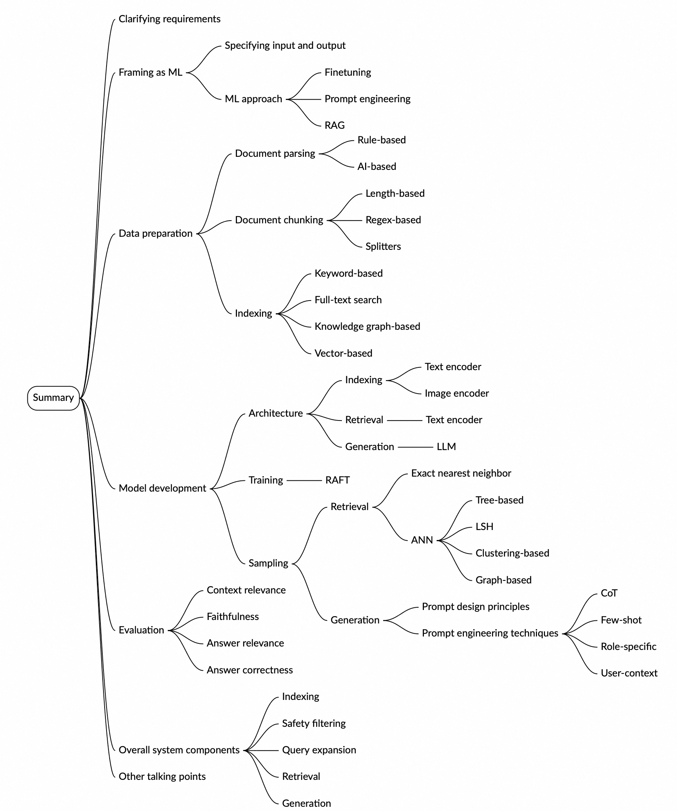

Image represents a mind map outlining the key considerations in designing a generative AI system. The central node is labeled 'Summary,' branching into two main categories: 'Model development' and 'Evaluation.' 'Model development' further branches into 'Architecture,' 'Training,' and 'Sampling.' 'Architecture' details indexing methods (keyword-based, full-text search, knowledge graph-based, vector-based), retrieval techniques (ANN, LSH, tree-based, clustering-based, graph-based), and generation methods (LLM, text encoder, image encoder, prompt engineering techniques, Chain-of-Thought (CoT), few-shot learning, role-specific prompting, and user context). 'Training' includes the mention of 'Hall.' 'Sampling' is a leaf node. 'Evaluation' branches into 'Content relevance,' 'Faithfulness,' and 'Answer correctness.' A separate branch from 'Summary' labeled 'Data preparation' details 'Clarifying requirements,' 'Specifying input and output,' 'Framing as ML,' 'Finetuning,' 'ML approach,' 'Prompt engineering,' 'RAG,' 'Rule-based,' 'Document parsing,' 'AI-based,' 'Length-based,' 'Document chunking,' 'Regex-based,' and 'Splitters.' Finally, a branch labeled 'Overall system components' includes 'Indexing process,' 'Safety filtering,' 'Query expansion,' 'Retrieval,' and 'Generation.' Another branch labeled 'Other talking points' is also present. The entire mind map uses color-coded branches to visually group related concepts.

## Reference Material

\[1\] Perplexity. [https://www.perplexity.ai/](https://www.perplexity.ai/).  
\[2\] ChatPDF. [https://www.chatpdf.com/](https://www.chatpdf.com/).  
\[3\] LoRA: Low-Rank Adaptation of Large Language Models. [https://arxiv.org/abs/2106.09685](https://arxiv.org/abs/2106.09685).  
\[4\] Optical character recognition. [https://en.wikipedia.org/wiki/Optical\_character\_recognition](https://en.wikipedia.org/wiki/Optical_character_recognition).  
\[5\] Dedoc GitHub Repository. [https://github.com/ispras/dedoc](https://github.com/ispras/dedoc).  
\[6\] LayoutParser: A Unified Toolkit for Deep Learning Based Document Image Analysis. [https://arxiv.org/abs/2103.15348](https://arxiv.org/abs/2103.15348).  
\[7\] Google Cloud document parser API. [https://cloud.google.com/document-ai/docs/layout-parse-chunk](https://cloud.google.com/document-ai/docs/layout-parse-chunk).  
\[8\] PDF.CO document parser API. [https://developer.pdf.co/api/document-parser/index.html](https://developer.pdf.co/api/document-parser/index.html).  
\[9\] Character text splitter in LangChain. [https://python.langchain.com/v0.1/docs/modules/data\_connection/document\_transformers/character\_text\_splitter/](https://python.langchain.com/v0.1/docs/modules/data_connection/document_transformers/character_text_splitter/).  
\[10\] Elasticsearch. [https://www.elastic.co/elasticsearch](https://www.elastic.co/elasticsearch).  
\[11\] A Survey on Knowledge Graphs: Representation, Acquisition, and Applications. [https://ieeexplore.ieee.org/document/9416312](https://ieeexplore.ieee.org/document/9416312).  
\[12\] Manning, Christopher D. "Introduction to information retrieval." (2008). \[[https://nlp.stanford.edu/IR-book/information-retrieval-book.html](https://nlp.stanford.edu/IR-book/information-retrieval-book.html)\] ([https://nlp.stanford.edu/IR-book/information-retrieval-book.html](https://nlp.stanford.edu/IR-book/information-retrieval-book.html))  
\[13\] Modern information retrieval: A brief overview. [http://singhal.info/ieee2001.pdf](http://singhal.info/ieee2001.pdf).  
\[14\] Learning Transferable Visual Models From Natural Language Supervision. [https://arxiv.org/abs/2103.00020](https://arxiv.org/abs/2103.00020).  
\[15\] OpenAI finetuning documentation. [https://platform.openai.com/docs/guides/fine-tuning](https://platform.openai.com/docs/guides/fine-tuning).  
\[16\] Anthropic finetuning. [https://www.anthropic.com/news/fine-tune-claude-3-haiku](https://www.anthropic.com/news/fine-tune-claude-3-haiku).  
\[17\] RAFT: Adapting Language Model to Domain Specific RAG. [https://arxiv.org/abs/2403.10131](https://arxiv.org/abs/2403.10131).  
\[18\] Euclidean distance. [https://en.wikipedia.org/wiki/Euclidean\_distance](https://en.wikipedia.org/wiki/Euclidean_distance).  
\[19\] Cosine similarity. [https://en.wikipedia.org/wiki/Cosine\_similarity](https://en.wikipedia.org/wiki/Cosine_similarity).  
\[20\] Multidimensional binary search trees used for associative searching. [https://dl.acm.org/doi/10.1145/361002.361007](https://dl.acm.org/doi/10.1145/361002.361007).  
\[21\] R-trees: A dynamic index structure for spatial searching. [https://dl.acm.org/doi/10.1145/971697.602266](https://dl.acm.org/doi/10.1145/971697.602266).  
\[22\] Annoy library. [https://github.com/spotify/annoy](https://github.com/spotify/annoy).  
\[23\] Similarity search in high dimensions via hashing. [https://www.cs.princeton.edu/courses/archive/spring13/cos598C/Gionis.pdf](https://www.cs.princeton.edu/courses/archive/spring13/cos598C/Gionis.pdf).  
\[24\] Efficient and robust approximate nearest neighbor search using Hierarchical Navigable Small World graphs. [https://arxiv.org/abs/1603.09320](https://arxiv.org/abs/1603.09320).  
\[25\] Faiss Documentation. [https://faiss.ai/](https://faiss.ai/).  
\[26\] ScaNN. [https://research.google/blog/announcing-scann-efficient-vector-similarity-search/](https://research.google/blog/announcing-scann-efficient-vector-similarity-search/).  
\[27\] Developer Playground. [https://docs.cohere.com/v2/docs/playground-overview](https://docs.cohere.com/v2/docs/playground-overview).  
\[28\] Chain-of-Thought Prompting Elicits Reasoning in Large Language Models. [https://arxiv.org/abs/2201.11903](https://arxiv.org/abs/2201.11903).  
\[29\] Tree of Thoughts: Deliberate Problem Solving with Large Language Models. [https://arxiv.org/abs/2305.10601](https://arxiv.org/abs/2305.10601).  
\[30\] OpenAI o1. [https://openai.com/index/learning-to-reason-with-llms/](https://openai.com/index/learning-to-reason-with-llms/).  
\[31\] Scaling LLM Test-Time Compute Optimally can be More Effective than Scaling Model Parameters. [https://arxiv.org/abs/2408.03314](https://arxiv.org/abs/2408.03314).  
\[32\] Language Models are Few-Shot Learners. [https://arxiv.org/abs/2005.14165](https://arxiv.org/abs/2005.14165).  
\[33\] Machine Learning System Design Interview. [https://www.aliaminian.com/books](https://www.aliaminian.com/books).  
\[34\] Evaluation measure for information retrieval. [https://en.wikipedia.org/wiki/Evaluation *measures* (information\_retrieval)](https://en.wikipedia.org/wiki/Evaluation_measures_\(information_retrieval\)).  
\[35\] Ragas. [https://docs.ragas.io/en/stable/](https://docs.ragas.io/en/stable/).  
\[36\] ARES: An Automated Evaluation Framework for Retrieval-Augmented Generation Systems. [https://arxiv.org/abs/2311.09476](https://arxiv.org/abs/2311.09476).  
\[37\] Query2doc: Query Expansion with Large Language Models. [https://arxiv.org/abs/2303.07678](https://arxiv.org/abs/2303.07678).  
\[38\] TableNet: Deep Learning model for end-to-end Table detection and Tabular data extraction from Scanned Document Images. [https://arxiv.org/abs/2001.01469](https://arxiv.org/abs/2001.01469).  
\[39\] CascadeTabNet: An approach for end to end table detection and structure recognition from image-based documents. [https://arxiv.org/abs/2004.12629](https://arxiv.org/abs/2004.12629).  
\[40\] Deepdesrt: Deep learning for detection and structure recognition of tables in document images. [https://ieeexplore.ieee.org/document/8270123](https://ieeexplore.ieee.org/document/8270123).  
\[41\] Active Retrieval Augmented Generation. [https://arxiv.org/abs/2305.06983](https://arxiv.org/abs/2305.06983).  
\[42\] Self-RAG: Learning to Retrieve, Generate, and Critique through Self-Reflection. [https://arxiv.org/abs/2310.11511](https://arxiv.org/abs/2310.11511).  
\[43\] Precise Zero-Shot Dense Retrieval without Relevance Labels. [https://arxiv.org/abs/2212.10496](https://arxiv.org/abs/2212.10496).

[^1]: Accurate at the time of writing.

[^2]: Specifics are unknown to the public at the time of writing.