## Introduction

One of the primary applications of generative AI is to generate realistic images of faces. This can be useful in entertainment, marketing, and virtual reality. In this chapter, we explore the technologies behind face generation.

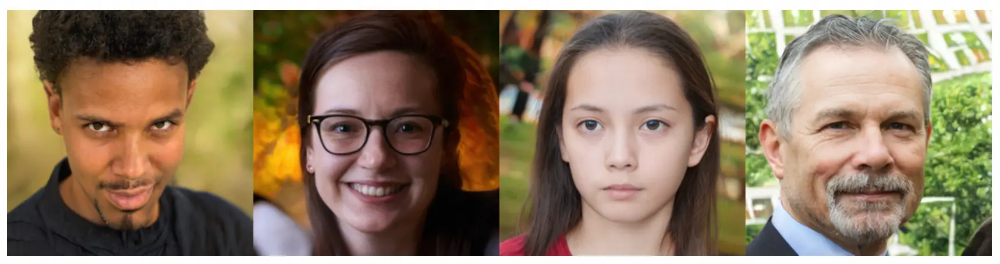

Figure 1: Realistic faces generated by StyleGAN2 \[1\]

## Clarifying Requirements

Here is a typical interaction between a candidate and an interviewer:

**Candidate**: What is the primary application of the face generation system?  
**Interviewer**: The initial focus is on entertainment and content creation, but we would also consider using it for data collection in the future.

**Candidate**: Is the focus only on faces? Or does the entire body need to be generated?  
**Interviewer**: Let’s focus on faces only.

**Candidate**: Should the generated faces represent a diverse range of ethnicities, ages, and genders?  
**Interviewer**: Yes. This is crucial to ensure inclusivity and avoid biases.

**Candidate**: Should the system allow control over facial attributes? For example, editing the facial expression of a generated image while preserving its identity?  
**Interviewer**: Good question. Let’s start without attribute control. If we have time, we can optionally discuss attribute control.

**Candidate**: How will we source the training data? What is the size of the training data?  
**Interviewer**: We use publicly available datasets with proper licenses to ensure all data is in compliance with privacy regulations. There are 70,000 images of diverse faces in the dataset.

**Candidate**: What is the desired image resolution?  
**Interviewer**: Let’s aim for 1024x1024.

**Candidate**: What is the expected speed to generate a face?  
**Interviewer**: The system should generate faces in near real-time – less than a second.

## Frame the Problem as an ML Task

### Specifying the system’s input and output

In a face generation system, users usually don't provide specific inputs; they simply request the generation of a new face. Since machine learning (ML) models need numerical inputs to start, most image generation models begin with a random noise vector. This noise serves as the initial input, which the model then transforms into a realistic image. If the system supports attribute control, users can also provide desired attributes as input to guide the generation.

The output, which is generated in response to the random noise input, is a realistic image of a human face. This output should also reflect the desired attributes (if specified), such as age, gender, and hairstyle.

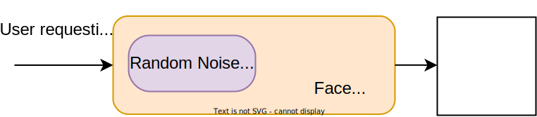

Figure 2: Input and output of a face generation system

### Choosing a suitable ML approach

In this section, we explore common ML approaches for image generation. We discuss the strengths and limitations of each approach and select the best fit for our use case.

While there are different approaches for generating images, we focus on those that are most widely used in the industry. There are four main approaches to image generation:

- Variational autoencoder
- Generative adversarial network
- Autoregressive model
- Diffusion model

#### Variational autoencoder

A variational autoencoder (VAE) is a generative model architecture designed to learn the distribution of data. This enables the VAE to generate new data points by sampling from this learned distribution.

A VAE consists of two main components:

- Encoder
- Decoder

**Encoder:** The encoder is a neural network that maps an input image into a lower-dimensional space, known as the latent space. The output of the encoder is a latent vector, an encoded representation of the input image.

**Decoder:** The decoder is another neural network that maps the encoded representation into an image. The output of the decoder is an image of the same size as the original input image.

During training, the VAE encodes the input into a latent space and then reconstructs the original input from this encoded representation. After training, the VAE can generate new images by sampling points from the learned multivariate Gaussian distribution and using the decoder to map these points into image form.

Through a reparameterization trick (see \[2\] for more details), VAEs model the latent vector as being sampled from a multivariate Gaussian distribution. The modeling of latent space helps the VAE learn meaningful representations that can be smoothly interpolated, which is advantageous for tasks such as image morphing and creating variations of input data.

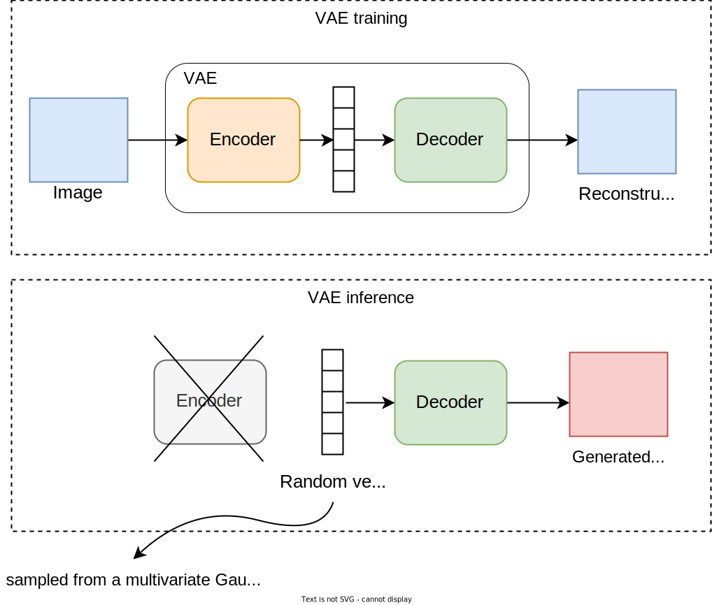

Figure 3: VAE training and inference process

VAEs have several strengths and weaknesses.

##### Pros:

- **Simple architecture:** The encoder and decoder are neural network architectures that are simple to implement.
- **Fast generation:** Compared to other approaches, VAEs offer fast image generation. The process involves sampling a random noise from the latent space and decoding it into an image using the decoder.
- **Stable training:** Training a VAE is typically easy and stable.
- **Compression capability:** Apart from image generation, VAEs are a powerful tool for compressing images into lower-dimensional representations.

##### Cons:

- **Less realistic images:** VAEs struggle to capture high-frequency details. This leads to images that are less realistic compared to those generated by some other approaches.
- **Blurriness:** A significant limitation of VAEs is their tendency to produce blurry images that lack sharp details.
- **Limited novelty:** VAEs typically struggle to generate images that significantly differ from their training data. This limits their ability to produce novel outputs.
- **Limited control in generation:** VAEs are not designed to support extra control inputs such as text descriptions or attribute controls for the desired image.

In summary, VAEs are not the best choice for generating high-quality, detailed images. Their strength, however, lies in efficiently encoding images into compact representations. In Chapter 11, we will explore VAEs and leverage their compression capabilities to build an efficient video generation system.

#### Generative adversarial network

A generative adversarial network (GAN) \[3\] consists of two networks:

- **Generator:** A neural network that converts a random noise into an image.
- **Discriminator:** Another neural network that determines whether a given image is real or artificially generated.

During training, these two networks engage in a continuous game: the generator learns to make more realistic images, while the discriminator becomes better at distinguishing real from generated ones. If a generated image is correctly classified as “generated,” the generator will receive a penalty for not generating a realistic image. This adversarial process continues until the generator generates images that the discriminator can no longer differentiate from real ones.

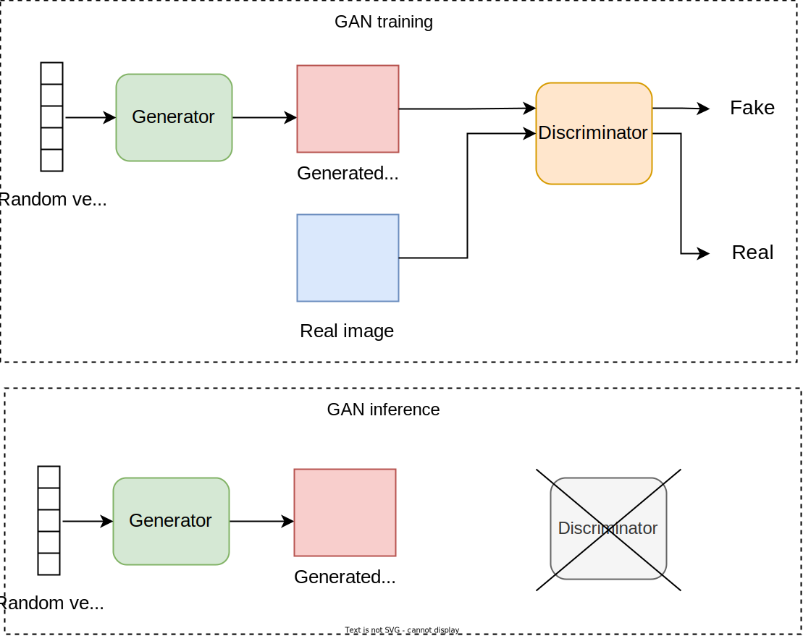

Figure 4: GAN training and inference process

##### Pros:

- **High-quality generation:** GANs are known for their ability to generate high-quality images.
- **Fast generation:** While GANs are generally slower than VAEs, the generator can still generate an image in a single forward pass.
- **Attribute control:** GAN architecture can be modified to control specific attributes such as age or expression. For example, a user can request a face image that is happy and old.

##### Cons:

- **Training instability:** GANs are challenging to train. Common training issues are mode collapse \[4\], where the generator creates a limited variety of outputs, and non-convergence \[5\], where the GAN model fails to stabilize during training.
- **Limited control**: While GANs allow for attribute control, it is challenging to go beyond that, for example, using a text description to generate an image \[6\].
- **Limited novelty:** While GANs are good at generating variations of images in a certain domain, they typically struggle to generate novel images that are much different from their training data.

In summary, GANs are challenging to train, and they offer limited control over generated images. However, they can generate detailed images, and they support control over facial attributes, which makes them suitable for applications such as face generation and image editing.

#### Autoregressive model

In autoregressive modeling, image generation is formulated as a sequence generation task, where each part of an image is generated sequentially. This sequential generation enables the use of the Transformer architecture, allowing us to benefit from its powerful ability to capture long-range dependencies.

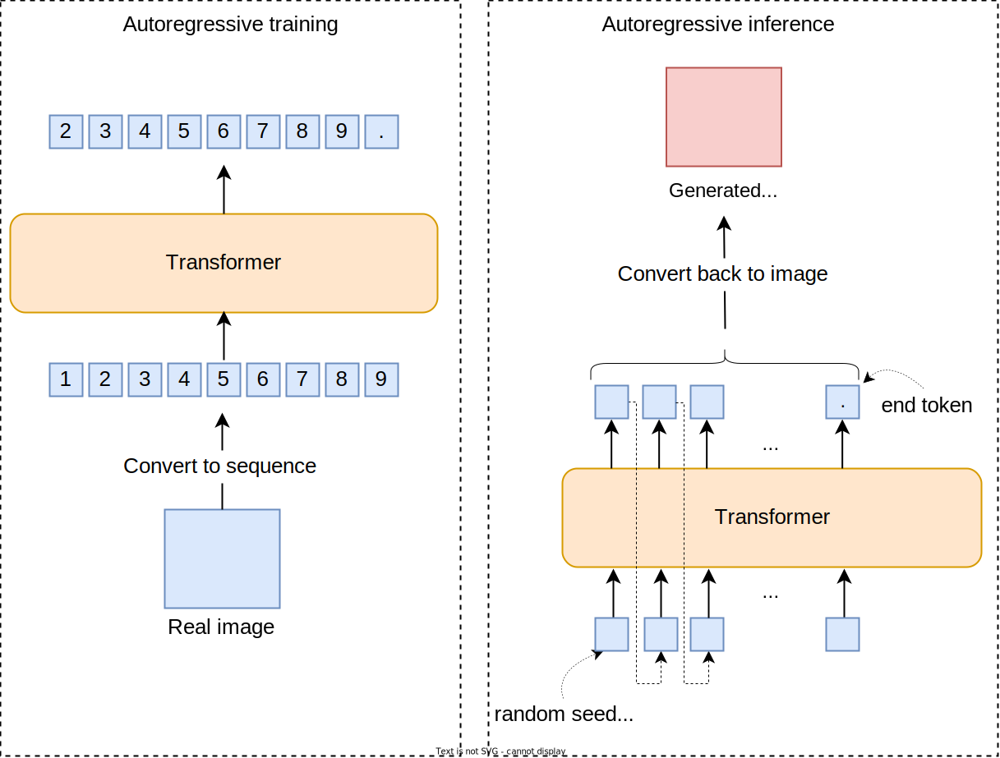

Figure 5: Autoregressive model training and inference process

##### Pros:

- **High detail and realism:** Autoregressive models generate images with high levels of detail and sharpness.
- **Stable training:** Compared to GANs, training autoregressive models is usually more stable.
- **Control over generation:** It is possible to control image generation using additional inputs, such as a text prompt describing the desired image content. This flexibility comes from the Transformer architecture, which can support any number of inputs as part of the input sequence.
- **Support of multimodal conditioning:** Autoregressive models easily support conditioning on different modalities. For example, if we provide a celebration audio as input, the generated image will match the audio. This flexibility is due to the Transformer architecture, which can support different modalities as input as long as they are provided as a sequence of numerical vectors.
- **Novelty:** Autoregressive models are capable of generating novel and complex images. For example, they can generate an image of “an avocado on a chair on Mars” even if they haven't seen such examples in their training data.

##### Cons:

- **Slow generation:** Autoregressive models generate the image sequentially, one token at a time. This sequential generation makes them slower compared to VAEs or GANs.
- **Resource-intensive:** These models are usually very large, with billions of parameters. Training such large models requires significant computational resources, which increases the cost.
- **Limited image manipulation:** Unlike VAEs and GANs, autoregressive models don’t have a structured latent space that can be easily explored or manipulated. This limits certain types of image manipulations such as attribute control in faces.

In summary, while autoregressive models are slow in generation due to their sequential nature, they can generate highly detailed and novel images. Many popular image generation models, such as OpenAI’s DALL-E \[7\] and Google’s Muse \[8\], are based on autoregressive modeling. Chapter 8 will examine this approach in more detail.

#### Diffusion model

Diffusion models are another popular approach for image generation, which has shown remarkable capabilities. Diffusion models formulate image generation as an iterative process. During training, noise is gradually added to images, and a neural network is trained to predict this noise. When generating images during inference, the process begins with random noise. The trained neural network is then used to iteratively denoise the image, transforming the noise into a meaningful image. This transformation occurs over a fixed number of steps, with the model adding details to the image at each step.

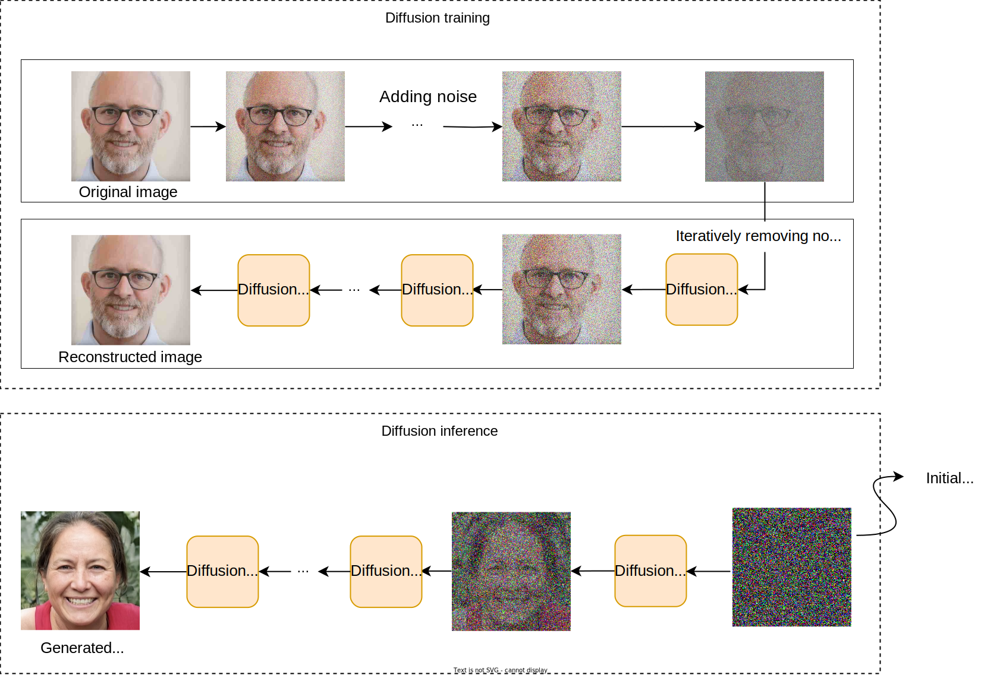

Figure 6: Diffusion model training and inference process

##### Pros:

- **High detail and realism:** Diffusion models can generate images of exceptional quality and realism.
- **Stable training:** Compared to GANs, training diffusion models are typically stable.
- **Control over generation:** Similar to autoregressive models, diffusion models can be controlled using various inputs, such as text describing the desired image.
- **Novelty and creativity:** Diffusion models can generate novel and imaginative images.
- **Robustness to noisy images:** Diffusion models are effective at removing noise from images because of their denoising process. This can be useful in certain applications such as image denoising.

##### Cons:

- **Slow generation:** Diffusion models generate images in multiple denoising steps. This iterative process makes them slower compared to other methods.
- **Resource-intensive:** Diffusion models are usually large, with billions of parameters. This makes them computationally intensive and, therefore, expensive to train.
- **Limited image manipulation:** Unlike VAEs and GANs, diffusion models don’t have a structured latent space for manipulating images.

In summary, while diffusion models are slow, they have shown impressive performance in generating highly detailed, diverse, and imaginative images. Most state-of-the-art image generation models, such as DALL·E 3 \[9\], are based on diffusion models. Chapter 9 will examine diffusion models in great detail.

| Characteristics | VAE | GAN | Autoregressive | Diffusion |
| --- | --- | --- | --- | --- |
| **Quality** | Low | Moderate | High | Exceptional |
| **Speed** | Fast | Fast | Slow | Slow |
| **Training stability** | Stable | Unstable | Stable | Stable |
| **Control over generation** | Limited | Limited | Flexible | Moderate |
| **Facial manipulation** | No | Yes | No | No |
| **Novelty** | Limited | Limited | High | High |
| **Resource intensity** | Moderate | Moderate | High | High |

Table 1: A comparison of different image generation approaches

For realistic face generation, we select GANs as our primary approach. GANs are particularly effective because they let us manipulate facial attributes through a structured latent space, which is an optional requirement in this chapter.

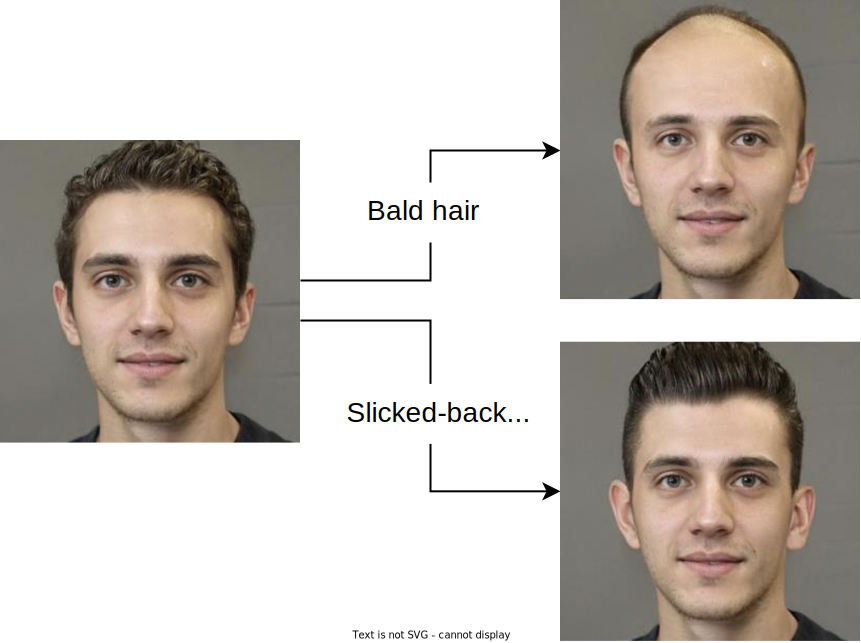

Figure 7: Facial attribute manipulation. Images are taken from \[10\].

## Data Preparation

Developing a realistic face generation system requires a large collection of images. Here, we have 70,000 diverse images of human faces. To prepare these images for training, we apply the following steps:

- **Remove low-quality or low-resolution images:** We remove low-resolution images and use ML models to filter low-quality, blurry ones. This ensures the model learns only from high-quality images.
- **Augment images:** We apply data augmentation techniques such as flipping, rotation, or color adjustment to artificially increase the size of the training data. This helps the model see more variations of the image during training and, thus, generalize better afterward.
- **Normalize and resize images:** We resize all images to a standard dimension, for example, 1024x1024. We also normalize images to a standard range, typically between -1 and 1.
- **Enhance diversity**: We use ML classifiers to tag images with gender, age, and other attributes. Then, we adjust the dataset to ensure a balanced representation of different groups. This step is crucial to prevent biases in generated faces.

## Model Development

### Architecture

GANs consist of two components: a generator and a discriminator. Let’s briefly examine the architecture of each component.

#### Generator

The generator component takes random noise as input and converts it into an image. Its architecture consists of a series of upsampling blocks, each of which increases the spatial dimensions (height and width) of its input. These blocks gradually transform the low-dimensional noise vector into a 2D image of the desired size.

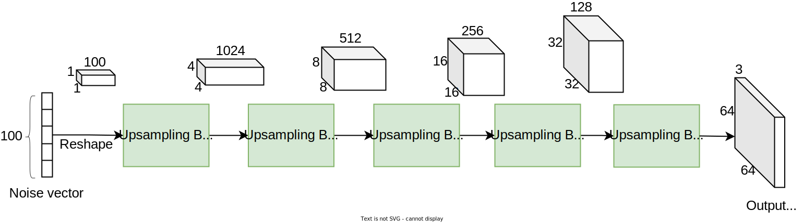

Figure 8: Series of upsampling blocks

Let’s talk about the three main components of the upsampling block:

- Transposed convolution
- Normalization layer
- Non-linear activation

##### Transposed convolution

Transposed convolution, also known as *deconvolution* or *upsampling convolution*, is an operation used in neural networks to increase the spatial resolution of feature maps—essentially performing the opposite of a regular convolution. It’s widely used in applications such as image generation, semantic segmentation, and super-resolution where the goal is to reconstruct higher-resolution outputs from lower-resolution inputs.

Unlike standard convolution, which slides a filter across the input, transposed convolution starts by inserting zeroes between the pixels of the input feature map, effectively expanding it. The expanded input is then convolved with a filter, where the filter’s stride [^1] and padding [^2] are adjusted to achieve the desired output size. For example, starting with an input of 1x1x100, with 1024 filters of kernel size 1x1 and stride 1, we end up with a 4x4x1024 feature map. In the next step, with 512 filters of kernel size 3x3 and stride 1, we get an 8x8x512 feature map. These are the first two upsampling stages shown in Figure 8.

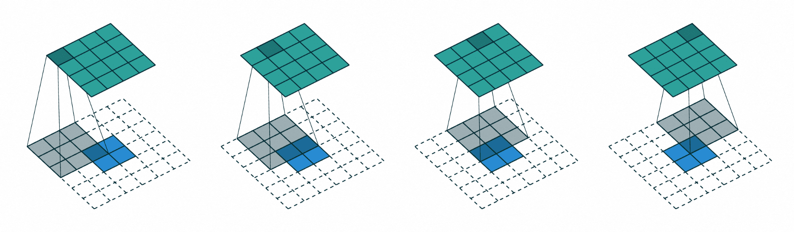

Figure 9: Transpose conv with 3x3 filter and \*stride=1\* over 4x4 inputs \[11\]

In PyTorch, this layer is usually implemented with “ *ConvTranspose2d*.” To learn more about convolutions and transposed convolutions, refer to \[11\].

##### Normalization layer

A normalization layer improves the training stability by scaling the input data to have a consistent distribution.

Training GANs is unstable because it involves two networks (the generator and the discriminator) competing against each other. This can lead to problems like mode collapse, where the generator produces limited diversity, or oscillations, where the generator and discriminator fail to converge during training. Normalization helps stabilize the training by scaling the activations at each layer, thus reducing the risk of vanishing or exploding gradients. This helps maintain consistent distributions of activations, which is critical for balanced competition between the generator and discriminator. With a more robust optimization process, we can use a higher learning rate, speed up training, and reduce the time needed for convergence. We will discuss the training challenges and mitigations later in this chapter.

There are several normalization layers, each with its own way of normalizing data:

- Batch normalization
- Layer normalization
- Instance normalization
- Group normalization

###### Batch Normalization (BN)

BN \[12\] normalizes the inputs of a layer across the batch dimension by calculating the mean and variance for each feature. The normalized data is then scaled and shifted using learnable parameters.

- **Benefits:** BN helps stabilize the learning process and allows for higher learning rates, speeding up training. It also acts as a regularizer, reducing chances of overfitting.
- **Usage:** Commonly used in deep networks, including Convolutional Neural Networks (CNNs) and GAN generators.

###### Layer Normalization (LN)

LN \[13\] normalizes the inputs across the features of each individual sample rather than across the batch dimension. It, therefore, computes the mean and variance for each feature across the entire feature vector of each sample.

- **Benefits:** LN is effective in settings where batch sizes are small or variable, such as in Recurrent Neural Networks (RNNs) and Transformers.
- **Usage:** Frequently used in sequence models and scenarios where consistent behavior across samples is crucial.

###### Instance Normalization (IN)

IN \[14\] operates by normalizing across each feature map individually for each sample.

- **Benefits:** IN is beneficial for tasks where the appearance of individual samples varies widely, as it allows the network to focus on content rather than style.
- **Usage:** Commonly used in style transfer and image generation tasks.

###### Group Normalization (GN)

GN \[15\] normalizes inputs by dividing features into groups and normalizing within each group. It offers a balance between BN and LN.

- **Benefits:** GN is useful for cases with very small batch sizes where BN might not be effective.
- **Usage:** Often applied in tasks where BN fails due to small batch sizes or when layer behavior consistency is needed across groups of features.
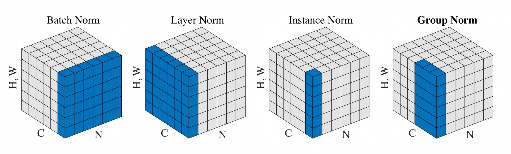

Figure 10: Comparison of different normalization methods \[15\]

##### Non-linear activation

Non-linear activation functions, such as ReLU \[16\], introduce non-linearity into the model, allowing it to learn complex patterns and representations. Without non-linearity, the network would essentially be a linear transformation, regardless of the depth, making it incapable of modeling intricate data distributions such as images, speech, or complex functions.

As shown in Figure 11, our generator consists of upsampling blocks (ConvTranspose2D), each followed by a normalization layer (BatchNorm2D) and a non-linear activation (ReLU). The final block uses "Tanh" \[17\] instead of "ReLU". This choice ensures the final outputs range between -1 and 1, matching the range of our image pixels after data preparation.

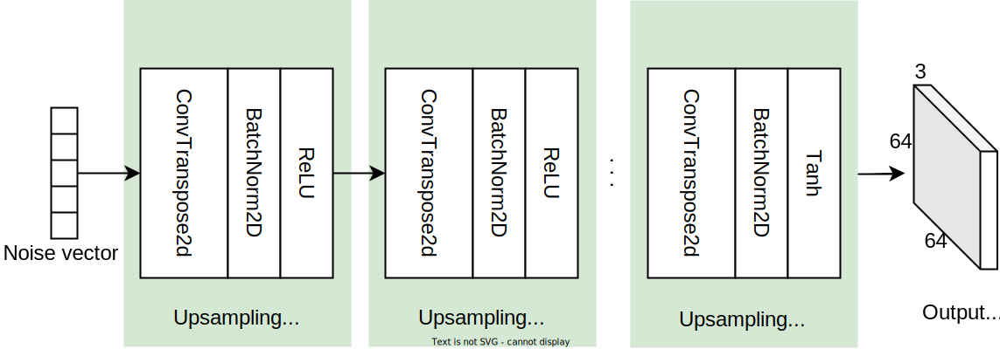

Figure 11: Generator architecture

#### Discriminator

The discriminator's job is to differentiate between real and generated images. It functions as a binary classifier, taking an image as input and outputting the probability that the image is real.

The discriminator comprises a series of downsampling blocks followed by a classification head. The downsampling blocks progressively reduce the spatial dimensions of the input image while extracting its features. The classification head then processes the extracted features to predict the probability that the input image is real.

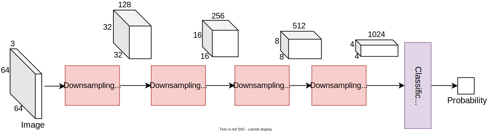

Figure 12: Series of downsampling blocks

A downsampling block consists of several convolution operations to progressively decrease the input's spatial dimension. In PyTorch, we typically use a "Conv2D" layer with a stride of 2 to halve the spatial dimensions. Like the generator, batch normalization (BatchNorm2D) and non-linear activation function (ReLU) are used in between convolution layers to enhance training stability and performance.

The classification head includes one or two fully connected layers followed by a *sigmoid* activation function. The *sigmoid* function ensures the final output ranges between 0 and 1, which is crucial for interpreting the output as a probability.

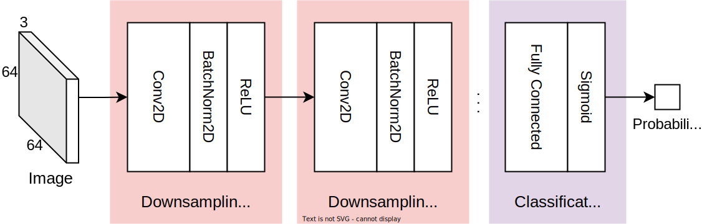

Figure 13: Discriminator architecture

Various versions of GANs have been developed over the years to serve different purposes. For instance, StyleGAN \[18\] modifies the generator's architecture to control attributes of generated faces, such as age, hair color, and facial expression. For more details on the StyleGAN architecture and its key architectural choices, refer to \[18\].

### Training

To produce realistic images, we train the GAN using a unique process called adversarial training. In adversarial training, the generator and the discriminator are trained simultaneously in a game-like scenario. The generator aims to produce images that look real, while the discriminator improves its ability to distinguish between real and generated images. During this adversarial process, the generator learns to produce increasingly more convincing images. At the same time, the discriminator gets better at identifying fake images. This competitive process continues until the generator produces images that the discriminator can no longer detect as fake.

When training GANs, it is important to ensure both the generator and discriminator improve together, avoiding scenarios where one dominates the other. Such a balance is empirically shown to be crucial for successful training. To maintain this balance, it is common to alternate between the following two steps:

1. Train the discriminator for a few iterations while keeping the generator frozen.
2. Train the generator for a few iterations while keeping the discriminator frozen.
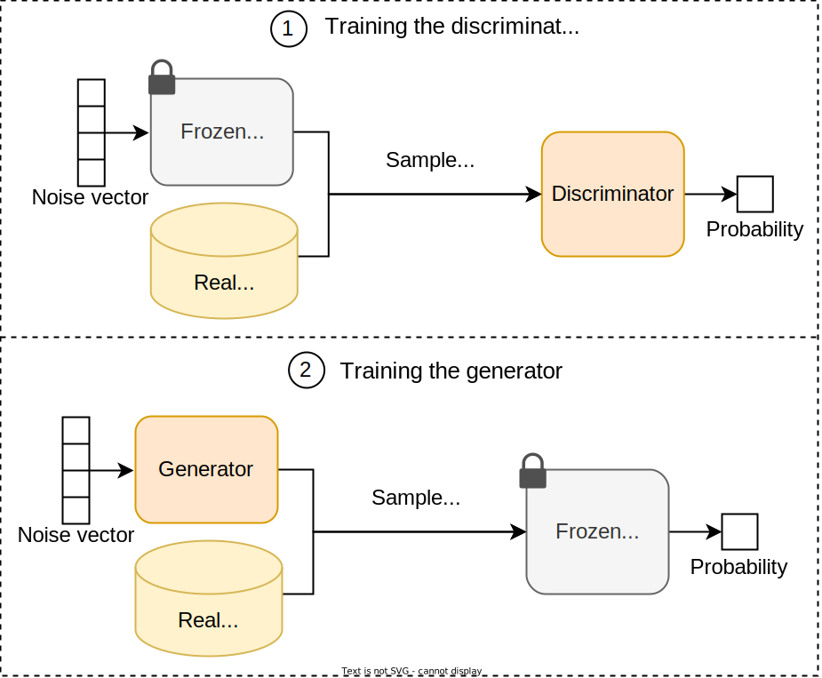

Figure 14: Generator and discriminator alternative training

Next, let’s examine the ML objective and loss function for training a GAN model.

#### ML objective and loss function

The generator and discriminator have their own specific, conflicting goals. The discriminator aims to distinguish accurately between real and generated images. The generator aims to produce images that the discriminator cannot distinguish from real ones. We first explore the loss function and ML objective of each component and then combine them into a unified loss function for the GAN.

##### Discriminator

We employ binary cross-entropy as the loss function for the discriminator, as it is commonly used in binary classification models.

$$
L_D=-\hspace*{-5pt}\overbrace{\frac{1}{m} \sum_{i=1}^m \log D\left(\mathbf{x}^{(i)}\right)}^{\begin{array}{c}
		\text { loss contribution } \\
		\text { from real images }
\end{array}} \hspace*{-4pt}-~ \overbrace{\frac{1}{n} \sum_{j=1}^n \log \left(1-D\left(G\left(\mathbf{z}^{(j)}\right)\right)\right)}^{\begin{array}{c}
		\text { loss contribution } \\
		\text { from fake images }
\end{array}}
$$

Where:

- $D\left(x^{(i)}\right)$ is the discriminator's predicted probabilities for a real image,
- $G\left(z^{(j)}\right)$ is the generator's output (a fake image) given random noise,
- $m$ is the number of real images,
- $n$ is the number of fake images.

The discriminator’s ML objective is to minimize the binary cross-entropy loss function.

##### Generator

The generator aims to produce realistic images that the discriminator cannot distinguish from real ones. Ideally, the discriminator should predict probabilities close to 1 for images that have been produced by the generator. To achieve this, the ML objective is formulated as maximizing $\log \left(D\left(G\left(z^{(j)}\right)\right)\right)$ for all fake images or, equivalently, minimizing the following loss function:

$$
L_G=\frac{1}{n} \sum_{j=1}^n \log \left(1-D\left(G\left(\mathbf{z}^{(j)}\right)\right)\right)
$$

##### GAN’s minimax loss

The minimax loss \[19\], originally used in the GAN paper, unifies the generator’s and discriminator’s losses into a single function:

$$
\text { Minimax loss }=\frac{1}{m} \sum_{i=1}^m \log D\left(\mathbf{x}^{(i)}\right)+\frac{1}{n} \sum_{j=1}^n \log \left(1-D\left(G\left(\mathbf{z}^{(j)}\right)\right)\right)
$$

The discriminator aims to maximize the loss, while the generator aims to minimize it. Therefore, the overall ML objective is:

$$
\min _G \max _D\left(\frac{1}{m} \sum_{i=1}^m \log D\left(\mathbf{x}^{(i)}\right)+\frac{1}{n} \sum_{j=1}^n \log \left(1-D\left(G\left(\mathbf{z}^{(j)}\right)\right)\right)\right)
$$

Besides the minimax loss, researchers have proposed other loss functions to improve training stability in GANs. To learn more about these loss functions, refer to \[20\].

#### Common training challenges in GANs

GANs are difficult to train compared to other generative models such as autoregressive or diffusion models. Discussing these challenges is beneficial in an ML interview. In this section, we discuss three main challenges of training GANs:

- Vanishing gradients
- Mode collapse
- Failure to converge

##### Vanishing gradients

The vanishing gradient problem \[21\] occurs when gradients become very small during training. This problem primarily affects the generator. When the discriminator becomes too good at distinguishing between real and fake images, it provides very small gradient values for the generator to update its parameters. This slows down or stops the generator’s learning process.

Two common techniques to mitigate the vanishing gradient problem are:

- Modified minimax loss
- Wasserstein loss

**Modified minimax loss:** The original GAN paper points out that minimizing the original ML objective can cause training to stall. To overcome this, the paper recommends altering the generator's objective to maximize

$$
L_G=\frac{1}{n} \sum_{j=1}^n \log \left(D\left(G\left(\mathbf{z}^{(j)}\right)\right)\right)
$$

This minor adjustment is inspired by formulating the ML objective from a different perspective. With this change, the generator aims to maximize the probability of fake images being identified as real, rather than minimizing the probability of fake images being identified as fake.

**Wasserstein loss:** This loss function is used in a modified GAN called a " *Wasserstein GAN* " or " *WGAN*." Let’s examine the ML objective for a WGAN’s discriminator and generator.

- **WGAN’s discriminator:** The discriminator for a WGAN, also known as the "critic," differs from the one in a traditional GAN. Instead of classifying images as real or fake, the critic outputs a score representing the "realness" of an image. The critic loss is defined as the difference between the critic’s outputs for real images and fake images. Hence, the critic’s ML objective is to maximize the critic loss.
$$
\text { Critic loss }=D(x)-D(G(z))
$$
- **WGAN’s generator:** The ML objective for the generator of a WGAN is to maximize the probability of fake images being identified as real:
$$
\text { Generator loss : } D(G(z))
$$

##### Mode collapse

Ideally, a GAN model should produce different variations of images with different random inputs. Mode collapse refers to situations where the generator produces a limited variety of images. Let’s see why this might happen.

During training, the generator might learn to trick the system by finding one image that seems most plausible to the discriminator. Once the generator finds this most plausible image, it may keep producing the same image to fool the discriminator. Hence, the generator never learns to generate other images. This type of failure in a GAN is known as “ *mode collapse* ”. Two common techniques to mitigate mode collapse are:

- Wasserstein loss
- Unrolled GAN \[22\]

To learn more about the unrolled GAN and how it mitigates the mode collapse, refer to \[4\].

##### Failure to converge

Training GANs is typically challenging and the process is often unstable. This is due to the “failure to converge” problem, a common issue in training GANs. Let’s explore why this happens.

As the generator improves during training, the discriminator's performance declines because it becomes increasingly more difficult to distinguish between real and fake images. If the generator reaches a point where it can mimic real data perfectly, the discriminator’s accuracy drops to 50 percent; it effectively begins to make random guesses, much like flipping a coin. This decline in discriminator performance hinders GAN convergence since its feedback gradually becomes less and less useful to the generator. When training continues past a certain point, the generator starts training on useless feedback, and its quality may collapse as a result.

There are various approaches to improve the training stability and convergence of GANs:

- **Normalization**: Applying techniques like batch normalization helps stabilize training by ensuring consistent distributions across layers.
- **Different learning rates**: Using different learning rates for the generator and discriminator can help balance their progress and avoid instability in training.
- **Regularization**: Employing regularization methods like weight decay prevents overfitting and helps maintain training stability.
- **Adding noise to discriminator inputs**: Injecting noise into the inputs of the discriminator can prevent it from becoming too powerful early on, which helps balance the competition between the generator and the discriminator.

To learn more about the specific details of these approaches, refer to \[21\] and \[23\].

### Sampling

Sampling is the process of generating new images from a trained GAN model. Before discussing sampling methods, let's first review the concept of latent space in a GAN.

During training, the generator learns to transform various noise vectors into images. This process forms a latent space—a multidimensional space where each point represents a potential noise vector. This latent space is meaningful to the GAN because its generator can map each point to its corresponding image.

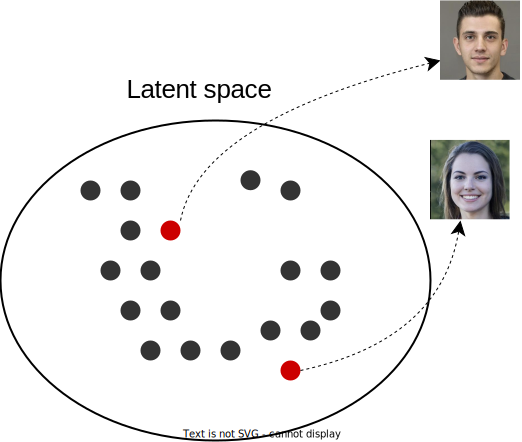

Figure 15: Latent space points map to face images

To generate a realistic face image, we sample a point from this latent space, known as a latent vector. The generator then takes this latent vector and transforms it into an image.

There are two methods to sample a latent vector from a learned latent space:

- Random sampling
- Truncated sampling

#### Random sampling

Random sampling uses a standard Gaussian distribution to draw latent vectors from the latent space. This ensures a diverse selection of latent vectors, leading to the generation of varied images.

#### Truncated sampling

Truncated sampling restricts the latent vectors to a smaller, high-probability region of the latent space. By truncating the distribution, the method reduces the chance of generating outliers, resulting in higher-quality images. This approach is beneficial when the primary goal is to maintain high realism in the generated faces. If you are interested in learning about the details and implementation of truncated sampling, refer to \[24\].

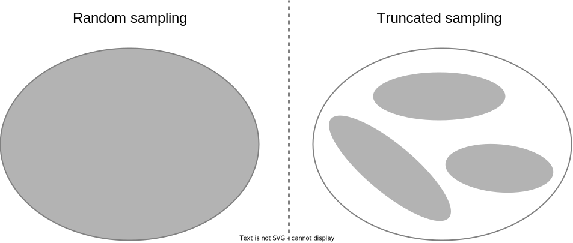

Figure 16: Random vs. truncated sampling (gray regions represent sampling areas).

In summary, random sampling ensures diversity by exploring the entire latent space, while truncated sampling focuses on a high-probability region to enhance realism. For realistic face generation, we utilize random sampling as it leads to diversity and usually works well in practice.

## Evaluation

### Offline evaluation metrics

Evaluating image generation systems involves assessing both the quality and diversity of the generated images. Several metrics have been developed for this purpose, such as Inception score \[25\], Fréchet Inception distance (FID) \[26\], and Kernel Inception distance (KID) \[27\]. Among these, Inception score and FID are the most widely used. Human evaluation also continues to be an essential method of assessing generative models.

In an ML system design interview, the interviewer’s goal is to assess your intuition and practical understanding, rather than test your detailed knowledge of formulas and theories. However, having a broad understanding of some of these metrics can still be helpful. Let’s briefly examine the Inception score and FID.

#### Inception score

The Inception score is a widely used metric to evaluate the quality of generated images in generative models such as GANs. The metric relies on a pretrained image classification model, such as “ *Inception v3* ” \[28\], to assess how well the generated images resemble real-world objects.

Here's a step-by-step explanation of how the metric is calculated:

1. **Generating images:** We start by generating a large set of images using the model we want to evaluate.
2. **Computing class probabilities:** For each generated image, the Inception model provides a probability distribution over all of its 1,000 object classes. A high-quality image should lead to a distribution with a peak (i.e., a high probability for one class) indicating that the model recognizes it as a clear instance of a class.
3. **Calculating the marginal distribution:** Marginal distribution refers to the average of the predicted class probabilities across all images. This helps us understand the overall distribution of classes represented in the generated set. If the images are diverse, the marginal distribution will be flat and spread across many classes.
4. **Computing KL divergence:** The KL divergence measures how different the predicted class distribution for each image is from the marginal distribution. High-quality images will have a distribution that is very different from the marginal distribution. This is because a high-quality image is expected to have a peak in its distribution, while the marginal distribution is expected to be close to uniform if the images are diverse.
5. **Calculating the Inception score:** The Inception score is the exponentiated average of the KL divergence across all images. A high Inception score indicates that individual images have been confidently classified into a variety of classes, which means the generated images are both diverse and of high quality.
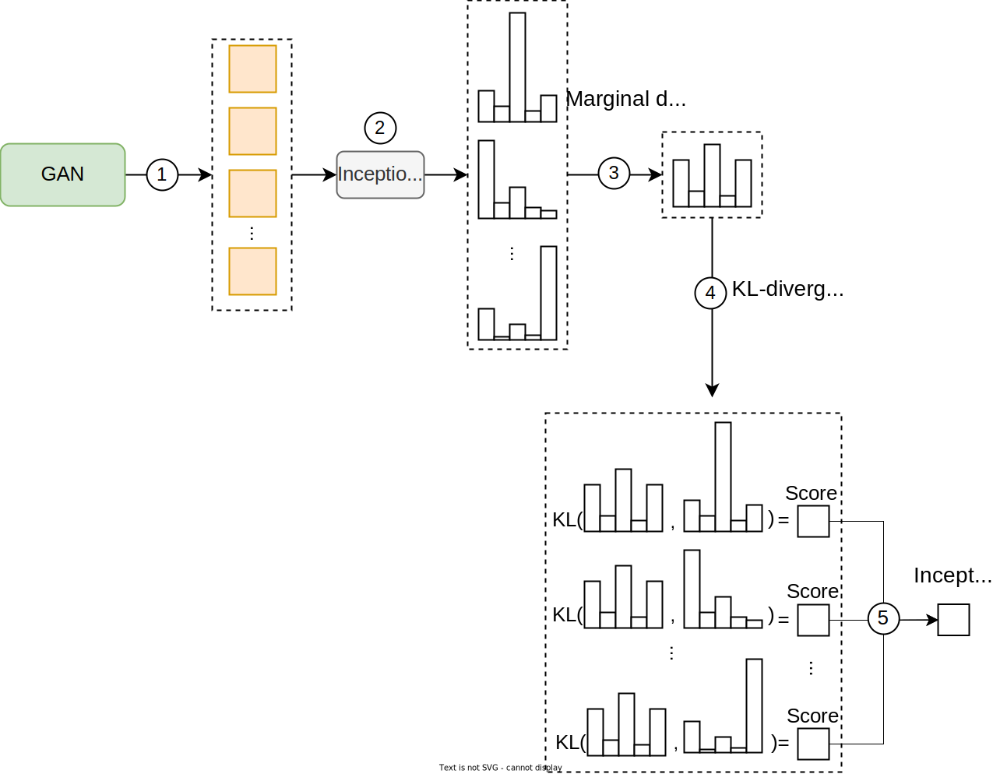

Figure 17: Inception score calculation

**How does the Inception score measure both diversity and quality?**

- **Diversity:** The Inception score evaluates diversity by checking if the generated images result in a nearly uniform marginal distribution across classes, indicating that the images are spread evenly across different classes.
- **Quality:** High-quality images result in a sharp, peaked probability distribution, indicating that the image is clearly recognized as belonging to a particular class. The Inception score compares this distribution with the marginal distribution to assess image quality.

#### Fréchet inception distance (FID)

FID is another popular metric for evaluating the quality of images produced by generative models. It assesses how similar the distribution of generated images is to the distribution of real images. Unlike the Inception score, which uses class probabilities, FID considers the statistics of the features extracted by a pretrained model such as *Inception v3*. The Inception model is chosen because it is trained on a large and diverse dataset (ImageNet) and can extract meaningful features that represent the content and style of the images.

Here's a step-by-step explanation of how FID is calculated:

1. **Generating images:** We start by generating a large set of images using the model we want to evaluate. These images will be compared to a set of real images to evaluate their quality and diversity.
2. **Extracting features:** We pass each image (both generated and real) through the *Inception v3* model and extract features (“activations”) from a specific layer, usually one near the end of the network. Features from this deep layer capture high-level information—such as shapes, textures, and objects—which is crucial for assessing the realism of the images.
3. **Calculating mean and covariance:** We calculate the mean and covariance of the extracted features separately for generated and real images. These statistical measures summarize the distributions of features for both sets of images.
4. **Computing Fréchet distance:** We calculate the FID as the Fréchet distance between the mean and covariance of generated and real images. The Fréchet distance measures how close the two distributions are. A lower FID indicates greater similarity between the distributions, meaning the generated images are more realistic and diverse. To learn more about the Fréchet distance and its formula, refer to \[29\].
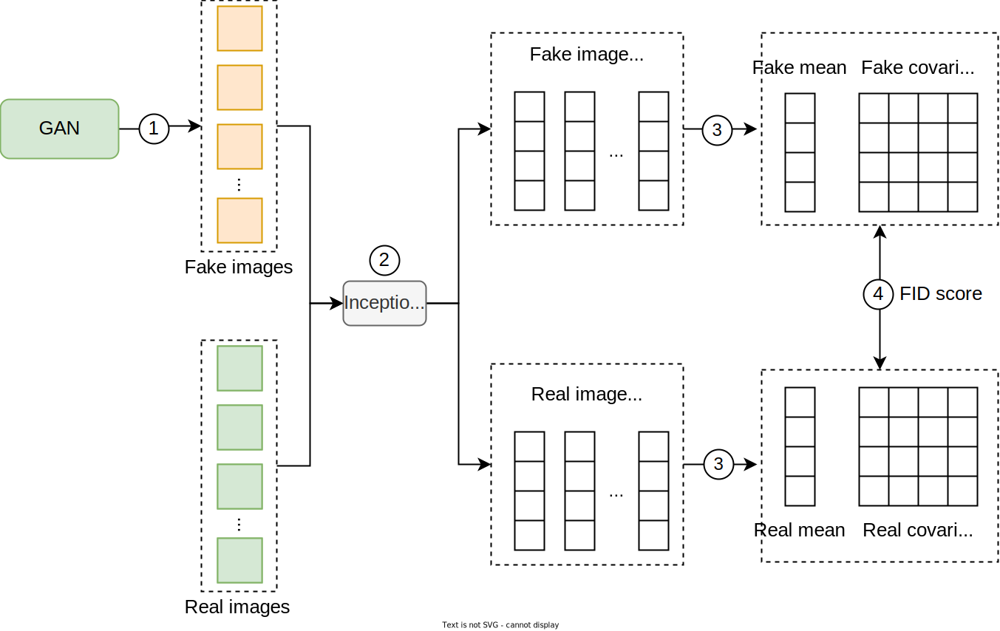

Figure 18: FID calculation

**How does the FID measure both diversity and quality?**

- **Diversity:** The FID considers the covariance of the features, reflecting the spread and variation in the image features. A diverse set of generated images will have a feature distribution similar to that of real images, showing the model's ability to produce a wide range of different images.
- **Quality:** FID ensures the generated images are high-quality by comparing their feature distributions to those of real images. If the mean and covariance of the generated images’ features are similar to those of the real images, this indicates that the generated images are likely to be of high quality.

FID and Inception score are useful for assessing the quality and diversity of image generation models, but they don't always align with human judgment. This is mainly because these metrics rely on ImageNet classes, which can introduce artifacts. The authors of \[30\] suggest that using a non-ImageNet-trained model like CLIP could provide a better alignment with human evaluation.

While CLIP-based metrics show promise in improving alignment with human judgment, they still cannot fully replace the insights gained from direct human feedback. Human evaluation still remains the most reliable method for assessing the quality of generated images, as it captures nuances that automated metrics might miss.

#### Human evaluation

Human evaluation is crucial for assessing image generation systems since automated metrics can miss subjective qualities such as aesthetic appeal. There are different protocols to perform human evaluation. One protocol, as outlined in \[31\], involves presenting users with pairs of images generated by different models. The human evaluators are asked to choose which image looks more photorealistic. This approach lets us compare models based on criteria that align more closely with human judgment.

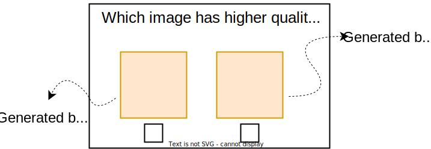

Figure 19: Pairwise comparison during human evaluation

### Online evaluation metrics

Various metrics are typically monitored in practice to ensure that the image generation system performs well and meets user expectations. Two common metrics are:

- **User feedback:** This metric is vital as it directly reflects users' opinions about the generated images. User feedback can be gathered through surveys, ratings, or direct comments.
- **Latency:** Latency refers to the time it takes from when a request is made until the image is fully generated and delivered to the user. Fast response times are crucial for maintaining a good user experience, especially in interactive applications. Monitoring latency helps identify performance bottlenecks and ensures the system meets user expectations.

## Overall ML System Design

In this section, we explore the holistic design of a realistic face generation system. The key components we'll examine are:

- Face generator
- Training service
- Evaluation service
- Deployment service
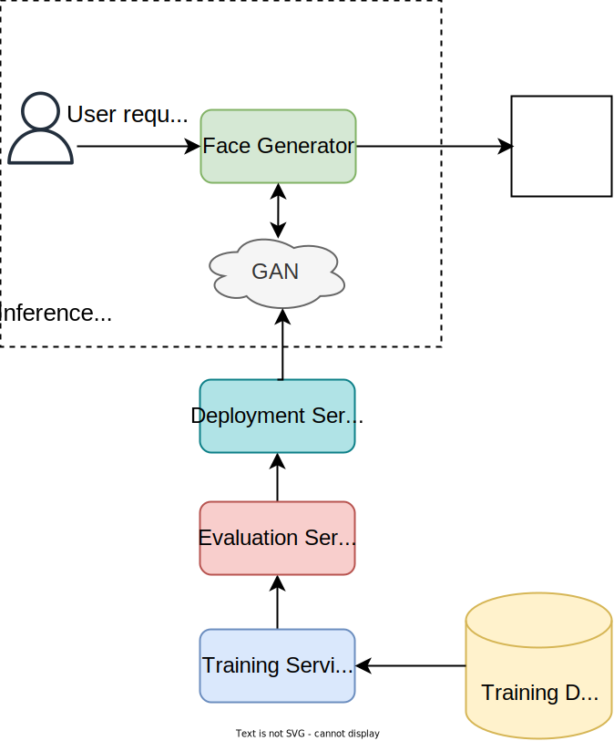

Figure 20: Realistic face generation overall design

### Face generator

The face generator is the core component responsible for generating realistic faces. It handles user requests and interacts with the trained GAN model to sample high-quality images. Users can optionally specify desired attributes such as age, gender, hairstyle, and expression. The service leverages StyleGAN properties to adjust the noise vector in the latent space based on these attributes.

The architectural details of attribute control and latent manipulation aren’t typically discussed in ML system design interviews. If you are interested in learning more in this space, read \[32\]\[33\].

### Training service

The training service continuously improves the GAN model by periodically retraining it with user-approved generated images and new training data.

### Evaluation service

The evaluation service automatically evaluates newly trained models. It uses predefined metrics to assess their performance. The evaluation results determine whether the new model meets quality standards and should replace the existing one.

### Deployment service

The deployment service deploys improved models to the production environment. It ensures a smooth transition with minimal downtime during updates. The deployment service also monitors the performance of deployed models to ensure they function as expected.

## Other Talking Points

In case there's extra time after the interview, you might discuss these further topics:

- Various GAN architectures, such as DCGAN, WGAN, and StyleGAN, and the trade-offs of each architecture \[34\]\[35\]\[18\].
- Techniques for stabilizing GAN training to avoid mode collapse and convergence issues, including the use of Wasserstein loss, gradient penalty, and other robust training methods \[36\].
- Utilize conditional GANs (cGANs) to generate faces based on specific conditions or inputs \[37\].
- Evaluation metrics of condition consistency \[38\]\[39\].
- Style-mixing in face generation \[18\].

## Summary

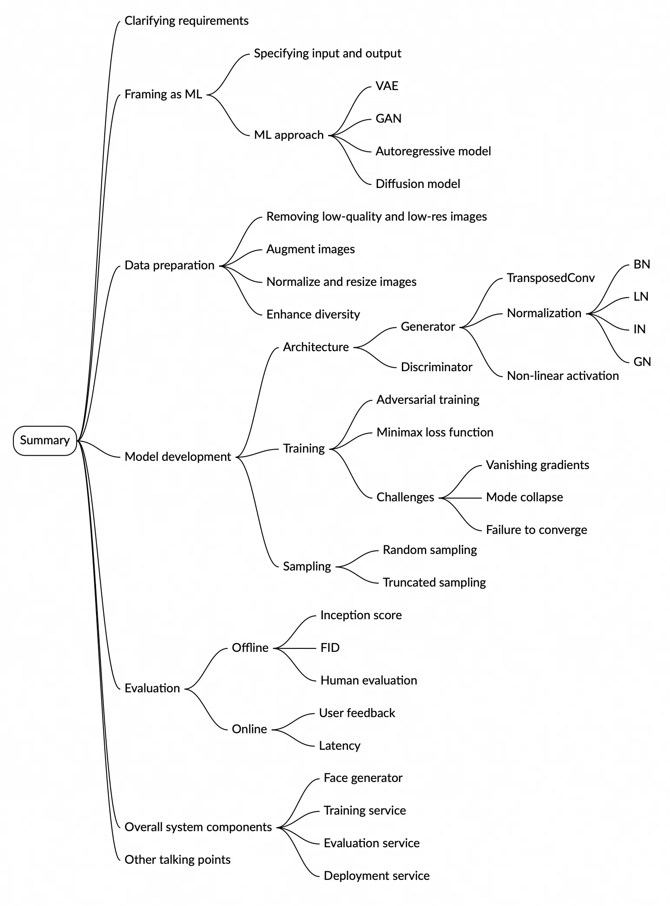

Image represents a mind map summarizing the key aspects of generative AI system design. The central node is labeled 'Summary,' branching out into five main categories: Clarifying Requirements, Data Preparation, Model Development, Evaluation, and Overall System Components. 'Clarifying Requirements' further branches into 'Framing as ML' (leading to 'ML approach' with sub-branches 'VAE' and 'GAN') and 'Specifying Input and Output.' 'Data Preparation' details steps like removing low-quality images, augmentation, normalization, and diversity enhancement. 'Model Development' breaks down into 'Architecture' (describing Generator components like Transposed Conv, Normalization layers (BN, LN, IN, GN), and non-linear activation functions, and Discriminator components), and 'Training' (including adversarial training, Minimax loss function, and challenges like vanishing gradients, mode collapse, and failure to converge). 'Evaluation' is divided into 'Offline' (Inception score, FID) and 'Online' (Human evaluation, User feedback, Latency) methods. Finally, 'Overall System Components' outlines the Face generator, Training service, Evaluation service, and Deployment service. Each branch uses color-coding for visual distinction, and the overall structure provides a hierarchical view of the design process, from initial requirements to final deployment.

## Reference Material

\[1\] StyleGAN2. [https://arxiv.org/abs/1912.04958](https://arxiv.org/abs/1912.04958).  
\[2\] Auto-Encoding Variational Bayes. [https://arxiv.org/abs/1312.6114](https://arxiv.org/abs/1312.6114).  
\[3\] Generative Adversarial Networks. [https://arxiv.org/abs/1406.2661](https://arxiv.org/abs/1406.2661).  
\[4\] Combating Mode Collapse in GAN training: An Empirical Analysis using Hessian Eigenvalues. [https://arxiv.org/abs/2012.09673](https://arxiv.org/abs/2012.09673).  
\[5\] Google’s GAN course. [https://developers.google.com/machine-learning/gan/training](https://developers.google.com/machine-learning/gan/training).  
\[6\] StackGAN: Text to Photo-realistic Image Synthesis with Stacked Generative Adversarial Networks. [https://arxiv.org/abs/1612.03242](https://arxiv.org/abs/1612.03242).  
\[7\] Zero-Shot Text-to-Image Generation. [https://arxiv.org/abs/2102.12092](https://arxiv.org/abs/2102.12092).  
\[8\] Muse: Text-To-Image Generation via Masked Generative Transformers. [https://arxiv.org/abs/2301.00704](https://arxiv.org/abs/2301.00704).  
\[9\] DALL·E 3. [https://openai.com/index/dall-e-3/](https://openai.com/index/dall-e-3/).  
\[10\] Attribute-specific Control Units in StyleGAN for Fine-grained Image Manipulation. [https://arxiv.org/abs/2111.13010](https://arxiv.org/abs/2111.13010).  
\[11\] A guide to convolution arithmetic for deep learning. [https://arxiv.org/abs/1603.07285](https://arxiv.org/abs/1603.07285).  
\[12\] Batch Normalization: Accelerating Deep Network Training by Reducing Internal Covariate Shift. [https://arxiv.org/abs/1502.03167](https://arxiv.org/abs/1502.03167).  
\[13\] Layer Normalization. [https://arxiv.org/abs/1607.06450](https://arxiv.org/abs/1607.06450).  
\[14\] Instance Normalization: The Missing Ingredient for Fast Stylization. [https://arxiv.org/abs/1607.08022](https://arxiv.org/abs/1607.08022).  
\[15\] Group Normalization. [https://arxiv.org/abs/1803.08494](https://arxiv.org/abs/1803.08494).  
\[16\] Deep Learning using Rectified Linear Units (ReLU). [https://arxiv.org/abs/1803.08375](https://arxiv.org/abs/1803.08375).  
\[17\] PyTorch’s Tanh layer. [https://pytorch.org/docs/stable/generated/torch.nn.Tanh.html](https://pytorch.org/docs/stable/generated/torch.nn.Tanh.html).  
\[18\] A Style-Based Generator Architecture for Generative Adversarial Networks. [https://arxiv.org/abs/1812.04948](https://arxiv.org/abs/1812.04948).  
\[19\] Minimax. [https://en.wikipedia.org/wiki/Minimax](https://en.wikipedia.org/wiki/Minimax).  
\[20\] Loss functions in GANs. [https://developers.google.com/machine-learning/gan/loss](https://developers.google.com/machine-learning/gan/loss).  
\[21\] Towards Principled Methods for Training Generative Adversarial Networks. [https://arxiv.org/abs/1701.04862](https://arxiv.org/abs/1701.04862).  
\[22\] Unrolled Generative Adversarial Networks. [https://arxiv.org/abs/1611.02163](https://arxiv.org/abs/1611.02163).  
\[23\] Stabilizing Training of Generative Adversarial Networks through Regularization. [https://arxiv.org/abs/1705.09367](https://arxiv.org/abs/1705.09367).  
\[24\] Megapixel Size Image Creation using Generative Adversarial Networks. [https://arxiv.org/abs/1706.00082v1](https://arxiv.org/abs/1706.00082v1).  
\[25\] Inception score. [https://en.wikipedia.org/wiki/Inception\_score](https://en.wikipedia.org/wiki/Inception_score).  
\[26\] GANs Trained by a Two Time-Scale Update Rule Converge to a Local Nash Equilibrium. [https://arxiv.org/abs/1706.08500](https://arxiv.org/abs/1706.08500).  
\[27\] Demystifying MMD GANs. [https://arxiv.org/abs/1801.01401](https://arxiv.org/abs/1801.01401).  
\[28\] Rethinking the Inception Architecture for Computer Vision. [https://arxiv.org/abs/1512.00567](https://arxiv.org/abs/1512.00567).  
\[29\] FID calculation. [https://en.wikipedia.org/wiki/Fr%C3%A9chet\_inception\_distance](https://en.wikipedia.org/wiki/Fr%C3%A9chet_inception_distance).  
\[30\] The Role of ImageNet Classes in Fréchet Inception Distance. [https://arxiv.org/abs/2203.06026](https://arxiv.org/abs/2203.06026).  
\[31\] Hierarchical Text-Conditional Image Generation with CLIP Latents. [https://arxiv.org/abs/2204.06125](https://arxiv.org/abs/2204.06125).  
\[32\] Alias-Free Generative Adversarial Networks. [https://arxiv.org/abs/2106.12423](https://arxiv.org/abs/2106.12423).  
\[33\] StyleGAN3. [https://nvlabs.github.io/stylegan3/](https://nvlabs.github.io/stylegan3/).  
\[34\] Unsupervised Representation Learning with Deep Convolutional Generative Adversarial Networks. [https://arxiv.org/abs/1511.06434](https://arxiv.org/abs/1511.06434).  
\[35\] Wasserstein GAN. [https://arxiv.org/abs/1701.07875](https://arxiv.org/abs/1701.07875).  
\[36\] Stabilizing Generative Adversarial Networks: A Survey. [https://arxiv.org/abs/1910.00927](https://arxiv.org/abs/1910.00927).  
\[37\] Conditional Generative Adversarial Nets. [https://arxiv.org/abs/1411.1784](https://arxiv.org/abs/1411.1784).  
\[38\] CLIPScore: A Reference-free Evaluation Metric for Image Captioning. [https://arxiv.org/abs/2104.08718](https://arxiv.org/abs/2104.08718).  
\[39\] DreamBooth: Fine Tuning Text-to-Image Diffusion Models for Subject-Driven Generation. [https://arxiv.org/abs/2208.12242](https://arxiv.org/abs/2208.12242).

[^1]: Stride controls how much the filter moves across the input during convolution—larger strides skip more pixels

[^2]: Padding adds extra borders around the input to control the output size during convolution