## Introduction

Generative AI offers a fascinating ability to create highly realistic and diverse images. In this chapter, we explore a technique that enables the generation of detailed and varied images in just seconds.

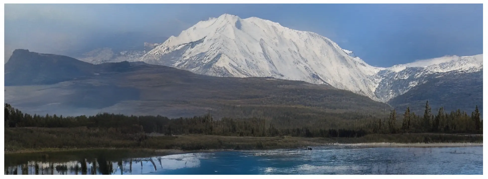

Figure 1: An image generated by VQGAN \[1\]

## Clarifying Requirements

Here is a typical interaction between a candidate and an interviewer:

**Candidate**: Should the system focus on specific categories of images at the start?  
**Interviewer**: For simplicity, let's begin with natural scenes and urban landscapes. We can explore other categories later.

**Candidate**: Do we have training data consisting of natural scenes? What's the dataset size?  
**Interviewer**: We have a large dataset with about 5 million high-resolution images of natural scenes and landscapes.

**Candidate:** Should the system support additional conditioning, such as input text describing the desired image?  
**Interviewer:** Good question. We'll focus on image generation without input conditions. However, the system should be flexible to support input prompts.

**Candidate**: What resolution range should we aim for when generating the images?  
**Interviewer**: The system should generate images with either 1024 $\times$ 1024 or 2048 $\times$ 2048 pixels, based on user requests.

**Candidate**: Should the images be generated in real time, or is some delay acceptable?  
**Interviewer**: Real-time generation isn't necessary. However, a reasonable processing time is important. Let's aim for five seconds per image.

## Frame the Problem as an ML Task

### Specifying the system’s input and output

For high-resolution image synthesis, the user simply requests a new image. The output is a high-resolution image.

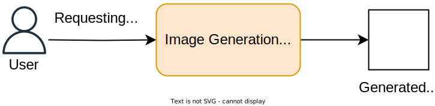

Figure 2: Input and output of an image generation system

### Choosing a suitable ML approach

As discussed in Chapter 7, there are several approaches to image generation, including VAEs, GANs, autoregressive models, and diffusion models. In this section, we choose the one best suited for the task.

Most variants of VAEs and GANs struggle to generate high-resolution images, such as those with resolutions of 512x512 pixels and above. They face a challenge known as posterior collapse. This occurs because, as the resolution increases, these models require a decoder with a higher capacity to capture additional details. During training, the decoder can become so powerful that it starts to ignore input from the latent space, as it can model the output independently. As a result, the latent variables contribute little to the generation process, reducing the diversity of the images.

While both autoregressive and diffusion models can generate high-resolution images, they differ significantly in complexity and resource requirements. Autoregressive models are often considered slow due to their sequential nature, where each pixel depends on the ones generated before it. This dependency leads to a time complexity that increases linearly with the number of pixels, resulting in an $O(N^2)$ complexity for an image of size $N\times N$, and the process is difficult to parallelize. To address this limitation, autoregressive models generate images chunk by chunk instead of pixel by pixel. For example, generating a 1024 $\times$ 1024 image using chunks of 64 $\times$ 64 pixels requires only 256 steps or tokens, significantly reducing the computational overhead compared to traditional pixel-based methods.

On the other hand, the complexity of diffusion models increases super-linearly with image size, resulting in a computational complexity of $O(TN^2)$, where $N$ is the number of pixels and T represents the number of denoising steps. Larger images often require more refinement steps to maintain quality and coherence, which further escalates computational demand.

In practice, generating a high-resolution image using standard diffusion models can take several minutes [^1]. In contrast, Transformer-based autoregressive models can accomplish similar tasks in seconds due to their chunk-based generation approach. For this chapter, we focus on autoregressive models for educational purposes. In Chapter 9, we will cover diffusion models in detail. Let's now delve into autoregressive models and their key components.

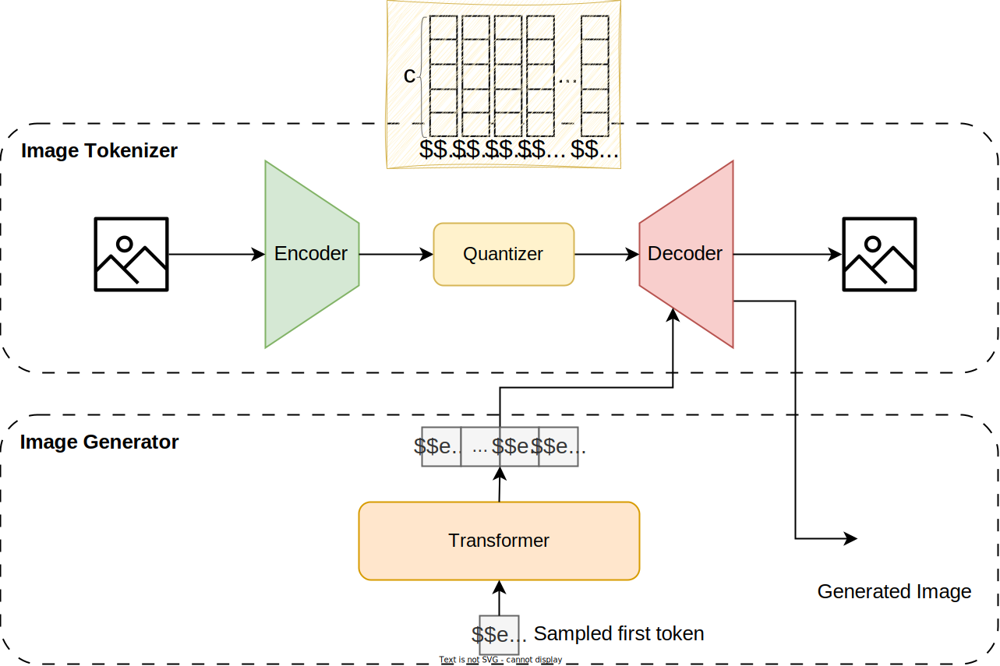

Figure 3: Autoregressive image generation

Autoregressive models generate images by treating them as a sequence generation task. This approach relies on two primary components:

- Image tokenizer
- Image generator

#### Image tokenizer

Image tokenization refers to representing an image with a sequence of discrete tokens. This is crucial in autoregressive models, where the image is generated sequentially, chunk by chunk.

The image tokenizer is a separate model, trained independently. Its main functions are to encode an image into a sequence of discrete tokens and decode a sequence of discrete tokens back into an image.

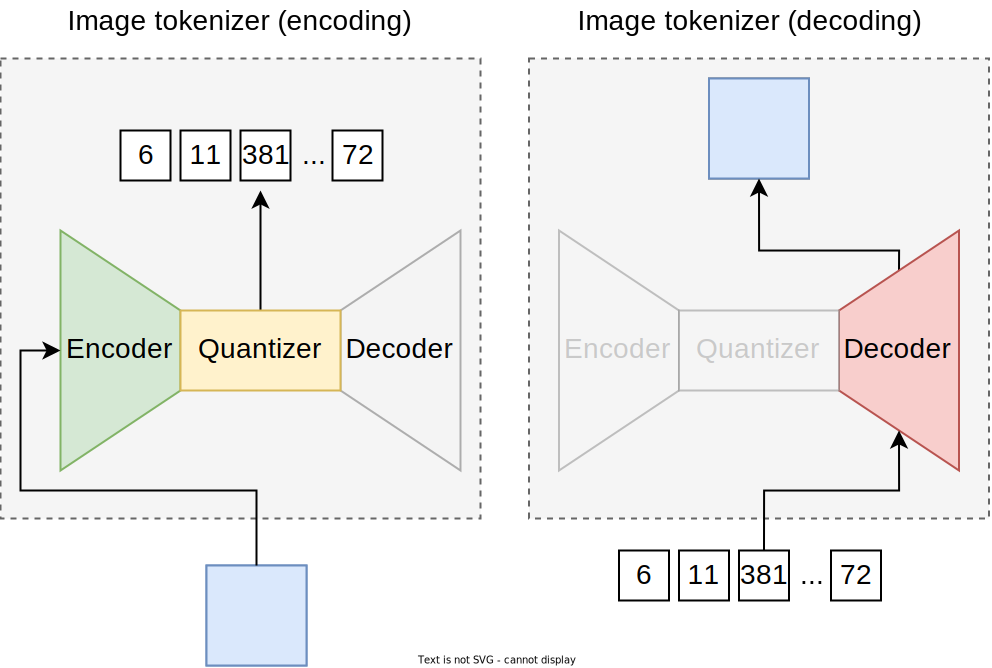

Figure 4: Image tokenizer’s encoding and decoding

#### Image generator

The image generator is the primary model for generating images chunk by chunk. While there are various architectures for sequence generation, the decoder-only Transformer is the most effective choice for two reasons. First, the decoder-only Transformer has a flexible architecture that can handle different modalities. In a chatbot, it takes text tokens as input and generates text tokens as output. In image captioning, it takes an image as input and outputs text tokens. For image generation, it generates a sequence of image tokens as output, which are then decoded into an image.

Second, the Transformer architecture is effective at capturing long-range dependencies through its attention mechanism, which is beneficial for generating coherent images.

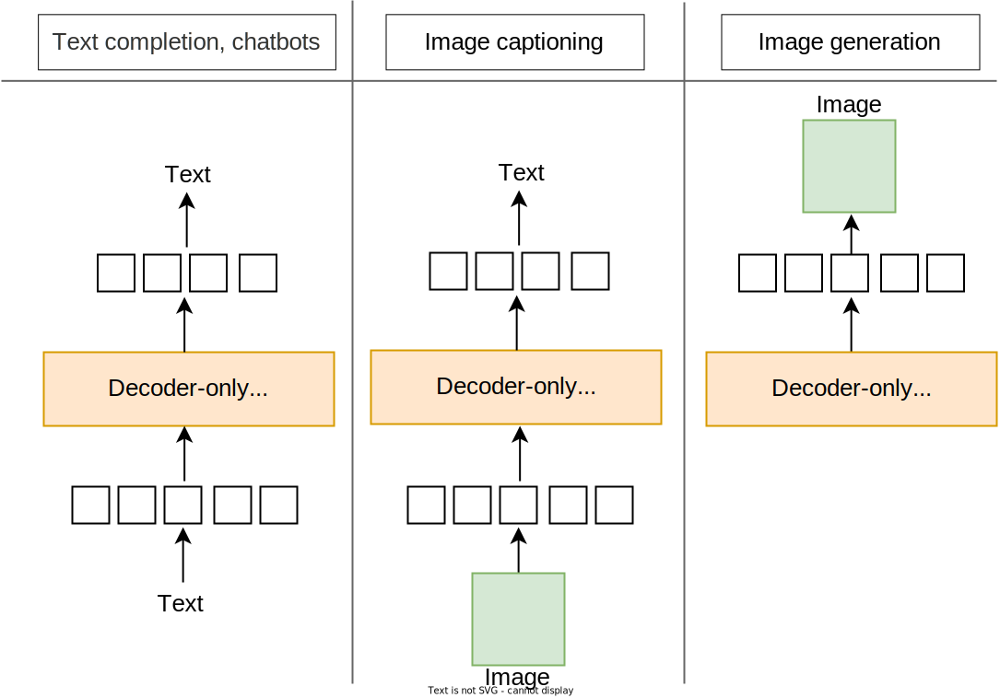

Figure 5: Decoder-only Transformer’s flexibility in handling various modalities

In summary, we approach image generation with a Transformer-based autoregressive model. First, an image generator (decoder-only Transformer) generates a sequence of discrete tokens. Then, an image tokenizer decodes these tokens into the final image. We will explore the architecture, training, and sampling processes of these components in detail in the model development section.

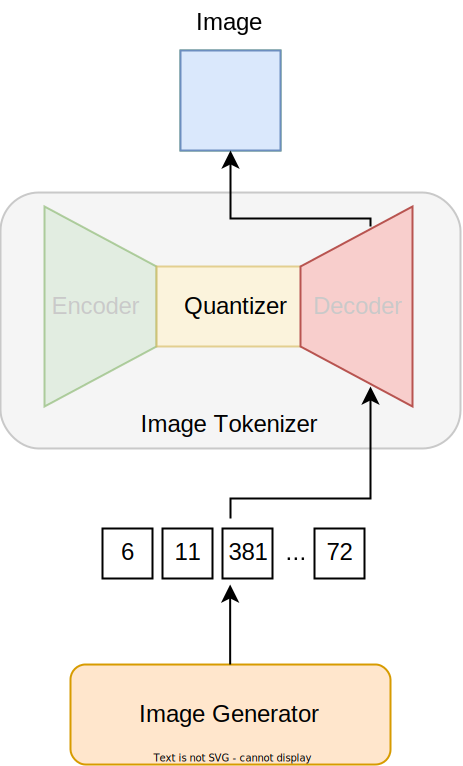

Figure 6: Autoregressive image generation

## Data Preparation

The data preparation process involves two crucial steps:

- Image cleaning and normalization
- Image tokenization

### Image cleaning and normalization

In this step, we remove low-quality images from the training data and ensure the remaining ones are consistent. This is achieved by applying the following operations:

- **Remove low-quality images:** We remove images with low resolution, excessive noise, or irrelevant content. We also ensure the dataset includes a wide range of styles, subjects, and compositions. This step is crucial for the generative model to produce diverse, high-quality images.
- **Normalize images:** Normalization involves scaling pixel values to a range, typically 0 to 1, to stabilize the training process.
- **Resize images:** Images often come in different sizes and aspect ratios. Resizing them to a uniform size ensures the model receives consistent inputs. Based on the interviewer’s requirements, we resize all images to *1024x1024*.

### Image tokenization

The image generator requires images to be represented as a sequence of discrete tokens. To achieve this, after training the image tokenizer, we tokenize all images in our training dataset into discrete tokens. It's important to note that this data preparation step is intended primarily for the image generator, not the image tokenizer.

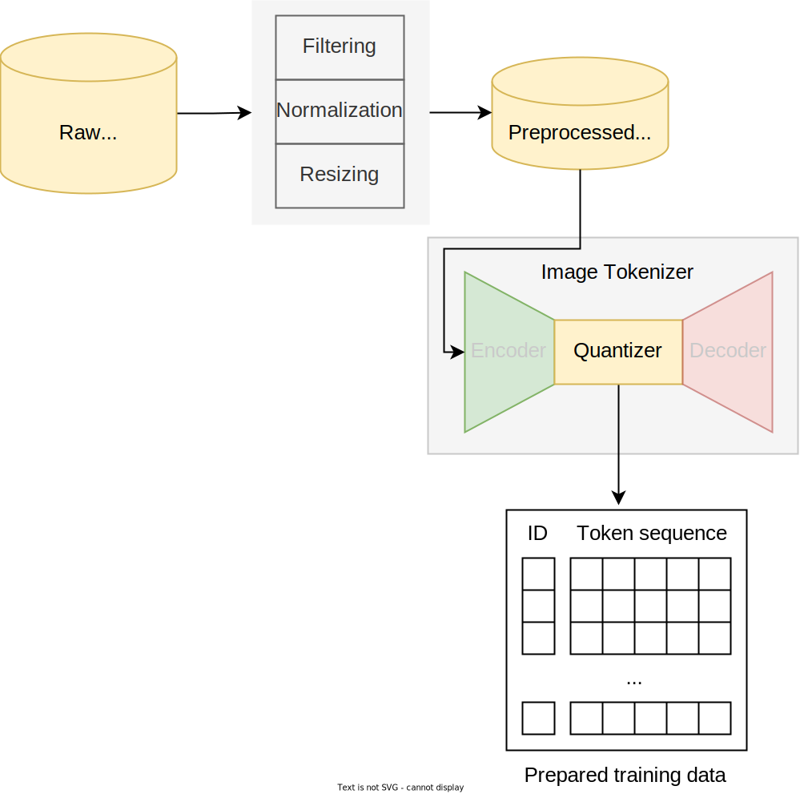

Figure 7: Data preparation process

These two steps ensure the training data is high-quality, consistent, and represented as a sequence of numerical inputs.

## Model Development

### Architecture

In this section, we explore the architecture of both the image tokenizer and the image generator.

#### Image tokenizer

The image tokenizer model has two functions:

1. Encoding an image into a sequence of discrete tokens
2. Decoding a sequence of discrete tokens back into an image

A common architecture specifically designed for image tokenization is the Vector-Quantized VAE (VQ-VAE) \[2\], which is a variant of the standard VAE discussed in Chapter 7. The VQ-VAE consists of three components:

- Encoder
- Quantizer
- Decoder

##### Encoder

The encoder maps the input image into a lower-dimensional latent space. This component encodes important features of the image into an encoded representation.

The encoder's architecture is a deep convolutional neural network (CNN) with several convolution layers, each followed by a ReLU \[3\] activation function. These layers process the input image and extract visual features.

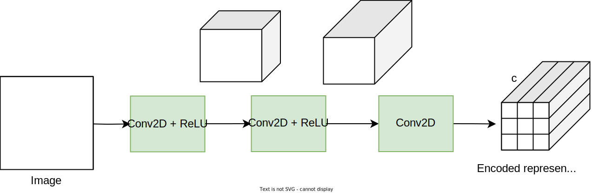

Figure 8: The encoder converts an input image into an encoded representation containing 9 features, each with c channels

##### Quantizer

The quantizer converts continuous latent vectors into discrete tokens. There are two main reasons why VQ-VAE introduces a quantizer component to a standard VAE:

- Avoiding posterior collapse
- Reducing the learning space

###### Avoiding posterior collapse

*Posterior collapse* is a common issue in standard VAEs where the latent variables contribute little or are ignored because the decoder generates accurate outputs without using the latent space. The quantization step addresses this by discretizing the latent variables, thus forcing the model to use them during reconstruction. This ensures the decoder doesn't overpower the latent space and keeps the latent variables actively involved in shaping the output.

###### Reducing the learning space

Continuous vectors are difficult to predict sequentially because they have endless possibilities and small differences. By turning these vectors into discrete tokens, the quantizer simplifies the process by allowing the Transformer to focus on fewer options.

The quantizer uses an internal codebook to convert continuous latent vectors into discrete tokens. This codebook contains learnable embeddings that represent different patterns in the input images. Each embedding acts as a token, represented by an integer from 1 to k. The quantizer replaces each continuous vector with the closest token in the codebook based on Euclidean distance \[4\].

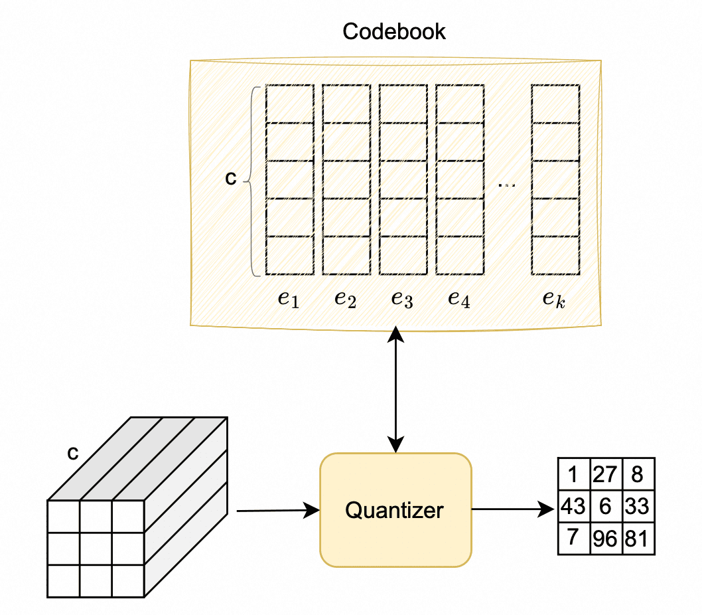

Figure 9: Quantization process

Note that the quantizer is an embedding table. Its sole parameter is the codebook, which is learned during training. The quantizer’s single responsibility is to map each continuous vector with the closest token in the codebook; therefore, the output is a collection of token IDs.

##### Decoder

The decoder converts discrete tokens back into the original image. It typically uses a deep CNN with transposed convolutions (*ConvTranspose2d*) to gradually transform the representation to the original image size. To learn more about convolutions and transposed convolutions, refer to \[5\].

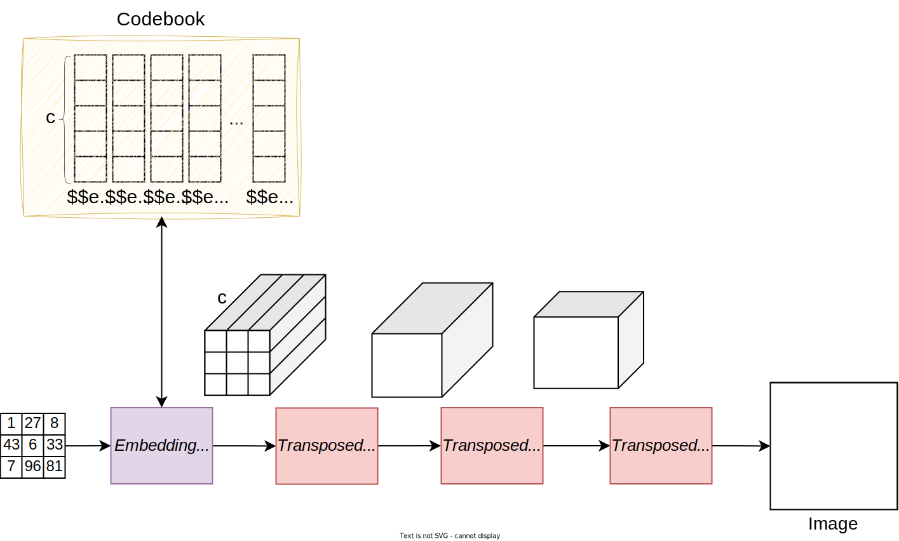

Figure 10: Decoding process

#### Image generator

The image generator generates a sequence of discrete tokens representing an image. As mentioned earlier, a decoder-only Transformer is often used for sequence generation tasks, which includes the following components:

- **Embedding lookup:** Replaces each discrete token with its embedding from the codebook.
- **Projection:** Projects each token embedding into a dimensionality that matches the Transformer's internal representation.
- **Positional encoding:** Adds positional encodings to the sequence to provide spatial information.
- **Transformer:** Processes the input sequence and outputs an updated sequence of vectors.
- **Prediction head:** Utilizes the updated embeddings to predict the next token.
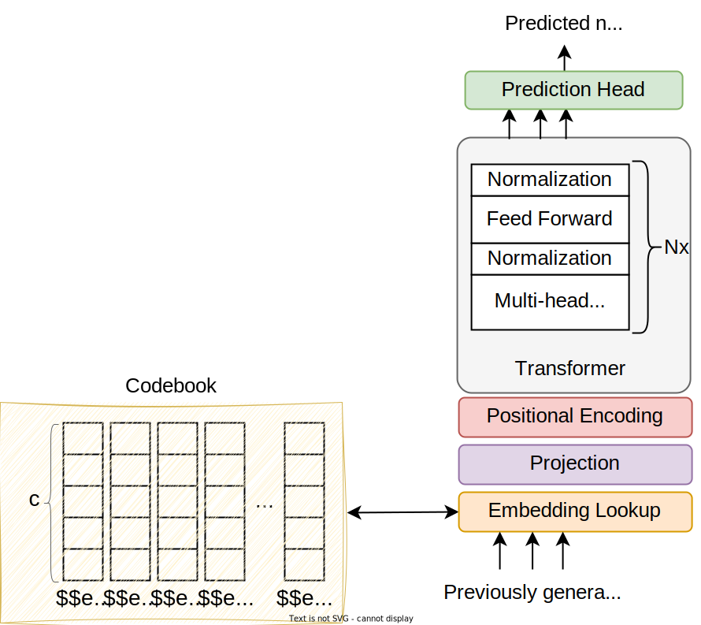

Figure 11: Decoder-only Transformer components

### Training

In autoregressive image generation, we have two training stages:

- Stage I: Training the image tokenizer
- Stage II: Training the image generator

#### Stage I: Training the image tokenizer

The training process involves optimizing the encoder, decoder, and codebook so the model can accurately reconstruct the original images. This process can be described in three steps:

1. The encoder processes an input image and converts it into a continuous representation.
2. The quantizer replaces the continuous representation with discrete tokens using its internal codebook.
3. The decoder uses the discrete tokens to reconstruct the original image.
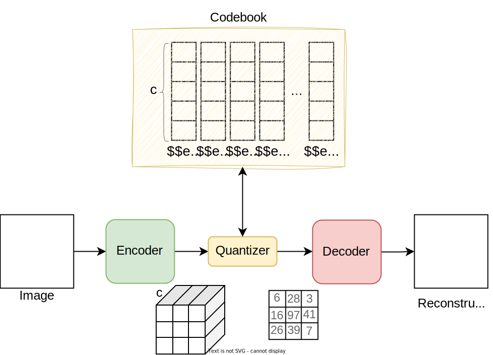

Figure 12: Image tokenizer training process

Since the quantizer lookup operation lacks a well-defined gradient for backpropagation, the VQ-VAE paper proposes approximating the gradient by copying it from the decoder input directly to the encoder output. This approach means that only the selected tokens receive gradients from the decoder, while unselected tokens do not receive any gradients.

##### Training data

We train the image tokenizer with 5 million images. Since the training is self-supervised and doesn't require image labels, we include other publicly available image datasets to enhance the tokenizer's robustness. In particular, we use the *LAION-400M* dataset \[6\], which contains 400 million images. This results in a richer codebook that captures diverse visual patterns.

##### ML objective and loss function

The ML objective of the image tokenizer is to accurately reconstruct original images from their quantized tokens. To achieve this ML objective, the following loss functions are typically employed during the training process:

- Reconstruction loss
- Quantization loss

**Reconstruction loss:** The reconstruction loss measures the difference between the original image and its reconstruction from the quantized tokens. It is typically calculated using the mean squared error (MSE) formula:

$$
\text {Reconstruction loss}=\frac{1}{n} \sum_{i=1}^n\left(x_i-\hat{x}_i\right)^2
$$

Where:

- $x_i$ is the pixel value of the original image,
- $\hat{x}_i$ is the pixel value of the reconstructed image,
- $n$ is the total number of pixels in the image.

**Quantization loss:** The quantization loss measures the distance between the encoder’s outputs and the nearest embedding in the codebook. This loss encourages the encoder to produce outputs that are closer to the codebook embeddings.

$$
\text {Quantization loss}=\left\|\operatorname{sg}[E(x)]-z_q\right\|_2^2+\left\|\operatorname{sg}\left[z_q\right]-E(x)\right\|_2^2
$$

Where:

- $E(x)$ is the continuous latent vector produced by the encoder, $E$, from the input $x$,
- $z_q$ is the quantized latent vector selected from the codebook $Z$,
- $\operatorname{sg}(.)$ represents the stop-gradient operation that blocks the gradients from flowing through the term. It is used here to prevent the codebook from being updated when optimizing the encoder.

For more details on the quantization loss formula, refer to the *VQGAN* paper \[1\].

In practice, using both reconstruction loss and quantization loss during training works well for reconstructing low-resolution images. However, for high-resolution images, the model may still produce artifacts. To improve reconstruction quality at high resolutions, two additional loss functions are typically employed:

- Perceptual loss
- Adversarial loss

**Perceptual loss:** Perceptual loss measures the difference between the features of the original and reconstructed images extracted from a specific layer of a pretrained model such as *VGG* \[7\]. The formula is:

$$
\text { Perceptual loss }=\sum_l\left\|\phi_l(x)-\phi_l(\hat{x})\right\|_2^2
$$

Where:

- $\phi_l$ denotes the feature map of the layer, l, from a pretrained VGG model,
- $x$ is the original image,
- $\hat{x}$ is the reconstructed image.

The perceptual loss encourages the model to reconstruct images that are perceptually similar to the original images. *VGG* features encode high-level details such as content and style. The perception loss guides the training process so that the model can better preserve these details in the reconstructed images.

**Adversarial loss:** Adversarial loss is derived from *GANs* \[8\], where a discriminator tries to distinguish between real and reconstructed images. This loss is used to measure how well the image reconstructed by the image tokenizer can fool the discriminator. The formula, as we saw in Chapter 7, is:

$$
\text {Adversarial loss}=-\log (D(\hat{x}))
$$

Where:

- $D$ is the discriminator network,
- $\hat{x}$ is the reconstructed image.

This loss function encourages the model to produce reconstructed images that a trained discriminator cannot distinguish from real images. The *VQGAN* paper introduced a patch-based version of this loss to reduce unnatural artifacts and improve the realism of the reconstructions.

**Overall loss:** The overall loss function is often a weighted sum of the individual losses described above. The weights $(\lambda_i)$ are hyperparameters that need tuning based on specific performance goals and experiments.

$$
\begin{aligned}
	\text { Overall loss }=  \lambda_{\text {rec }} & \times \text { reconstruction loss }+ \\
	 \lambda_{\text {quant }} &\times \text { quantization loss }+ \\
	 \lambda_{\text {perc }} &\times \text { perceptual loss }+ \\
	 \lambda_{\text {adv }} &\times \text { adversarial loss }
\end{aligned}
$$

After training the image tokenizer, we convert all 5 million training images into discrete tokens and cache them, as detailed in the data preparation section. This step ensures that all images are represented as a sequence of discrete tokens, which is required for training the image generator.

#### Stage II: Training the image generator

Training the image generator, which is a decoder-only Transformer, is similar to the process described in earlier chapters. The training data consists of sequences of discrete tokens, and the model learns to predict these tokens sequentially during training.

We employ next-token prediction as our ML objective and cross-entropy as the loss function to measure how accurate the predicted probabilities are compared to the correct visual tokens.

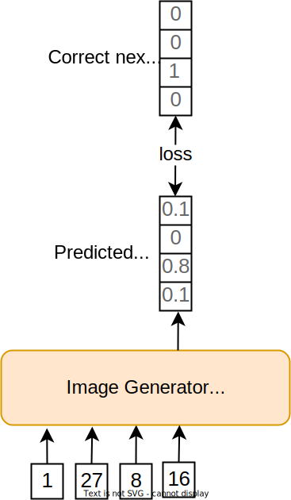

Figure 13: Image generator loss calculation

### Sampling

In autoregressive models, generating a new image involves two steps:

1. Generating a sequence of discrete tokens
2. Decoding discrete tokens into an image

#### 1\. Generating a sequence of discrete tokens

In the first step, the image generator produces a sequence of tokens. The autoregressive nature of the generation ensures that each token is conditioned on preceding tokens, leading to coherent images.

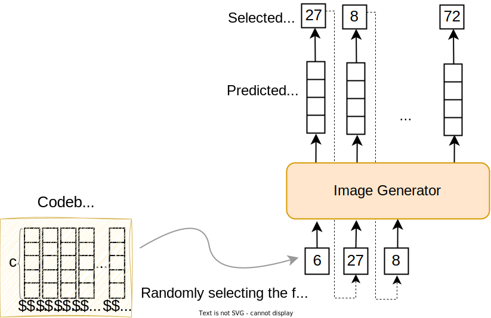

Figure 14: Generating a sequence of discrete tokens using the image generator

Here is a step-by-step process to autoregressively generate a sequence of tokens:

1. Randomly select a token from the codebook as the first token. This initial token acts as a seed for the rest of the generation process.
2. Autoregressively generate tokens one by one. This involves:
	1. Passing the current sequence of tokens to the image generator to predict the probability distribution over the codebook
		2. Selecting the next token using a sampling method such as *top-p* sampling
		3. Appending the chosen token to the current sequence

This process continues until the entire image is generated. The number of iterations depends on the resolution and size of the desired output image. For example, generating an image of 1024 $\times$ 1024 pixels, with each visual token representing a 64 $\times$ 64 pixel block, requires 256 tokens. The process continues until all 256 tokens are generated. Once the sequence of tokens is complete, it is transformed into an actual image, which is the focus of the next step.

#### 2\. Decoding discrete tokens into an image

In this step, the sequence of discrete tokens is transformed into an image by using the decoding functionality of the image tokenizer.

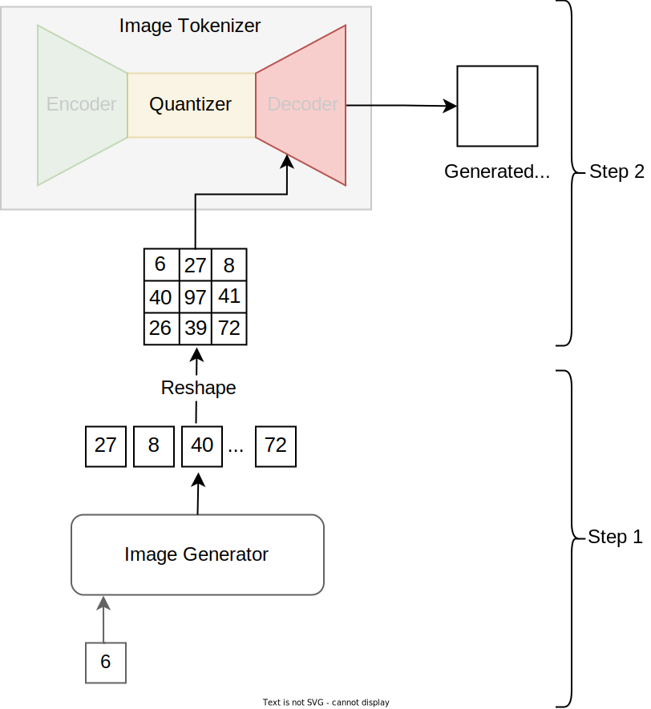

Figure 15: Decoding tokens into an image

## Evaluation

The evaluation metrics for high-resolution image synthesis are similar to those in Chapter 7. We'll briefly review them in this section without going into detail.

### Offline evaluation metrics

The following metrics are typically employed to measure the quality and diversity of the generated images:

- **Inception score:** Measures how similar the generated images are to images of real-world objects by utilizing a pretrained *Inception v3* model. To learn more about the Inception score, refer to \[9\].
- **Fréchet inception distance (FID):** Compares the distribution of generated images to real images by comparing features extracted from a pretrained *Inception v3* model. This metric measures how similar the statistics of generated and real images are. To learn more about FID, refer to \[10\].
- **Human evaluation:** Human evaluators are presented with pairs of images and asked to judge their photorealism and aesthetic qualities. The votes provide a statistical measure of which models produce more realistic images over time.

In addition to those metrics, it is common to evaluate other aspects of the model such as latency and cost.

- **Time to generate an image:** Measures the time it takes for the model to generate an image. This metric is important to monitor since users generally expect quick results.
- **Cost per generation:** Calculates the cost to generate an image. This metric depends on factors such as model complexity, resolution, and infrastructure expenses. Monitoring the cost of generation is crucial as it impacts business revenue.

### Online evaluation metrics

In practice, companies monitor various metrics to assess the system's real-time quality. Common metrics include:

- **User feedback:** Collects direct feedback from users regarding generated images.
- **Periodic surveys:** Gathers user opinions on the quality and relevance of generated images.
- **Subscription rate:** Measures how often users subscribe to services or features related to image generation.
- **Churn rate**: Measures the rate at which users stop using the service.

## Overall ML System Design

Once we are satisfied with the performance of the image generator and image tokenizer models, we can integrate them to construct the image synthesis system. The primary components in a high-resolution image synthesis system are:

- Generation service
- Decoding service
- Super-resolution service
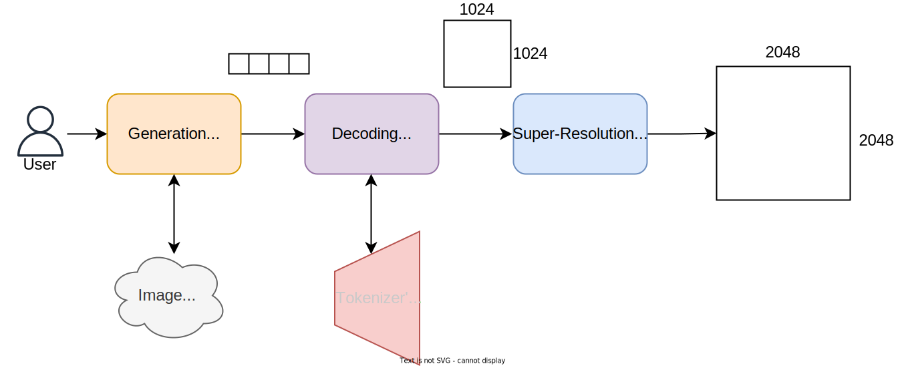

Figure 16: High-resolution image synthesis ML design

Understanding the purpose of each component and their interactions will provide a holistic view of the system. Let’s explore each in more detail.

### Generation service

The generation service handles user requests and interacts with the trained image generator model to produce a sequence of visual tokens.

### Decoding service

The decoding service interacts with the image tokenizer to convert the generated sequence of visual tokens into an image. Note that when we deploy the model, we don’t need the encoder in the image tokenizer – it is only used during training.

Separating generation and decoding services is crucial because the image generator and tokenizer are different models with distinct computational needs and latencies. This approach allows each service to scale independently and manage resources efficiently.

### Super-resolution service

Super-resolution service uses a pretrained model to increase the resolution of generated images. For example, if the desired resolution is 2048 $\times$ 2048 but the generator produces only 1024 $\times$ 1024, we use a super-resolution model with a 2x upscale factor.

This service is crucial for applications requiring detailed and realistic visuals, such as medical imaging. There are many established solutions for super-resolution, from CNN-based \[11\] to GAN-improved \[12\]. To learn more about recent approaches, refer to \[13\].

## Other Talking Points

If there's time remaining at the end of the interview, you could explore these additional points:

- Extending autoregressive models to support text-based generation \[14\] \[15\].
- Support applications such as image completion and image super-resolution \[16\].
- Balancing diversity vs. fidelity in sampling, using techniques such as temperature scaling \[17\].
- Enhancing the stability with adversarial training, gradient clipping, and learning rate scheduling \[18\]\[19\].
- Using progressive growing and multi-scale architectures to improve image quality and detail \[20\].
- Creating interactive systems for users to refine and customize generated images \[21\].

## Summary

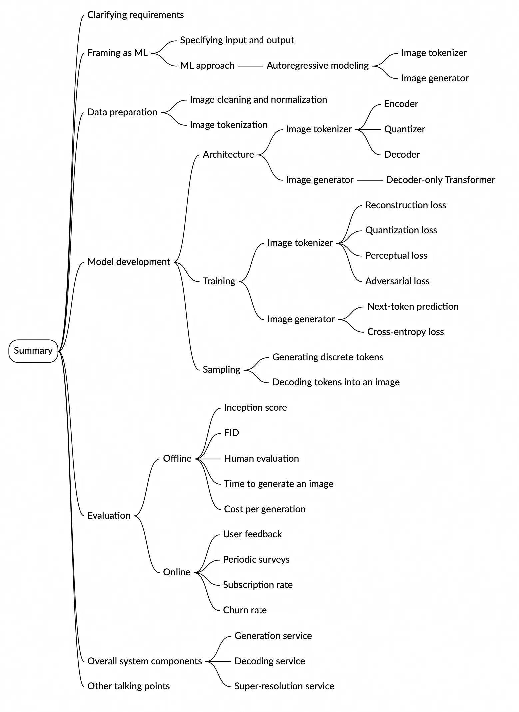

Image represents a mind map summarizing the key aspects of designing a generative AI system for image generation. The central element is a box labeled 'Summary,' from which several main branches radiate, each representing a crucial stage or component. These branches include 'Clarifying requirements' (further branching into 'Framing as ML' with sub-branches 'ML approach' and 'Autoregressive modeling,' and 'Specifying input and output'); 'Data preparation' (branching into 'Image cleaning and normalization' and 'Image tokenization'); 'Model development' (branching into 'Architecture' detailing components like 'Image tokenizer,' 'Image generator,' and 'Decoder-only Transformer,' and 'Training' specifying loss functions such as 'Reconstruction loss,' 'Quantization loss,' 'Perceptual loss,' 'Adversarial loss,' and 'Cross-entropy loss,' along with processes like 'Generating discrete tokens' and 'Decoding tokens into an image'); 'Evaluation' (dividing into 'Offline' with metrics like 'Inception score,' 'FID,' 'Human evaluation,' 'Time to generate an image,' and 'Cost per generation,' and 'Online' with metrics like 'User feedback,' 'Periodic surveys,' 'Subscription rate,' and 'Churn rate'); and 'Overall system components' (branching into 'Generation service,' 'Decoding service,' and 'Super-resolution service'). Finally, a branch labeled 'Other talking points' is also present. Each branch uses color-coding for visual distinction, and the overall structure is hierarchical, showing the relationships between different stages and components in the design process.

## Reference Material

\[1\] Taming Transformers for High-Resolution Image Synthesis. [https://arxiv.org/abs/2012.09841](https://arxiv.org/abs/2012.09841).  
\[2\] Neural Discrete Representation Learning. [https://arxiv.org/abs/1711.00937](https://arxiv.org/abs/1711.00937).  
\[3\] Deep Learning using Rectified Linear Units (ReLU). [https://arxiv.org/abs/1803.08375](https://arxiv.org/abs/1803.08375).  
\[4\] Euclidean distance. [https://en.wikipedia.org/wiki/Euclidean\_distance](https://en.wikipedia.org/wiki/Euclidean_distance).  
\[5\] A guide to convolution arithmetic for deep learning. [https://arxiv.org/abs/1603.07285](https://arxiv.org/abs/1603.07285).  
\[6\] LAION data set 400 million [https://laion.ai/blog/laion-400-open-dataset/](https://laion.ai/blog/laion-400-open-dataset/).  
\[7\] Very Deep Convolutional Networks for Large-Scale Image Recognition. [https://arxiv.org/abs/1409.1556](https://arxiv.org/abs/1409.1556).  
\[8\] Generative Adversarial Networks. [https://arxiv.org/abs/1406.2661](https://arxiv.org/abs/1406.2661).  
\[9\] Inception score. [https://en.wikipedia.org/wiki/Inception\_score](https://en.wikipedia.org/wiki/Inception_score).  
\[10\] FID calculation. [https://en.wikipedia.org/wiki/Fr%C3%A9chet\_inception\_distance](https://en.wikipedia.org/wiki/Fr%C3%A9chet_inception_distance).  
\[11\] Image Super-Resolution Using Very Deep Residual Channel Attention Networks. [https://arxiv.org/abs/1807.02758](https://arxiv.org/abs/1807.02758).  
\[12\] ESRGAN: Enhanced Super-Resolution Generative Adversarial Networks. [https://arxiv.org/abs/1809.00219](https://arxiv.org/abs/1809.00219).  
\[13\] NTIRE 2024 Challenge on Image Super-Resolution (×4): Methods and Results. [https://arxiv.org/abs/2404.09790](https://arxiv.org/abs/2404.09790).  
\[14\] Muse: Text-To-Image Generation via Masked Generative Transformers. [https://arxiv.org/abs/2301.00704](https://arxiv.org/abs/2301.00704).  
\[15\] VQGAN-CLIP: Open Domain Image Generation and Editing with Natural Language Guidance. [https://arxiv.org/abs/2204.08583](https://arxiv.org/abs/2204.08583).  
\[16\] LAR-SR: A Local Autoregressive Model for Image Super-Resolution. [https://openaccess.thecvf.com/content/CVPR2022/papers/ Guo\_LAR-SR\_A\_Local\_Autoregressive\_Model\_for\_Image\_Super-Resolution\_CVPR\_2022\_paper.pdf](https://openaccess.thecvf.com/content/CVPR2022/papers/Guo_LAR-SR_A_Local_Autoregressive_Model_for_Image_Super-Resolution_CVPR_2022_paper.pdf).  
\[17\] Long Horizon Temperature Scaling. [https://arxiv.org/abs/2302.03686](https://arxiv.org/abs/2302.03686).  
\[18\] Learning Rate Scheduling. [https://d2l.ai/chapter\_optimization/lr-scheduler.html](https://d2l.ai/chapter_optimization/lr-scheduler.html).  
\[19\] Adversarial Training. [https://adversarial-ml-tutorial.org/adversarial\_training/](https://adversarial-ml-tutorial.org/adversarial_training/).  
\[20\] Progressive Growing of GANs for Improved Quality, Stability, and Variation. [https://arxiv.org/abs/1710.10196](https://arxiv.org/abs/1710.10196).  
\[21\] CogView2: Faster and Better Text-to-Image Generation via Hierarchical Transformers. [https://arxiv.org/abs/2204.14217](https://arxiv.org/abs/2204.14217).

[^1]: Certain optimizations and techniques (e.g., latent diffusion model) can significantly speed up the generation process in diffusion models. These methods are discussed in detail in Chapter 10 and Chapter 11.