## Introduction

In many cases, instead of allowing the model to generate content from random noise (as discussed in Chapters 7 and 8), we want to control the content of the generated image. Text-to-image generation is a fascinating application of generative AI that allows users to enter a text prompt, which the model transforms into a detailed image. Several text-to-image services are commercially available, such as OpenAI's DALL-E 3 \[1\], Google's Imagen \[2\], and Adobe's Firefly \[3\].

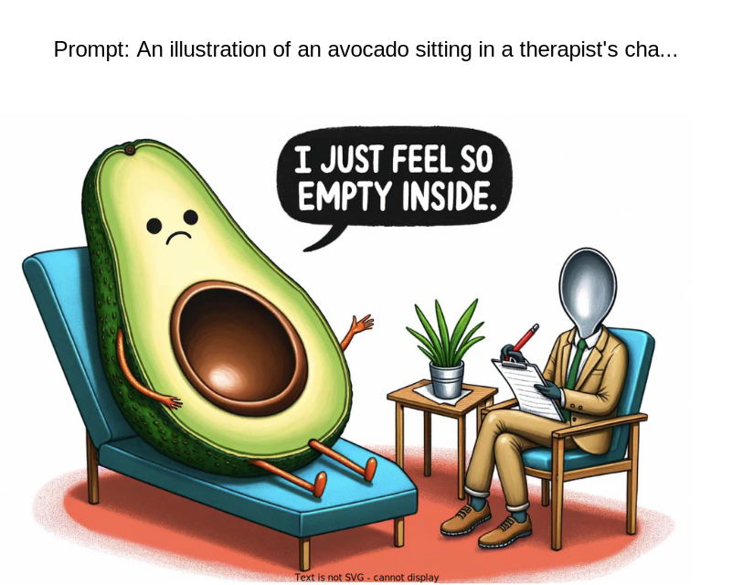

Figure 1: An example of a prompt and a generated image by OpenAI’s DALL-E 3 \[1\]

## Clarifying Requirements

Here is a typical interaction between a candidate and an interviewer:

**Candidate:** What resolution do we target for generated images?  
**Interviewer:** We aim for high-resolution images, specifically 1024x1024 pixels.

**Candidate:** Should the system support multiple languages for text input or just English?  
**Interviewer:** We'll focus on English initially, but the system's architecture should be adaptable for other languages later.

**Candidate:** How large is the dataset for training a text-to-image model?  
**Interviewer:** We have about 500 million images from user assets, most with captions.

**Candidate:** How detailed and complex can the text prompts be? Is there a limit to their complexity or length?  
**Interviewer:** The system should handle detailed text prompts, with a maximum length of 128 words.

**Candidate:** What speed should the system achieve for image generation?  
**Interviewer:** The goal is near–real-time generation. Let’s aim for 10 seconds per image.

**Candidate:** What types of images should the system generate? Are we focusing on a specific domain, like landscapes?  
**Interviewer:** The system should be capable of generating, based on text prompts, a wide range of images, including realistic landscapes, portraits, and abstract or conceptual art.

**Candidate:** It's important to ensure the images aren't biased by age, race, or gender. Can I start by focusing on those three attributes?  
**Interviewer:** Great point. It’s crucial to have a fair system. Let's begin by addressing those three attributes.

**Candidate:** Ethical considerations are crucial. We need filters and checks to avoid generating offensive, inappropriate, or harmful images. Does that sound correct?  
**Interviewer:** Yes, that’s correct.

## Frame the Problem as an ML Task

### Specifying the system’s input and output

The input to the system is a text prompt provided by the user that describes the desired image. This prompt usually includes details like scenes, objects, colors, styles, and emotions.

The output is a visually detailed image that adheres to the text prompt. For example, as shown in Figure 2, a prompt like "A boat on an ocean" produces an image depicting this scene.

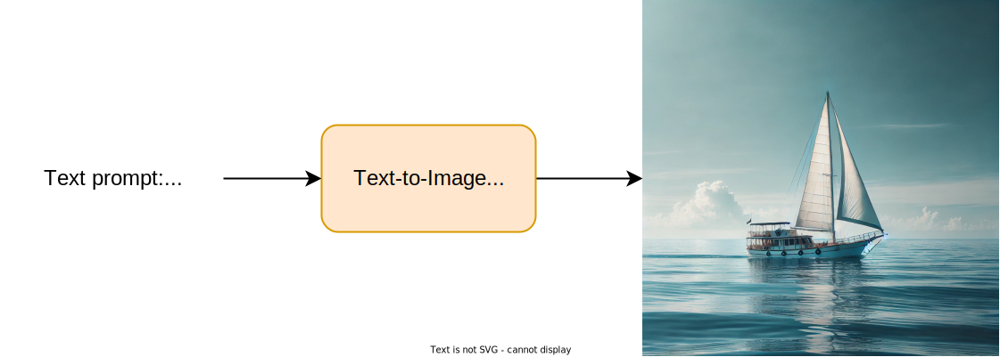

Figure 2: Input and output of a text-to-image system. Image credit: \[4\]

### Choosing a suitable ML approach

Text-to-image generation is a multimodal task that involves understanding text and generating a corresponding image. There are two primary approaches for building text-to-image systems:

- Autoregressive models
- Diffusion models

Let’s briefly review each and choose the one that best suits our needs.

#### Autoregressive models

These models treat text-to-image generation as a sequence generation task. A decoder-only Transformer takes a sequence of text tokens as input and outputs a sequence of visual tokens representing an image. An image tokenizer then decodes these visual tokens into the actual image.

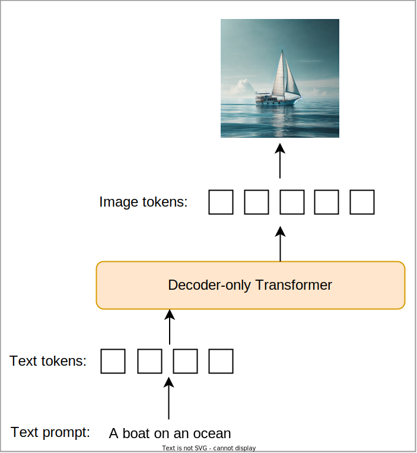

Figure 3: Autoregressive text-to-image generation

Several text-to-image models have been developed using this approach, such as OpenAI’s DALL-E \[5\] and Google’s Muse \[6\].

#### Diffusion models

First introduced in 2019 \[7\], diffusion models gained mainstream attention about three years later. They use a different approach for text-to-image generation by starting with random noise and gradually transforming it into a clear image based on the text prompt. This process typically involves a text encoder, such as OpenAI’s CLIP \[8\] or Google’s T5 \[9\], which converts the text prompt into an embedding. This embedding captures the meaning of the prompt and guides the diffusion model to generate images that match it.[^1]

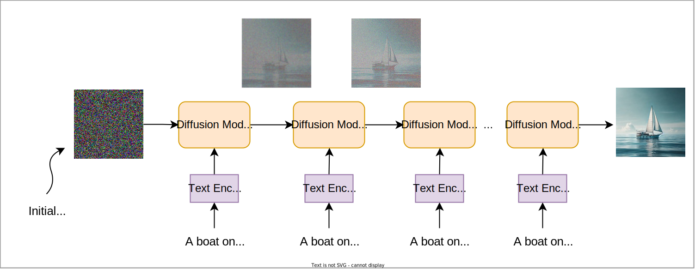

Figure 4: Diffusion-based text-to-image generation

Examples of diffusion-based text-to-image models include Google’s Imagen 3 \[2\], OpenAI’s DALL-E 2 \[10\], and Stability AI’s Stable Diffusion \[11\].

#### Diffusion versus autoregressive models

Autoregressive models frame text-to-image generation as a sequence generation task, while diffusion models approach it as an iterative refinement process. This key difference in modeling impacts their capabilities.

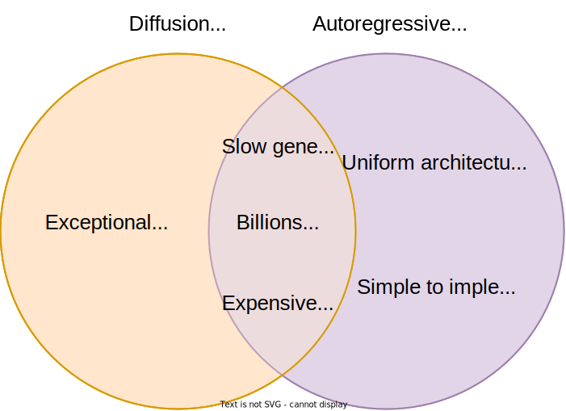

Figure 5: Diffusion vs. autoregressive model characteristics

Both diffusion and autoregressive models can produce realistic images, are slow in generation, typically have billions of parameters, and require substantial computational resources for training. Despite these similarities, they differ in three key aspects:

1. **Implementation complexity**: Autoregressive models are simpler to implement during both training and inference. During training, they are more statistically efficient because they can obtain useful gradient signals from all steps in a single forward-backward pass. In contrast, diffusion models are less statistically efficient, requiring sampling of different noise levels for each training example. At inference time, once the Transformer in an autoregressive model generates the sequence of visual tokens, these tokens form the final image. Diffusion models, however, refine the image over many steps, adding complexity to the implementation.
2. **Image quality**: Diffusion models have shown better performance in generating highly detailed and realistic images. Their iterative process allows the model to continuously refine and enhance fine details, leading to superior overall realism in the generated images.
3. **Flexibility in sampling**: Diffusion models are more flexible in trading off sampling speed and image quality. They can easily adjust the number of sampling steps—more steps usually lead to higher-quality images but take more time. Once trained, an autoregressive model cannot easily make such adjustments.

In this chapter, we choose diffusion models to prioritize exceptional image quality. In the model development section, we explore the architecture, training methods, and sampling techniques of diffusion models.

## Data Preparation

Our dataset consists of approximately 500 million image–caption pairs. However, large-scale datasets often require substantial preprocessing before they can be used for model training. In this section, we explore common techniques to prepare images and captions for diffusion training.

### Image preparation

We focus on two main steps to prepare the images: filtering inappropriate images and standardizing the remaining ones. Let's delve into each step in more detail.

#### Filtering inappropriate images

In large-scale datasets, many images may not be useful for training. It's crucial to remove these to ensure the model learns only from high-quality and safe data. To achieve this, we perform the following steps:

- **Remove small images:** We discard image–caption pairs where the image size is smaller than a certain threshold, for example, 64×64 pixels. Small images are often of poor quality and may not provide valuable information for training.
- **Deduplicate images:** We use deduplication methods, such as \[12\], to remove identical or perceptually similar images. This prevents the model from being biased toward certain images that appear more frequently.
- **Remove inappropriate images:** We employ harm detection and NSFW (Not Safe For Work) detection models to filter out harmful content such as violence or nudity. This ensures the model doesn't learn to generate inappropriate images.
- **Remove low-aesthetic images:** We use specialized ML models to eliminate images that aren't aesthetically pleasing. This helps the model focus on high-quality images during training.

#### Standardizing images

- **Adjust image dimensions:** The diffusion model requires inputs of specific dimensions. Therefore, it's crucial to have training data of similar sizes. For example, if the expected model input is 128x128, we first resize the images so that the smaller dimension is 128, preserving the aspect ratio. Then, we center-crop them to achieve the final size of 128x128.
- **Normalize images:** We normalize pixel values to a standard range such as \[0, 1\] or \[-1, 1\] for more stable training.
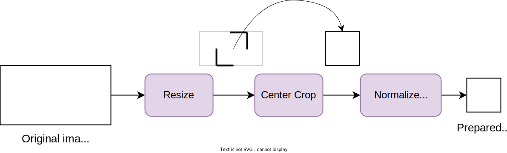

Figure 6: Image preparation steps

### Caption preparation

In addition to images, captions are often irrelevant or missing. Here are common steps to ensure captions are consistent and of high quality:

- **Handle missing or non-English captions:** For images without captions or with captions in another language, we use an image captioning model such as BLIP-3 \[13\] to automatically generate descriptive captions. If you would like to build an image captioning system from scratch, refer to Chapter 5.
- **Enhance captions:** We use a pretrained model such as CLIP \[8\] to score the relevance of each image–caption pair. For pairs scoring below a threshold, we replace the original caption with an auto-generated one using the BLIP-3 model.
- **Remove poorly matched pairs:** After enhancing captions, we remove image–caption pairs with CLIP similarity scores below a threshold. This step ensures that the model is exposed only to pairs whose captions accurately describe the images.

## Model Development

### Architecture

A diffusion model, as previously explained, progressively denoises a noisy image through multiple steps until it becomes clear. In each step, as illustrated in Figure 7, the model takes a noisy image as input and predicts the noise to be removed.[^2] Two common architectures are typically used for this purpose:

- U-Net
- Diffusion Transformer (DiT)
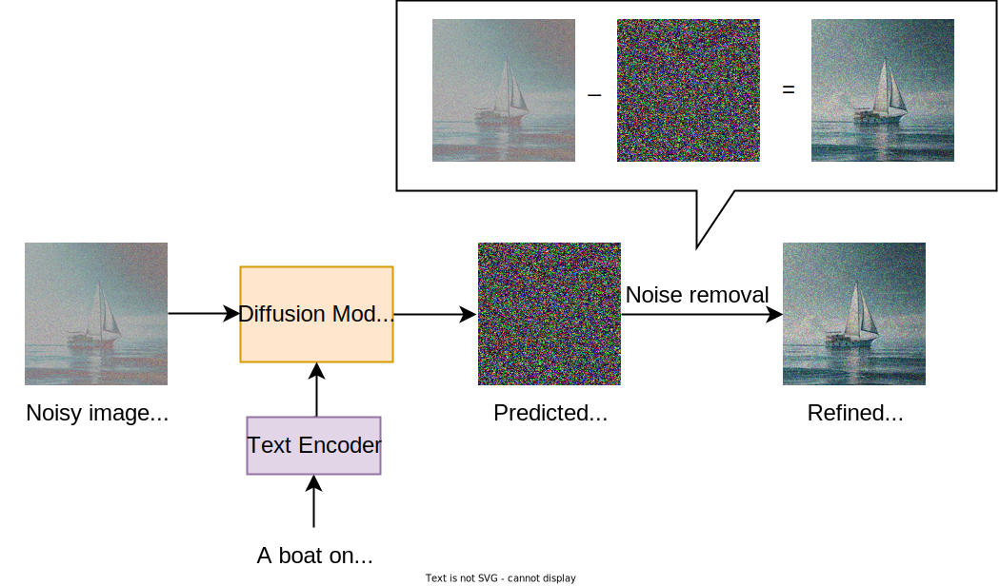

Figure 7: Input and output of the diffusion model in a single step

#### U-Net

U-Net \[14\] is a convolutional neural network (CNN) architecture originally developed for biomedical image segmentation. It consists of a series of downsampling blocks followed by upsampling blocks, as shown in Figure 8.

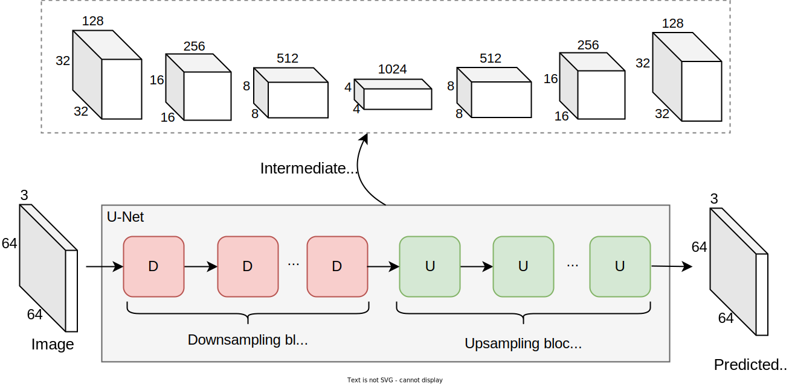

Figure 8: U-Net downsampling and upsampling blocks

##### Downsampling blocks

The downsampling blocks progressively reduce spatial dimensions (height and width) while increasing depth (number of channels), leading to a compressed representation of the input. Each downsampling block typically consists of the following:

- **Convolution operation**: Extracts visual features from the input.
- **Batch normalization**: Normalizes feature maps to stabilize training.
- **Non-linear activation**: Introduces non-linearity to learn complex patterns.
- **Max-pooling**: Reduces the feature map dimensions.
- **Cross-attention**: Cross-attends to additional conditions, such as text prompt tokens. This is necessary to ensure the text prompt influences the predicted noise.
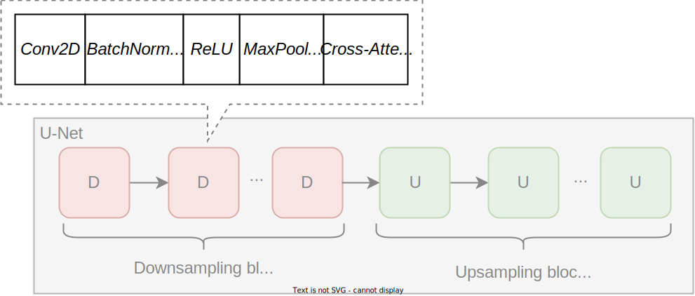

Figure 9: Typical layers in a downsampling block

Let's explore the cross-attention layer in more detail, as this is the first instance where we're applying cross-attention between different modalities—image and text inputs. The text prompt is processed by a text encoder, such as a Transformer-based model, which converts words or tokens into a sequence of continuous embeddings. These embeddings capture the semantic meaning of the text. During each denoising step of the diffusion process, the model receives a noisy image as input and processes it through layers like *Conv2D* and *BatchNorm2D* to extract visual features. In the cross-attention layer, the queries are derived from the image features, while the keys and values come from the text embeddings. This enables the model to align and integrate information effectively from the text into the image features.

##### Upsampling blocks

The upsampling blocks symmetrically increase spatial dimensions and decrease feature map depth. The final output matches the original input size, which, in this case, is the predicted noise. Each upsampling block consists of the following:

- **Transposed convolution:** Uses operations like PyTorch’s *ConvTranspose2D* to process and increase the feature map’s dimensions.
- **Batch normalization**: Normalizes feature maps to stabilize training.
- **Non-linear activation**: Introduces non-linearity to learn complex patterns.
- **Cross-attention:** Maintains the influence of additional conditions during upsampling.
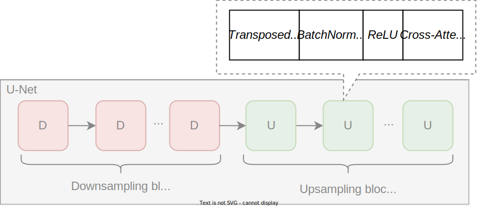

Figure 10: Typical layers in an upsampling block

The U-Net architecture has various details and variations. Different implementations may use different layers and configurations. However, understanding the key components and structure is generally sufficient for most ML system design interviews. For more in-depth information, refer to \[14\].

#### DiT

DiT \[15\] is another popular architecture in diffusion models. Unlike U-Net, which uses a series of downsampling and upsampling layers, DiT primarily relies on a Transformer architecture to process the noisy input image and predict the noise.

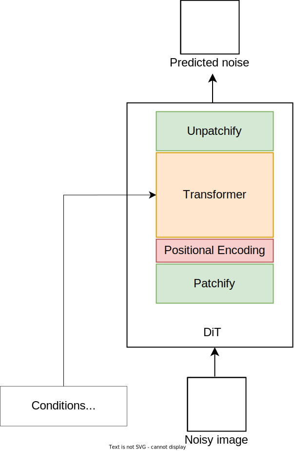

Figure 11: DiT components

DiT is primarily inspired by the Vision Transformer (ViT) \[16\] architecture discussed in Chapter 5. DiT components are:

- **Patchify:** Converts the input image into a sequence of patch embeddings.
- **Positional encoding:** Attaches position information to each patch embedding to indicate its location in the original image.
- **Transformer:** Processes the sequence of embeddings and other conditioning signals, such as the text prompt, to predict the noise for each patch.
- **Unpatchify:** Converts the sequence of predicted noise vectors into an image with the same dimension as the original input image.

In summary, both U-Net and DiT architectures perform well in practice. U-Net was originally used in several text-to-image models such as Google’s Imagen \[17\] and Stability AI’s Stable Diffusion \[11\]. Recently, the DiT architecture has shown great promise for text-to-image generation. For educational purposes, we use the U-Net architecture in this chapter. Chapter 11 explores the DiT architecture in more detail.

### Training

A diffusion model is trained by employing the diffusion process. The diffusion process has two phases:

- Forward process
- Backward process

#### Forward process

In the forward process, also known as the **noising process**, noise is gradually added to an image over multiple steps (denoted as *t* or timesteps) until the image becomes completely noisy. The value of *t*, representing the number of steps, is typically chosen randomly from a range, usually between 1 and 1,000. The forward process does not involve any ML models or parameter updates.

Figure 12: Forward diffusion process

#### Backward process

In the backward process, also known as the **denoising process**, an ML model learns to reverse the forward process. At each step, the model predicts the noise in the noisy image. This predicted noise is then used to reduce the noise in the input image. As shown in Figure 13, this process is repeated until the image becomes clear.

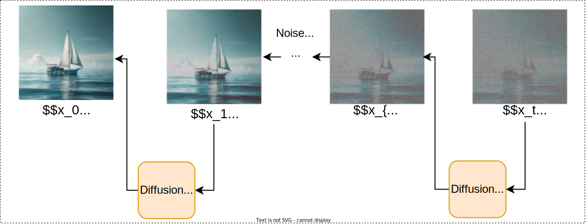

Figure 13: Backward diffusion process

With an understanding of both the forward and backward processes, we can now explore how they are applied during the diffusion training process.

#### Diffusion training process

During training, we introduce noise to the original image by simulating the forward process, then ask the model to predict this noise. This process involves four key steps:

1. Noise addition
2. Preparation of conditioning signals
3. Noise prediction
4. ML objective and loss calculation

This section includes some math for those who are interested, but the details do not affect the design of the ML system.

##### 1\. Noise addition

The first step is to simulate the forward diffusion process by adding noise to the original image over multiple timesteps. At each timestep, we corrupt the image slightly by adding Gaussian noise. This gradual addition of noise transforms the image into pure noise over time.

The amount of noise added at each timestep is controlled by a **noise schedule**. The noise schedule is defined by a set of variance parameters, 1, 2,...,T, where T is the total number of timesteps. Each t(0,1) controls the amount of noise added at timestep t.

The noise schedule typically increases the values of $\beta$ incrementally:

$$
\beta_1<\beta_2<\ldots<\beta_T
$$

Thus, smaller amounts of noise are added in the early steps, preserving more of the original image, and larger amounts of noise are added in the later steps, accelerating the diffusion process.

With the noise schedule defined, we can express the noisy data at timestep $t$ using the noise addition formula:

$$
x_t = \sqrt{(1-\beta_t)}x_{t-1} + \sqrt{\beta_t}\epsilon
$$

where:

- $x_t$ is the noisy image at timestep $t$,
- $x_{t-1}$ is the noisy image at timestep $t-1$,
- $\epsilon$ is the Gaussian noise sampled from the standard normal distribution $N(0, I)$,
- $\beta_t$ is the variance schedule parameter at timestep t, controlling the amount of noise added.

Iteratively adding noise over many steps can be time-consuming. Instead, it can be shown that the noisy data at timestep $t$ can be directly derived from the original data, $x_0$:

$$
\begin{aligned}
	& x_t=\sqrt{\alpha_t} x_{t-1}+\sqrt{1-\alpha_t} \epsilon_{t-1} \\
	& =\sqrt{\alpha_t}\left(\sqrt{\alpha_{t-1}} x_{t-2}+\sqrt{1-\alpha_{t-1}} \epsilon_{t-2}\right)+\sqrt{1-\alpha_t} \epsilon_{t-1} \\
	& =\sqrt{\alpha_t \alpha_{t-1}} x_{t-2}+\sqrt{1-\alpha_t \alpha_{t-1}} \epsilon_{t-2}^{\prime} \\
	& =\ldots \\
	& =\sqrt{\alpha_t^{\prime}} x_0+\sqrt{1-\alpha_t^{\prime}} \epsilon
\end{aligned}
$$

where:

- $x_t$ is the noisy image at timestep $t$,
- $\alpha_t=1-\beta_t$ and $\alpha_t^{\prime}=\prod_{i=1}^t \alpha_i$ are reparameterizations of $\beta_t$,
- $\epsilon$ is the Gaussian noise sampled from the standard normal distribution $N(0, I)$.

In summary, during noise addition, we randomly sample $t$ and compute $x_t$ directly from $x_0$, without the need to iteratively add noise at each timestep, using the following formula:

$$
x_t=\sqrt{\alpha_t^{\prime}} x_0+\sqrt{1-\alpha_t^{\prime}} \epsilon
$$

##### 2\. Preparation of conditioning signals

To predict the added noise, the model typically expects two additional pieces of information: the image caption and the sampled timestep, $t$, which indicates the noise level. We use separate encoders (see Figure 14) to prepare each of these conditioning signals to be processed by the model.

##### 3\. Noise prediction

The primary goal of training a diffusion model is to learn how to reverse the forward diffusion process-that is, to reconstruct the original data, $x_0$, from its noisy version, $x_t$. It has been shown that directly predicting $x_0$ is not as effective. Instead, training the model to predict the noise, $\epsilon$, added during the forward process simplifies the task and improves performance. Therefore, in this step, the model predicts the noise, $\epsilon$, given the noisy input, $x_t$, and the timestep, t.[^3]

##### 4\. ML objective and loss calculation

The ML objective is to minimize the difference between the true noise, $\epsilon$, and the model's prediction. The loss function used is the mean squared error (MSE) between the true noise and the predicted noise:

$$
L=E_{t, x_0, \epsilon}\left(\left\|\epsilon-\epsilon_\theta\left(x_t, t\right)\right\|^2\right)
$$

where:

- $t$ is a timestep sampled uniformly from $\{1,2, \ldots, T\}$,
- $\epsilon \sim N(0, I)$ is the Gaussian noise used in the forward process,
- $x_t$ is the noisy data at timestep $t$, computed using the noise addition formula,
- $\epsilon_\theta\left(x_t, t\right)$ is the prediction of the neural network model (U-Net or DiT).
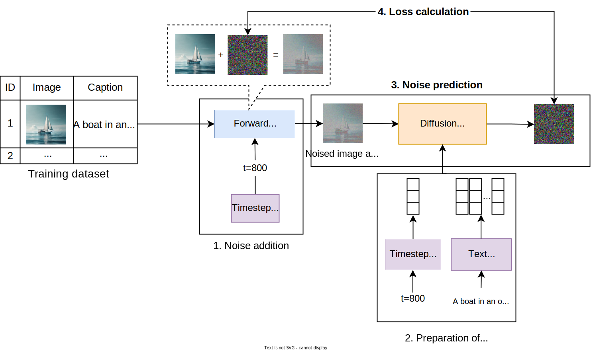

Figure 14: A single iteration in diffusion training

To enhance the reading experience, we have omitted the mathematical details, such as the derivation of the tractable mean and the loss simplification. For more information on diffusion training, refer to \[18\].

### Sampling

Sampling refers to generating a new image from a trained diffusion model. In this section, we’ll explore how sampling works in diffusion models and how noises are transformed into coherent images guided by the text prompt.

The sampling process starts with an image of random pixels, typically drawn from a Gaussian distribution. The model then gradually refines this image step by step. At each step, the diffusion model predicts the noise present in the current image and uses this prediction to adjust the image slightly in the right direction. This gradual refinement continues, each step producing a clearer image until a clear and detailed image is achieved.

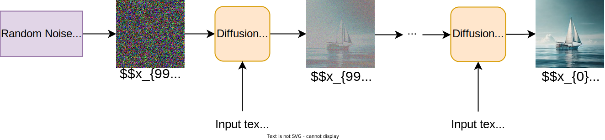

Figure 15: Sampling process

The basic sampling process described above has two drawbacks. First, it often fails to generate images that accurately match the text prompt. Second, it is slow, because generating each sample requires many iterative steps. The following two techniques are commonly employed in practice to mitigate the issues described above:

- **Classifier-free guidance (CFG)**: CFG \[19\] improves the alignment between images and text prompts in diffusion models. During training, the model learns to generate images with and without the text prompt. During sampling, CFG adjusts the balance between these two modes. CFG ensures the generated images closely match the text prompts by increasing the influence of the conditioned (text prompt) mode and reducing the unconditioned (no text prompt) mode. This adjustment guides the diffusion process to produce more accurate results. To learn more about CFG, refer to \[19\].
- **Reduction of diffusion steps:** Sampling algorithms such as DDIM \[20\] reduce the number of diffusion steps from the standard 1,000 to as few as 20. This significantly speeds up the generation process while maintaining image quality. To learn more about DDIM, refer to \[20\].

In most ML system design interviews, the focus is on high-level concepts and how components work together, not on the intricate details. If you are interested in exploring diffusion models in more depth, refer to \[21\]\[19\]\[20\].

### Challenges in text-to-image diffusion models

Diffusion models are typically very large. For example, DALLE-2 has 3.5 billion parameters \[10\]. This capacity is necessary since these models have to learn diverse concepts, shapes, and styles.

Training such large models poses several challenges during both training and sampling. The most common ones include:

- Resource-intensive model training
- Slow image generation

#### Resource-intensive model training

Training diffusion models is computationally intensive, requiring significant processing power. It also requires substantial GPU memory due to the size of the model and the high-dimensional nature of the generated images. Most modern GPUs may not have sufficient memory to fit model parameters, activations, and gradients during training. The following strategies are commonly employed to overcome these challenges:

- **Mixed precision training:** This technique uses both 16-bit and 32-bit floating-point types to reduce memory usage and increase computational efficiency. To learn more, refer to \[22\].
- **Model and data parallelism:** These methods distribute training across multiple devices. Most distributed training frameworks, such as FSDP \[23\] and Deepspeed \[24\], support various parallelism techniques.
- **Latent diffusion models:** These models operate in a lower-dimensional space instead of pixel space, significantly speeding up training and inference. Chapter 11 examines this approach in more detail.

#### Slow image generation

Generating images from text in diffusion models is slow for two main reasons. First, due to the sequential nature of the diffusion sampling process, multiple steps are needed to refine the image. Second, as diffusion models have billions of parameters, significant computations occur at each step.

Common strategies to mitigate this challenge include:

- **Parallel sampling:** Implementing parallel processing during sampling reduces the time needed to generate images \[25\].
- **Model distillation:** A distilled model improves generation speed because of its reduced size, but it retains the behavior and performance of the original model. To learn more about model distillation in diffusion models, refer to \[26\].
- **Model quantization:** This technique reduces the precision of the model's weights, which decreases memory usage and speeds up generation.

## Evaluation

### Offline evaluation metrics

A consistent and reliable benchmark is key to evaluating text-to-image models. DrawBench \[17\] serves this purpose by providing a curated set of prompts that test various aspects of image generation such as object composition, interaction, and context understanding. These prompts, ranging from simple to complex, help to assess how accurately the model generates images from text. Due to its comprehensiveness, we use DrawBench to evaluate our text-to-image model. Let’s examine both automated metrics and human evaluation to assess three key areas of the model’s ability to generate images:

- Image quality
- Image diversity
- Image–text alignment

As discussed in previous chapters, Inception score (IS) \[27\] and Fréchet Inception distance (FID) \[28\] are two common metrics for evaluating quality and diversity in image generation systems. In this section, we focus primarily on image–text alignment.

#### Image–text alignment

Image–text alignment refers to how accurately the generated images match the text prompts. Measuring this alignment is important because it ensures the generated images are faithful to the user's input. A common metric for assessing this is CLIPScore \[29\], which evaluates the degree of alignment. Before diving into CLIPScore, let's briefly review CLIP.

##### CLIP

CLIP \[8\] is a model developed by OpenAI that has been trained to match images with their corresponding descriptions. It consists of two encoders: one for text and one for images. The text encoder converts input text into a text embedding; the image encoder converts the image into an image embedding.

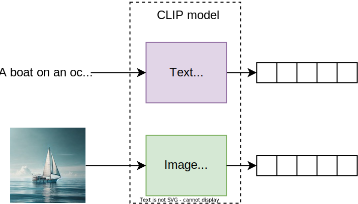

Figure 16: CLIP encoders

During training, CLIP learns to align embeddings by bringing related text and image embeddings closer together and pushing unrelated ones apart. This helps CLIP develop a shared embedding space where both an image and its associated text will map into the same space.

After training, similar text descriptions map close to each other in the embedding space, and images map near their relevant descriptions.[^4]

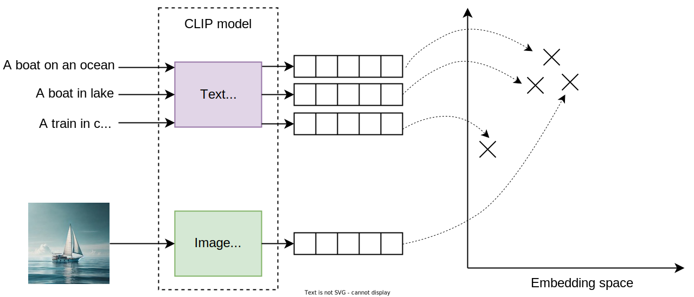

Figure 17: Text and image feature vectors mapped to the CLIP embedding space

With an understanding of the CLIP model, we can now easily explore CLIPScore as a metric for evaluating image–text alignment.

##### CLIPScore

The CLIPScore measures the cosine similarity between the CLIP embeddings of a text description and an image. It shows how closely the image matches the text in the high-dimensional embedding space. A higher score indicates better alignment between an image and a description.

#### Human evaluation

Human evaluation complements the automated metrics by assessing both image quality and text alignment using the following approach:

- **Image quality:** Human raters compare a generated image with a reference image by judging which of the images is more photorealistic. Image quality is determined by the percentage of times the generated image is chosen over the reference image.
- **Text alignment:** Human raters are shown an image and its caption and then asked, " *Does the caption accurately describe the above image?*" The responses " *yes,*" " *somewhat,*" and " *no* " are scored as 100, 50, and 0, respectively. These scores are averaged separately for generated images and reference images to measure text alignment.

### Online evaluation metrics

Online metrics measure how the model works in production. Common metrics to evaluate our text-to-image model include:

- **Click-through rate (CTR):** The percentage of users who click on the generated images. A high CTR indicates that users find the generated images useful.
- **Time spent on page:** The average time users spend with the service. Longer viewing times indicate higher user engagement.
- **User feedback:** Direct feedback from users is collected through feedback. Positive feedback indicates satisfaction with the image quality and text alignment.
- **Conversion rate:** The percentage of users who take a desired action (e.g., purchase, sign up) after interacting with generated images. A high conversion rate indicates satisfaction with the model's performance.
- **Latency:** The time it takes to generate an image from a text prompt. Lower latency indicates faster performance, which is important for user satisfaction.
- **Throughput:** The number of image generations the model can handle per second. High throughput ensures the service can serve more users.
- **Resource utilization:** The computational resources (e.g., CPU, GPU, memory) used to run the model and serve users. Efficient resource utilization is key to reducing costs.
- **Average cost per user per month:** Generating images with models that have billions of parameters is costly. If users are unhappy with the images, they might repeatedly generate new ones using the same prompt but different seeds, hoping for better results. This behavior increases our expenses. By monitoring this metric, we can ensure that costs remain justifiable.

## Overall ML System Design

While the diffusion model is at the core of a text-to-image generation system, several other pipelines are crucial for ensuring efficiency, safety, and quality. In this section, we delve into the holistic design of a text-to-image generation system by examining the following pipelines:

- Data pipeline
- Training pipeline
- Model optimization pipeline
- Inference pipeline

### Data pipeline

The data pipeline prepares data for training by removing inappropriate images, standardizing the rest, and storing them. It ensures captions are present and relevant and uses a pretrained model such as Google’s T5 \[9\] to pre-compute and cache caption embeddings. This caching reduces computation during training.

In addition to preparing text–image pairs from the training data, the pipeline also collects and processes newly generated data such as user prompts, generated images, and user feedback. This new data is added to the training set for future use.

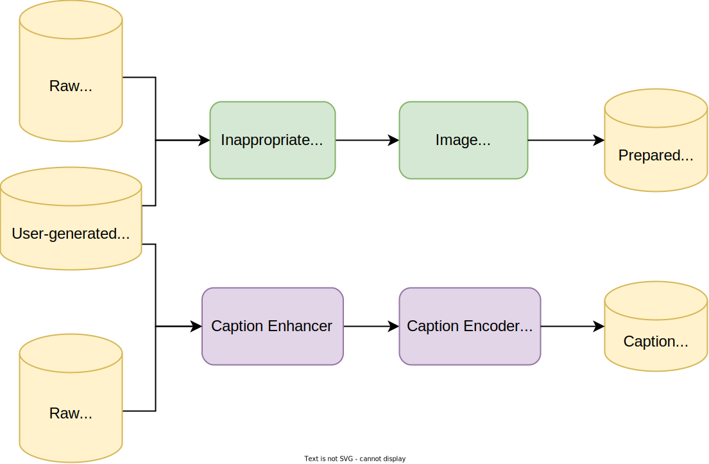

Figure 18: Data pipeline

### Training pipeline

The training pipeline trains a model using the latest training data collected by the data pipeline.

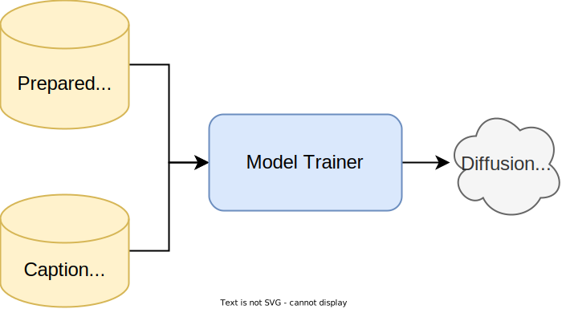

Figure 19: Training pipeline

The training pipeline ensures that the model adapts to recent user prompts and is trained on higher-quality generated images.

### Evaluation pipeline

The evaluation pipeline assesses newly trained models using predefined automated metrics to determine whether or not they meet performance and quality standards for deployment.

### Model optimization pipeline

The model optimization pipeline is responsible for enhancing the efficiency of the model. There are several methods to optimize models:

- **Model compression:** Use techniques such as quantization and pruning to reduce model size and generation time.
- **Model distillation:** Distill the model into a smaller one to reduce the model size and generation time.
- **Optimized algorithms:** Replace sampling with more efficient algorithms for faster generation.

Once the model optimization is completed, the optimized model can replace the existing model in production.

### Inference pipeline

The inference pipeline handles user requests and generates images based on text prompts. It comprises several components, each playing an important role in ensuring the system's quality and safety. In this section, we will examine the key components:

- Prompt auto-complete
- Prompt safety service
- Prompt enhancement
- Image generation
- Harm detection
- Super-resolution service
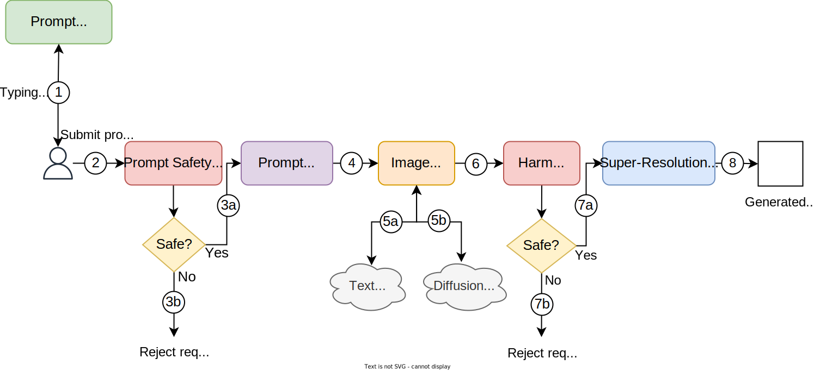

Figure 20: Inference pipeline

#### Prompt auto-complete service

The prompt auto-complete service uses a specialized model to suggest possible next words or phrases in real-time as the user types their prompt. This enhances user experience by providing potential completions.

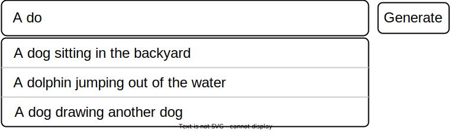

Figure 21: Suggested phrases by the auto-complete service

#### Prompt safety service

This service uses a text classification model to process user prompts and reject those that violate our usage policies, for example, requests for violence, hateful imagery, or nudity.

This service ensures that the system adheres to safety standards and prevents the generation of inappropriate images.

#### Prompt enhancement

The prompt enhancement component refines user prompts to improve their clarity, coherence, and details.

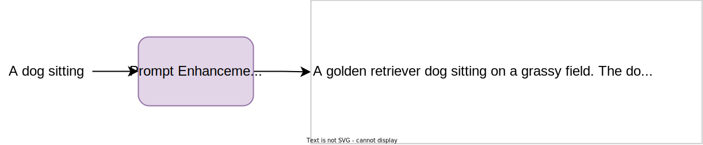

Figure 22: An example of prompt enhancement

This component is widely used in advanced image and video generation systems \[30\], as it effectively helps the model produce better outputs. It improves the quality of generated images by offering the model a more coherent and detailed prompt.

#### Image generation

The image generation component is the core of the inference pipeline. It interacts with the T5 text encoder to encode the enhanced text prompt into a sequence of tokens. These tokens are passed to the diffusion model to generate one or multiple images for each prompt.

#### Harm detection

This component ensures that generated images are safe for users. If an image still contains violence or nudity despite previous safeguards, the component flags it and blocks it from being shown.

#### Super-resolution service

The super-resolution service increases the resolution of the generated images. This step ensures that the final output is visually appealing and meets resolution requirements.

In practice, text-to-image systems often use at least one super-resolution model because diffusion models typically cannot generate high-resolution images directly. Instead, the diffusion model is trained at a lower resolution, and specialized super-resolution models enhance the resolution. For example, the base model might generate a 64x64 image, which a first super-resolution model increases to 256x256, followed by a second model that boosts it to 1024x1024. Google's \[31\] follows this approach to achieve the desired resolution.

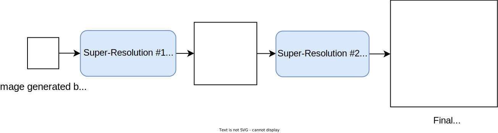

Figure 23: A cascade of super-resolution models

In summary, various pipelines work together to ensure that a text-to-image system is reliable, high-quality, and safe. The data pipeline provides the foundation for continuous improvement, while the training and model optimization pipelines enhance the model's performance. The inference pipeline ensures safe, efficient, and high-quality image generation. These pipelines create a system ready for real-world challenges.

## Other Talking Points

If time permits at the end of the interview, consider discussing these additional topics:

- Using consistency models for faster image generation \[26\].
- Employing RLHF for quality improvement \[32\].
- Extending the text-to-image model to support inpainting and outpainting applications \[33\].
- Personalizing the text-to-image model to a particular concept (Chapter 10).
- Details of different scheduling techniques \[34\].
- Details of DDPM and DDIM, including their theoretical foundations \[20\]\[18\].
- Supporting multiple aspect ratios and resolutions using techniques such as Patch n’ Pack \[35\].
- Details of developing a re-captioning model \[36\]\[37\]\[13\].
- Improving the diversity–fidelity trade-off with guidance \[19\].
- More advanced controls over the generated images using techniques like ControlNet \[38\].
- Controlling the style of the generated images \[39\].

## Summary

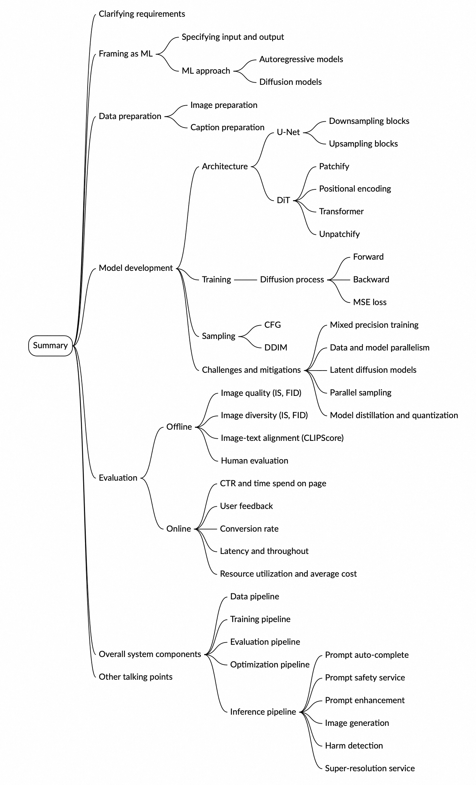

Image represents a mind map summarizing the key aspects of a generative AI system design interview. The central node is labeled 'Summary,' branching into five main categories represented by colored lines: orange ('Clarifying requirements' and 'Other talking points'), light-coral ('Model development' and 'Evaluation'), light-blue ('Specifying input and output'), purple ('Data preparation'), and teal ('Overall system components'). The 'Model development' branch further subdivides into 'Architecture' (detailing U-Net, Diffusion, downsampling/upsampling blocks, patchify/unpatchify, positional encoding, and transformer components), 'Training' (including diffusion process specifics like forward/backward passes and MSE loss), and 'Sampling' (covering CFG and DDIM methods). It also includes 'Challenges and mitigations' addressing mixed precision training, data and model parallelism, and latent diffusion models. The 'Evaluation' branch splits into 'Offline' (covering image quality, diversity, image-text alignment using CLIP scores, and human evaluation) and 'Online' (focusing on conversion rate, latency, throughput, and resource utilization). The 'Overall system components' branch details the data, training, evaluation, and optimization pipelines, as well as the inference pipeline, which includes prompt auto-complete, safety service, enhancement, image generation, harm detection, and super-resolution services. The 'Clarifying requirements' branch specifies framing the problem as an ML task and choosing between autoregressive and diffusion models. Finally, the 'Data preparation' branch focuses on image and caption preparation. The entire diagram visually depicts the interconnectedness of various stages, from initial requirements to final system deployment and evaluation metrics.

## Reference Material

\[1\] OpenAI’s DALL-E 3. [https://openai.com/index/dall-e-3/](https://openai.com/index/dall-e-3/).  
\[2\] Imagen 3. [https://arxiv.org/abs/2408.07009](https://arxiv.org/abs/2408.07009).  
\[3\] Adobe’s Firefly. [https://www.adobe.com/products/firefly.html](https://www.adobe.com/products/firefly.html).  
\[4\] Introducing ChatGPT. [https://openai.com/index/chatgpt/](https://openai.com/index/chatgpt/).  
\[5\] Zero-Shot Text-to-Image Generation. [https://arxiv.org/abs/2102.12092](https://arxiv.org/abs/2102.12092).  
\[6\] Muse: Text-To-Image Generation via Masked Generative Transformers. [https://arxiv.org/abs/2301.00704](https://arxiv.org/abs/2301.00704).  
\[7\] Generative Modeling by Estimating Gradients of the Data Distribution. [https://arxiv.org/abs/1907.05600](https://arxiv.org/abs/1907.05600).  
\[8\] Learning Transferable Visual Models From Natural Language Supervision. [https://arxiv.org/abs/2103.00020](https://arxiv.org/abs/2103.00020).  
\[9\] Exploring the Limits of Transfer Learning with a Unified Text-to-Text Transformer. [https://arxiv.org/abs/1910.10683](https://arxiv.org/abs/1910.10683).  
\[10\] Hierarchical Text-Conditional Image Generation with CLIP Latents. [https://arxiv.org/abs/2204.06125](https://arxiv.org/abs/2204.06125).  
\[11\] High-Resolution Image Synthesis with Latent Diffusion Models. [https://arxiv.org/abs/2112.10752](https://arxiv.org/abs/2112.10752).  
\[12\] On the De-duplication of LAION-2B. [https://arxiv.org/abs/2303.12733](https://arxiv.org/abs/2303.12733).  
\[13\] xGen-MM (BLIP-3): A Family of Open Large Multimodal Models. [https://www.arxiv.org/abs/2408.08872](https://www.arxiv.org/abs/2408.08872).  
\[14\] U-Net: Convolutional Networks for Biomedical Image Segmentation. [https://arxiv.org/abs/1505.04597](https://arxiv.org/abs/1505.04597).  
\[15\] Scalable Diffusion Models with Transformers. [https://arxiv.org/abs/2212.09748](https://arxiv.org/abs/2212.09748).  
\[16\] An Image is Worth 16x16 Words: Transformers for Image Recognition at Scale. [https://arxiv.org/abs/2010.11929](https://arxiv.org/abs/2010.11929).  
\[17\] Photorealistic Text-to-Image Diffusion Models with Deep Language Understanding. [https://arxiv.org/abs/2205.11487](https://arxiv.org/abs/2205.11487).  
\[18\] Denoising Diffusion Probabilistic Models. [https://arxiv.org/abs/2006.11239](https://arxiv.org/abs/2006.11239).  
\[19\] Classifier-Free Diffusion Guidance. [https://arxiv.org/abs/2207.12598](https://arxiv.org/abs/2207.12598).  
\[20\] Denoising Diffusion Implicit Models. [https://arxiv.org/abs/2010.02502](https://arxiv.org/abs/2010.02502).  
\[21\] Introduction to Diffusion Models. [https://lilianweng.github.io/posts/2021-07-11-diffusion-models/](https://lilianweng.github.io/posts/2021-07-11-diffusion-models/).  
\[22\] Mixed Precision Training. [https://arxiv.org/abs/1710.03740](https://arxiv.org/abs/1710.03740).  
\[23\] FSDP tutorial. [https://pytorch.org/tutorials/intermediate/FSDP\_tutorial.html](https://pytorch.org/tutorials/intermediate/FSDP_tutorial.html).  
\[24\] DeepSpeed. [https://github.com/microsoft/DeepSpeed](https://github.com/microsoft/DeepSpeed).  
\[25\] Parallel Sampling of Diffusion Models. [https://arxiv.org/abs/2305.16317](https://arxiv.org/abs/2305.16317).  
\[26\] Consistency Models. [https://arxiv.org/abs/2303.01469](https://arxiv.org/abs/2303.01469).  
\[27\] Inception score. [https://en.wikipedia.org/wiki/Inception\_score](https://en.wikipedia.org/wiki/Inception_score).  
\[28\] FID calculation. [https://en.wikipedia.org/wiki/Fr%C3%A9chet\_inception\_distance](https://en.wikipedia.org/wiki/Fr%C3%A9chet_inception_distance).  
\[29\] CLIPScore: A Reference-free Evaluation Metric for Image Captioning. [https://arxiv.org/abs/2104.08718](https://arxiv.org/abs/2104.08718).  
\[30\] Sora overview. [https://openai.com/index/video-generation-models-as-world-simulators/](https://openai.com/index/video-generation-models-as-world-simulators/).  
\[31\] Imagen Video: High Definition Video Generation with Diffusion Models. [https://arxiv.org/abs/2210.02303](https://arxiv.org/abs/2210.02303).  
\[32\] Finetune Stable Diffusion Models with DDPO via TRL. [https://huggingface.co/blog/trl-ddpo](https://huggingface.co/blog/trl-ddpo).  
\[33\] Kandinsky: an Improved Text-to-Image Synthesis with Image Prior and Latent Diffusion. [https://arxiv.org/abs/2310.03502](https://arxiv.org/abs/2310.03502).  
\[34\] On the Importance of Noise Scheduling for Diffusion Models. [https://arxiv.org/abs/2301.10972](https://arxiv.org/abs/2301.10972).  
\[35\] Patch n' Pack: NaViT, a Vision Transformer for any Aspect Ratio and Resolution. [https://arxiv.org/abs/2307.06304](https://arxiv.org/abs/2307.06304).  
\[36\] InternVL: Scaling up Vision Foundation Models and Aligning for Generic Visual-Linguistic Tasks. [https://arxiv.org/abs/2312.14238](https://arxiv.org/abs/2312.14238).  
\[37\] BLIP-2: Bootstrapping Language-Image Pre-training with Frozen Image Encoders and Large Language Models. [https://arxiv.org/abs/2301.12597](https://arxiv.org/abs/2301.12597).  
\[38\] Adding Conditional Control to Text-to-Image Diffusion Models. [https://arxiv.org/abs/2302.05543](https://arxiv.org/abs/2302.05543).  
\[39\] StyleDrop: Text-to-image generation in any style. [https://research.google/blog/styledrop-text-to-image-generation-in-any-style/](https://research.google/blog/styledrop-text-to-image-generation-in-any-style/).

[^1]: In practice, we provide the diffusion model with additional conditioning inputs, such as the timestep. This will be discussed further in the training section.

[^2]: For simplicity, we omitted the timestep input to the diffusion model. This will be covered in more detail in the training section.

[^3]: For simplicity, we include only the noisy image, xt, and the timestep, t, as the input. As mentioned earlier, conditioning signals can also be included as inputs.

[^4]: For simplicity, the embedding space is visualized in 2D. In reality, it is a d-dimensional space, where d represents the embedding size.