### Introduction

People You May Know (PYMK) is a list of users with whom you may want to connect based on things you have in common, such as a mutual friend, school, or workplace. Many social networks, such as Facebook, LinkedIn, and Twitter, utilize ML to power PYMK functionality.

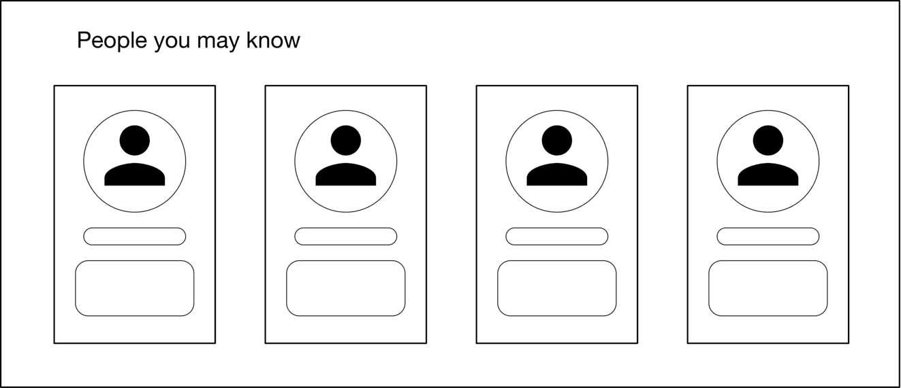

Figure 11.1: The PYMK feature

In this chapter, we will design a PYMK feature similar to LinkedIn’s. The system takes a user as input and recommends a list of potential connections as output.

### Clarifying Requirements

Here is a typical interaction between a candidate and an interviewer.

**Candidate:** Can I assume the motivation for building the PYMK feature is to help users discover potential connections and grow their network?  
**Interviewer:** Yes, that’s a good assumption.

**Candidate:** To recommend potential connections, a huge list of factors must be considered, such as location, educational background, work experience, existing connections, previous activities, etc. Should I focus on the most important factors, such as educational background, work experience, and the user’s social context?  
**Interviewer:** That sounds good.

**Candidate:** On LinkedIn, two people are friends if – and only if – each is a friend of the other. Is that correct?  
**Interviewer:** Yes, friendship is symmetrical. When someone sends a connection request to another user, the recipient needs to accept the request for the connection to be made.

**Candidate:** What’s the total number of users on the platform? How many of them are daily active users?  
**Interviewer:** We have nearly 1 billion users and 300 million daily active users.

**Candidate:** How many connections does an average user have?  
**Interviewer:** 1,000 connections.

**Candidate:** The social graph of most users is not very dynamic, meaning their connections don’t change significantly over a short period. Can I make this assumption when designing PYMK?  
**Interviewer:** That’s an excellent point. Yes, it’s a reasonable assumption.

Let's summarize the problem statement. We are asked to design a PYMK system similar to LinkedIn's. The system takes a user as input and recommends a ranked list of potential connections as output. The motivation for building the system is to enable users to discover new connections more easily and grow their networks. There are 1 billion total users on the platform, and a user has 1,000 connections on average.

### Frame the problem as an ML task

#### Defining the ML objective

A common ML objective in PYMK systems is to maximize the number of formed connections between users. This helps users to grow their networks quickly.

#### Specifying the system’s input and output

The input to the PYMK system is a user, and the outputs are a list of connections ranked by relevance to the user. This is shown in Figure 11.2.

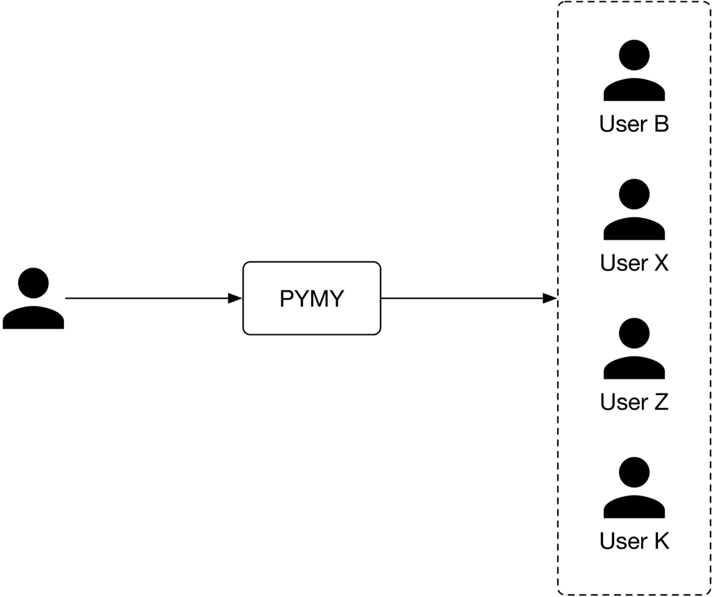

Figure 11.2: PYMK system’s input-output

#### Choosing the right ML category

Let's examine two approaches commonly used to build PYMK: pointwise Learning to Rank (LTR) and edge prediction.

##### Pointwise LTR

In this approach, we frame PYMK as a ranking problem and use a pointwise LTR to rank users. In pointwise LTR, as Figure 11.3 shows, we employ a binary classification model which takes two users as input and outputs the probability of the given pair forming a connection.

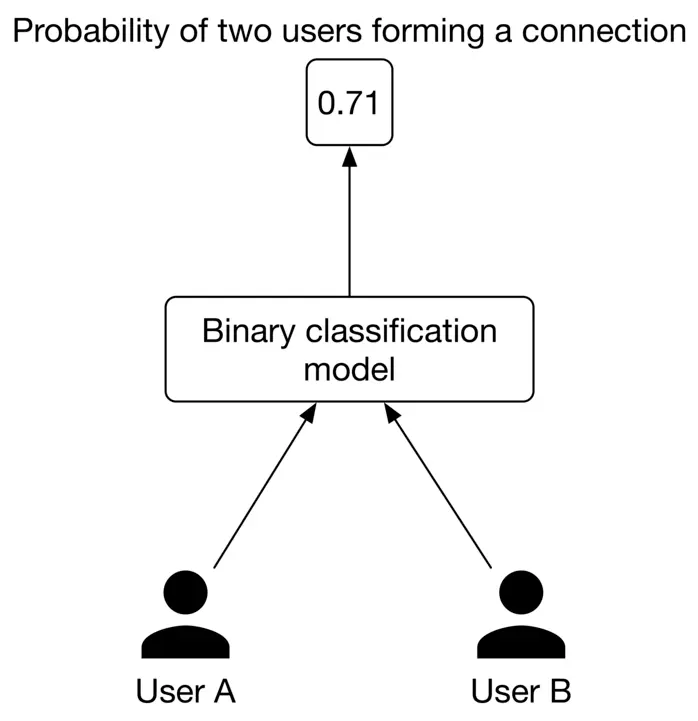

Figure 11.3: Binary classification with two input users

However, this approach has a major drawback; since the model's inputs are two distinct users, it doesn't consider the available social context. While this does simplify things, leaving out information about a user's connections might make predictions less accurate.

Let's analyze an example to understand how social context can provide very important insights. Imagine we want to predict whether or not $\langle$ user A, user B $\rangle$ is a potential connection.

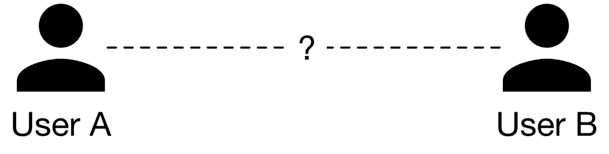

Figure 11.4: Can user A and user B form a potential connection?

By looking at their one-hop neighborhood (connections of user A or user B), we gain more information to determine if $\langle$ user $A$, user $B\rangle$ is a potential connection. As shown in Figure 11.5, consider two different scenarios.

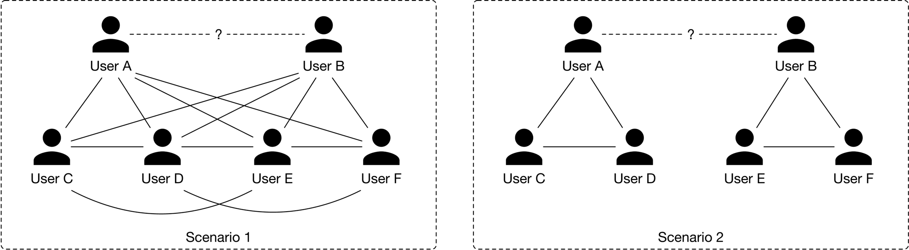

Figure 11.5: Two different scenarios of one-hop neighborhoods

In scenario 1, user A and user B each have four mutual connections, and there are mutual connections between users $\mathrm{C}, \mathrm{D}, \mathrm{E}$, and $\mathrm{F}$.

In scenario 2, user A and user B each have two friends, and there's no connection between user A and user B's connections.

By looking at their one-hop neighborhood, you might expect that $\langle$ user $A$, user $B\rangle$ is more likely to form a connection in scenario 1 rather than in scenario 2. In practice, we can even leverage two-hop or three-hop neighborhoods to capture more useful information from the social context.

Before discussing the second approach, let's understand how graphs store structural data, such as the social context, and which machine learning tasks can be performed on graphs.

In general, a graph represents relations (edges) between a collection of entities (nodes). The entire social context can be represented by a graph, where each node represents a user, and an edge between two nodes indicates a formed connection between two users. Figure 11.6 shows a simple graph with four nodes and three edges.

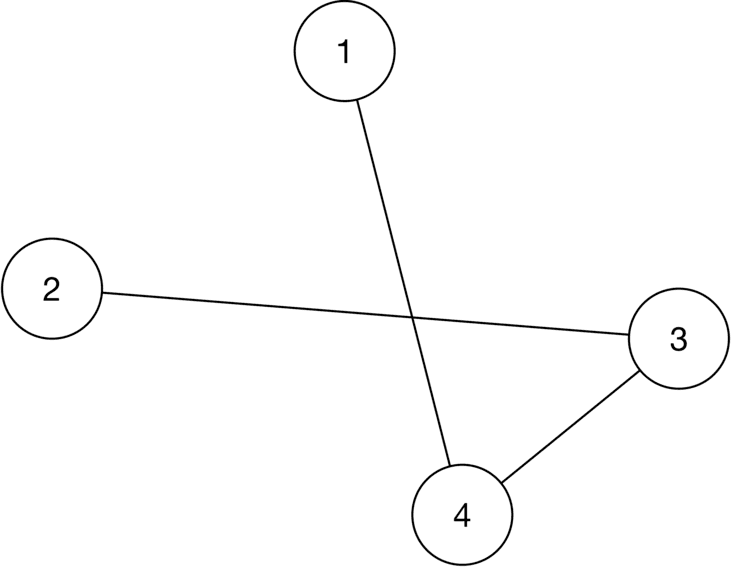

Figure 11.6: A simple graph

There are three general types of prediction tasks that can be performed on structured data represented by graphs:

- **Graph-level prediction.** For example, given a chemical compound as a graph, we predict whether the chemical compound is an enzyme or not.
- **Node-level prediction.** For example, given a social network graph, we predict if a specific user (node) is a spammer.
- **Edge-level prediction.** Predict if an edge is present between two nodes. For example, given a social network graph, we predict if two users are likely to connect.

Let's look at the edge prediction approach for building the PYMK system.

##### Edge prediction

In this approach, we supplement the model with graph information. This enables the model to rely on the additional knowledge extracted from the social graph, to predict whether an edge exists between two nodes.

More formally, we use a model that takes the entire social graph as input, and predicts the probability of an edge existing between two specific nodes. To rank potential connections for user A, we compute the edge probabilities between user A and other users, and use these probabilities as the ranking criteria.

In addition to the typical features that the model utilizes, the model also relies on additional knowledge extracted from the social graph to predict whether an edge exists between two nodes.

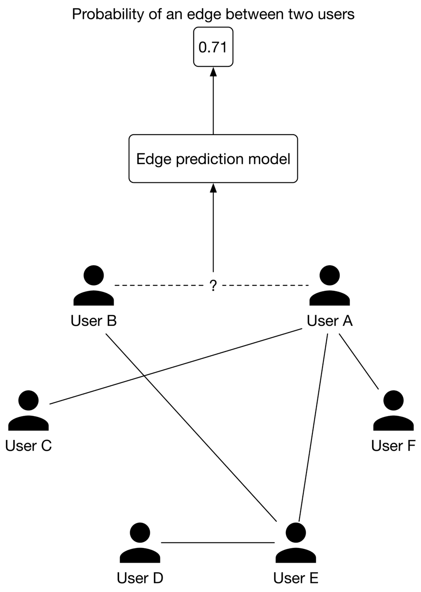

Figure 11.7: Binary classification with graph input

### Data Preparation

#### Data engineering

In this section, we discuss the raw data available:

- Users
- Connections
- Interactions

##### Users

In addition to users’ demographic data, we have information about their educational and work backgrounds, skills, etc. Table 11.1 shows an example of a user’s educational background data. There might be similar tables to store work experiences, skills, etc.

| **User ID** | **School** | **Degree** | **Major** | **Start date** | **End date** |
| --- | --- | --- | --- | --- | --- |
| 11 | Waterloo | M.Sc | Computer Science | August 2015 | May 2017 |
| 11 | Harvard | M.Sc | Physics | May 2004 | August 2006 |
| 11 | UCLA | Bachelors | Electrical Engineering | Sep 2022 | \- |

Table 11.1: Users’ educational background data

One challenge with this type of raw data is that a specific attribute can be represented in different forms. For example, "computer science" and "CS" have the same meaning, but the text differs. So, it's important to standardize the raw data during the data engineering step so we don't treat different forms of a single attribute differently. There are various approaches to standardizing the raw data. For example:

- Force users to select attributes from a predefined list.
- Use heuristics to group different representations of an attribute.
- Use ML-based methods such as clustering \[1\] or language models to group similar attributes.

##### Connections

A simplified example of connection data is shown in Table 11.2. Each row represents a connection between two users and when the connection was formed.

| User ID 1 | User ID 2 | Timestamp when the connection was formed |
| --- | --- | --- |
| 28 | 3 | 1658451341 |
| 7 | 39 | 1659281720 |
| 11 | 25 | 1659312942 |

Table 11.2: Connection data

##### Interactions

There are different types of interactions: a user sends a connection request, accepts a request, follows another user, searches for an entity, views a profile, likes or reacts to a post, etc. Note, in practice, we may store interaction data in different databases, but for simplicity, here, we include everything in a single table.

| User ID | Interaction type | Interaction value | Timestamp |
| --- | --- | --- | --- |
| 11 | Connection request | user\_id\_8 | 1658450539 |
| 8 | Accepted connection | user\_id\_11 | 1658451341 |
| 11 | Comment | \[user\_id\_4, Very insightful\] | 1658451365 |
| 4 | Search | "Scott Belsky" | 1658435948 |
| 11 | Profile view | user\_id\_21 | 1658451849 |

Table 11.3: Interaction data

#### Feature engineering

To determine potential connections for a user (e.g., user A), the model needs to utilize user A's information, such as age, gender, etc. In addition, the affinities between user $A$ and other users are useful. In this section, we discuss some of the most important features.

##### User features

###### Demographics: age, gender, city, country, etc.

Demographic data helps determine if two users are likely to form a connection. Users tend to connect with others who have similar demographics.

It's common to have missing values in demographic data. To learn more about how to handle missing values, refer to the "Introduction and Overview" chapter.

###### The numbers of connections, followers, following, and pending requests

This information is important as users are more likely to connect with someone with lots of followers or connections, compared to a user with few connections.

###### Account’s age

Accounts created very recently are less reliable than those that have existed for longer. For example, if an account was created yesterday, it's more likely to be a spam account. So, it may not be a good idea to recommend it to users.

###### The number of received reactions

These are numerical values representing the total number of reactions received, such as likes, shares, and comments over a certain period, like one week. Users tend to connect with more active users on the platform, who receive more interactions from other users.

##### User-user affinities

The affinity between two users is a good signal to predict if they will connect. Let’s look at some important features which capture user-user affinities.

###### Education and work affinity

- **Schools in common:** Users tend to connect with others who attended the same school.
- **Contemporaries at school:** Overlapping years at school increases the likelihood of two users connecting. For example, users might want to connect with someone who attended school $\mathrm{X}$ the same time they did.
- **Same major:** A binary feature representing whether two users had the same major in school.
- **Number of companies in common:** Users may connect with people who have worked at the same companies.
- **Same industry:** A binary feature representing whether the two users work in the same industry.

###### Social affinity

- **Profile visits:** The number of times a user looks at the profile of another user.
- **Number of connections in common, aka mutual connections:** If two users have many common connections, they are more likely to connect. This feature is one of the most important predictive features \[2\].
- **Time discounted mutual connections:** This feature weighs mutual connections by how long they have existed. Let's go through an example to understand the reasoning behind this feature.

Imagine we want to determine whether user B is a potential connection for user A. Consider two scenarios: in scenario 1, user A's connections were formed very recently, whereas in scenario 2, the connections were formed a long time ago. This is shown in Figure 11.8.

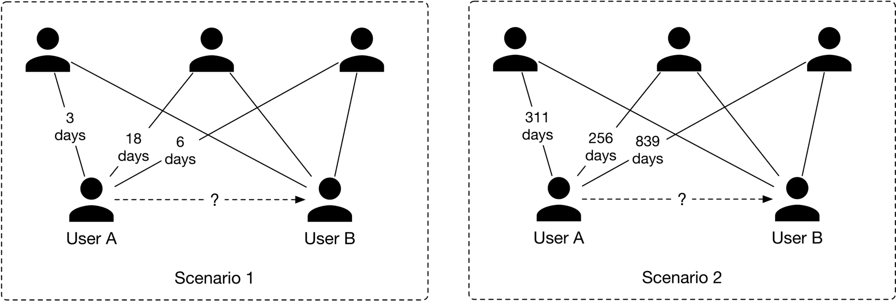

Figure 11.8: Comparing recent connections to old connections

In scenario 1, user A's network has grown recently, meaning it's more likely user A will connect with user B. Meanwhile, in scenario 2, the chances are that user A is aware of user $B$ but has decided not to connect.

### Model Development

#### Model selection

Earlier, we formulated the PYMK problem as an edge prediction task, where a model takes the social graph as input and predicts the probability of an edge existing between two users. To handle the edge prediction task, we choose a model that can process graph inputs. Graph neural networks (GNNs) are designed to operate on graph data. Let's take a closer look.

#### GNNs

GNNs are neural networks that can be directly applied to graphs. They provide an easy way to perform graph-level, node-level, and edge-level prediction tasks.

As shown in Figure 11.9, GNN takes a graph as input. This input graph contains attributes associated with nodes and edges. For example, the nodes can store information such as age, gender, etc., while the edges can store user-user characteristics, such as the number of common schools and workplaces, connection age, etc. Given the input graph and associated attributes, the GNN produces node embeddings for each node.

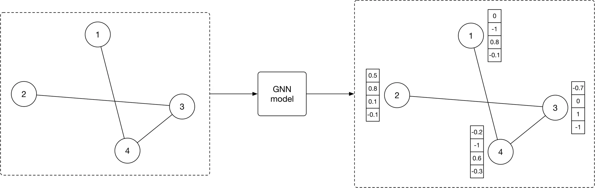

Figure 11.9: GNN model produces node embeddings for each graph node

Once the node embeddings are produced, they are used to predict how likely two nodes will form a connection using a similarity measure, such as dot product. For example, as shown in Figure 11.10, we compute the dot product between the embeddings of node 2 and node 4 to predict whether there is an edge between them.

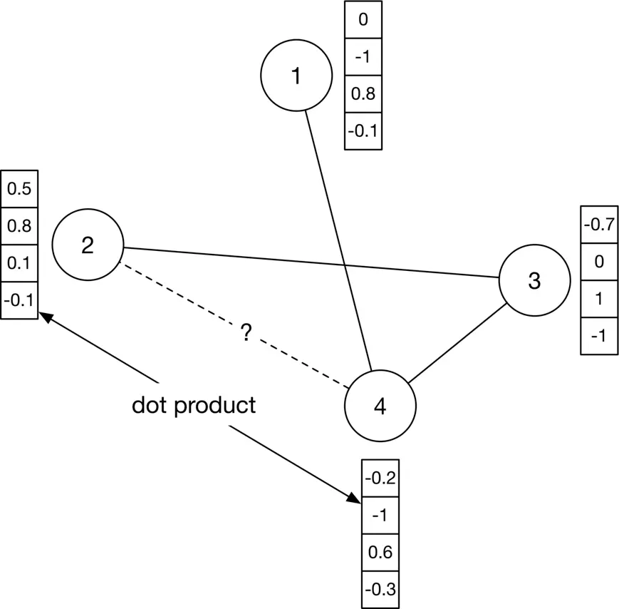

Figure 11.10: Predict how likely there is an edge between nodes 2 and 4

Many GNN-based architectures, such as GCN \[3\], GraphSAGE \[4\], GAT \[5\], and GIT \[6\], have been developed in recent years. These variants have different architectures and different levels of complexity. To determine which architecture works best, extensive experimentation is required. To gain a deeper understanding of GNN-based architectures, refer to \[7\]

#### Model training

To train a GNN model, we provide the model with a snapshot of the social graph at time $t$. The model predicts the connections which will form at time $t+1$. Let's examine how to construct the training data.

##### Constructing the dataset

To construct the dataset, we do the following:

1. Create a snapshot of the graph at time $t$
2. Compute initial node features and edge features of the graph
3. Create labels

**1.** **Create a snapshot of the graph at time $t$**. The first step in constructing training data is to create input for the model. Since a GNN model expects a social graph as input, we create a snapshot of the social graph at time $t$ using the available raw data. Figure $11.11$ shows an example of the graph at time $t$.

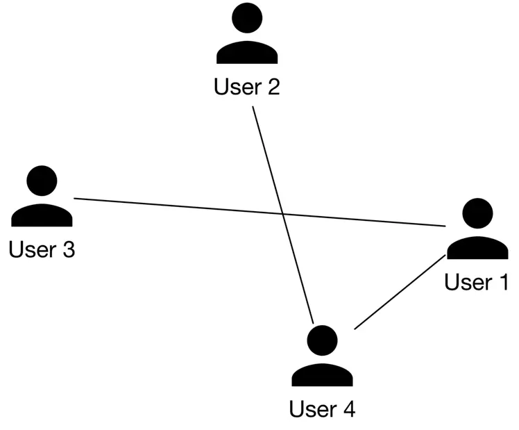

Figure 11.11: A snapshot of the social graph at time $t$

**2\. Compute initial node features and edge features of the graph.** As shown in Figure 11.12, we extract the user's features, such as age, gender, account age, number of connections, etc. These are used as the nodes' initial feature vectors.

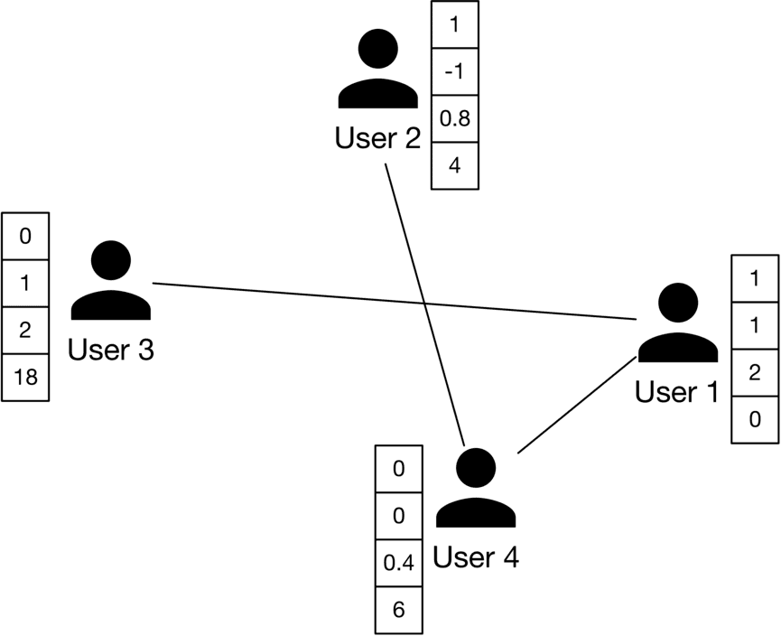

Figure 11.12: Initial node features

Similarly, we extract user-user affinity features and employ them as the initial feature vectors of the edges. As shown in Figure $11.13$, there is an edge between user 2 and user 4. $E_{2,4}$ represents the initial feature vector which captures information such as the number of mutual connections, profile visits, overlapping time at schools in common, etc.

Figure 11.13: Initial edge features

**3\. Create labels**  
In this step, we create labels that the model is expected to predict. We use the graph snapshot at time $t+1$ to determine positive or negative labels. Let's take a look at a concrete example.

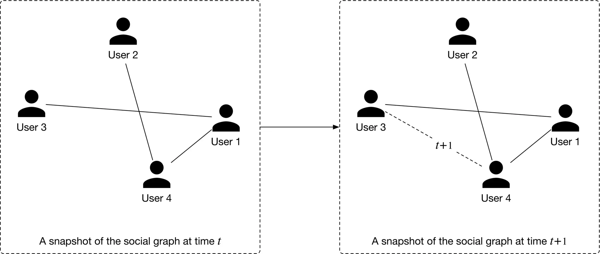

Figure 11.14: Newly formed edges from time $t$ to $t + 1$

As shown in Figure 11.14, positive and negative labels are created depending on whether a new edge forms at $t+1$. In particular, we label a pair of nodes as positive when they connect at $t+1$. Otherwise, they are labeled as negative.

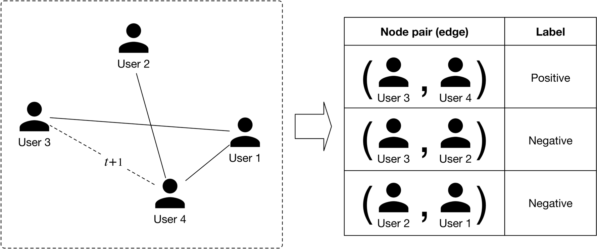

Figure 11.15: Creating positive and negative labels

##### Choosing the loss function

Once the input graph and labels are created, we are ready to train the GNN model. A detailed explanation of how GNN training works and which loss functions to employ is beyond the scope of this book. To learn more about these, see \[7\].

### Evaluation

#### Offline metrics

During the offline evaluation, we evaluate the performance of the GNN model and the PYMK system.

##### GNN model

Since the GNN model predicts the presence of edges, we can think of it as a binary classification model. ROC-AUC metric is used to measure the performance of the model.

##### PYMK system

We extensively discuss choosing the right offline metrics for ranking and recommendation systems in previous chapters, so don't go into detail here. In our system, a user will either connect with a recommended connection or discard it. Due to this binary nature (connect or not), $\mathrm{mAP}$ is a good choice.

#### Online metrics

In practice, companies track lots of online metrics to measure the impact of PYMK systems. Let's explore two of the most important metrics:

- The total number of connection requests sent in the last $X$ days
- The total number of connection requests accepted in the last $X$ days

**The total number of connection requests sent in the last $X$ days.** This metric helps us understand if the model increases or decreases the number of connection requests. For example, if a model leads to a $5 \%$ increase in the total number of sent connection requests, we can assume the model has a positive impact on the business objective.

However, this metric has a major drawback. A new connection forms between two users only when the recipient accepts a request to connect. For example, a user may send 1,000 connection requests, but recipients accept only a small percentage. This metric might not correctly reflect the actual growth of the users' network. Now, let's address this drawback with the next metric.

**The total number of connection requests accepted in the last $X$ days.** As a new connection forms only when the recipient accepts the sender's request, this metric accurately reflects the real growth of the users' network.

### Serving

At serving time, the PYMK system efficiently recommends a list of potential connections to a given user. In this section, we explain why speed optimization is needed and introduce some techniques to make PYMK efficient. Then, we propose a design in which different components work together to serve requests.

#### Efficiency

As discussed in the requirement gathering section, the total number of users on the platform is 1 billion, which indicates we need to sort through 1 billion embeddings to find potential connections for a single user. To make things even more challenging, the algorithm needs to be run for each user. Unsurprisingly, this is impractical at our scale. To mitigate the issue, two common techniques are used: 1) utilizing friends of friends (FoF) and 2) pre-compute PYMK.

##### Utilizing FoF

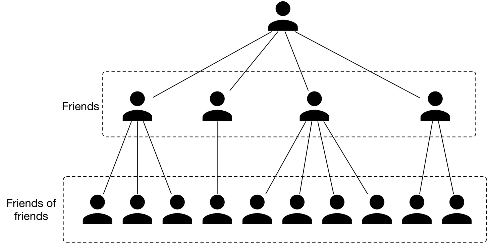

Figure 11.16: FoF of a user

According to a Meta study \[2\], 92% of new friendships are formed via FoF. This technique uses a user's FoF to narrow down the search space.

As previously mentioned, a user has 1,000 friends on average. That means a user has 1 million $(1000 \times 1000)$ FoF, on average. This reduces the search space from 1 billion to 1 million.

##### Pre-compute PYMK

Let’s take a step back and consider adopting online or batch predictions.

**Online prediction** In PYMK, online prediction refers to generating potential connections in real-time when a user loads the homepage. In this approach, we don't generate recommendations for inactive users. Since recommendations are calculated "on the fly", if computing the recommendations takes a long time, it creates a poor user experience.

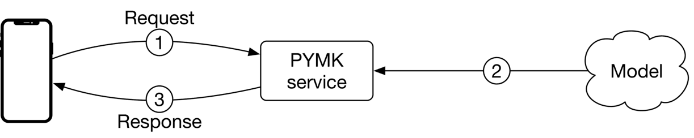

Figure 11.17: Online prediction in PYMK

**Batch prediction** Batch prediction means the system pre-computes potential connections for all users and stores them in a database. When a user loads the homepage, we fetch pre-computed recommendations directly, so from the end user's standpoint, the recommendation is instantaneous. The downside of batch prediction is that we may end up with unnecessary computations. Imagine $20 \%$ of users log in daily. If we generate recommendations for every user daily, then the computing power used to generate $80 \%$ of recommendations will be wasted.

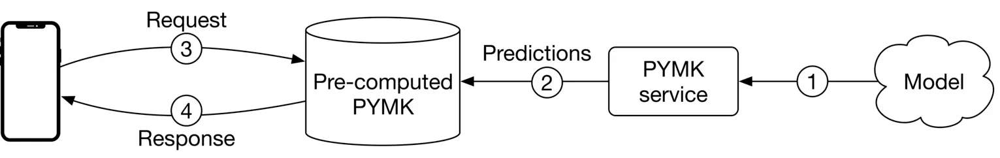

Figure 11.18: Batch prediction in PYMK

**Which option do we choose: online or batch?** We recommend batch prediction for two reasons. First, based on the requirements gathered, there are 300 million daily active users. Computing PYMK for all 300 million users on the fly may be too slow for a quality user experience.

Second, as the social graph in PYMK does not evolve quickly, the pre-computed recommendations remain relevant for an extended period. For example, we can keep PYMK recommendations for seven days and then re-compute them. The time window can be shortened (for instance, by one day) for newer users because their networks tend to grow faster.

In a social network, a user may not want to see the same set of recommended connections repeatedly. To support this, we can pre-compute more connections than needed and only display those a user hasn't seen before.

#### ML system design

Figure $11.19$ shows the PYMK ML system design. The design comprises two pipelines:

- PYMK generation pipeline
- Prediction pipeline

Let's inspect each.

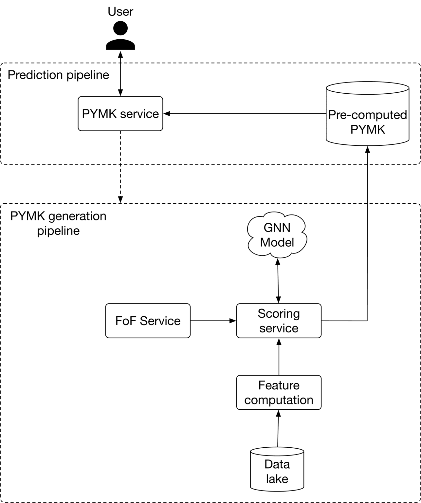

Figure 11.19: PYMK ML system design

##### PYMK generation pipeline

This pipeline is responsible for generating PYMK for all users and storing the results in a database. Let's take a closer look at this pipeline.

First, for a specific user, the FoF service narrows down the connections into a subset of candidate connections (2-hop neighbors). This is shown in Figure 11.20.

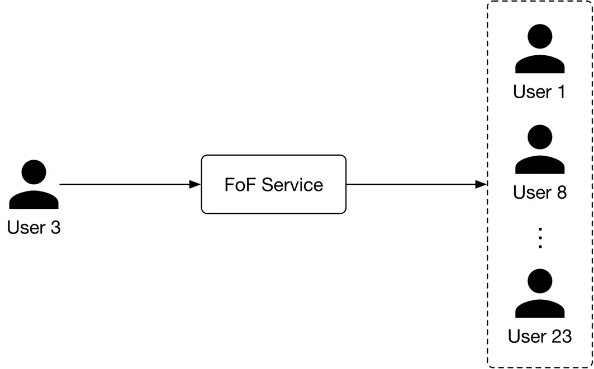

Figure 11.20: FoF service input-output

Next, the scoring service takes the candidate connections produced by the FoF service, scores each of them using the GNN model, then generates a ranked list of PYMK for the user. The PYMK is stored in a database. When a user request is made, we can simply pull their individual PYMK list directly from the database. This flow is shown in Figure 11.21.

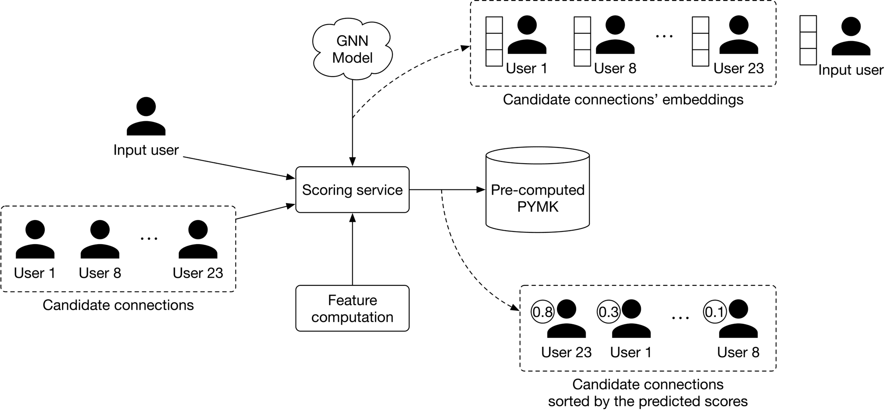

Figure 11.21: Scoring service input-output

##### Prediction pipeline

When a request arrives, the PYMK service first looks at the pre-computed PYMKs to see if recommendations exist. If they do, recommendations are fetched directly. If not, it sends a one-time request to the PYMK generation pipeline.

Note that what we have proposed is a simplified system. If you asked during an interview to optimize it, here are a few potential talking points:

- Pre-computing PYMK only for active users.
- Using a lightweight ranker to reduce the number of generated candidates into a smaller set before the scoring service assigns them a score.
- Using a re-ranking service to add diversity to the final PYMK list.

### Other Talking Points

If there's time left at the end of the interview, here are some additional talking points:

- Personalized random walk \[8\] is another method often used to make recommendations. Since it's efficient, it is a helpful way to establish a baseline.
- Bias issue. Frequent users tend to have greater representation in the training data than occasional users. The model can become biased towards some groups and against others due to uneven representation in the training data. For example, in the PYMK list, frequent users might be recommended to other users at a higher rate. Subsequently, these users can make even more connections, making them even more represented in the training data \[9\].
- When a user ignores recommended connections repeatedly, the question arises of how to take them into account in future re-ranks. Ideally, ignored recommendations should have a lower ranking \[9\].
- A user may not send a connection request immediately when we recommend it to them. It may take a few days or weeks. So, when should we label a recommended connection as negative? In general, how would we deal with delayed feedback in recommendation systems \[10\]?

### References

1. Clustering in ML. [https://developers.google.com/machine-learning/clustering/overview](https://developers.google.com/machine-learning/clustering/overview).
2. PYMK on Facebook. [https://youtu.be/Xpx5RYNTQvg?t=1823](https://youtu.be/Xpx5RYNTQvg?t=1823).
3. Graph convolutional neural networks. [http://tkipf.github.io/graph-convolutional-networks/](http://tkipf.github.io/graph-convolutional-networks/).
4. GraphSage paper. [https://cs.stanford.edu/people/jure/pubs/graphsage-nips17.pdf](https://cs.stanford.edu/people/jure/pubs/graphsage-nips17.pdf).
5. Graph attention networks. [https://arxiv.org/pdf/1710.10903.pdf](https://arxiv.org/pdf/1710.10903.pdf).
6. Graph isomorphism network. [https://arxiv.org/pdf/1810.00826.pdf](https://arxiv.org/pdf/1810.00826.pdf).
7. Graph neural networks. [https://distill.pub/2021/gnn-intro/](https://distill.pub/2021/gnn-intro/).
8. Personalized random walk. [https://www.youtube.com/watch?v=HbzQzUaJ\_9I](https://www.youtube.com/watch?v=HbzQzUaJ_9I).
9. LinkedIn’s PYMK system. [https://engineering.linkedin.com/blog/2021/optimizing-pymk-for-equity-in-network-creation](https://engineering.linkedin.com/blog/2021/optimizing-pymk-for-equity-in-network-creation).
10. Addressing delayed feedback. [https://arxiv.org/pdf/1907.06558.pdf](https://arxiv.org/pdf/1907.06558.pdf).