Google Street View \[1\] is a technology in Google Maps that provides street-level interactive panoramas of many public road networks around the world. In 2008, Google created a system that automatically blurs human faces and license plates to protect user privacy. In this chapter, we design a blurring system similar to Google Street View.

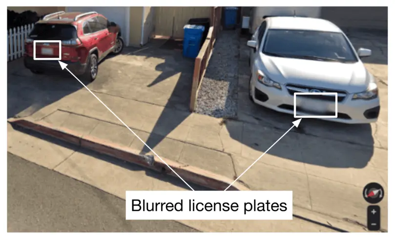

Figure 3.1: A Street View image with blurred license plates

### Clarifying Requirements

Here's a typical conversation between a candidate and the interviewer.

**Candidate:** Is it fair to say the business objective of the system is to protect user privacy?  
**Interviewer:** Yes.

**Candidate:** We want to design a system that detects all human faces and license plates in Street View images and blurs them before displaying them to users. Is that correct? Can I assume users can report images that are not correctly blurred?  
**Interviewer:** Yes, those are fair assumptions.

**Candidate:** Do we have an annotated dataset for this task?  
**Interviewer:** Let's assume we have sampled 1 million images. Human faces and license plates are manually annotated in those images.

**Candidate:** The dataset may not contain faces from certain racial profiles, which may cause a bias towards certain human attributes such as race, age, gender, etc. Is that a fair assumption?  
**Interviewer:** Great point. For simplicity, let's not focus on fairness and bias today.

**Candidate:** My understanding is that latency is not a big concern, as the system can detect objects and blur them offline. Is that correct?  
**Interviewer:** Yes. We can display existing images to users while new ones are being processed offline.

Let's summarize the problem statement. We want to design a Street View blurring system that automatically blurs license plates and human faces. We are given a training dataset of 1 million images with annotated human faces and license plates. The business objective of the system is to protect user privacy.

### Frame the Problem as an ML Task

In this section, we frame the problem as an ML task.

#### Defining the ML objective

The business objective of this system is to protect user privacy by blurring visible license plates and human faces in Street View images. But protecting user privacy is not an ML objective, so we need to translate it into an ML objective that an ML system can solve. One possible ML objective is to accurately detect objects of interest in an image. If an ML system can detect those objects accurately, then we can blur the objects before displaying the images to users.

Throughout this chapter, we use "objects" instead of "human faces and license plates" for conciseness.

#### Specifying the system's input and output

The input of an object detection model is an image with zero or multiple objects at different locations within it. The model detects those objects and outputs their locations. Figure 3.2 shows an object detection system, along with its input and output.

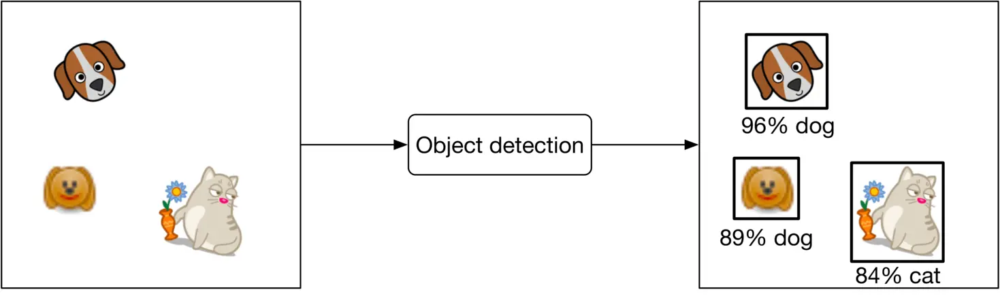

Figure 3.2: Object detection system’s input-output

#### Choosing the right ML category

In general, an object detection system has two responsibilities:

- Predicting the location of each object in the image
- Predicting the class of each bounding box (e.g., dog, cat, etc.)

The first task is a regression problem since the location can be represented by $(x, y)$ coordinates, which are numeric values. The second task can be framed as a multi-class classification problem.

Traditionally, object detection architectures are divided into one-stage and two-stage networks. Recently, Transformer-based architectures such as DETR \[2\] have shown promising results, but in this chapter, we mainly explore two-stage and one-stage architectures.

#### Two-stage networks

As the name implies, two separate models are used in two-stage networks:

1. **Region proposal network (RPN):** scans an image and proposes candidate regions that are likely to be objects.
2. **Classifier:** processes each proposed region and classifies it into an object class.

Figure 3.3 shows these two stages.

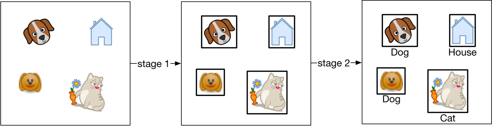

Figure 3.3: Two-stage network

Commonly used two-stage networks include: R-CNN \[3\], Fast R-CNN \[4\], and FasterRCNN \[5\].

#### One-stage networks

In these networks, both stages are combined. Using a single network, bounding boxes and object classes are generated simultaneously, without explicit detection of region proposals. Figure 3.4 shows a one-stage network.

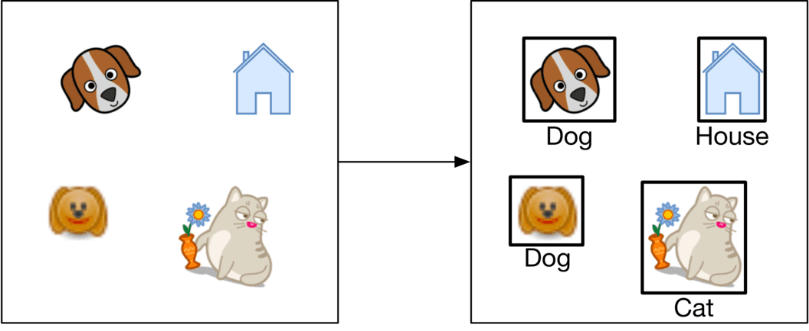

Figure 3.4: One-stage network

Commonly used one-stage networks include: YOLO \[6\] and SSD \[7\] architectures.

###### One-stage vs. two-stage

Two-stage networks comprise two components that run sequentially, so they are usually slower, but more accurate.

In our case, the dataset contains 1 million images, which is not huge by modern standards. This indicates that using a two-stage network doesn't increase the training cost excessively. So, for this exercise, we start with a two-stage network. When training data increases or predictions need to be made faster, we can switch to one-stage networks.

### Data Preparation

#### Data engineering

In the Introduction chapter, we discussed data engineering fundamentals. Additionally, it's usually a good idea to discuss the specific data available for the task at hand. For this problem, we have the following data available:

- Annotated dataset
- Street View images

Let's discuss each in more detail.

##### Annotated dataset

Based on the requirements, we have 1 million annotated images. Each image has a list of bounding boxes and associated object classes. Table 3.1 shows data points from the dataset:

| **Image path** | **Objects** | **Bounding boxes** |
| --- | --- | --- |
| dataset/image1.jpg | human face  human face  license plate | \[10,10,25,50\]  \[120,180,40,70\]  \[80,95,35,10\] |
| dataset/image2.jpg | human face | \[170,190,30,80\] |
| dataset/image3.jpg | license plate  human face | \[25,30,210,220\]  \[30,40,30,60\] |

Table 3.1: A few data points from the annotated dataset

Each bounding box is a list of 4 numbers: top left X and Y coordinates, followed by the width and height of the object.

##### Street View images

These are the Street View images collected by the data sourcing team. The ML system processes these images to detect human faces and license plates. Table 3.2 shows the metadata of the images.

| **Image path** | **Location (lat, lng)** | **Pitch, Yaw, Roll** | **Timestamp** |
| --- | --- | --- | --- |
| tmp/image1.jpg | (37.432567, -122.143993) | (0,10,20) | 1646276421 |
| tmp/image2.jpg | (37.387843, -122.091086) | (0,10,-10) | 1646276539 |
| tmp/image3.jpg | (37.542081, -121.997640) | (10,-20,45) | 1646276752 |

Table 3.2: Metadata of Street View images

#### Feature engineering

During feature engineering, we first apply standard, such as resizing and normalization. After that, we increase the size of the dataset by using a data augmentation technique. Let's take a closer look at this.

##### Data augmentation

A technique called data augmentation involves adding slightly modified copies of original data, or creating new data artificially from the original. As the dataset size increases, the model is able to learn more complex patterns. This technique is especially useful when the dataset is imbalanced, as it increases the number of data points in minority classes.

A special type of data augmentation is image augmentation. Among the commonly used augmentation techniques are:

- Random crop
- Random saturation
- Vertical or horizontal flip
- Rotation and/or translation
- Affine transformations
- Changing brightness, saturation, or contrast

Figure 3.5 shows an image with various data augmentation techniques applied to it.

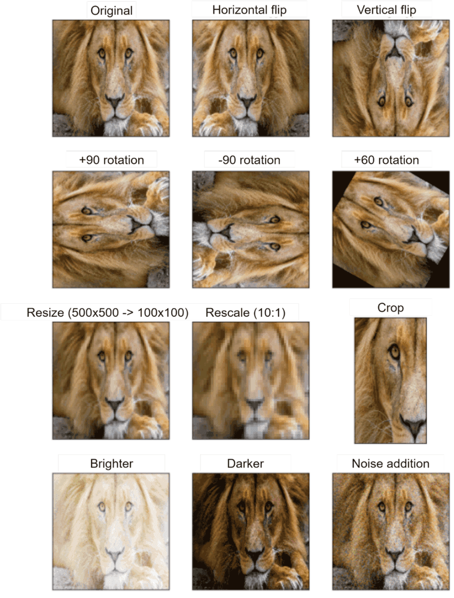

Figure 3.5: Augmented images (source \[8\])

It is important to note that with certain types of augmentations, the ground truth bounding boxes also need to be transformed. For example, when rotating or flipping the original image, the ground truth bounding boxes must also be transformed.

Data augmentation is used in offline or online forms.

- **Offline:** Augment images before training
- **Online:** Augment images on the fly during training

**Online vs. offline:** In offline data augmentation, training is faster since no additional augmentation is needed. However, it requires additional storage to store all the augmented images. While online data augmentation slows down training, it does not consume additional storage.

The choice between online and offline data augmentation depends upon the storage and computing power constraints. What is more important in an interview is that you talk about different options and discuss trade-offs. In our case, we perform offline data augmentation.

Figure 3.6 shows the dataset preparation flow. With preprocessing, images are resized, scaled, and normalized. With image augmentation, the number of images is increased. Let's say the number increases from 1 million to 10 million.

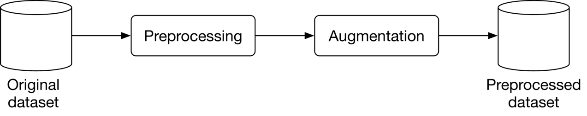

Figure 3.6: Dataset preparation workflow

### Model Development

#### Model selection

As mentioned in the "Frame the Problem as an ML Task" section, we opt for two-stage networks. Figure 3.7 shows a typical two-stage architecture.

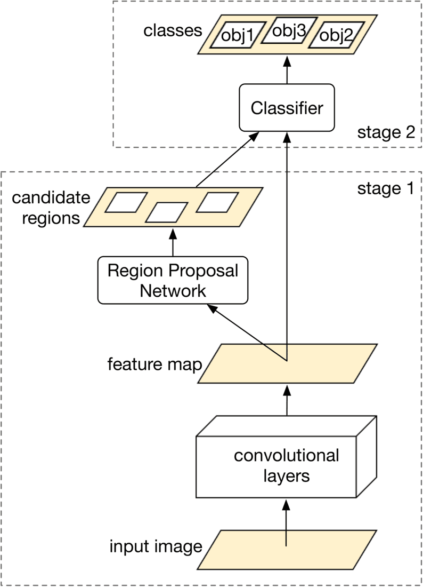

Figure 3.7: Two-stage object detection network

Let's examine each component.

##### Convolutional layers

Convolutional layers \[9\] process the input image and output a feature map.

##### Region Proposal Network (RPN)

RPN proposes candidate regions that may contain objects. It uses neural networks as its architecture and takes the feature map produced by convolutional layers as input and outputs candidate regions in the image.

##### Classifier

The classifier determines the object class of each candidate region. It takes the feature map and the proposed candidate regions as input, and assigns an object class to each region. This classifier is usually based on neural networks.

In ML system design interviews, you are generally not expected to discuss the architecture of these neural networks.

#### Model training

The process of training a neural network usually involves three steps: forward propagation, loss calculation, and backward propagation. Readers are expected to be familiar with these steps, but for more information, see \[10\]. In this section, we discuss the loss functions commonly used to detect objects.

An object detection model is expected to perform two tasks well. First, the bounding boxes of the objects predicted should have a high overlap with the ground truth bounding boxes. This is a regression task. Second, the predicted probabilities for each object class should be accurate. This is a classification task. Let's define a loss function for each.

**Regression loss:** This loss measures how aligned the predicted bounding boxes are with the ground truth bounding boxes. We use standard regression loss functions, such as Mean Squared Error (MSE) \[11\], and denote it by $L_{r e g}$:

$$
L_{r e g}=\frac{1}{M} \sum_{i=1}^M\left[\left(x_i-\hat{x}_i\right)^2+\left(y_i-\hat{y}_i\right)^2+\left(w_i-\hat{w}_i\right)^2+\left(h_i-\hat{h}_i\right)^2\right]
$$

Where:

- $M$: total number of predictions
- $x_i$: ground truth top left $x$ coordinate
- $\hat{x}_i$: predicted top left $x$ coordinate
- $y_i$: ground truth top left $y$ coordinate
- $\hat{y}_i$: predicted top left $y$ coordinate
- $w_i$: ground truth width
- $\hat{w}_i:$ predicted width
- $h_i$: ground truth height
- $\hat{h}_i$: predicted height

**Classification loss:** This measures how accurate the predicted probabilities are for each detected object. Here, we use a standard classification loss, such as log loss (crossentropy) \[12\] and denote it by $L_{c l s}$:

$$
L_{c l s}=-\frac{1}{M} \sum_{i=1}^M \sum_{c=1}^C y_c \log \hat{y}_c
$$

Where:

- $M$: total number of detected bounding boxes
- $C$: total number of classes
- $y_i$: ground truth label for detection $i$
- $\hat{y}_i:$ predicted class label for detection $i$

To define a final loss that measures the model's overall performance, we combine the classification loss and regression loss weighted by a balancing parameter $\lambda$:

$L=L_{c l s}+\lambda L_{r e g}$

### Evaluation

During an interview, it is crucial to discuss how to evaluate an ML system. The interviewer usually wants to know which metrics you'd choose and why. This section describes how object detection systems are usually evaluated, and then selects important metrics for offline and online evaluations.

An object detection model usually needs to detect $\mathrm{N}$ different objects in an image. To measure the overall performance of the model, we evaluate each object separately and then average the results.

Figure 3.8 shows the output of an object detection model. It shows both the ground truth and detected bounding boxes. As shown, the model detected 6 bounding boxes, while we only have two instances of the object.

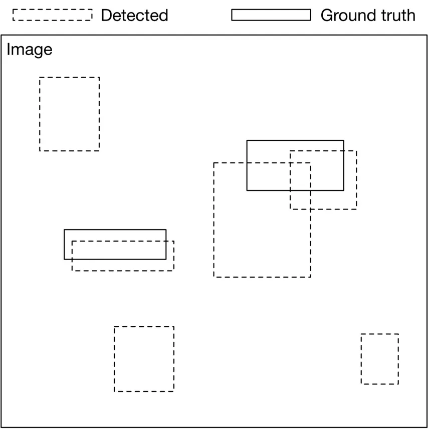

Figure 3.8: Ground truth and detected bounding boxes

When is a predicted bounding box considered correct? To answer this question, we need to understand the definition of Intersection Over Union.

**Intersection Over Union (IOU):** IOU measures the overlap between two bounding boxes. Figure $3.9$ shows a visual representation of IOU.

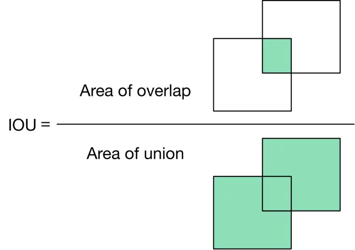

Figure 3.9: IOU formula

IOU determines whether a detected bounding box is correct. An IOU of 1 is ideal, indicating the detected bounding box and the ground truth bounding box are fully aligned. In practice, it's rare to see an IOU of 1. A higher IOU means the predicted bounding box is more accurate. An IOU threshold is usually used to determine whether a detected bounding box is correct (true positive) or incorrect (false positive). For example, an IOU threshold of $0.7$ means any detection that has an overlap of $0.7$ or higher with a ground truth bounding box, is a correct detection.

Now we know what IOU is and how to determine correct and incorrect bounding box predictions, let's discuss metrics for offline evaluation.

#### Offline metrics

Model development is an iterative process. We use offline metrics to quickly evaluate the performance of newly developed models. Here are some metrics that might be useful for the object detection system:

- Precision
- Average precision
- Mean average precision

##### Precision

This is the fraction of correct detections among all detections across all images. A high precision value shows the system's detections are more reliable.

$$
\text { Precision }=\frac{\text { Correct detections }}{\text { Total detections }}
$$

In order to calculate precision, we need to pick an IOU threshold. Let's use an example to better understand this. Figure $3.10$ shows a set of ground truth bounding boxes and detected bounding boxes, with their respective IOUs.

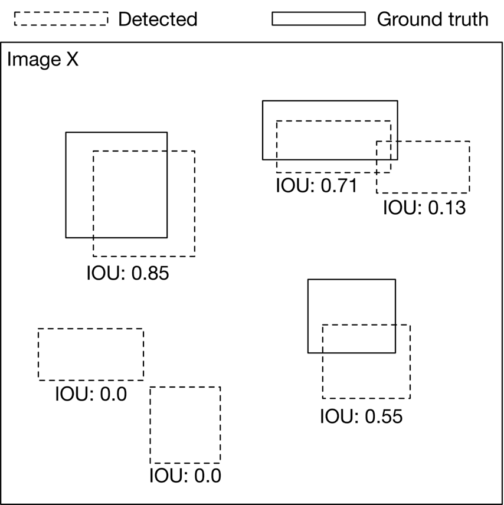

Figure 3.10: Ground truth bounding boxes and detected bounding boxes

Let's calculate precision for three different IOU thresholds: 0.7, 0.5, and 0.1.

- **IOU threshold $=0.7$** Out of the six total detections, two have an IOU above 0.7. Therefore, we have two correct predictions at this threshold. 
	$$
	\text { Precision }_{0.7}=\frac{\text { Correct detections }}{\text { Total detections }}=\frac{2}{6}=0.33
	$$
- **IOU threshold $=0.5$** At this threshold, we have three detections with IOU above $0.5$: 
	$$
	\text { Precision }_{0.5}=\frac{\text { Correct detections }}{\text { Total detections }}=\frac{3}{6}=0.5
	$$
- **IOU threshold $=0.1$** This time, we have four correct detections: 
	$$
	\text { Precision }_{0.1}=\frac{\text { Correct detections }}{\text { Total detections }}=\frac{4}{6}=0.67
	$$

As you may have noticed, the primary disadvantage of this metric is that precision varies with different IOU thresholds. Therefore, it's difficult to understand the model's overall performance by looking at a precision score with a particular IOU threshold. Average precision addresses this limitation.

**Average Precision (AP)** This metric computes precision across various IOU thresholds and calculates their average. The AP formula is:

$$
A P=\int_0^1 P(r) d r
$$

Where $P(r)$ is the precision at IOU threshold $r$.

The above formula can be approximated by a discrete summation over a predefined list of thresholds. For example, in the pascal VOC2008 benchmark \[13\], the AP is calculated across 11 evenly-spaced threshold values.

$$
A P=\frac{1}{11} \sum_{n=0}^{n=10} P(n)
$$

AP summarizes the model's overall precision for a specific object class (e.g., human faces). To measure the model's overall precision across all object classes (e.g., human faces and license plates), we need to use mean average precision.

**Mean average precision (mAP)** This is the average of AP across all object classes. This metric summarizes the model's overall performance. Here is the formula:

$$
m A P=\frac{1}{C} \sum_{c=1}^C A P_c
$$

Where $C$ is the total number of object classes the model detects.

The mAP metric is commonly used to evaluate object detection systems. To find out which thresholds are used in standard benchmarks, refer to \[14\] \[15\].

#### Online metrics

According to the requirements, the system needs to protect the privacy of individuals. One way to measure this is to count the number of user reports and complaints. We can also rely on human annotators to spot-check the percentage of incorrectly blurred images. Other metrics that measure bias and fairness are also critical. For example, we want to blur human faces equally well across different races and age groups. But measuring bias, as stated in the requirements, is out of the scope.

To conclude the evaluation section, we use mAP and AP as our offline metrics. mAP measures the overall precision of the model, while AP gives us insight into the precision of the model in particular classes. The main metric of the online evaluation is "user reports."

### Serving

In this section, we first talk about a common problem that may occur in object detection systems: overlapping bounding boxes. Next, we propose an overall ML system design.

#### Overlapping bounding boxes

When running an object detection algorithm on an image, it is very common to see bounding boxes overlap. This is because the RPN network proposes various highly overlapping bounding boxes around each object. It is important to narrow down these bounding boxes to a single bounding box per object during inference.

A widely used solution is an algorithm called “Non-maximum suppression” (NMS) \[16\]. Let’s examine how it works.

###### NMS

NMS is a post-processing algorithm designed to select the most appropriate bounding boxes. It keeps highly confident bounding boxes and removes overlapping bounding boxes. Figure 3.11 shows an example.

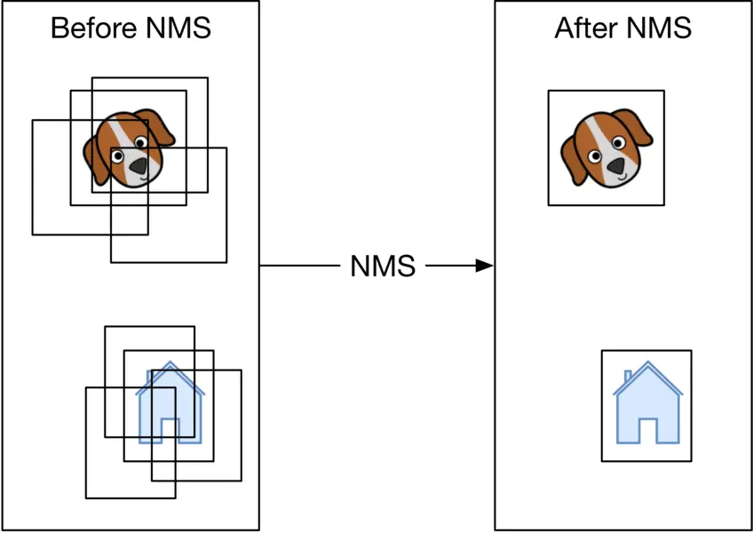

Figure 3.11: Before and after applying NMS

NMS is a commonly asked algorithm in ML system design interviews, so you're encouraged to have a good understanding of it \[17\].

#### ML system design

As illustrated in Figure 3.12, we propose an ML system design for the blurring system.

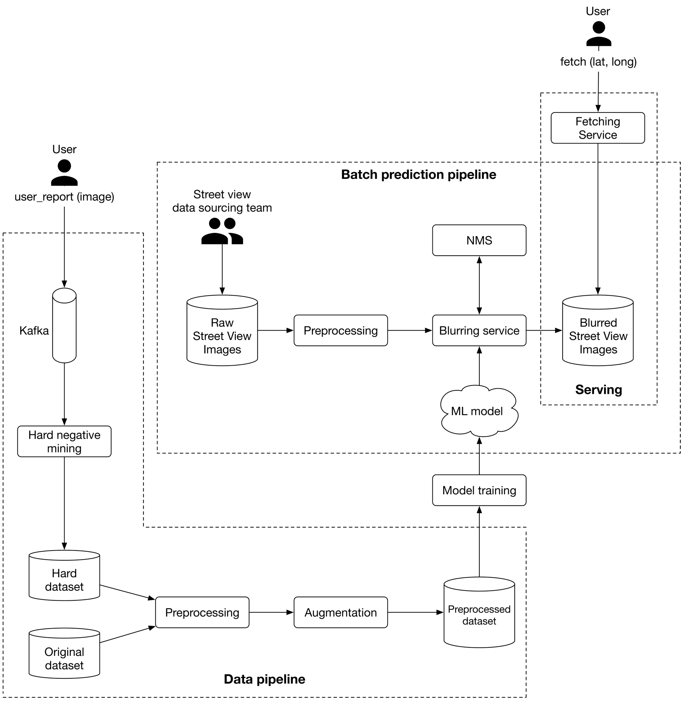

Figure 3.12: ML system design

Let's examine each pipeline in more detail.

##### Batch prediction pipeline

Based on the requirements gathered, latency is not a big concern because we can display existing images to users while new ones are being processed. Since instant results are not required, we can utilize batch prediction and precompute the object detection results.

**Preprocessing** Raw images are preprocessed by this component. This section does not discuss the preprocess operations as we have already discussed them in the feature engineering section.

**Blurring service** This performs the following operations on a Street View image:

1. Provides a list of objects detected in the image.
2. Refines the list of detected objects using the NMS component.
3. Blurs detected objects.
4. Stores the blurred image in object storage (Blurred Street View images).

Note that the preprocessing and blurring services are separate in the design. The reason is preprocessing images tends to be a CPU-bound process, whereas blurring service relies on GPU. Separating these services has two benefits:

- Scale the services independently based on the workload each receives.
- Better utilization of CPU and GPU resources.

##### Data pipeline

This pipeline is responsible for processing users' reports, generating new training data, and preparing training data to be used by the model. Data pipeline components are mostly self-explanatory. Hard negative mining is the only component that needs more explanation.

**Hard negative mining.** Hard negatives are examples that are explicitly created as negatives out of incorrectly predicted examples, and then added to the training dataset. When we retrain the model on the updated training dataset, it should perform better.

### Other Talking Points

If time allows, here are some additional points to discuss:

- How Transformer-based object detection architectures differ from one-stage or twostage models, and what are their pros and cons \[18\].
- Distributed training techniques to improve object detection on a larger dataset \[19\] \[20\].
- How General Data Protection Regulation (GDPR) in Europe may affect our system \[21\].
- Evaluate bias in face detection systems \[22\] \[23\].
- How to continuously fine-tune the model \[24\].
- How to use active learning \[25\] or human-in-the-loop ML \[26\] to select data points for training.

### References

1. Google Street View. [https://www.google.com/streetview](https://www.google.com/streetview).
2. DETR. [https://github.com/facebookresearch/detr](https://github.com/facebookresearch/detr).
3. RCNN family. [https://lilianweng.github.io/posts/2017-12-31-object-recognition-part-3](https://lilianweng.github.io/posts/2017-12-31-object-recognition-part-3).
4. Fast R-CNN paper. [https://arxiv.org/pdf/1504.08083.pdf](https://arxiv.org/pdf/1504.08083.pdf).
5. Faster R-CNN paper. [https://arxiv.org/pdf/1506.01497.pdf](https://arxiv.org/pdf/1506.01497.pdf).
6. YOLO family. [https://pyimagesearch.com/2022/04/04/introduction-to-the-yolo-family](https://pyimagesearch.com/2022/04/04/introduction-to-the-yolo-family).
7. SSD. [https://jonathan-hui.medium.com/ssd-object-detection-single-shot-multibox-detector-for-real-time-processing-9bd8deac0e06](https://jonathan-hui.medium.com/ssd-object-detection-single-shot-multibox-detector-for-real-time-processing-9bd8deac0e06).
8. Data augmentation techniques. [https://www.kaggle.com/getting-started/190280](https://www.kaggle.com/getting-started/190280).
9. CNN. [https://en.wikipedia.org/wiki/Convolutional\_neural\_network](https://en.wikipedia.org/wiki/Convolutional_neural_network).
10. Forward pass and backward pass. [https://www.youtube.com/watch?v=qzPQ8cEsVK8](https://www.youtube.com/watch?v=qzPQ8cEsVK8).
11. MSE. [https://en.wikipedia.org/wiki/Mean\_squared\_error](https://en.wikipedia.org/wiki/Mean_squared_error).
12. Log loss. [https://en.wikipedia.org/wiki/Cross\_entropy](https://en.wikipedia.org/wiki/Cross_entropy).
13. Pascal VOC. [http://host.robots.ox.ac.uk/pascal/VOC/voc2008/index.html](http://host.robots.ox.ac.uk/pascal/VOC/voc2008/index.html).
14. COCO dataset evaluation. [https://cocodataset.org/#detection-eval](https://cocodataset.org/#detection-eval).
15. Object detection evaluation. [https://github.com/rafaelpadilla/Object-Detection-Metrics](https://github.com/rafaelpadilla/Object-Detection-Metrics).
16. NMS. [https://en.wikipedia.org/wiki/NMS](https://en.wikipedia.org/wiki/NMS).
17. Pytorch implementation of NMS. [https://learnopencv.com/non-maximum-suppression-theory-and-implementation-in-pytorch/](https://learnopencv.com/non-maximum-suppression-theory-and-implementation-in-pytorch/).
18. Recent object detection models. [https://viso.ai/deep-learning/object-detection/](https://viso.ai/deep-learning/object-detection/).
19. Distributed training in Tensorflow. [https://www.tensorflow.org/guide/distributed\_training](https://www.tensorflow.org/guide/distributed_training).
20. Distributed training in Pytorch. [https://pytorch.org/tutorials/beginner/dist\_overview.html](https://pytorch.org/tutorials/beginner/dist_overview.html).
21. GDPR and ML. [https://www.oreilly.com/radar/how-will-the-gdpr-impact-machine-learning](https://www.oreilly.com/radar/how-will-the-gdpr-impact-machine-learning).
22. Bias and fairness in face detection. [http://sibgrapi.sid.inpe.br/col/sid.inpe.br/sibgrapi/2021/09.04.19.00/doc/103.pdf](http://sibgrapi.sid.inpe.br/col/sid.inpe.br/sibgrapi/2021/09.04.19.00/doc/103.pdf).
23. AI fairness. [https://www.kaggle.com/code/alexisbcook/ai-fairness](https://www.kaggle.com/code/alexisbcook/ai-fairness).
24. Continual learning. [https://towardsdatascience.com/tag/fine-tuning/](https://towardsdatascience.com/tag/fine-tuning/).
25. Active learning. [https://en.wikipedia.org/wiki/Active\_learning\_(machine\_learning)](https://en.wikipedia.org/wiki/Active_learning_\(machine_learning\)).
26. Human-in-the-loop ML. [https://arxiv.org/pdf/2108.00941.pdf](https://arxiv.org/pdf/2108.00941.pdf).