On video-sharing platforms such as YouTube, the number of videos can quickly grow into the billions. In this chapter, we design a video search system that can efficiently handle this volume of content. As shown in Figure 4.1, the user enters text into the search box, and the system displays the most relevant videos for the given text.

Figure 4.1: Searching videos with a text query

### Clarifying Requirements

Here is a typical interaction between a candidate and an interviewer.

**Candidate:** Is the input query text-only, or can users search with an image or video?  
**Interviewer:** Text queries only.

**Candidate:** Is the content on the platform only in video form? How about images or audio files?  
**Interviewer:** The platform only serves videos.

**Candidate:** The YouTube search system is very complex. Can I assume the relevancy of a video is determined solely by its visual content and the textual data associated with the video, such as the title and description?  
**Interviewer:** Yes, that's a fair assumption.

**Candidate:** Is there any training data available?  
**Interviewer:** Yes, let's assume we have ten million pairs of $\langle$ video, text query $\rangle$.

**Candidate:** Do we need to support other languages in the search system?  
**Interviewer:** For simplicity, let's assume only English is supported.

**Candidate:** How many videos are available on the platform?  
**Interviewer:** One billion videos.

**Candidate:** Do we need to personalize the results? Should we rank the results differently for different users, based on their past interactions?  
**Interviewer:** As opposed to recommendation systems where personalization is essential, we do not necessarily have to personalize results in search systems. To simplify the problem, let's assume no personalization is required.

Let's summarize the problem statement. We are asked to design a search system for videos. The input is a text query, and the output is a list of videos that are relevant to the text query. To search for relevant videos, we leverage both the videos' visual content and textual data. We are given a dataset of ten million $\langle$ video, text query $\rangle$ pairs for model training.

### Frame the Problem as an ML Task

#### Defining the ML objective

Users expect search systems to provide relevant and useful results. One way to translate this into an ML objective is to rank videos based on their relevance to the text query.

#### Specifying the system's input and output

As shown in Figure 4.2, the search system takes a text query as input and outputs a ranked list of videos sorted by their relevance to the text query.

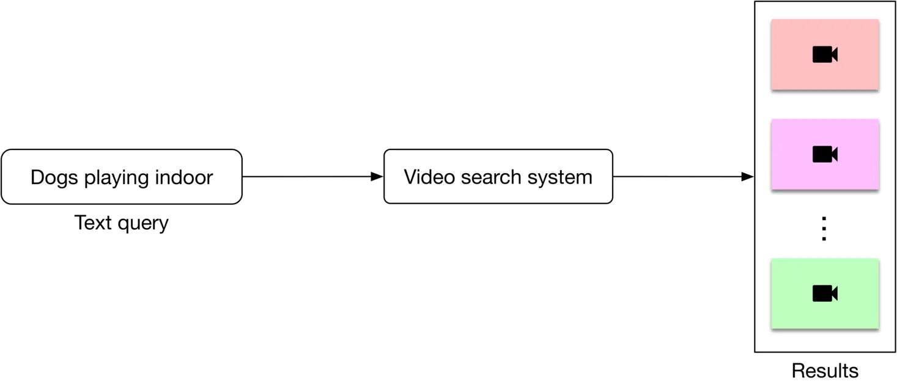

Figure 4.2: Video search system’s input-output

#### Choosing the right ML category

In order to determine the relevance between a video and a text query, we utilize both visual content and the video’s textual data. An overview of the design can be seen in Figure 4.3.

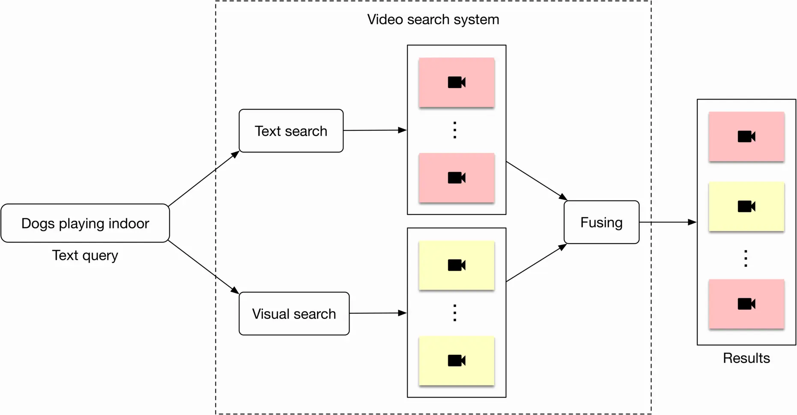

Figure 4.3: High-level overview of the search system

Let's briefly discuss each component.

##### Visual search

This component takes a text query as input and outputs a list of videos. The videos are ranked based on the similarity between the text query and the videos' visual content.

Representation learning is a commonly used approach to search for videos by processing their visual content. In this approach, text query and video are encoded separately using two encoders. As shown in Figure 4.4, the ML model contains a video encoder that generates an embedding vector from the video, and a text encoder that generates an embedding vector from the text. The similarity score between the video and the text is calculated using the dot product of their representations.

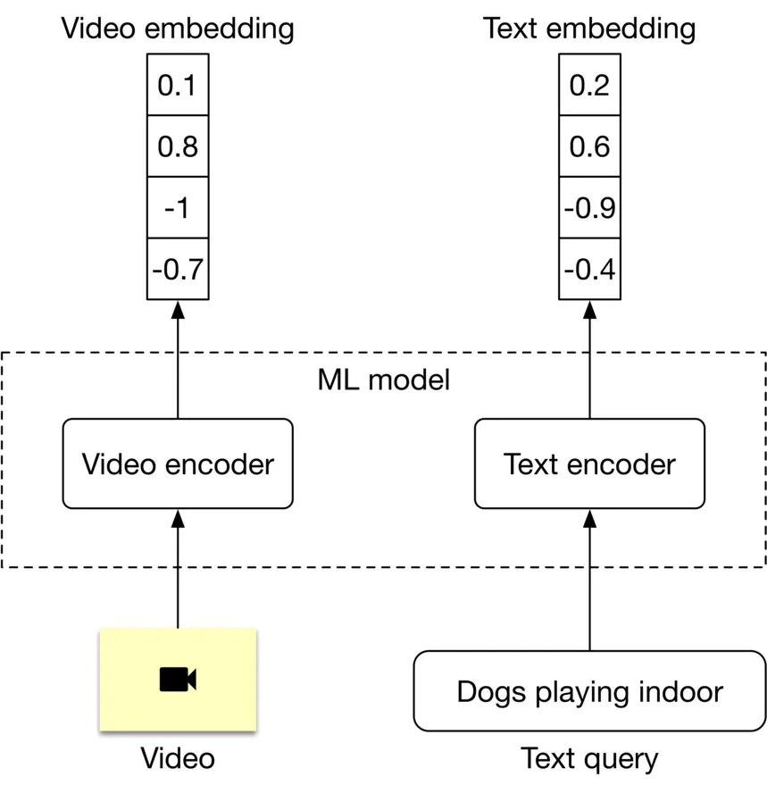

Figure 4.4: ML model’s input-output

In order to rank videos that are visually and semantically similar to the text query, we compute the dot product between the text and each video in the embedding space, then rank the videos based on their similarity scores.

##### Text search

Figure 4.5 shows how text search works when a user types in a text query: "dogs playing indoor". Videos with the most similar titles, descriptions, or tags to the text query are shown as the output.

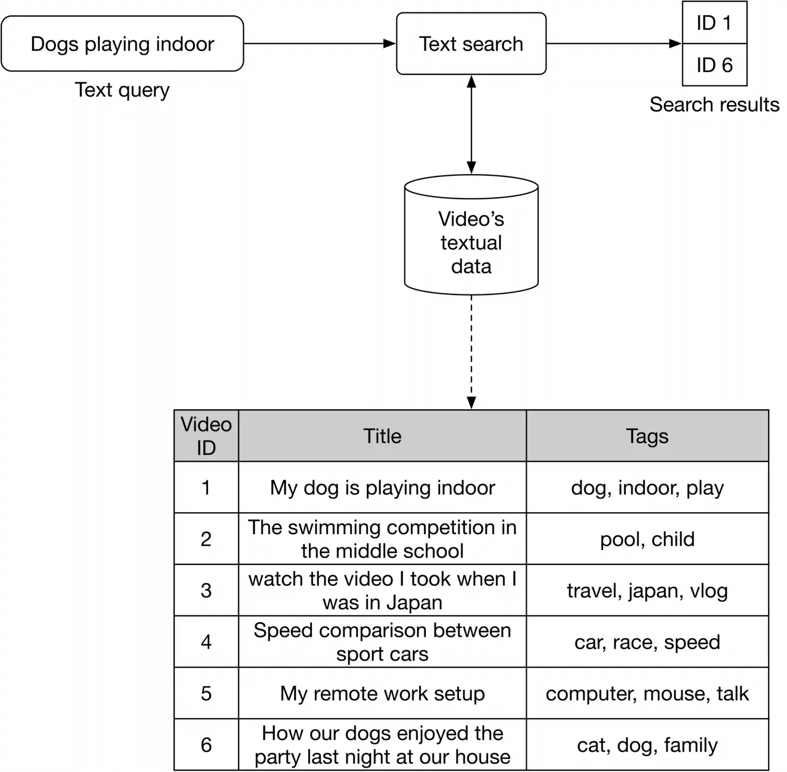

Figure 4.5: Text search

The inverted index is a common technique for creating the text-based search component, allowing efficient full-text search in databases. Since inverted indexes aren't based on machine learning, there is no training cost. A popular search engine companies often use is Elasticsearch, which is a scalable search engine and document store. For more details and a deeper understanding of Elasticsearch, refer to \[1\].

### Data Preparation

#### Data engineering

Since we are given an annotated dataset to train and evaluate the model, it's not necessary to perform any data engineering. Table 4.1 shows what the annotated dataset might look like.

| **Video name** | **Query** | **Split type** |
| --- | --- | --- |
| 76134.mp4 | Kids swimming in a pool! | Training |
| 92167.mp4 | Celebrating graduation | Training |
| 2867.mp4 | A group of teenagers playing soccer | Validation |
| 28543.mp4 | How Tensorboard works | Validation |
| 70310.mp4 | Road trip in winter | Test |

Table 4.1: Annotated dataset

#### Feature engineering

Almost all ML algorithms accept only numeric input values. Unstructured data such as texts and videos need to be converted into a numerical representation during this step. Let's take a look at how to prepare the text and video data for the model.

##### Preparing text data

As shown in Figure $4.6$, text is typically represented as a numerical vector using three steps: text normalization, tokenization, and tokens to IDs \[2\].

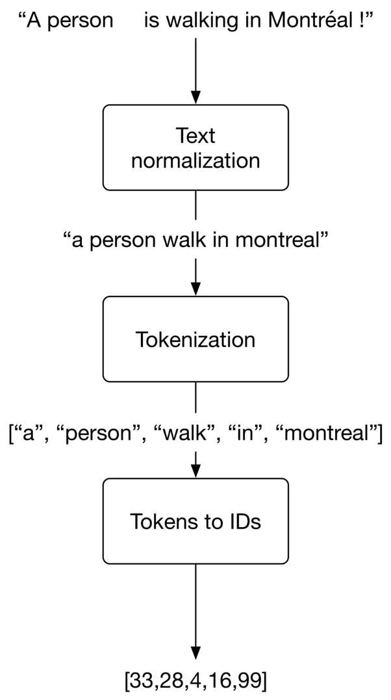

Figure 4.6: Represent a text with a numerical vector

Let's take a look at each step in more detail.

###### Text normalization

Text normalization - also known as text cleanup - ensures words and sentences are consistent. For example, the same word may be spelled slightly differently; as in "dog", "dogs", and "DOG!" all refer to the same thing but are spelled in different ways. The same is true for sentences. Take these two sentences, for example:

- "A person walking with his dog in Montréal!"
- "a person walks with his dog, in Montreal."

Both sentences mean the same, but have differing punctuation and verb forms. Here are some typical methods for text normalization:

- Lowercasing: make all letters lowercase, as this does not change the meaning of words or sentences
- Punctuation removal: remove punctuation from the text. Common punctuation marks are the period, comma, question mark, exclamation point, etc.
- Trim whitespaces: trim leading, trailing, and multiple whitespaces
- Normalization Form KD (NFKD) \[3\]: decompose combined graphemes into a combination of simple ones
- Strip accents: remove accent marks from words. For example: Màlaga $\rightarrow$ Malaga, Noël $\rightarrow$ Noel
- Lemmatization and stemming: identify a canonical representative for a set of related word forms. For example: walking, walks, walked $\rightarrow$ walk

###### Tokenization

Tokenization is the process of breaking down a piece of text into smaller units called tokens. Generally, there are three types of tokenization:

- Word tokenization: split the text into individual words based on specific delimiters. For example, a phrase like "I have an interview tomorrow" becomes \[ "I", "have", "an", "interview", "tomorrow"\]
- Subword tokenization: split text into subwords (or n-gram characters)
- Character tokenization: split text into a set of characters The details of different tokenization algorithms are not usually a strong focus in ML system design interviews. If you are interested to learn more, refer to \[4\].

###### Tokens to IDs

Once we have the tokens, we need to convert them to numerical values (IDs). The representation of tokens with numerical values can be done in two ways:

- Lookup table
- Hashing

**Lookup table.** In this method, each unique token is mapped to an ID. Next, a lookup table is created to store these $1: 1$ mappings. Figure $4.7$ shows what the mapping table might look like.

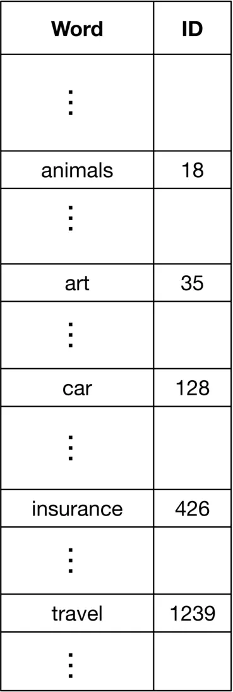

Figure 4.7: A lookup table

**Hashing.** Hashing, also called "feature hashing" or "hashing trick," is a memory-efficient method that uses a hash function to obtain IDs, without keeping a lookup table. Figure $4.8$ shows how a hash function is used to convert words to IDs.

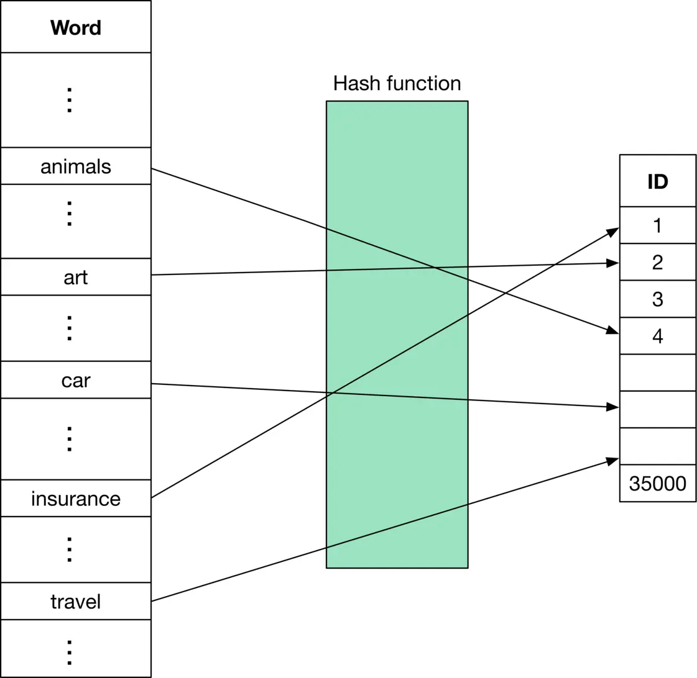

Figure 4.8: Use hashing to obtain word IDs

Let's compare the lookup table with the hashing method.

|  | **Lookup table** | **Hashing** |
| --- | --- | --- |
| **Speed** | ✓ Quick to convert tokens to IDs | ✘ Need to compute hash function to convert tokens to IDs |
| **ID to token** | ✓ Easy to convert IDs to tokens using a reverse index table | ✘ Not possible to convert IDs to tokens |
| **Memory** | ✘ The table is stored in memory. A large number of tokens will result in an increase in memory required | ✓ The hash function is sufficient to convert any token to its ID |
| **Unseen tokens** | ✘ New or unseen words cannot be properly handled | ✓ Easily handles new or unseen words by applying the hash function to any word |
| **Collisions \[5\]** | ✓ No collision issue | ✘ Collisions are a potential problem |

Table 4.2: Lookup table vs. feature hashing

##### Preparing video data

Figure 4.9 shows a typical workflow for preprocessing a raw video.

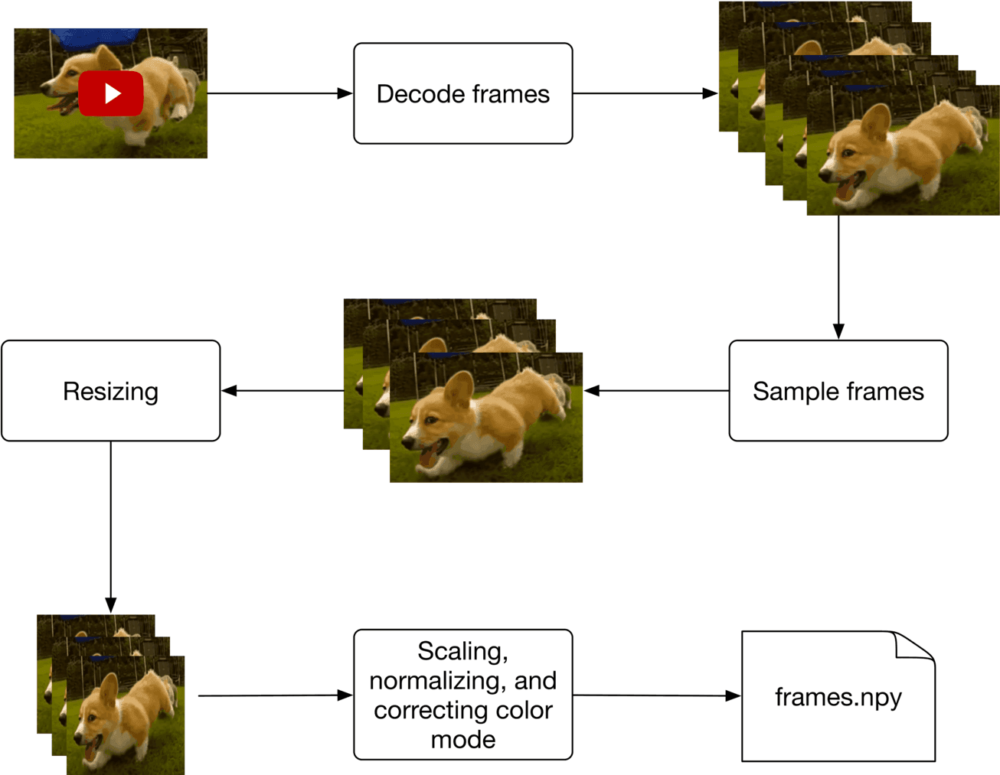

Figure 4.9: Video preprocessing workflow

### Model Development

#### Model selection

As discussed in the "Framing the problem as an ML task" section, text queries are converted into embeddings by a text encoder, and videos are converted into embeddings by a video encoder. In this section, we examine possible model architectures for each encoder.

A typical text encoder’s input and output are shown in Figure 4.10.

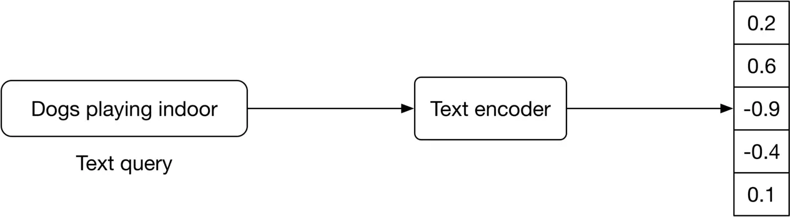

Figure 4.10: Text encoder’s input-output

The text encoder converts text into a vector representation \[6\]. For example, if two sentences have similar meanings, their embeddings are more similar. To build the text encoder, two broad categories are available: statistical methods and ML-based methods. Let's examine each.

###### Statistical methods

Those methods rely on statistics to convert a sentence into a feature vector. Two popular statistical methods are:

- Bag of Words (BoW)
- Term Frequency Inverse Document Frequency (TF-IDF)

**BoW.** This method converts a sentence into a fixed-length vector. It models sentenceword occurrences by creating a matrix with rows representing sentences, and columns representing word indices. An example of BoW is shown in Figure 4.11.

|  | best | holiday | is | nice | person | this | today | trip | very | with |
| --- | --- | --- | --- | --- | --- | --- | --- | --- | --- | --- |
| this person is nice very nice | 0 | 0 | 1 | 2 | 1 | 1 | 0 | 0 | 1 | 0 |
| today is holiday | 0 | 1 | 1 | 0 | 0 | 0 | 1 | 0 | 0 | 0 |
| this trip with best person is best | 2 | 0 | 1 | 0 | 1 | 1 | 0 | 1 | 0 | 1 |

Figure 4.11: BoW representations of different sentences

BoW is a simple method that computes sentence representations fast, but has the following limitations:

- It does not consider the order of words in a sentence. For example, "let's watch TV after work" and "let's work after watch TV" would have the same BoW representation.
- The obtained representation does not capture the semantic and contextual meaning of the sentence. For example, two sentences with the same meaning but different words have a totally different representation.
- The representation vector is sparse. The size of the representation vector is equal to the total number of unique tokens we have. This number is usually very large, so each sentence representation is mostly filled with zeros.

**TF-IDF.** This is a numerical statistic intended to reflect how important a word is to a document in a collection or corpus. TF-IDF creates the same sentence-word matrix as in BoW, but it normalizes the matrix based on the frequency of words. To learn more about the mathematics behind this, refer to \[7\].

Since TF-IDF gives less weight to frequent words, its representations are usually better than BoW. However, it has the following limitations:

- A normalization step is needed to recompute term frequencies when a new sentence is added.
- It does not consider the order of words in a sentence.
- The obtained representation does not capture the semantic meaning of the sentence.
- The representations are sparse.

In summary, statistical methods are usually fast. However, they do not capture the contextual meaning of sentences, and the representations are sparse. ML-based methods address those issues.

###### ML-based methods

In these methods, an ML model converts sentences into meaningful word embeddings so that the distance between two embeddings reflects the semantic similarity of the corresponding words. For example, if two words, such as "rich" and "wealth" are semantically similar, their embeddings are close in the embedding space. Figure $4.12$ shows a simple visualization of word embeddings in the $2 \mathrm{D}$ embedding space. As you can see, similar words are grouped together.

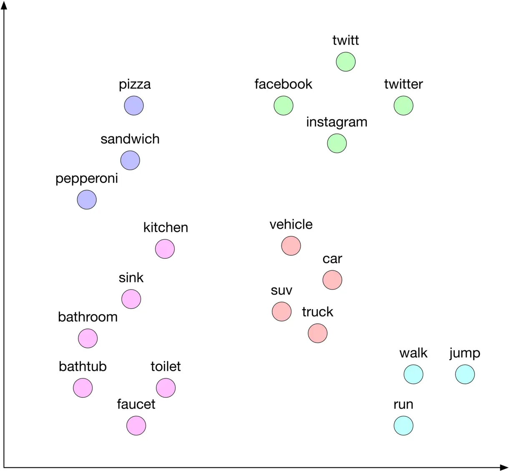

Figure 4.12: Words in the 2D embedding space

There are three common ML-based approaches for transforming texts into embeddings:

- Embedding (lookup) layer
- Word2vec
- Transformer-based architectures

**Embedding (lookup) layer** In this approach, an embedding layer is employed to map each ID to an embedding vector. Figure 4.13 shows an example.

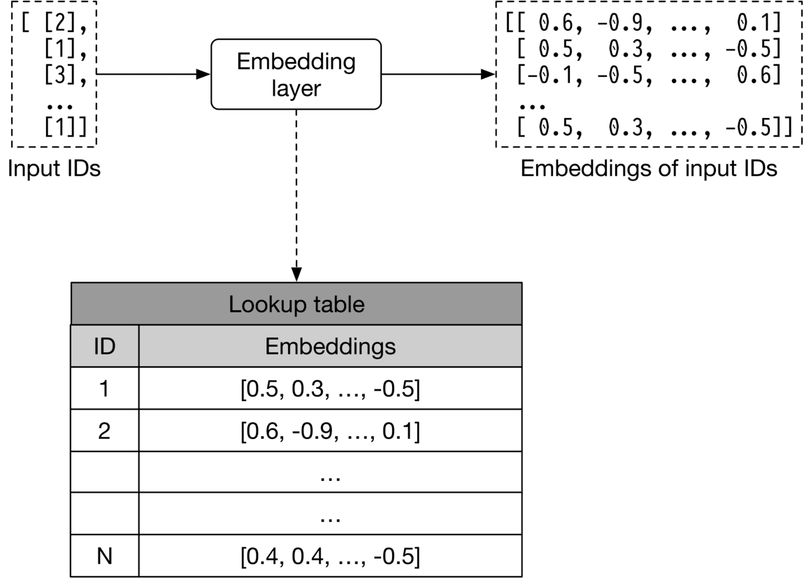

Figure 4.13: Embedding lookup method

Employing an embedding layer is a simple and effective solution to convert sparse features, such as IDs, into a fixed-size embedding. We will see more examples of its usage in later chapters.

**Word2vec** Word2vec \[8\] is a family of related models used to produce word embeddings. These models use a shallow neural network architecture and utilize the co-occurrences of words in a local context to learn word embeddings. In particular, the model learns to predict a center word from its surrounding words during the training phase. After the training phase, the model is capable of converting words into meaningful embeddings.

There are two main models based on word2vec: Continuous Bag of Words (CBOW) \[9\] and Skip-gram \[10\]. Figure $4.14$ shows how CBOW works at a high level. If you are interested to learn about these models, refer to \[8\].

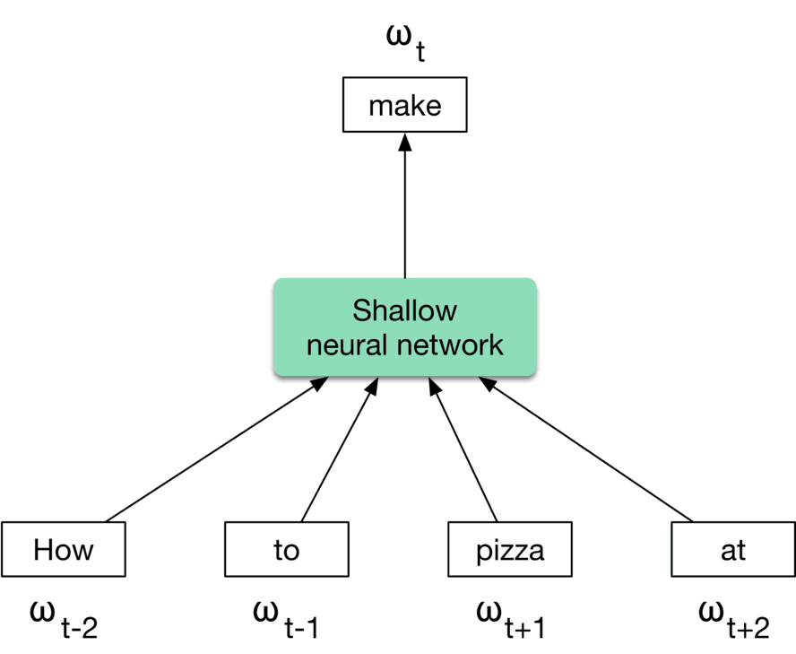

Figure 4.14: CBOW approach

Even though word2vec and embedding layers are simple and effective, recent architectures based upon Transformers have shown promising results.

**Transformer-based models**  
These models consider the context of the words in a sentence when converting them into embeddings. As opposed to word2vec models, they produce different embeddings for the same word depending on the context.

Figure 4.15 shows a Transformer-based model which takes a sentence - a set of words as input, and produces an embedding for each word.

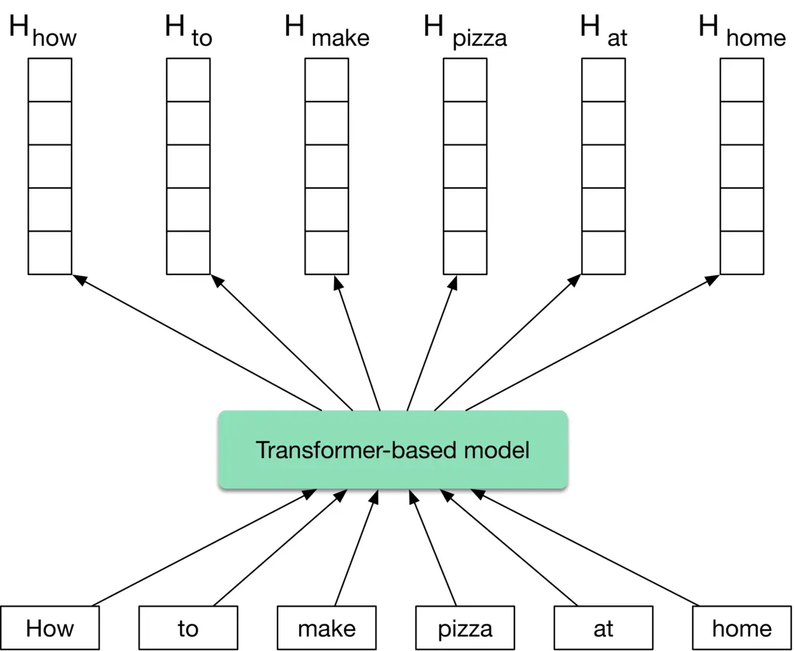

Figure 4.15: Transformer-based model’s input-output

Transformers are very powerful at understanding the context and producing meaningful embeddings. Several models, such as BERT \[11\], GPT3 \[12\], and BLOOM \[13\], have demonstrated Transformers' potential to perform a wide variety of Natural Language Processing (NLP) tasks. In our case, we choose a Transformer-based architecture such as BERT as our text encoder.

In some interviews, the interviewer may want you to dive deeper into the details of the Transformer-based model. To learn more, refer to \[14\].

##### Video encoder

We have two architectural options for encoding videos: We have two architectural options for encoding videos:

- Video-level models
- Frame-level models

Video-level models process a whole video to create an embedding, as shown in Figure 4.16. The model architecture is usually based on 3D convolutions \[15\] or Transformers. Since the model processes the whole video, it is computationally expensive.

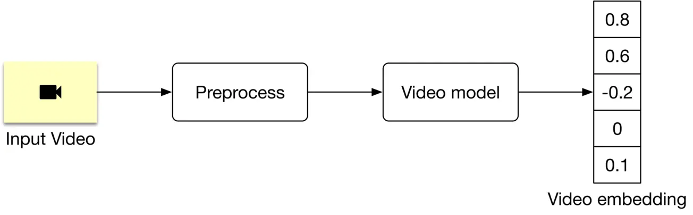

Figure 4.16: A video-level model

Frame-level models work differently. It is possible to extract the embedding from a video using a frame-level model by breaking it down into three steps:

- Preprocess a video and sample frames.
- Run the model on the sampled frames to create frame embeddings.
- Aggregate (e.g., average) frame embeddings to generate the video embedding.

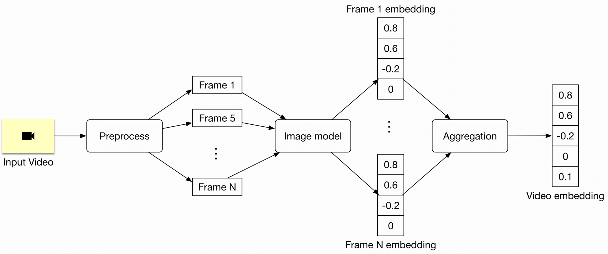

Figure 4.17: A frame-level model

Since this model works at the frame level, it is often faster and computationally less expensive. However, frame-level models are usually not able to understand the temporal aspects of the video, such as actions and motions. In practice, frame-level models are preferred in many cases where a temporal understanding of the video is not crucial. Here, we employ a frame-level model such as ViT \[16\] for two reasons:

- Improve the training and serving speed
- Reduce the number of computations

#### Model training

To train the text encoder and video encoder, we use a contrastive learning approach. If you are interested in learning more about this, see the "Model training" section in Chapter 2, Visual Search System.

An explanation of how to compute the loss during model training is shown in Figure 4.18.

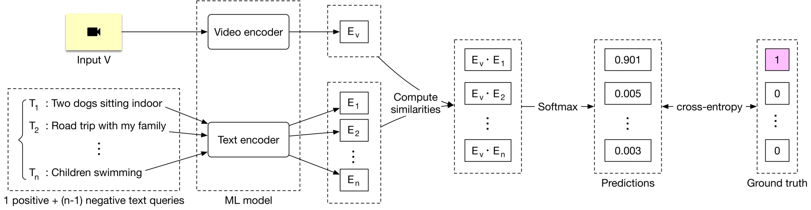

Figure 4.18: Loss computation

### Evaluation

#### Offline metrics

Here are some offline metrics that are typically used in search systems. Let's examine which are the most relevant.

**Precision@k and mAP**

$$
\text { precision@k }=\frac{\text { number of relevant items among the top } k \text { items in the ranked list }}{k}
$$

In the evaluation dataset, a given text query is associated with only one video. That means the numerator of the precision@k formula is at most 1. This leads to low precison@k values. For example, for a given text query, even if we rank its associated video at the top of the list, the precision@10 is only 0.1. Due to this limitation, precision metrics, such as precision@k and mAP, are not very helpful.

**Recall@k.** This measures the ratio between the number of relevant videos in the search results and the total number of relevant videos.

$$
\text { recall@k }=\frac{\text { Number of relevant videos among the top } k \text { videos }}{\text { Total number of relevant videos }}
$$

As described earlier, the "total number of relevant videos" is always 1. With that, we can translate the recall@k formula to the following:

recall@ $\mathrm{k}=1$ if the relevant video is among the top $k$ videos, 0 otherwise

What are the pros and cons of this metric?

**Pros**

- It effectively measures a model's ability to find the associated video for a given text query.

**Cons**

- It depends on $k$. Choosing the right $\mathrm{k}$ could be challenging.
- When the relevant video is not among the $\mathrm{k}$ videos in the output list, recall@k is always 0. For example, consider the case where model A ranks a relevant video at place 15, and model B ranks the same video at place 50. If we use recall@10 to measure the quality of these two models, both would have recall@10=0, even though model A is better than model B.

**Mean Reciprocal Rank (MRR).** This metric measures the quality of the model by averaging the rank of the first relevant item in each search result. The formula is:

$$
M R R=\frac{1}{m} \sum_{i=1}^m \frac{1}{\operatorname{rank}_i}
$$

This metric addresses the shortcomings of recall@k and can be used as our offline metric.

#### Online metrics

As part of online evaluation, companies track a wide variety of metrics. Let's take a look at some of the most important ones:

- Click-through rate (CTR)
- Video completion rate
- Total watch time of search results

**CTR.** This metric shows how often users click on retrieved videos. The main problem with CTR is that it does not track whether the clicked videos are relevant to the user. In spite of this issue, CTR is still a good metric to track because it shows how many people clicked on search results.

**Video completion rate.** A metric measuring how many videos appear in search results and are watched by users until the end. The problem with this metric is that a user may watch a video only partially, but still find it relevant. The video completion rate alone cannot reflect the relevance of search results.

**Total watch time of search results.** This metric tracks the total time users spent watching the videos returned by the search results. Users tend to spend more time watching if the search results are relevant. This metric is a good indication of how relevant the search results are.

### Serving

At serving time, the system displays a ranked list of videos relevant to a given text query. Figure $4.19$ shows a simplified ML system design.

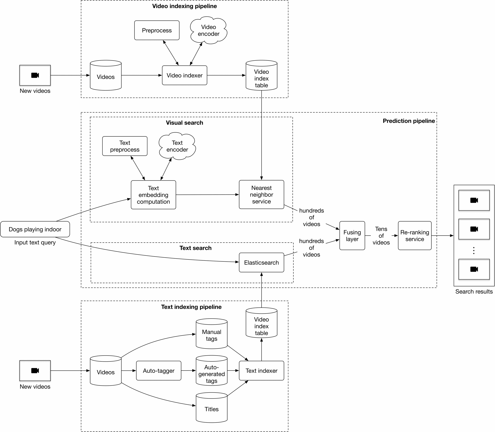

Figure 4.19: ML system design

Let's discuss each pipeline in more detail.

#### Prediction pipeline

This pipeline consists of:

- Visual search
- Text search
- Fusing layer
- Re-ranking service

Visual search. This component encodes the text query and uses the nearest neighbor service to find the most similar video embeddings to the text embedding. To accelerate the NN search, we use approximate nearest neighbor (ANN) algorithms, as described in Chapter 2, Visual Search System.

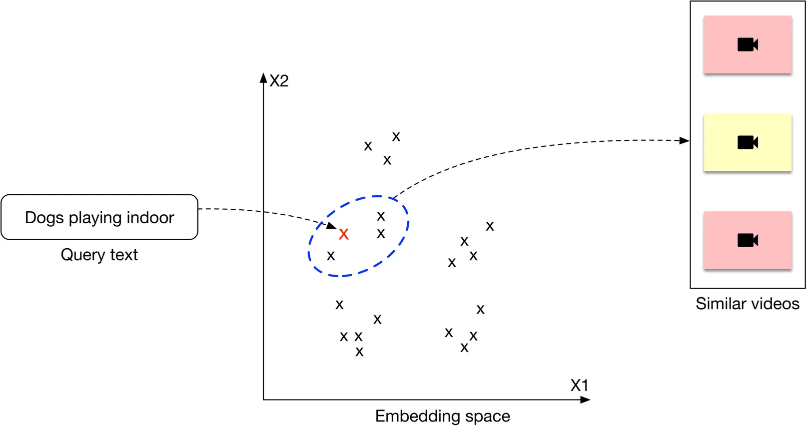

Figure 4.20: Retrieving the top 3 results for a given text query

**Text search.** Using Elasticsearch, this component finds videos with titles and tags that overlap the text query.

**Fusing layer.** This component takes two different lists of relevant videos from the previous step, and combines them into a new list of videos.

The fusing layer can be implemented in two ways, the easiest of which is to re-rank videos based on the weighted sum of their predicted relevance scores. A more complex approach is to adopt an additional model to re-rank the videos, which is more expensive because it requires model training. Additionally, it's slower at serving. As a result, we use the former approach.

**Re-ranking service.** This service modifies the ranked list of videos by incorporating business-level logic and policies.

#### Video indexing pipeline

A trained video encoder is used to compute video embeddings, which are then indexed. These indexed video embeddings are used by the nearest neighbor service.

#### Text indexing pipeline

This uses Elasticsearch for indexing titles, manual tags, and auto-generated tags.

Usually, when a user uploads a video, they provide tags to help better identify the video. But what if they do not manually enter tags? One option is to use a standalone model to generate tags. We name this component the auto-tagger and it is especially valuable in cases where a video has no manual tags. These tags may be noisier than manual tags, but they are still valuable.

### Other Talking Points

Before concluding this chapter, it's important to note we have simplified the system design of the video search system. In practice, it is much more complex. Some improvements may include:

- Use a multi-stage design (candidate generation + ranking).
- Use more video features such as video length, video popularity, etc.
- Instead of relying on annotated data, use interactions (e.g., clicks, likes, etc.) to construct and label data. This allows us to continuously train the model.
- Use an ML model to find titles and tags which are semantically similar to the text query. This model can be combined with Elasticsearch to improve search quality.

If there's time left at the end of the interview, here are some additional talking points:

- An important topic in search systems is query understanding, such as spelling correction, query category identification, and entity recognition. How to build a queryunderstanding component? \[17\].
- How to build a multi-modal system that processes speech and audio to improve search results \[18\].
- How to extend this work to support other languages \[19\].
- Near-duplicate videos in the final output may negatively impact user experience. How to detect near-duplicate videos so we can remove them before displaying the results $[20]$?
- Text queries can be divided into head, torso, and tail queries. What are the different approaches commonly used in each case \[21\]?
- How to consider popularity and freshness when producing the output list \[22\]?
- How real-world search systems work \[23\]\[24\]\[25\].

### References

1. Elasticsearch. [https://www.tutorialspoint.com/elasticsearch/elasticsearch\_query\_dsl.htm](https://www.tutorialspoint.com/elasticsearch/elasticsearch_query_dsl.htm).
2. Preprocessing text data. [https://huggingface.co/docs/transformers/v4.42.0/preprocessing](https://huggingface.co/docs/transformers/v4.42.0/preprocessing).
3. NFKD normalization. [https://unicode.org/reports/tr15/](https://unicode.org/reports/tr15/).
4. What is Tokenization summary. [https://huggingface.co/docs/transformers/tokenizer\_summary](https://huggingface.co/docs/transformers/tokenizer_summary).
5. Hash collision. [https://en.wikipedia.org/wiki/Hash\_collision](https://en.wikipedia.org/wiki/Hash_collision).
6. Deep learning for NLP. [http://cs224d.stanford.edu/lecture\_notes/notes1.pdf](http://cs224d.stanford.edu/lecture_notes/notes1.pdf).
7. TF-IDF. [https://en.wikipedia.org/wiki/Tf%E2%80%93idf](https://en.wikipedia.org/wiki/Tf%E2%80%93idf).
8. Word2Vec models. [https://www.tensorflow.org/tutorials/text/word2vec](https://www.tensorflow.org/tutorials/text/word2vec).
9. Continuous bag of words. [https://www.kdnuggets.com/2018/04/implementing-deep-learning-methods-feature-engineering-text-data-cbow.html](https://www.kdnuggets.com/2018/04/implementing-deep-learning-methods-feature-engineering-text-data-cbow.html).
10. Skip-gram model. [http://mccormickml.com/2016/04/19/word2vec-tutorial-the-skip-gram-model/](http://mccormickml.com/2016/04/19/word2vec-tutorial-the-skip-gram-model/).
11. BERT model. [https://arxiv.org/pdf/1810.04805.pdf](https://arxiv.org/pdf/1810.04805.pdf).
12. GPT3 model. [https://arxiv.org/pdf/2005.14165.pdf](https://arxiv.org/pdf/2005.14165.pdf).
13. BLOOM model. [https://bigscience.huggingface.co/blog/bloom](https://bigscience.huggingface.co/blog/bloom).
14. Transformer implementation from scratch. [https://peterbloem.nl/blog/transformers](https://peterbloem.nl/blog/transformers).
15. 3D convolutions. [https://www.kaggle.com/code/shivamb/3d-convolutions-understanding-use-case/notebook](https://www.kaggle.com/code/shivamb/3d-convolutions-understanding-use-case/notebook).
16. Vision Transformer. [https://arxiv.org/pdf/2010.11929.pdf](https://arxiv.org/pdf/2010.11929.pdf).
17. Query understanding for search engines. [https://www.linkedin.com/pulse/ai-query-understanding-daniel-tunkelang/](https://www.linkedin.com/pulse/ai-query-understanding-daniel-tunkelang/).
18. Multimodal video representation learning. [https://arxiv.org/pdf/2012.04124.pdf](https://arxiv.org/pdf/2012.04124.pdf).
19. Multilingual language models. [https://arxiv.org/pdf/2107.00676.pdf](https://arxiv.org/pdf/2107.00676.pdf).
20. Near-duplicate video detection. [https://arxiv.org/pdf/2005.07356.pdf](https://arxiv.org/pdf/2005.07356.pdf).
21. Generalizable search relevance. [https://livebook.manning.com/book/ai-powered-search/chapter-10/v-10/20](https://livebook.manning.com/book/ai-powered-search/chapter-10/v-10/20).
22. Freshness in search and recommendation systems. [https://developers.google.com/machine-learning/recommendation/dnn/re-ranking](https://developers.google.com/machine-learning/recommendation/dnn/re-ranking).
23. Semantic product search by Amazon. [https://arxiv.org/pdf/1907.00937.pdf](https://arxiv.org/pdf/1907.00937.pdf).
24. Ranking relevance in Yahoo search. [https://www.kdd.org/kdd2016/papers/files/adf0361-yinA.pdf](https://www.kdd.org/kdd2016/papers/files/adf0361-yinA.pdf).
25. Semantic product search in E-Commerce. [https://arxiv.org/pdf/2008.08180.pdf](https://arxiv.org/pdf/2008.08180.pdf).