In this chapter, we design an event recommendation system similar to Eventbrite's. Eventbrite is a popular event management and ticketing marketplace which allows users to create, browse, and register events. A recommendation system personalizes the experience and displays events relevant to users.

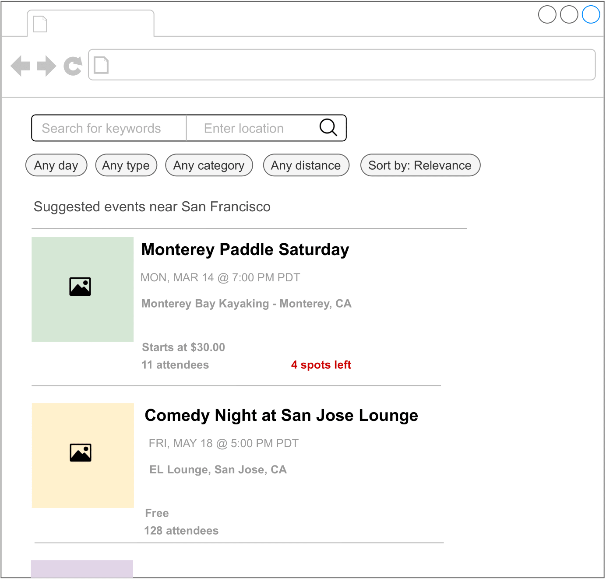

Image represents a webpage interface for searching and displaying events. The top section contains a search bar with fields for 'Search for keywords' and 'Enter location,' accompanied by a magnifying glass icon to initiate the search. To the left of the search bar are navigation icons: a back arrow, a forward arrow, a refresh icon, and a document icon. Below the search bar are filter options: 'Any day,' 'Any type,' 'Any category,' and 'Any distance' buttons, allowing users to refine their search. A 'Sort by: Relevance' option is also present. Below the filters, the heading 'Suggested events near San Francisco' appears, followed by event listings. Each event listing includes a small image placeholder icon, the event name (e.g., 'Monterey Paddle Saturday'), date and time (e.g., 'MON, MAR 14 @ 7:00 PM PDT'), location (e.g., 'Monterey Bay Kayaking - Monterey, CA'), price ('Starts at $30.00' or 'Free'), the number of attendees, and the number of spots remaining (e.g., '4 spots left'). The events are displayed in a card-like format, with a light-green and light-beige background differentiating them. Three small circles in the upper right corner likely represent user account settings or notifications.

### Clarifying Requirements

Here is a typical interaction between a candidate and an interviewer.

**Candidate:** What is the business objective? Can I assume the main business objective is to increase ticket sales?  
**Interviewer:** Yes, that sounds good.

**Candidate:** Besides attending an event, can users book hotels or restaurants on the platform?

**Interviewer**: For simplicity, let's assume only events are supported.

**Candidate:** An event is considered an ephemeral one-time occurrence item that only happens once, and then expires. Is this assumption correct?  
**Interviewer:** That's an excellent observation.

**Candidate:** What event attributes are available? Can I assume we have access to the textual description of the event, price range, location, date and time, etc.?  
**Interviewer:** Sure, those are fair assumptions.

**Candidate:** Do we have any annotated data?  
**Interviewer:** We don't have a hand-labeled dataset. You can use event and user interaction data to construct the training dataset.

**Candidate:** Do we have access to the user's current location?  
**Interviewer:** Yes. Since this problem focuses on a location-based recommendation system, let's assume users agree to share their location data.

**Candidate:** Can users become friends on the platform? Friendship information is valuable for building a personalized event recommendation system.  
**Interviewer:** Good question. Yes, let's assume users can form friendships on our platform. A friendship is bidirectional, meaning if A is a friend of B, then B is also a friend of A.

**Candidate:** Can users invite others to events?  
**Interviewer:** Yes.

**Candidate:** Can a user RSVP to an event?  
**Interviewer:** For simplicity, let's assume only a registration option is available for an event.

**Candidate:** Are the events free or paid?  
**Interviewer:** We need to support both.

**Candidate:** How many users and events are available?  
**Interviewer:** We host around 1 million total events every month.

**Candidate:** How many daily active users visit the website/app?  
**Interviewer:** Assume we have one million unique users per day.

**Candidate:** Since we are building a location-based event recommendation system, it's important to calculate the distance and travel time between two locations efficiently. Can we assume external APIs such as Google Maps API or other map services can be used to obtain such data?  
**Interviewer:** Good point. Assume we can use third-party services to obtain location data.

Let's summarize the problem statement. We are asked to design an event recommendation system, which displays a personalized list of events to users. When an event is finished, users can no longer register for it. In addition to registering for events, users can invite others to events and form friendships. The training data should be constructed online from user interactions. The primary goal of this system is to increase total ticket sales.

### Frame the Problem as an ML Task

#### Defining the ML objective

Based on the requirements, the business objective is to increase ticket sales. One way to translate this into a well-defined ML objective is to maximize the number of event registrations.

#### Specifying the system's input and output

The input to the system is a user, and the output is the top k events ranked by relevance to the user.

#### Choosing the right ML category

There are different ways to solve a recommendation problem:

- Simple rules, such as recommending popular events
- Embedding-based models which rely on content-based or collaborative filtering
- Reformulating it into a ranking problem

Rule-based methods are good starting points to form a baseline. However, ML-based approaches usually lead to better outcomes. In this chapter, we reformulate the task into a ranking problem and use Learning to Rank (LTR) to solve it.

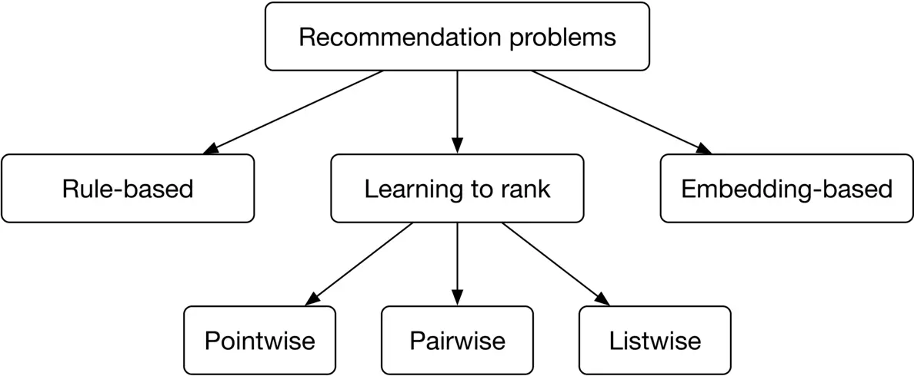

Figure 7.2: Different approaches to solving recommendation problems

LTR is a class of algorithmic techniques that apply supervised machine learning to solve ranking problems. The ranking problem can be formally defined as: "having a query and a list of items, what is the optimal ordering of the items from most relevant to least relevant to the query?" There are generally three LTR approaches: pointwise, pairwise, and listwise. Let's briefly examine each. Note that a detailed explanation of these approaches is beyond the scope of this book. If you're interested in learning more about LTR, refer to \[1\].

##### Pointwise LTR

In this approach, we go over each item and predict the relevance between the query and the item, using classification or regression methods. Note that the score of one item is predicted independently of other items.

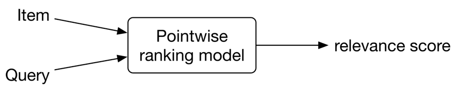

Figure 7.3: Pointwise ranking model

The final ranking is achieved by sorting the predicted relevance scores.

##### Pairwise LTR

In this approach, the model takes two items and predicts which item is more relevant to the query.

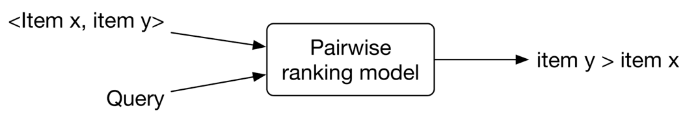

Figure 7.4: Pairwise ranking model

Some of the most popular pairwise LTR algorithms are RankNet \[2\], LambdaRank \[3\], and LambdaMART \[4\].

##### Listwise LTR

Listwise approaches predict the optimal ordering of an entire list of items, given the query.

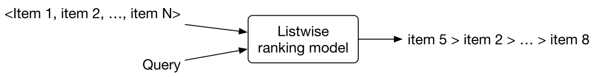

Figure 7.5: Listwise ranking model

Some popular listwise LTR algorithms are SoftRank \[5\], ListNet \[6\], and AdaRank \[7\].

In general, pairwise and listwise approaches produce more accurate results, but they are more difficult to implement and train. For simplicity, we use the pointwise approach for this problem. In particular, we employ a binary classification model which takes a single event at a time and predicts the probability that the user will register for it. This approach is shown in Figure 7.6.

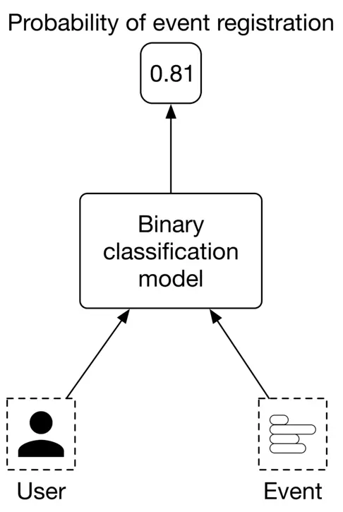

Figure 7.6: Binary classification model

### Data Preparation

#### Data engineering

To engineer good features, we need first to understand the raw data available in the system. Since an event management platform is mainly centered around users and events, we assume the following data are available:

- Users
- Events
- Friendship
- Interactions

##### Users

The user data schema is shown below.

| ID | Username | Age | Gender | City | Country | Language | Time zone |
| --- | --- | --- | --- | --- | --- | --- | --- |

Table 7.1: User data schema

##### Events

Table 7.2 shows what the event data might look like.

| ID | Host User ID | Category/ Subcategory | Description | Price | Location | Date/Time |
| --- | --- | --- | --- | --- | --- | --- |
| 1 | 5 | Music Concert | Dua Lipa Tour in Miami | 200-900 | American Airlines Arena Miami, FL | 09/18/2022 19:00-24:00 |
| 2 | 11 | Sports Basketball | Golden State Warriors vs. Milwaukee Bucks | 140-2500 | Chase Center SF, CA | 09/22/2022 17:00-19:00 |
| 3 | 7 | Art Theater | The Comedy and Magic of Robert Hall | Free | San Jose Improv San Jose, CA | 09/06/2022 18:00-19:30 |

Table 7.2: Event data

##### Friendship

In Table 7.3, each row represents a friendship formed between two users, along with the timestamp of when it was formed

| User ID 1 | User ID 2 | Timestamp when friendship was formed |
| --- | --- | --- |
| 28 | 3 | 1658451341 |
| 7 | 39 | 1659281720 |
| 11 | 25 | 1659312942 |

Table 7.3: Friendship data

##### Interactions

Table 7.4 stores user interaction data, such as event registrations, invitations, and impressions. In practice, we may store interaction data in different databases, but for simplicity, we include them in a single table.

| User ID | Event ID | Interaction type | Interaction value | Location (lat, long) | Timestamp |
| --- | --- | --- | --- | --- | --- |
| 4 | 18 | Impression | \- | 38.8951   \-77.0364 | 1658450539 |
| 4 | 18 | Register | Confirmation number | 38.8951   \-77.0364 | 1658451341 |
| 4 | 18 | Invite | User 9 | 41.9241   \-89.0389 | 1658451365 |

Table 7.4: Interaction data

#### Feature engineering

Event-based recommendations are more challenging than traditional recommendations. An event is fundamentally different from a movie or a book, as there is no consumption after the event ends. Events are typically short-lived, meaning the time is short between event creation and when it finishes. As a result, there are not many historical interactions available for a given event. For this reason, event-based recommendations are intrinsically cold-start and suffer from a constant new-item problem.

To overcome those issues, we put more effort into feature engineering to create as many meaningful features as possible. Due to space constraints, we will only discuss some of the most important features. In practice, the number of predictive features can be much higher. In this section, we create features related to each of the following categories:

- Location-related features
- Time-related features
- Social-related features
- User-related features
- Event-related features.

##### Location-related features

**How accessible is the event's location?**

The accessibility of an event's location is an important factor. For example, if an event is high up in hills far from public transportation, the commute may discourage users from attending. Let's create the following features to capture accessibility:

- Walk score: Walk score is a number between 0 and 100, which measures how walkable an address is, based on the distance to nearby amenities. It is computed by analyzing various factors such as distance to amenities, pedestrian friendliness, population density, etc. We assume walk scores can be obtained from external data sources such as Google Maps, Open Street Map, etc. Table $7.5$ shows walk scores bucketized into 5 categories.

| Category | Walk score | Description |
| --- | --- | --- |
| 1 | 90-100 | No car needed |
| 2 | 70-89 | Very walkable |
| 3 | 50-69 | Somewhat walkable |
| 4 | 25-49 | Car-dependent |
| 5 | 0-24 | Requires a car |

Table 7.5: Walk score categories

- Walk score similarity: The difference between the event's walk score and the user's average walk score of previous events registered by the user.
- Transit score, transit score similarity, bike score, bike score similarity.

**Is the event in the same country and city as the user?**  
A very important deciding factor for a user is whether the event is in the same country and city where they are located. The following two features can be created:

- If the user's country is the same as the event's country, this feature is 1, otherwise 0
- If the user's city is the same as the event's city, this feature is 1, otherwise 0

**Is the user comfortable with the distance?**  
Some users may prefer events that are very close to their location, while others prefer events that are further away. We use the following features to capture this:

- The distance between the user's location and the event's location. This value can be obtained from external APIs and bucketized into a few categories. For example:
	- 0: less than a mile
		- 1: 1-5 miles
		- 2: 5-20 miles
		- 3: 20-50 miles
		- 4: 50-100 miles
		- 5: +100 miles
- Distance similarity: Difference between the distance to an event and the average distance (in reality, the median or percentile range can be used) to events previously registered by the user.

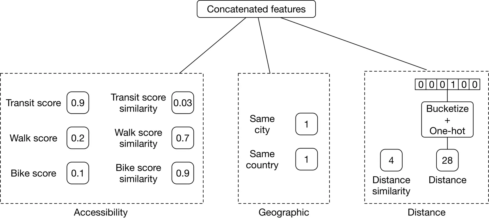

Image represents a feature engineering process for a machine learning model. The topmost box, 'Concatenated features,' acts as the output, receiving input from three distinct feature groups. The first group, labeled 'Accessibility,' contains three pairs of values: 'Transit score' (0.9), 'Transit score similarity' (0.03); 'Walk score' (0.2), 'Walk score similarity' (0.7); and 'Bike score' (0.1), 'Bike score similarity' (0.9). The second group, 'Geographic,' includes binary indicators: 'Same city' (1) and 'Same country' (1). The third group, 'Distance,' processes a binary feature vector '0 0 0 1 1 0 0' which is then 'Bucketized' and undergoes 'One-hot' encoding, resulting in two numerical features: 'Distance similarity' (4) and 'Distance' (28). All three feature groups contribute to the 'Concatenated features' which are then presumably used as input for a machine learning model (not shown in the diagram).

##### Time-related features

**How convenient is the time remaining until an event?**  
Some users may plan events a few days in advance, while others don't. Let's create the following features to capture this:

- The remaining time until the event begins. This feature can be bucketized into different categories and one-hot encoded. For example:
	- 0: less than 1 hour left until the event starts
		- 1: 1-2 hours
		- 2: 2-4 hours
		- 3: 4-6 hours
		- 4: 6-12 hours
		- 5: 12-24 hours
		- 6: 1-3 days
		- 7: 3-7 days
		- 8: +7 days
- Remaining time similarity: Difference between "remaining time" and average "remaining time" of events previously registered by the user.
- The estimated travel time from the user's location to the event's location. This value will be obtained from external services and bucketized into categories.
- Estimated travel time similarity: The difference between the estimated travel time to the event in question, and the average estimated travel time of events previously registered by the user.

**Are the date and time convenient for the user?**  
Some users may prefer events that occur at weekends, while others prefer weekdays. Some users prefer events in the morning, while others may prefer evening events. To capture a user's historical preferences for days of the week, we create a user profile. This user profile is a vector of size 7, and each value counts the number of events the user attended on a particular day. By dividing these values by the total number of attended events, we get the historical rate of event attendance for each day of the week. Figure 7.8 shows the per-day distribution of a user's previously attended events. As we can see, this user has never attended an event on Monday or Wednesday, so displaying an event that occurs on Wednesday may not be a good recommendation for this user. Per-hour user profiles can be created using a similar approach. Similarly, we add day and hour similarity.

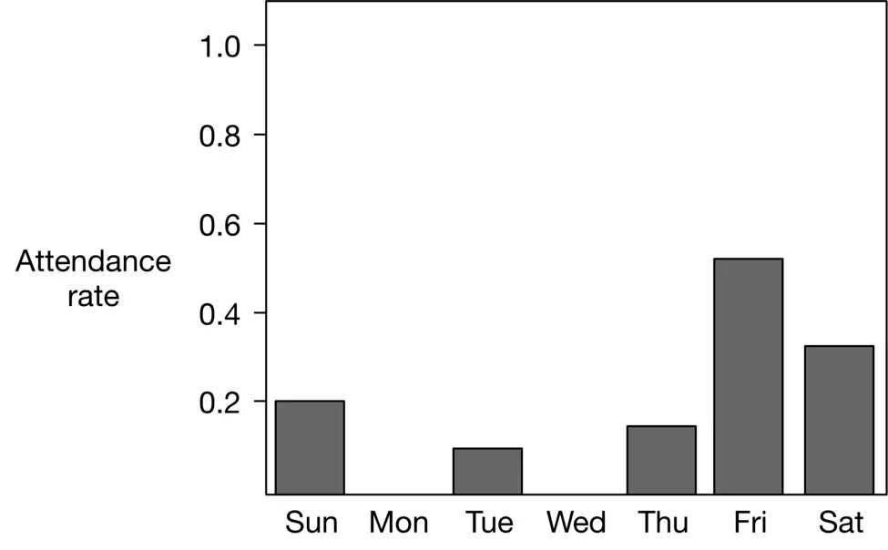

Figure 7.8: Per-day distribution of the event data

A summary of time-related features is shown in Figure 7.9

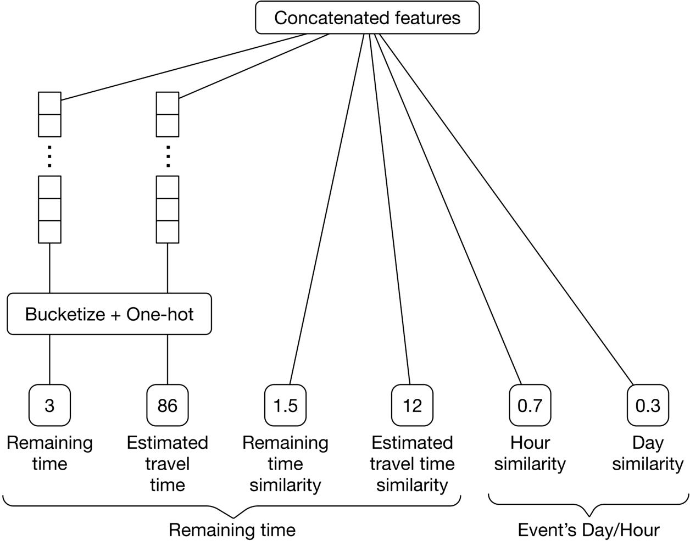

Image represents a data preprocessing and feature engineering pipeline for a machine learning model. The topmost box, 'Concatenated features,' acts as the output, receiving input from several processed features. Below this, two sets of vertically stacked boxes, each labeled with ellipses ('...'), represent multiple input features that are initially bucketized and one-hot encoded by the 'Bucketize + One-hot' box. This box processes the raw features and outputs numerical representations. The resulting features are then connected to the 'Concatenated features' box. Specifically, the processed features include 'Remaining time' (value 3), 'Estimated travel time' (value 86), 'Remaining time similarity' (value 1.5), 'Estimated travel time similarity' (value 12), 'Hour similarity' (value 0.7), and 'Day similarity' (value 0.3). The bottom two features, 'Hour similarity' and 'Day similarity,' are grouped under 'Event's Day/Hour,' suggesting they represent temporal aspects of the data. The other features relate to travel time and its similarity, possibly indicating a prediction task related to travel time estimation or comparison. The entire diagram illustrates how multiple raw features are preprocessed, combined, and prepared as input for a subsequent machine learning model.

#### Social-related features

**How many people are attending this event?**  
In general, users are more likely to register for an event if there are a lot of other attendees. Let's extract the following features to capture this:

- Number of users registered for this event
- The ratio of the total number of registered users to the number of impressions
- Registered user similarity: The difference between the number of registered users for the event in question and previously registered events

**Features related to attendance by friends**  
A user is more likely to register for an event if their friends are attending it. Here are some of the features we can use:

- Number of the user's friends who registered for this event
- The ratio of the number of registered friends to the total number of friends
- Registered friend similarity: Difference between the number of registered friends for the event in question and previously registered events

**Is the user invited to this event by others?**  
Users are more likely to attend events to which they are invited. Some features that might be helpful are:

- The number of friends who invited this user to the event
- The number of fellow users who invited this person to the event

**Is the event's host a friend of the user?**  
Users tend to attend events created by their friends. We create a binary feature to reflect this: if the event's host is the user's friend, this value is 1, otherwise, 0.

**How often has the user attended previous events created by this host?**  
Some users are interested in following a particular host's events.

##### User-related features

**Age and gender**  
Some events are geared toward specific ages and genders. For example, "Women in Tech" and "Life lessons to excel in your 30 s" are examples of events that may be specific to certain demographic groups. We create two features to capture this:

- User's gender, encoded with one-hot encoding
- User's age, bucketized into multiple categories and encoded with one-hot encoding

##### Event-related features

**Price of event:**  
The price of an event might affect the user's decision to register for it. Some features to use are:

- Event's price, bucketized into a few categories. For example:
	- 0: Free
		- 1: $1-$99
		- 2: $100-$499
		- 3: $500-$1,999
		- 4:+$2,000
- **Price similarity:** Difference between the price of the event in question and the average price of events previously registered for by the user.

**How similar is this event's description to previously registered descriptions?**  
This indicates the user's interests, based on previously registered events. For example, if the word "concert" repeatedly appears in the descriptions of previous events, it may indicate the user is interested in concert events. To capture this, we create a feature that represents the similarity between the event's description and the descriptions of previously registered events by the user. To compute the similarity, the description is converted into a numerical vector using TF-ID, and similarity is calculated using cosine distance.

Note, this feature might be noisy as descriptions are manually provided by hosts. We can experiment by training our model with and without this feature, to measure its importance.

Figure $7.10$ shows an overview of user features, event features, and social-related features.

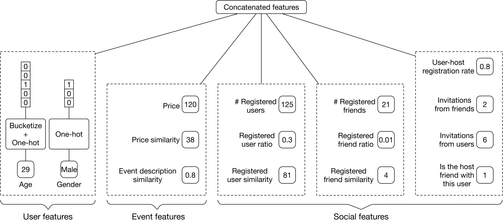

Image represents a data processing pipeline for feature engineering in a machine learning model. The topmost box, 'Concatenated features,' acts as the output, receiving input from three distinct feature groups: 'User features,' 'Event features,' and 'Social features.' 'User features' are derived from raw data ('Age' and 'Gender') using 'Bucketize + One-hot' encoding, resulting in numerical representations (e.g., age bucketed and gender one-hot encoded). 'Event features' include 'Price' (120) and 'Price similarity' (38), along with 'Event description similarity' (0.8). 'Social features' consist of '# Registered users' (125), 'Registered user ratio' (0.3), '# Registered friends' (21), 'Registered friend ratio' (0.01), 'Registered user similarity' (81), 'Registered friend similarity' (4), 'User-host registration rate' (0.8), 'Invitations from friends' (2), 'Invitations from users' (6), and 'Is the host friend with this user' (1). Each feature group's components are numerically represented, and these numerical values are then combined in the 'Concatenated features' box to form the final feature vector for the machine learning model. The dashed lines delineate the different feature groups.

The features listed above are not exhaustive. There are lots of other predictive features that can be created in practice. For example, host-related features such as the host's popularity, user's search history, event's category, auto-generated event tags, etc. At an interview, it's not necessary to follow this section strictly. You can use it as a starting point and then discuss topics that are more relevant to the interviewer. Here are some potential talking points you might want to elaborate on:

- **Batch vs. streaming features:** Batch (static) features refer to features that change less frequently, such as age, gender, and event description. These features can be computed periodically using batch processing and stored in a feature store. In contrast, streaming (aka dynamic) features change quickly. For example, the number of users registered for an event and the remaining time until an event, are dynamic features. The interviewer may want you to dive deeper into this topic and discuss batch vs. online processing in ML. If you're interested to learn more, refer to \[8\].
- **Feature computation efficiency.** Computing features in real-time is not efficient. You may want to discuss this issue and possible ways to avoid it. For example, instead of computing the distance between the user's current location and the event's location as a feature, we can pass both locations to the model as two separate features, and rely on the model to implicitly compute useful information from the two locations. To learn more about how to prepare location data for ML models, refer to \[9\]
- **Using a decay factor** for features that rely on the user's last X interactions. A decay factor gives more weight to the user's recent interactions/behaviors.
- **Using embedding learning** to convert each event and user into an embedding vector. Those embedding vectors are used as the features representing the events and users.
- **Creating features from users’ attributes may create bias.** For example, relying on age or gender to decide if an applicant is a good match for a job, may lead to discrimination. Since we create features from users’ attributes, it’s important to be aware of potential bias issues.

### Model Development

#### Model selection

Binary classification problems can be solved by various ML methods. Let's take a look at the following:

- Logistic regression
- Decision tree
- Gradient-boosted decision tree (GBDT)
- Neural network

##### Logistic regression (LR)

LR models the probability of a binary outcome by using a linear combination of one or multiple features. For the details of LR, refer to \[10\].

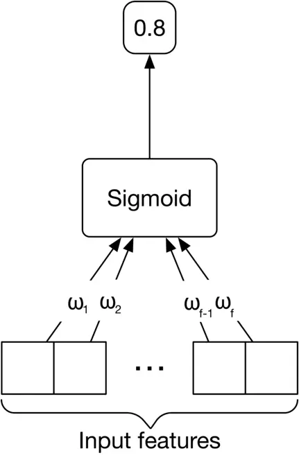

Figure 7.11: Logistic regression

Let's see the pros and cons of LR.

**Pros:**

- **Fast inference speed.** Computing a weighted combination of input features is fast.
- **Efficient training.** Given the simple architecture, it's easy to implement, interpret, and train quickly.
- Works well when the data is linearly separable (Figure 7.12).
- **Interpretable and easy to understand.** The weights assigned to each feature indicate the importance of different features, which gives us insight into why a decision was made.

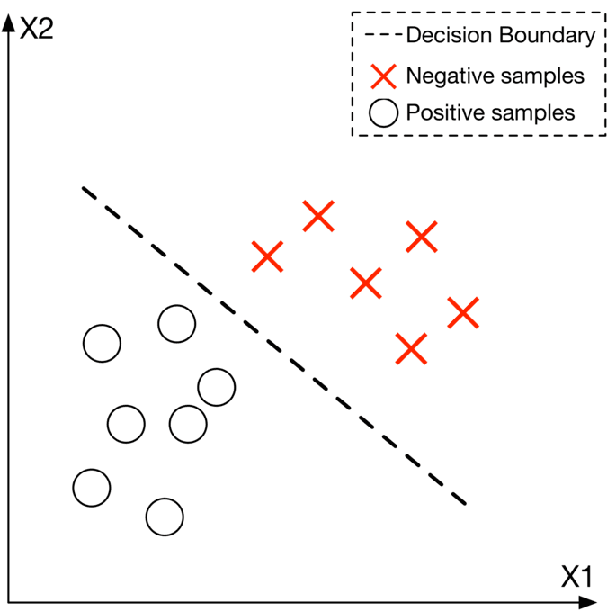

Figure 7.12: A linearly separable data with LR’s decision boundary

**Cons:**

- **Non-linear problems can't be solved** with LR, since it uses a linear combination of input features.
- **Multicollinearity** occurs when two or more features are highly correlated. One of the known limitations of LR is that it cannot learn the task well when multicollinearity is present in the input features.

In our system, the number of input features can be very large. Often, these features have complex and non-linear relations with the target variable (binary outcome). This complexity might be hard for LR to learn.

##### Decision tree

Decision trees are another class of learning methods that use a tree-like model of decisions and their possible consequences to make predictions. Figure 7.13 shows a simple decision tree with two features: age and gender. It also shows the corresponding decision boundary. Each leaf node in the decision tree indicates a binary outcome where "+" indicates the given input is classified as positive, and "-" means negative. To learn more about decision trees, refer to \[11\].

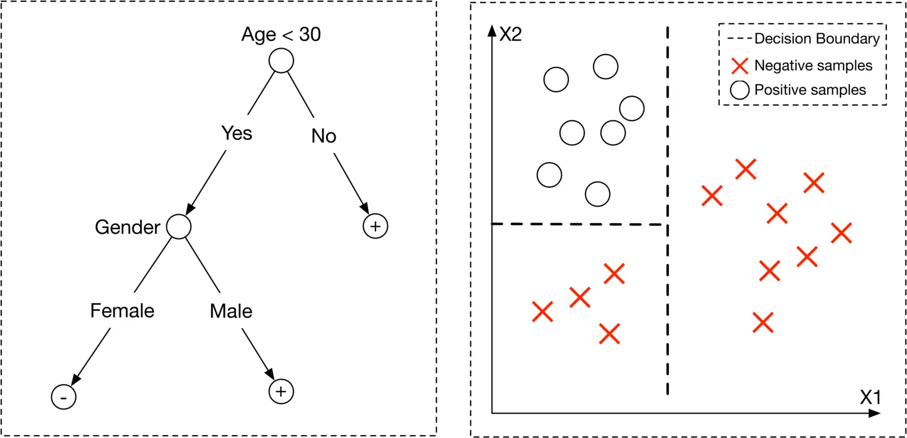

Figure 7.13: Decision tree (left) and the learned decision boundary (right)

**Pros:**

- **Fast training:** Decision trees are quick to train.
- **Fast inference:** Decision trees make predictions quickly at inference time.
- **Little to no data preparation:** Decision tree models don't require data normalization or scaling, since the algorithm does not depend on the distribution of the input features.
- **Interpretable and easy to understand.** Visualizing the tree provides good insights into why a decision was made and what the important decision factors are.

**Cons:**

- **Non-optimal decision boundary:** decision tree models produce decision boundaries that are parallel to the axes in the feature space (Figure 7.13). This may not be the optimal way to find a decision boundary for certain data distributions.
- **Overfitting:** Decision trees are very sensitive to small variations in data. A small change in input data may lead to different outcomes at serving time. Similarly, a small change in training data can lead to a totally different tree structure. This is a major issue and makes predictions less reliable.

In practice, naive decision trees are rarely used. The reason is that they are too sensitive to variations of input data. To reduce the sensitivity of decision trees, two techniques are commonly used:

- Bootstrap aggregation (Bagging)
- Boosting

These two techniques are widely used across the tech industry. It's essential to understand how they work. Let's take a closer look.

###### Bagging

Bagging is the ensemble learning method that trains a set of ML models in parallel, on multiple subsets of the training data. In bagging, the predictions of all these trained models are combined to make a final prediction. This significantly reduces the model's sensitivity to the change in data (variance).

One example of bagging is the commonly used "random forest" model \[12\]. Random forest builds multiple decision trees in parallel during training, to reduce the model's sensitivity. To make a prediction, each decision tree independently predicts the output class (positive or negative) of the given input, and then a voting mechanism is used to combine these predictions to make a final prediction. Figure $7.14$ shows a random forest with three decision trees.

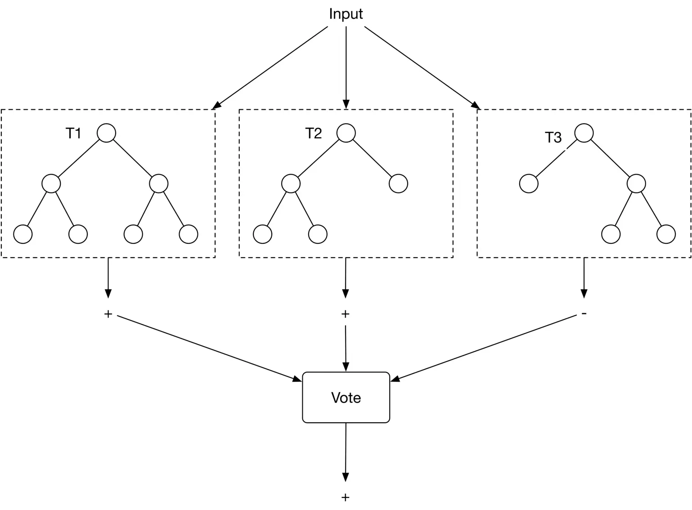

Figure 7.14: Random forest

The bagging technique has the following advantages:

- Reduces the effect of overfitting (high variance).
- Does not significantly increase training time because the decision trees can be trained in parallel.
- Does not add much latency at the inference time because decision trees can process the input in parallel.

Despite its advantages, bagging is not helpful when the model faces underfitting (high bias). To overcome bagging’s drawbacks, let’s discuss another technique called boosting.

###### Boosting

In ML, boosting involves training several weak classifiers sequentially to reduce prediction errors. The phrase "weak classifier" refers to a simple classifier that performs slightly better than random guesses. In boosting, multiple weak classifiers are converted into a single strong learning model. Figure $7.15$ shows an example of boosting.

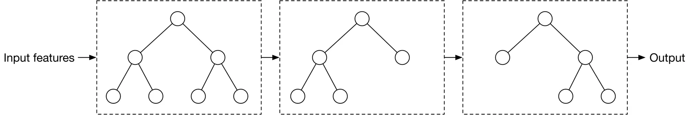

Figure 7.15: A boosting example

**Pros:**

- **Boosting reduces bias and variance.** Combining weak classifiers leads to a strong model less sensitive to the change in data. To learn more about bias/variance tradeoffs, refer to \[13\]. Cons:
- **Slower training and inference.** Given the classifiers are trained based on the mistakes of the previous classifiers, they work sequentially. This adds to the serving time due to the sequential nature of boosting.

The boosting method is usually preferred over bagging in practice because bagging is not helpful in cases of bias, whereas boosting reduces the effect of both bias and variance.

Typical boosting-based decision trees are Adaboost \[14\], XGBoost \[15\], and Gradient boost \[16\]. They are commonly employed to train classification models.

##### GBDT

GBDT is a commonly used tree-based model, utilizing GradientBoost to improve decision trees. Some variants of GBDT, such as XGBoost \[15\], have demonstrated strong performance in various ML competitions \[17\]. If you're interested in learning more about GBDT, refer to \[18\] \[19\].

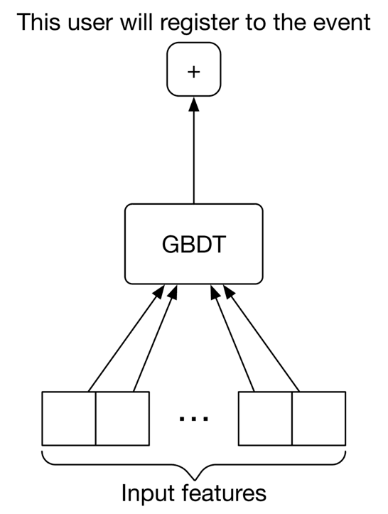

Figure 7.16: A GBDT model with a binary output

Here are the pros and cons of the GBDT model.

**Pros:**

- **Easy data preparation:** Similar to decision trees, it does not require data preparation.
- **Reduces variance:** GBDT reduces variance as it uses the boosting technique.
- **Reduces bias:** GBDT reduces the prediction error by leveraging several weak classifiers, iteratively improving upon the misclassified data points from the previous classifiers.
- Works well with structured data.

**Cons:**

- **Lots of hyperparameters to tune**, such as the number of iterations, tree depth, regularization parameters, etc.
- GBDT does not work well on unstructured data such as images, videos, audio, etc.
- **Unsuitable for continual learning** from streaming data.

In our case, since the created features are structured data, GBDT or one of its variants such as XGBoost - is a good choice to experiment with.

A major drawback of GBDT is that it is unsuitable for continual learning. In an event recommendation system, new data continuously becomes available to the system, such as recent user interactions, registrations, new events, and even new users. In addition, users' tastes and interests may change over time. It is vital for a good event recommendation system to adapt itself to new data, continuously. Without the possibility of continual learning, it is very costly to retrain GBDT from scratch regularly. Next, we explore neural networks which overcome this limitation.

##### Neural network (NN)

In an event recommendation system, we have many features that might not correlate linearly with the outcome. Learning these complex relationships is difficult. In addition, continual learning is necessary for adapting the model to new data.

NNs are great at solving those challenges. They are capable of learning complex tasks with non-linear decision boundaries. Additionally, NN models can be fine-tuned on new data very easily, making them ideal for continual learning. If you are unfamiliar with the details of NNs, you are encouraged to read \[20\].

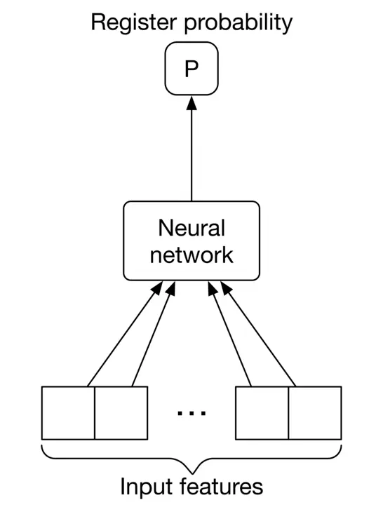

Figure 7.17: Neural network input-output

Let's see its pros and cons.

**Pros**

- **Continual learning:** NNs are designed to learn from data and improve themselves continually.
- Works well with unstructured data such as text, image, video, or audio.
- **Expressiveness:** NNs have expressive power due to their high number of learning parameters. They can learn very complex tasks and non-linear decision boundaries.

**Cons**

- **Computationally expensive** to train.
- **The quality of input data strongly influences the outcome:** NNs are sensitive to input data. For example, if input features are in very different ranges, the model may converge slowly during the training phase. An important step for NNs is data preparation, such as normalization, log-scaling, one-hot encoding, etc.
- **Large training data** is required to train NNs.
- **Black-box nature:** NNs are not interpretable, meaning it's not easy to understand the influence of each feature upon the outcome, as the input features go through multiple layers of non-linear transformations.

##### Which model should we select?

Picking the right model is challenging. We often need to experiment with different models to determine which works best. We can choose the right model based on various factors:

- Complexity of the task
- Data distribution and data type
- Product requirements or constraints, such as training cost, speed, model size, etc In this problem, both GBDTs and NNs are good candidates for experimentation. We start with the GBDT variant, XGBoost, since it is fast to implement and train. The result can be used as an initial baseline.

Once we have a baseline, we explore the possibility of building a better model with NNs. Neural networks are expected to work well here for the following reasons:

- Massive training data is available in our system. Users continuously interact with the system by registering for events, inviting friends, publishing new events, etc. Given the number of users, this creates a massive amount of data available for training.
- Data may not be linearly separable, and neural networks can learn non-linear data.

When designing a NN architecture, several hyperparameters must be considered, including the number of hidden layers, neurons in each layer, activation function, etc. These can be determined by employing hyperparameter tuning techniques. NN architectural details are not typically the main focus of ML system design interviews, since there is no systematic way to choose the right architecture.

#### Model training

##### Constructing the dataset

Building training and evaluation datasets is an essential step in developing a model. For example, let's look at how we compute features and their labels.

To construct a single data point, we extract a $\langle$ user, event $\rangle$ pair from the interaction data and compute the input features from the pair. We then label the data point with 1 if the user has registered for the event, and 0 if not.

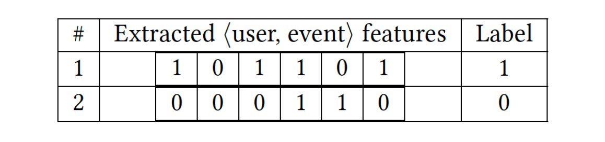

Figure 7.18: Constructed dataset

One issue we may face after constructing the dataset is class imbalance. The reason is that users may explore tens or hundreds of events before registering for one. Therefore, the number of negative $\langle$ user, event $\rangle$ pairs is significantly higher than positive data points. We can use one of the following techniques to address the class imbalance issue:

- Use focal loss or class-balanced loss to train the classifier
- Undersample the majority class

##### Choosing the loss function

Since the model is a binary classification model, we use a typical classification loss function such as binary cross-entropy to optimize the neural network model.

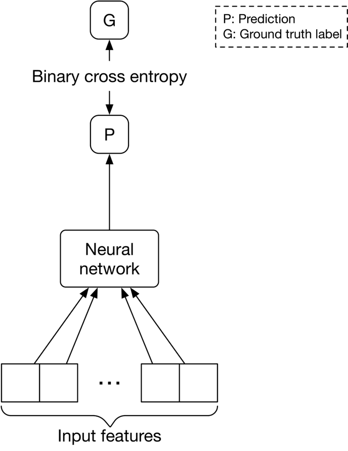

Figure 7.19: Loss between the prediction and the label

### Evaluation

#### Offline metrics

To evaluate the ranking system, we consider the following options.

**Recall@k or Precision@k.** These metrics are not good fits because they do not consider the ranking quality of the output.

**MRR, nDCG, or mAP.** These three metrics are commonly used to measure ranking quality. But which one is best?

MRR focuses on the rank of the first relevant item in the list, which is suitable in systems where only one relevant item is expected to be retrieved. However, in an event recommendation system, several recommended events may be relevant to the user. MRR is not a good fit.

nDCG works well when the relevance score between a user and an item is non-binary. In contrast, mAP works only when the relevance scores are binary. Since events are either relevant (a user registered for it) or irrelevant (a user saw the event but did not register), mAP is a better fit.

#### Online metrics

In our case, the business objective is to increase revenue by increasing ticket sales. To measure the impact of the system on revenue, let's explore the following metrics:

- Click-through rate (CTR)
- Conversion rate
- Bookmark rate
- Revenue lift

**CTR.** A ratio showing how often users who see recommended events go on to click on an event.

$$
C T R=\frac{\text { total number of clicked events }}{\text { total number of impressions }}
$$

A high CTR shows our system is good at recommending events that users click on. Having more clicks generally means more event registrations.

However, relying only on CTR as the online metric may be insufficient. Some events are clickbait. Ideally, we would like to measure how relevant recommended events are for the user. This metric is called the conversion rate, which we discuss now.

**Conversion rate.** A ratio showing how often users who see recommended events go on to register for them. The formula is:

$$
\text { Conversion rate }=\frac{\text { total number of event registrations }}{\text { total number of impressions }}
$$

A high conversion rate indicates users register for recommended events more often. For example, a conversion rate of $0.3$ means that users, on average, register for 3 events out of every 10 recommended events.

**Bookmark rate.** A ratio showing how often users bookmark recommended events. This is based on the assumption that the platform allows users to save or bookmark an event.

**Revenue lift.** This is the increase in revenue as a result of event recommendations.

### Serving

In this section, we propose an ML system design that can be used to serve requests. As Figure 7.20 shows, there are two main pipelines in the design:

- Online learning pipeline
- Prediction pipeline

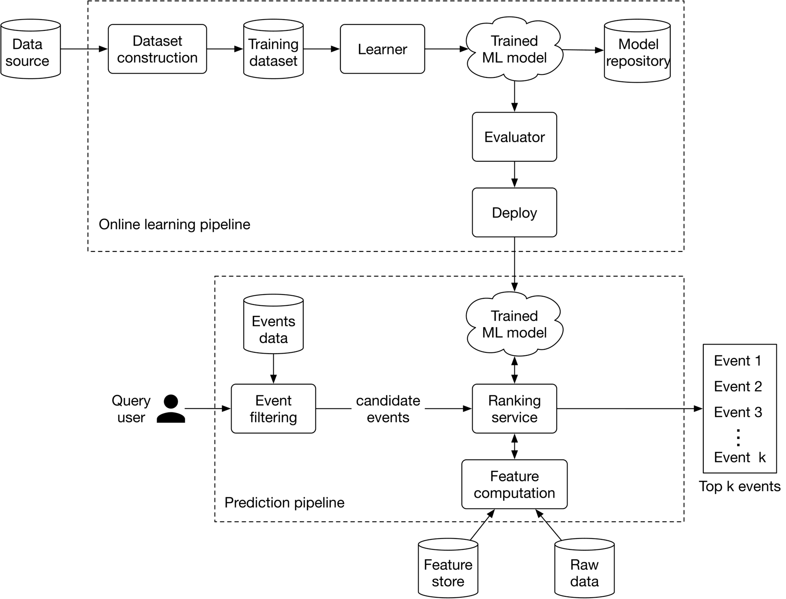

Figure 7.20: ML system design

#### Online learning pipeline

As described earlier, event recommendations are intrinsically cold-start and suffer from a constant new-item problem. Consequently, the model must be continuously fine-tuned to adapt to new data. This pipeline is responsible for continuously training new models by incorporating new data, evaluating the trained models, and deploying them.

#### Prediction pipeline

The prediction pipeline is responsible for predicting the top $\mathrm{k}$ most relevant events to a given user. Let's discuss some of the most important components of the prediction pipeline.

##### Event filtering

The event filtering component takes the query user as input and narrows down the events from 1 million to a small subset of events. This is based upon simple rules, such as event locations, or other types of user filters. For example, if a user adds a “concerts only” filter, the component quickly narrows down the list to a subset of candidate events. Since these types of filters are common in event recommendation systems, they can be used to significantly reduce our search space from potentially millions of events, to hundreds of candidate events.

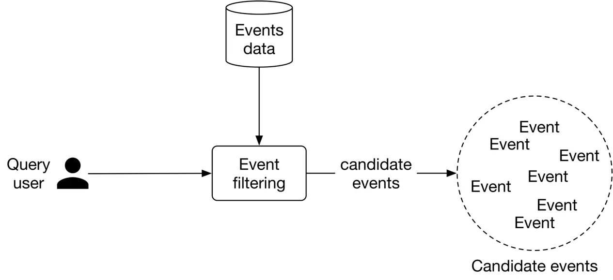

Figure 7.21: Event filtering input-output

##### Ranking service

This service takes the user and candidate events produced by the filtering component as input, computes features for each $\langle$ user, event $\rangle$ pair, sorts the events based on the probabilities predicted by the model, and outputs a ranked list of top $k$ most relevant events to the user.

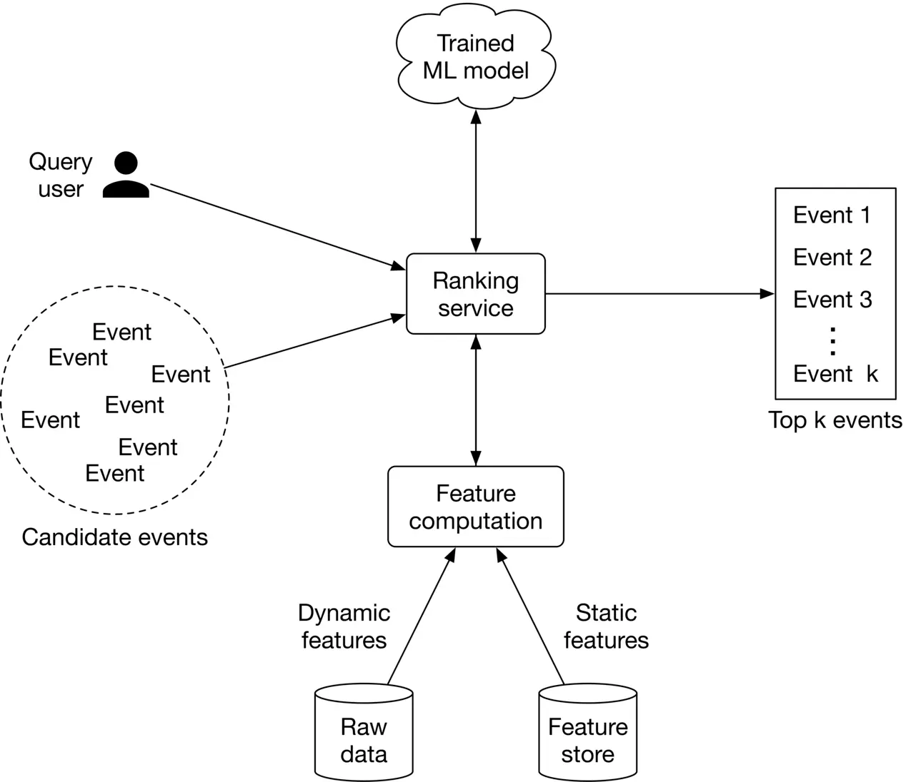

Figure 7.22: Ranking service workflow

Ranking service interacts with the feature computation component responsible for computing features that the model expects. Static features are obtained from a feature store, while dynamic features are computed in real-time from the raw data.

### Other Talking Points

If there is extra time at the end of the interview, here are some additional talking points:

- What are the different types of bias we may observe in this system \[21\].
- How to utilize feature crossing to achieve more expressiveness \[22\].
- Some users like to see a diverse list of events. How to ensure the recommended events are diverse and fresh \[23\]?
- We utilize the user's attributes to train a model. We also rely on users' live locations. What are additional considerations related to privacy and security \[24\]?
- Event management platforms are usually two-sided marketplaces, where event hosts are the suppliers and users fulfill the demand side. How to ensure the system is not optimized for one side only? Additionally, how to keep the platform fair for different hosts? To learn more about unique challenges in two-sided marketplaces, refer to \[25\].
- How to avoid data leakage when constructing the dataset \[26\].
- How to determine the right frequency to update the models \[27\].

### References

1. Learning to rank methods. [https://livebook.manning.com/book/practical-recommender-systems/chapter-13/53](https://livebook.manning.com/book/practical-recommender-systems/chapter-13/53).
2. RankNet paper. [https://icml.cc/2015/wp-content/uploads/2015/06/icml\_ranking.pdf](https://icml.cc/2015/wp-content/uploads/2015/06/icml_ranking.pdf).
3. LambdaRank paper. [https://www.microsoft.com/en-us/research/wp-content/uploads/2016/02/lambdarank.pdf](https://www.microsoft.com/en-us/research/wp-content/uploads/2016/02/lambdarank.pdf).
4. LambdaMART paper. [https://www.microsoft.com/en-us/research/wp-content/uploads/2016/02/MSR-TR-2010-82.pdf](https://www.microsoft.com/en-us/research/wp-content/uploads/2016/02/MSR-TR-2010-82.pdf).
5. SoftRank paper. [https://www.microsoft.com/en-us/research/wp-content/uploads/2016/02/SoftRankWsdm08Submitted.pdf](https://www.microsoft.com/en-us/research/wp-content/uploads/2016/02/SoftRankWsdm08Submitted.pdf).
6. ListNet paper. [https://www.microsoft.com/en-us/research/wp-content/uploads/2016/02/tr-2007-40.pdf](https://www.microsoft.com/en-us/research/wp-content/uploads/2016/02/tr-2007-40.pdf).
7. AdaRank paper. [https://dl.acm.org/doi/10.1145/1277741.1277809](https://dl.acm.org/doi/10.1145/1277741.1277809).
8. Batch processing vs stream processing. [https://www.confluent.io/learn/batch-vs-real-time-data-processing/#:~:text=Batch%20processing%20is%20when%20the,data%20flows%20through%20a%20system](https://www.confluent.io/learn/batch-vs-real-time-data-processing/#:~:text=Batch%20processing%20is%20when%20the,data%20flows%20through%20a%20system).
9. Leveraging location data in ML systems. [https://towardsdatascience.com/leveraging-geolocation-data-for-machine-learning-essential-techniques-192ce3a969bc#:~:text=Location%20data%20is%20an%20important,based%20on%20your%20customer%20data](https://towardsdatascience.com/leveraging-geolocation-data-for-machine-learning-essential-techniques-192ce3a969bc#:~:text=Location%20data%20is%20an%20important,based%20on%20your%20customer%20data).
10. Logistic regression. [https://www.youtube.com/watch?v=yIYKR4sgzI8](https://www.youtube.com/watch?v=yIYKR4sgzI8).
11. Decision tree. [https://careerfoundry.com/en/blog/data-analytics/what-is-a-decision-tree/](https://careerfoundry.com/en/blog/data-analytics/what-is-a-decision-tree/).
12. Random forests. [https://en.wikipedia.org/wiki/Random\_forest](https://en.wikipedia.org/wiki/Random_forest).
13. Bias/variance trade-off. [http://www.cs.cornell.edu/courses/cs578/2005fa/CS578.bagging.boosting.lecture.pdf](http://www.cs.cornell.edu/courses/cs578/2005fa/CS578.bagging.boosting.lecture.pdf).
14. AdaBoost. [https://en.wikipedia.org/wiki/AdaBoost](https://en.wikipedia.org/wiki/AdaBoost).
15. XGBoost. [https://xgboost.readthedocs.io/en/stable/](https://xgboost.readthedocs.io/en/stable/).
16. Gradient boosting. [https://machinelearningmastery.com/gentle-introduction-gradient-boosting-algorithm-machine-learning/](https://machinelearningmastery.com/gentle-introduction-gradient-boosting-algorithm-machine-learning/).
17. XGBoost in Kaggle competitions. [https://www.kaggle.com/getting-started/145362](https://www.kaggle.com/getting-started/145362).
18. GBDT. [https://blog.paperspace.com/gradient-boosting-for-classification/](https://blog.paperspace.com/gradient-boosting-for-classification/).
19. An introduction to GBDT. [https://www.machinelearningplus.com/machine-learning/an-introduction-to-gradient-boosting-decision-trees/](https://www.machinelearningplus.com/machine-learning/an-introduction-to-gradient-boosting-decision-trees/).
20. Introduction to neural networks. [https://www.youtube.com/watch?v=i2fmaabIs5w](https://www.youtube.com/watch?v=i2fmaabIs5w).
21. Bias issues and solutions in recommendation systems. [https://www.youtube.com/watch?v=pPq9iyGIZZ8](https://www.youtube.com/watch?v=pPq9iyGIZZ8).
22. Feature crossing to encode non-linearity. [https://developers.google.com/machine-learning/crash-course/feature-crosses/encoding-nonlinearity](https://developers.google.com/machine-learning/crash-course/feature-crosses/encoding-nonlinearity).
23. Freshness and diversity in recommendation systems. [https://developers.google.com/machine-learning/recommendation/dnn/re-ranking](https://developers.google.com/machine-learning/recommendation/dnn/re-ranking).
24. Privacy and security in ML. [https://www.microsoft.com/en-us/research/blog/privacy-preserving-machine-learning-maintaining-confidentiality-and-preserving-trust/](https://www.microsoft.com/en-us/research/blog/privacy-preserving-machine-learning-maintaining-confidentiality-and-preserving-trust/).
25. Two-sides marketplace unique challenges. [https://www.uber.com/blog/uber-eats-recommending-marketplace/](https://www.uber.com/blog/uber-eats-recommending-marketplace/).
26. Data leakage. [https://machinelearningmastery.com/data-leakage-machine-learning/](https://machinelearningmastery.com/data-leakage-machine-learning/).
27. Online training frequency. [https://huyenchip.com/2022/01/02/real-time-machine-learning-challenges-and-solutions.html#towards-continual-learning](https://huyenchip.com/2022/01/02/real-time-machine-learning-challenges-and-solutions.html#towards-continual-learning).